# Explainable Dynamic Graph Neural Network SIEM for Software-Defined IoT using Edge AI and Federated Learning

**Arka Talukder | B01821011**  
**MSc Cyber Security (Full-time)**  
**University of the West of Scotland**  
**School of Computing, Engineering and Physical Sciences**  
**Supervisor: Dr. Raja Ujjan**

---

## 1. Abstract

Internet of Things (IoT) deployments produce flow telemetry that Security Operations Centres (SOCs) must triage on CPU-only edge infrastructure. Detectors should be accurate, privacy-aware, and explainable so analysts can act on alerts without undue delay.

**Research question (headline answer).** The work asks how an **explainable GAT+GRU** on *k*NN **flow** graphs, with **Flower FedAvg** and **SIEM-shaped** output, can run on **CPU**. The **contribution** is a **reproducible, integrated** prototype on **CICIoT2023** (Pinto et al. 2023): public splits, **leakage-aware** preprocessing, **Captum** IG + **GAT** attention, **FastAPI** JSON delivery, and **one** *`config/experiment.yaml`*. Chapters **2, 4–6** justify and build; **7–8** test; **9** answers the sub-questions with **Tables 7–12**.

**Outcomes (subset, fixed split).** Central and federated GNN runs report F1 = 100% and ROC-AUC = 100% with zero false positives here; Random Forest and MLP reach F1 = 99.86% and 99.42% under the same protocol. Mean CPU inference is about 23 ms per five-window GNN sequence; federated weight traffic is about 31 MB over ten rounds. **Ablation**, **(window, *k*) sensitivity**, and **multi-seed** runs address **reliability** of the headline configuration; full **external validity** to live sites is not claimed.

Keywords: IoT security, dynamic graph neural network, federated learning, SIEM, explainable AI, edge AI, SOC, CICIoT2023

---

## Acknowledgements

I thank my supervisor, **Dr Raja Ujjan**, for technical guidance and support throughout the project. I thank my moderator, **Muhsin Hassanu**, for review of interim reports. I also thank **Dr Daune West** for academic support during the submission period. I am grateful to **School and programme staff** for module materials and to the **MSc project co-ordinator** for programme and ethics communication.

Finally, I thank **friends and family** for their patience during intensive writing and experiment runs.

---

## List of Abbreviations

| Abbrev. | Definition |
|---|---|
| API | Application Programming Interface |
| AUC | Area Under the (ROC) Curve |
| CPU | Central Processing Unit |
| ECS | Elastic Common Schema (log/alert shape used as a guide) |
| FedAvg | Federated Averaging (McMahan et al. 2017) |
| FL | Federated Learning |
| FN | False Negative |
| FP | False Positive |
| FPR | False Positive Rate |
| GAT | Graph Attention Network |
| GNN | Graph Neural Network |
| GRU | Gated Recurrent Unit |
| IG | Integrated Gradients |
| IoT | Internet of Things |
| IID | Independent and Identically Distributed (data split) |
| JSON | JavaScript Object Notation |
| kNN | k-Nearest Neighbours (graph construction) |
| MLP | Multi-Layer Perceptron |
| non-IID | Non-identical client data distributions |
| PyG | PyTorch Geometric |
| ROC | Receiver Operating Characteristic |
| SDN | Software-Defined Networking |
| SIEM | Security Information and Event Management |
| SOC | Security Operations Centre |
| TN | True Negative |
| TP | True Positive |
| UML | Unified Modelling Language |
| XAI | Explainable Artificial Intelligence |
| AI | Artificial Intelligence (general discipline; not a model name) |
| ML | Machine learning (umbrella for supervised and neural methods in Chapters 4–8) |
| IDS | Intrusion Detection System |
| NIDS | Network-based Intrusion Detection System |
| DNN | Deep Neural Network |
| VAE | Variational Autoencoder (cited in wider ML literature only; not a model used in this project) |
| Adam | Adaptive moment optimiser (used for MLP/GNN; see PyTorch documentation, Chapter 12) |
| IDE | Integrated Development Environment |

The front matter includes a **Table of Contents**, **List of Figures**, **List of Tables**, and this **List of Abbreviations**, as required for a complete technical report.

---

## Table of Contents

**List of Abbreviations**

**List of Figures**

**List of Tables**

**Acknowledgements**

**Chapter 1 – Introduction**  
- 1.1 Chapter Overview  
- 1.2 Background and Motivation  
- 1.3 Research Aim and Questions  
  - 1.3.1 Objectives  
  - 1.3.2 Where the Research Questions Are Answered (Evidence Map)  
- 1.4 Scope and Limitations  
- 1.5 Dissertation Structure  
- 1.6 Alignment with the Marking Criteria in the Project Specification  
  - 1.6.1 Where Each Technical Topic Is Stated Once (Clarity and Non-Repetition)  
- 1.7 Chapter Summary  

**Chapter 2 – Literature Review**  
- 2.1 Chapter Overview  
- 2.2 Themes and Structure  
  - 2.2.1 Literature Search Strategy and Primary Databases  
  - 2.2.2 Main Technology Pillars: Synthesis, Debate, and Fit with the Title  
    - 2.2.2.1 Software-Defined Flow Observability and the Detection Surface  
    - 2.2.2.2 Similarity Graphs and Dynamic GNNs as a Design Bet, Not a Slogan  
    - 2.2.2.3 Edge AI, Federated Training, and What “Privacy” Can Mean  
    - 2.2.2.4 Explainable, SIEM-Ready Outputs Versus Alert Economics  
    - 2.2.2.5 Title–Technology Coupling: Trade-Offs, Counterarguments, and What the Build Must Evidence  
- 2.3 IoT Security and the Need for Detection  
- 2.4 SIEM, SOC Workflows, and Alert Quality  
  - 2.4.1 Alert Volume, Triage, and the Need for Explanations  
  - 2.4.2 Explainability, SIEM Ecosystems, and Limits of “Better JSON”  
- 2.5 Graph Neural Networks and Dynamic Graphs  
  - 2.5.1 GNNs, Attention, and Attribute-Based Graphs in Intrusion Detection  
  - 2.5.2 Dynamic (*Temporal*) Graphs and the GAT+GRU Pattern  
- 2.6 Federated Learning and Privacy  
  - 2.6.1 FedAvg, Assumptions, and Communication  
  - 2.6.2 FL for IoT Intrusion Detection: Empirical Findings and Non-IID Reality  
- 2.7 Explainability in ML-Based Security  
  - 2.7.1 Post-hoc Attribution, Integrated Gradients, and Attention in GNNs  
  - 2.7.2 XAI for IoT Streams, SHAP as Alternative, and Latency as a Counterargument  
- 2.8 Synthesis: Significance, Limitations of Prior Work, Contributions, and Gap  
  - 2.8.1 How Existing Approaches Fill *Part* of the Problem (and Where They Stop)  
  - 2.8.2 Anticipated Significance (What *Would* Matter if the Evidence Holds)  
  - 2.8.3 Limitations *in the Literature* and Their Impact on Claims  
  - 2.8.4 Debate, Counterarguments, and the Consolidated Gap  
- 2.9 Mapping to CyBOK (Cyber Security Body of Knowledge)  
- 2.10 Extended Comparative Review (Fifteen to Twenty Core Sources)  
- 2.11 Chapter Summary  

**Chapter 3 – Project Management**  
- 3.1 Chapter Overview  
- 3.2 Project Plan and Timeline (45-day MSc)  
- 3.3 Risk Assessment  
- 3.4 Monitoring and Progress Reviews  
- 3.5 Research Plan for Completion: IDE, Platform, and Evidence for Supervision  
- 3.6 Ethics and Data  
- 3.7 Supervision and Progress Alignment  
- 3.8 Chapter Summary  

**Chapter 4 – Research Design and Methodology**  
- 4.1 Chapter Overview  
- 4.2 Research Approach  
- 4.3 Dataset and Subset  
  - 4.3.1 Proposed Pipeline Stages, Artefacts, and Leakage Controls  
  - 4.3.2 Repository Layout and Frozen Outputs  
  - 4.3.3 Empirical Flow and Graph Sample Sizes  
- 4.4 Models and Loss Functions  
  - 4.4.1 Hyperparameters, Tuning Funnel, and Training Budget (After Split)  
  - 4.4.2 Objectives, Losses, and Federation Rule  
- 4.5 Federated Learning Setup  
- 4.6 Explainability  
- 4.7 Evaluation Plan  
- 4.8 Software and Tools  
- 4.9 Chapter Summary  

**Chapter 5 – Design**  
- 5.1 Chapter Overview  
- 5.2 Pipeline, Alerts, and Deployment (Conceptual)  
- 5.3 Graph Design (Flows to kNN Snapshots)  
- 5.4 Research Design and System Architecture  
- 5.5 Conceptual Illustration: Similarity-Based Graph in One Window  
- 5.6 Chapter Summary  

**Chapter 6 – Implementation and System Development**  
- 6.1 Chapter Overview  
- 6.2 Environment and Tools  
- 6.3 Data Loading and Preprocessing  
- 6.4 Graph Construction  
- 6.5 Model Implementation  
- 6.6 Federated Learning (Flower)  
- 6.7 Explainability  
- 6.8 Alert Generation and SIEM-Style Output  
- 6.9 FastAPI Deployment and CPU Inference  
- 6.10 Implementation Code Screenshots (Author’s Codebase)  
- 6.11 Reproducibility Note  
- 6.12 Chapter Summary  

**Chapter 7 – Testing and Evaluation**  
- 7.1 Chapter Overview  
- 7.2 Evaluation Scope  
  - 7.2.1 Pass Criteria  
  - 7.2.2 Fail Criteria  
- 7.3 Test Schedule  
- 7.4 Experimental Setup  
  - 7.4.1 Data Validity, Reliability, and Threats to Generalisation  
- 7.5 Metrics  
- 7.6 Dataset and Experiment Statistics  
- 7.7 Comparison Design  
- 7.8 Chapter Summary  

**Chapter 8 – Results Presentation**  
- 8.1 Chapter Overview  
- 8.2 Centralised Model Comparison (Sub-Question 1)  
- 8.3 Federated Learning (Sub-Question 2)  
  - 8.3.1 What Federated Learning Produced (Reading the Curves and the Table)  
- 8.4 Central GNN Training Convergence  
- 8.5 Time-Window and CPU Inference (Sub-Question 2 and Deployment)  
- 8.6 Example Alerts with Explanations (Sub-Question 3)  
- 8.7 Ablation Studies (Priority 1: Evidence)  
- 8.8 Sensitivity Analysis (Stability of Design Choices)  
- 8.9 Multi-Seed Stability  
- 8.10 Comparison with Prior Work on CICIoT2023  
- 8.11 Chapter Summary  

**Chapter 9 – Conclusion, Discussion, and Recommendations**  
- 9.1 Chapter Overview  
- 9.2 Structured Conclusion  
- 9.3 Answering the Research Questions  
- 9.4 Strengths and Limitations  
- 9.5 Use of University and Course Materials  
- 9.6 Practical Implications  
- 9.7 Relation to Literature  
- 9.8 Summary of the Project  
- 9.9 Recommendations for Future Work  
- 9.10 Chapter Summary  

**Chapter 10 – Critical Self-Evaluation**  
- 10.1 Chapter Overview  
- 10.2 Planning, Scope, and Risk  
- 10.3 Literature and Alignment with the Questions  
- 10.4 Implementation: What Was Harder Than It Looked  
- 10.5 Results, Honesty, and the “100%” Question  
- 10.6 What I Learned (Skills and Mindset)  
- 10.7 Time Management: What I Would Reorder  
- 10.8 Chapter Summary  

**Chapter 11 – References**  
**Chapter 12 – Bibliography**  
**Chapter 13 – Appendices** (A: project code screenshots; B: process; C: project specification; D: optional repository and dataset material)

### Table of Figures

**Numbering rule:** Body figures are **Figure 1–Figure 29** in **strict order of first appearance** (Chapter 2 → Chapter 3 → Chapter 5 → Chapter 6 → Chapter 8). Within **Chapter 5**, subsection order is **5.2 pipeline → 5.3 graph specification → 5.4–5.5 figures**, so **Figures 7–9** match that reading order. Each body-figure caption states **Chapter** and **Section**. **Appendix A** uses **Figure A1-1**–**Figure A1-14** in the Table of Figures (separate from the 1–29 sequence). Each item shows **file path and symbol name only** (no extra narrative); line numbers are on the images.

| Figure | Title (chapter, section) | Page |
|--------|--------------------------|------|
| 1 | Taxonomy of IDS approaches (Ch. 2, Section 2.3) |  -  |
| 2 | Conceptual dynamic GNN flow  -  GAT + GRU (Ch. 2, Section 2.5) |  -  |
| 3 | Federated learning (FedAvg) flow (Ch. 2, Section 2.6) |  -  |
| 4 | Explainability methods for SOC-oriented alerts (Ch. 2, Section 2.7) |  -  |
| 5 | Positioning of related work  -  four pillars (Ch. 2, Section 2.7) |  -  |
| 6 | Project Gantt chart  -  six execution phases plus write-up (Ch. 3, Section 3.2) |  -  |
| 7 | Research pipeline  -  raw flows to SIEM alerts (Ch. 5, Section 5.2) |  -  |
| 8 | Research design  -  data flow, FL, edge alerting (Ch. 5, Section 5.4) |  -  |
| 9 | Conceptual *k*NN similarity graph in one window (Ch. 5, Section 5.5) |  -  |
| 10 | Code: `flows_to_knn_graph` core (Ch. 6, Section 6.10) |  -  |
| 11 | Code: `build_graphs_for_split` core (Ch. 6, Section 6.10) |  -  |
| 12 | Code: `train_one_epoch` training step (Ch. 6, Section 6.10) |  -  |
| 13 | Code: `DynamicGNN.forward` (Ch. 6, Section 6.10) |  -  |
| 14 | Code: `_ig_wrapper` / Integrated Gradients (Ch. 6, Section 6.10) |  -  |
| 15 | Code: FastAPI `POST /score` core (Ch. 6, Section 6.10) |  -  |
| 16 | Confusion matrix  -  Dynamic GNN (Ch. 8, Section 8.2) |  -  |
| 17 | ROC curve  -  Dynamic GNN (Ch. 8, Section 8.2) |  -  |
| 18 | Confusion matrix  -  Random Forest (Ch. 8, Section 8.2) |  -  |
| 19 | Confusion matrix  -  MLP (Ch. 8, Section 8.2) |  -  |
| 20 | ROC curve  -  Random Forest (Ch. 8, Section 8.2) |  -  |
| 21 | ROC curve  -  MLP (Ch. 8, Section 8.2) |  -  |
| 22 | Per-metric comparison  -  RF, MLP, Central GNN, Federated GNN (Ch. 8, Section 8.2) |  -  |
| 23 | Federated learning convergence  -  F1 and ROC-AUC vs. round (Ch. 8, Section 8.3) |  -  |
| 24 | Confusion matrix  -  Federated GNN (Ch. 8, Section 8.3) |  -  |
| 25 | Federated learning communication cost  -  per round and cumulative (Ch. 8, Section 8.3) |  -  |
| 26 | Central GNN training loss curve  -  six epochs (log scale) (Ch. 8, Section 8.4) |  -  |
| 27 | Model comparison  -  inference time and F1 (Ch. 8, Section 8.5) |  -  |
| 28 | Ablation  -  full GAT+GRU vs. GAT-only (Ch. 8, Section 8.7) |  -  |
| 29 | Sensitivity  -  window size and *k* (Ch. 8, Section 8.8) |  -  |
| A1-1 … A1-14 | Appendix A  -  project code (config, preprocess, graph, data loaders, baselines, GNN, training, XAI, FL, API) |  -  |

### Table of Tables

**Numbering rule:** Tables are **Table 1–Table 13** in **strict order of first appearance** (Chapter 2 → Chapters 4–6 method and testbed → Chapter 7 schedule → Chapter 8 results).

| Table | Title (chapter, section) | Page |
|-------|--------------------------|------|
| 1 | Comparison of selected related work (Ch. 2, Section 2.7) |  -  |
| 2 | Proposed data and modelling pipeline stages (Ch. 4, Section 4.3) |  -  |
| 3 | Hyperparameters, training budget, and federation (Ch. 4, Section 4.4) |  -  |
| 4 | Empirical sample sizes: flows, graph windows, sequences (Ch. 4, Section 4.3) |  -  |
| 5 | Testbed, storage, and runtime stack (Ch. 6, Section 6.2) |  -  |
| 6 | Evaluation scenarios, scripts, and frozen artefacts (Ch. 7, Section 7.3) |  -  |
| 7 | Model comparison on CICIoT2023 test set (Ch. 8, Section 8.2) |  -  |
| 8 | Federated learning round-by-round metrics (Ch. 8, Section 8.3) |  -  |
| 9 | Central GNN training history (Ch. 8, Section 8.4) |  -  |
| 10 | Ablation  -  centralised GNN variants (Ch. 8, Section 8.7) |  -  |
| 11 | Sensitivity analysis  -  nine (*window*, *k*) configs (Ch. 8, Section 8.8) |  -  |
| 12 | Multi-seed summary  -  central GNN (Ch. 8, Section 8.9) |  -  |
| 13 | Comparison with prior work on CICIoT2023 (Ch. 8, Section 8.10) |  -  |

---

## Chapter 1 – Introduction
### 1.1 Chapter Overview
This chapter presents the project background, IoT flow telemetry, SOC alert volume and the practical limitation at the edge node of a CPU. It describes the rationale behind the inclusion of dynamic graph learning, federated training, and explainable alerts in the same pipeline, followed by the research aim, sub-questions, scope, and structure of the chapters to ensure that subsequent chapters in the work are focused on method, implementation, and evidence.
### 1.2 Background and Motivation
The Internet of Things is now pervasive, yet many devices remain weakly protected in practice, creating exposure to botnet use, service abuse, and lateral movement (Kolias et al. 2017). Continuous network monitoring is therefore essential where legacy and new devices coexist. Software-defined approaches can expose flow-level statistics without storing full packet captures, easing storage and some privacy concerns; the harder problem is to analyse those flows accurately, to explain decisions to analysts, and to do so on edge hardware that is often CPU-only.

Security Operations Centres triage SIEM-fed alerts, but alert fatigue and opaque model scores delay response (Cuppens and Miège 2002). Random Forest and MLP baselines on tabular features are strong competitors; this work also models flows as nodes in a similarity graph and sequences of window graphs, because attacks often unfold as structured patterns, not independent rows. The public CICIoT2023 release does not support a full device–device IP topology, so *k*NN feature-space edges are used. A GAT+GRU stack encodes local neighbour structure and short-term temporal change; Flower FedAvg trains without centralising raw flows; a FastAPI path emits ECS-like JSON and reports CPU time—aligned with the main research question.
### 1.3 Research Aim and Questions
This project will develop and implement a software-defined flow data-based, dynamically trained, federated training, and practical explanation output-based reproducible prototype to detect IoT attacks and provide triage of SOC. It works on realistically constrained feasibility, particularly CPU execution and non-IID federated partitions and ensures that the pipeline is easy to understand when used by security operations.
The **primary research question** is:

**How can an explainable dynamic graph neural network, trained using federated learning, detect attacks in Software-Defined IoT flow data and generate SIEM alerts that support SOC operations on CPU-based edge devices?**

The **sub-questions** (each mapped to Chapters 7–8 and **Section 9.3**) are:

1. **Sub-Q1:** Does a dynamic graph model **outperform** simple tabular models (**Random Forest**, **MLP**) on the **same** test protocol?
2. **Sub-Q2:** Can **federated learning** (Flower FedAvg) **match** centralised training **without** exchanging raw flow rows?
3. **Sub-Q3:** Can the system produce **analyst-useful** explanation fields (Integrated Gradients + attention) in **SIEM-shaped** JSON for triage?

**Contributions (in this dissertation):**
A flow telemetry-to-kNN similarity-graphs prototype that is end-to-end, CPU-based and trains a dynamic GNN (GAT + GRU), and results in SIEM-shaped JSON alerts.
Comparison between a centralised and federated architecture with the same architecture under Flower FedAvg with non-IID client partitions.
An explainability route that integrates Integrated Gradients (feature attribution) with GAT attention (flow and structure cues) with ablation, sensitivity, and multi-seed support.
A reproducibility trail in submission ready format as configuration, scripts, chapter mappings and artefacts in the form of appendices.
CICIoT2023 is used in the work to compare choices and metrics with outcomes of previous studies and yet fit within a budget of an MSc time-box and resources.
#### 1.3.1 Objectives
The project has the following specific objectives to provide answers to the above research questions. All of these objectives are artefacts deliverable which are revisited in Chapters 4-8 as evidence:
Literature objective. Critically review IoT intrusion detection, graph and dynamic GNN techniques, federated learning and explainable AI to security, and determine the gap that this project addresses (Chapter 2).
Dataset objective. Use a manageable **CICIoT2023** subset with **public** `train` / `validation` / `test` files, full preprocessing, and **no** test-data leakage (Sections **4.3** and **6.3**).
Modelling objective. A controlled comparison (Sections 4.4 and 6.5) of two flow-level baselines (Random Forest, MLP) and one dynamic GNN (GAT + GRU).
Federated objective. Train on three non-IID clients (ten rounds) with Flower FedAvg, and test the global checkpoint on the central test set (Sections 4.5, 6.6 and 8.3).
Explainability objective. Add Captum Integrated Gradients to GAT attention to obtain per-alert top features and top flows ( Sections 4.6, 6.7 and 8.6).
SIEM objective. Serve the model through a FastAPI endpoint that returns ECS-like JSON alerts and report CPU inference latency (Sections 6.8, 6.9 and 8.5).
Evaluation objective. Establish metrics, ablation, sensitivity and multi-seed tests and present results in figures and tables (Chapters 7 and 8).
Reflect and write-up goal. Produce a full written report with critical self-evaluation (Chapters 9 and 10).

#### 1.3.2 Where the research questions are answered (evidence map)

| Question | What “answered” means in this project | Main evidence (body) |
|----------|----------------------------------------|----------------------|
| **Main RQ** (edge, CPU, explainable, federated, SIEM-shaped) | A **working** pipeline: data → model(s) → optional FL → **FastAPI** alerts with **latency** and **JSON** shape | Chapters **6**–**8**; **Table 5** (testbed), **Table 7**, **8.5**–**8.6** |
| **Sub-Q1** (GNN vs baselines) | **Held-out** test **F1** / **ROC-AUC** / **FPR** for **GNN** vs **RF**/**MLP** on the **same** splits | **Section 8.2**; **Table 7**; **Figures 16**–**22** |
| **Sub-Q2** (federated vs central) | **FedAvg** **global** model vs **central** GNN on the **shared** test set; **communication** | **Section 8.3**; **Table 8**; **Figures 23**–**25** |
| **Sub-Q3** (explanations for triage) | **Example alerts** with `top_features` / `top_nodes` and plausibility discussion | **Section 8.6**; **9.6** (limits: no formal user study) |
| **Robustness** (not a separate RQ) | **Ablation** (GRU), **sensitivity** (window, *k*), **multi-seed** | **Sections 8.7**–**8.9**; **Tables 10**–**12** |

**Similar work exists** on **parts** of this stack (GNN IDS, FL on IoT, XAI, SIEM). This dissertation’s **defensible claim** is **integration under one configuration**: the **same** benchmark subset, **same** splits, **one** *`experiment.yaml`*, and **comparable** baselines—**feasibility and artefact** contribution—rather than a claim to beat every prior accuracy figure (**Section 2.8**, **Table 13**).

### 1.4 Scope and Limitations
The project implements CICIoT2023 (Pinto et al. 2023) in a manageable subset in 45 days MSc. Flow level features are publicly exposed but unreliable device topology fields are not, to construct the complete host graph. Due to this, this implementation has flow nodes equipped with kNN feature-similarity edges and using a GAT+GRU model stack as explained in Section 2.5 and defined in Section 5.3.
It covers the baselines of Random Forest and MLP, Flower FedAvg federation, Captum explainability, and ECS-like alerts of FastAPI. Production SIEM integration, formal SOC user studies and large multi-organisation federation are outside of the scope. Details of technical implementation are specifically focused in Chapters 4 to 7 to eliminate repetitive text.
Limitations (overview): no production SIEM deployment, no formal study of SOC users, CPU-only training and inference, three federated clients and ten rounds in reported federated run. The headline measures are subset measures and are candidly talked about in Chapter 9. Following the risk treatment in Chapter 3 are contingency decisions, like reduced data and reduced rounds should it be necessary. The repository, config/experiment.yaml and execution notes are used to reproduce Chapter 13 content.

**Continuity of scope.** Every body chapter is tied to the **same** problem: **CPU-realistic, explainable, optionally federated** detection of **binary** attack vs benign traffic on **CICIoT2023** flow features, with **SIEM-oriented** output. The literature (**Chapter 2**) defines the gap; **Chapters 4–6** implement **one** artefact; **Chapters 7–8** test **one** pre-declared plan; **Chapters 9–10** interpret and reflect without **moving the goal** to new datasets or live capture.

### 1.5 Dissertation Structure
The report is organised as follows: Chapter 2 (literature, including the extended comparative review in **Section 2.10** with fifteen to twenty core sources), Chapter 3 (ethics, time, and project management), Chapters 4–5 (research design and system design), Chapter 6 (implementation), Chapter 7 (evaluation contract), Chapter 8 (results, minimal interpretation), Chapter 9 (discussion and conclusions), Chapter 10 (critical self-evaluation), Chapters 11–12 (references), and Chapter 13 (appendices and reproducibility material).

**Mapping to the signed project specification (Appendix C).** The agreed weight grid is: Introduction 5%; Context / Literature 20%; Research Design 20%; Implementation 25%; Evaluation 5%; Presentation of Results 5%; Conclusions 10%; Critical Self-Evaluation 10% (100%). Authoritative percentages are those on the **signed** specification form; the table below maps each criterion to this dissertation.

| Criterion (specification) | Where it is addressed |
|---|---|
| Introduction | **Chapter 1** — aim, RQs, **Section 1.3.2** evidence map, scope |
| Context / literature | **Chapter 2** — search, **Table 1**, **Section 2.8** gap |
| Research design | **Chapters 4–5** — method, **Tables 2–4**, design figures |
| Implementation | **Chapter 6** — code, testbed **Table 5**, screenshots **§6.10** |
| Evaluation | **Chapter 7** — pass/fail, **Table 6**, **§7.4.1** validity, **§7.5** metrics |
| Presentation of results | **Chapter 8** — **Tables 7–13**, figures |
| Conclusions | **Chapter 9** — **§9.3** RQ answers, limitations, future work |
| Critical self-evaluation | **Chapter 10** |

**Narrative chapter bands (indicative).** The body can also be read in thematic bands that mirror a typical technical dissertation: **Chapters 4 and 5** = research design and system design; **Chapter 6** = implementation and deployment (with **Appendix A** code evidence); **Chapters 7–8** = evaluation and results; **Chapters 7–9** = evaluation and discussion; **Chapter 10** = critical reflection; **Sections 9.2, 9.8, 9.9** = conclusion and future work. Front matter, **List of Abbreviations**, and **Chapters 11–12** support referencing and tables of figures and tables as listed at the start of this document.

| Indicative band (typical report shape) | Chapters in this report |
|---|---|
| Abstract | **1. Abstract** (front) |
| Introduction (~10% of body) | **Chapter 1** |
| Literature review (~15–20%) | **Chapter 2** |
| Research design & methods (~15–20%) | **Chapters 4 and 5** |
| Research design – deployment & implementation (~15–20%) | **Chapter 6** (with **Appendix A** code evidence) |
| Results – visualisation / analysis (~15–20%) | **Chapter 8** (and metrics in **Chapter 7**) |
| Model / results evaluation & discussion (~15–20%) | **Chapters 7, 8 (interpretation light), 9** |
| Critical reflection (~10%) | **Chapter 10** |
| Conclusion & future direction (~10%) | **Chapter 9** (esp. 9.2, 9.8–9.9) |
| Overall format: contents, references, own diagrams / plots (~10%) | **Front matter; 11–12; figures and tables** |

**Method and deployment spread.** **Chapters 4 and 5** set out the data contract, models, loss, federation design, graph semantics, **Tables 2–4**, and Figures **7–9**. **Chapter 6** records implementation and deployment: testbed **Table 5**, modules, code paths, **§6.10**, FastAPI, and **Appendix A** code figures. **Chapters 4–6** together should read as a balanced **design-and-build** block relative to the **Appendix C** weight split (Research Design 20% + Implementation 25% includes both design chapters and the implementation chapter).

### 1.6 Alignment with the Marking Criteria in the Project Specification
**Section 1.5** links this dissertation to the **signed Project Specification** (Appendix C). The indicative bands in the second table are a **narrative** reading aid; official marking uses the **specification** percentages agreed at project approval.

#### 1.6.1 Where each technical topic is stated once (clarity and non-repetition)

To keep **continuity** without **contradiction**, the dissertation uses a **single home** for each major technical claim: **graph construction and windowing**—**Section 5.3** and **Chapter 4** (pipeline); **loss and FedAvg**—**Section 4.4.2**; **metrics**—**Section 7.5**; **test evidence**—**Chapter 8**; **interpretation**—**Chapter 9**. Later chapters **point back** instead of redefining.

### 1.7 Chapter Summary
Chapter 1 framed the SOC and IoT problem context, stated the **primary and sub research questions**, provided an **evidence map** (**Section 1.3.2**), and defined scope, continuity, and boundaries. **Section 1.5** maps chapters to the **signed project specification** (Appendix C) and to an **indicative** thematic layout. **Chapter 2** reviews the literature.
## Chapter 2 – Literature Review

### 2.1 Chapter Overview

This chapter reviews IoT intrusion detection, SOC/SIEM needs, **graph** and **dynamic** GNNs, **federated** learning, and **explainable** ML for security, linking each strand to this prototype. It is a major part of the dissertation body alongside the design and results chapters (**Section 1.5**). **Dataset splits** and **hyperparameters** are fixed in Chapters 4, 6–7, not repeated here. This chapter is **analytical only**: it does not duplicate the Research Method.

### 2.2 Themes and Structure

This review is **selective, not exhaustive**: it prioritises peer-reviewed articles and major surveys on **(i)** IoT and flow-based intrusion detection, **(ii)** graph and **dynamic** graph neural models for security analytics, **(iii)** **federated learning** under data-sovereignty constraints, and **(iv)** **explainable** machine learning in operational security contexts. **Sections 2.2.1** and **2.2.2** state the search protocol and, separately, a **debate-led** view of the main technologies named in the dissertation title, so the chapter is not a glossary of terms.

The narrative is **argumentative**, not encyclopaedic. **Section 2.2.2.5** (after **2.2.2.1–2.2.2.4**) states explicitly how the **title’s** technology mix functions as a **contestable design claim**, not a list of buzzwords. **Section 2.3** establishes threat and data context. **Section 2.4** links SIEM operations to **alert quality** and **analyst** constraints. **Sections 2.5–2.7** map **directly** to the three sub-questions: **graph and temporal** modelling, **federated** training, and **explanations** for triage. **Table 1** and **Figure 5** make the **multi-pillar** coverage of prior work **visible**. **Section 2.8** states **significance**, **limits of prior work**, **contribution**, and **counterarguments**. **Section 2.9** maps the story to **CyBOK**; **Section 2.10** extends breadth to the required **fifteen to twenty** core sources.

#### 2.2.1 Literature Search Strategy and Primary Databases

**Discovery and venues.** Google Scholar was used for the first pass; full texts were taken from **IEEE Xplore**, **SpringerLink**, **MDPI**, and **ScienceDirect**. Backward snowballing from Zhong et al. (2024), Wang et al. (2025), and Pinto et al. (2023) expanded the pool. Unverified blog posts and informal READMEs were not used to support empirical security claims; implementation tools (Flower, PyG, Captum) are referenced in Chapters 11–12.

#### 2.2.2 Main Technology Pillars: Synthesis, Debate, and Fit with the Title

The dissertation title strings together **SIEM orientation**, **dynamic graph** learning, **edge AI** (CPU inference), and **federated learning**. The subsections below do not define “what is an attack”; they state **how the literature justifies *taking each ingredient seriously* at once**, where authors disagree, and what that implies for a single MSc prototype (Pinto et al. 2023; Zhong et al. 2024; McMahan et al. 2017; Qu et al. 2020; Cuppens and Miège 2002).

#### 2.2.2.1 Software-Defined Flow Observability and the Detection Surface

Software-defined and controller-centric IoT/SDN narratives matter here because they determine **where** flow aggregates become visible and **how far** an edge node can see (ENISA 2017). That visibility is a **policy-technical** trade-off, not a neutral given: more observation supports detection; it also increases handling obligations under data-protection framing. The **CICIoT2023** design (Pinto et al. 2023) reflects research practice: label-rich flow features without full raw capture, comparable across papers. The **debate** is not “IoT is risky” (Kolias et al. 2017) but whether **flow-level** ML generalises to production mixes—something surveys flag as an open **deployment** gap (Wang et al. 2025; Zhong et al. 2024). This work accepts that limit and uses **one** public benchmark to keep comparisons honest.

#### 2.2.2.2 Similarity Graphs and Dynamic GNNs as a Design Bet, Not a Slogan

Tabular classifiers on strong flow features are hard to beat on **some** tasks; GNNs are justified when **relational** structure carries signal beyond a single row (Ngo et al. 2025; Velickovic et al. 2018; Zhong et al. 2024). **Tension 1 — structure vs. cost:** GNN+sequence stacks increase CPU time per window (Basak et al. 2025; Lusa et al. 2025); the literature therefore supports **ablation and latency** reporting, not a priori superiority. **Tension 2 — topology vs. privacy:** the public CICIoT2023 release does not support full device-level IP graphs, so *k*NN in feature space is a **documented** compromise (Ngo et al. 2025), not a claim to physical topology. **Tension 3 — attention vs. ground truth:** GAT salience is not proof of attack intent; X-GANet-style work pairs accuracy with interpretability claims that still assume offline evaluation (Basak et al. 2025). The title’s “dynamic GNN” is thus a **testable** stack (GAT+GRU) against RF/MLP, not a marketing label.

#### 2.2.2.3 Edge AI, Federated Training, and What “Privacy” Can Mean

**Edge AI** in this project means **CPU** inference and deployment-shaped outputs (Lazzarini et al. 2023; Albanbay et al. 2025), not a claim that every edge device trains continuously. **Federated learning** is introduced where raw flows cannot be pooled (McMahan et al. 2017; Qu et al. 2020). The literature is explicit that **non-IID** client splits and client counts change convergence (Albanbay et al. 2025); that is a **counterargument** to any story that “FL always matches central training.” A second **counterargument** is privacy: **FedAvg** omits raw centralisation; it does **not** by itself guarantee differential privacy or robustness to gradient-based inference under strong threats (McMahan et al. 2017; discussion in **Section 2.6.2**). The title’s pairing of *edge* and *federated* is therefore a **situational** fit: each addresses a different constraint (inference site vs. training data custody).

#### 2.2.2.4 Explainable, SIEM-Ready Outputs Versus Alert Economics

A **SIEM-oriented** story requires more than a score: **analyst time** and **false-positive load** are long-standing operational themes (Cuppens and Miège 2002). XAI in IoT streams can improve transparency (Alabbadi and Bajaber 2025), but SHAP, IG, and attention disagree on *what* to privilege (Lundberg and Lee 2017; Sundararajan et al. 2017; Velickovic et al. 2018). The **debate** this chapter takes seriously is whether explanation **payloads** change triage or merely **transfer** work (see **Section 2.4.2**). The thesis therefore treats ECS-like JSON as a **plausible ingestion** move, to be read alongside measured **latency** and **selective** explanation (**Section 2.7.2**), not as proof of organisational adoption.

#### 2.2.2.5 Title–Technology Coupling: Trade-Offs, Counterarguments, and What the Build Must Evidence

Subsections **2.2.2.1–2.2.2.4** justify each title ingredient; this subsection states how they connect. The work is a **contestable** integrated design, not a keyword stack (Zhong et al. 2024; Wang et al. 2025): **(i)** software-defined here means **operational** flow visibility on **public** splits (Pinto et al. 2023), not vendor lock-in; **(ii)** GAT+GRU is **tested** against RF/MLP with **FPR** and **latency** (Cuppens and Miège 2002; Basak et al. 2025); **(iii)** FedAvg supports **data custody** but is not a complete privacy story; non-IID clients matter (McMahan et al. 2017; Albanbay et al. 2025); **(iv)** explainable JSON is **triage**-shaped output, not proof of trust (Lundberg and Lee 2017; **Section 2.4.2**). The defensible claim is **end-to-end integration** on CICIoT2023 with **deployment** limits (Wang et al. 2025). **Sections 2.3–2.7** deepen evidence; **Chapters 4–8** implement and measure.

*Continuity note:* **2.3–2.7** support **2.2.2**; they are not a second methods chapter.

### 2.3 IoT Security and the Need for Detection

Policy and surveys document **concentrated risk** in IoT deployments and weak default postures (ENISA 2017; **Kolias et al. 2017** on Mirai-scale abuse). **Automated** monitoring of flows is required at scale; software-defined and controller-centric exports can supply flow statistics, so detectors should be efficient enough for **edge** processing.

**Signature**, **anomaly/ML** approaches are both common in surveys (Zhong et al. 2024; Pinto et al. 2023). **CICIoT2023** (Pinto et al. 2023) is the benchmark used here: 46 pre-computed flow features, controlled **lab** attack scenarios, and class imbalance at flow level (~**97.8%** attack) handled in this work by **stratified** windowing. **Yang et al. (2025)** report gains from graph models on industrial IoT; **Wang et al. (2025)** and **Zhong et al. (2024)** show growing use of GNNs and note **temporal** modelling, **explainability**, and **federated** deployment as **incomplete** in many prior studies. **Figure 1** classes IDS families for this thesis (Kolias et al. 2017; Pinto et al. 2023; Wang et al. 2025; Zhong et al. 2024) as a **navigation** aid, not a map of every commercial SOC stack.

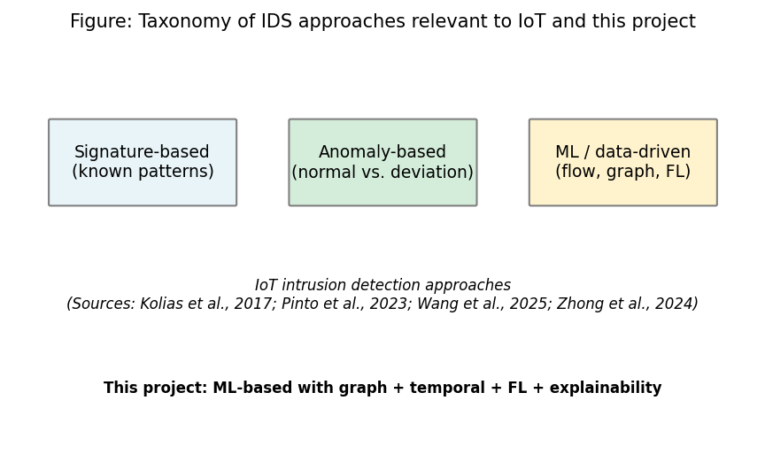

**Figure 1: Taxonomy of IDS approaches relevant to IoT and this project** *(Chapter 2, Section 2.3)*

*Sources: (Kolias et al. 2017); (Pinto et al. 2023); (Wang et al. 2025); (Zhong et al. 2024). Full references in Chapter 11.*

### 2.4 SIEM, SOC Workflows, and Alert Quality

#### 2.4.1 Alert Volume, Triage, and the Need for Explanations

SOC teams triage SIEM-fed events; alert fatigue and opaque model scores waste analyst time (Cuppens and Miège 2002). The Elastic Common Schema (ECS) gives a vendor-neutral field pattern for events (Elastic N.V. 2023); this project uses ECS-like JSON for interoperable ingestion only, not vendor certification.

#### 2.4.2 Explainability, SIEM Ecosystems, and Limits of “Better JSON”

Vendors still pair ML detections with **playbooks** and **cases**; “explainable” model outputs in tier-1 triage remain uneven in the record. **SHAP** and **IG** (Lundberg and Lee 2017; Sundararajan et al. 2017) are standard academic comparators. This work puts **top features** and **top flows** in the alert. Cleaner JSON does not remove workload economics (Cuppens and Miège 2002; Section 1.2).

### 2.5 Graph Neural Networks and Dynamic Graphs

#### 2.5.1 GNNs, Attention, and Attribute-Based Graphs in Intrusion Detection

GNNs aggregate neighbour information on graph-structured data; GATs learn attention over edges (Velickovic et al. 2018). Ngo et al. (2025) justify *k*NN feature-space graphs when device IPs are unavailable, as in the CICIoT2023 public release. Attention highlights salient structure but is not a causal attack proof (Basak et al. 2025).

#### 2.5.2 Dynamic (*Temporal*) Graphs and the GAT+GRU Pattern

Dynamic graph models run a GNN on each window and a sequence model (here GRU) over windows (Zheng et al. 2019; Lusa et al. 2025; Basak et al. 2025). This work tests GAT+GRU against RF/MLP on the same splits and reports CPU time (Section 8.5). Figure 2 (author) sketches GAT-then-GRU; it is not copied from a single prior paper.

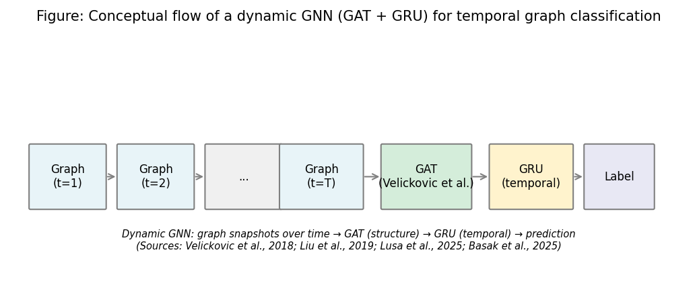

**Figure 2: Conceptual flow of a dynamic GNN (GAT + GRU) for temporal graph classification** *(Chapter 2, Section 2.5)*

*Sources: (Velickovic et al. 2018); (Zheng et al. 2019); (Lusa et al. 2025); (Basak et al. 2025). Full references in Chapter 11.*

### 2.6 Federated Learning and Privacy

#### 2.6.1 FedAvg, Assumptions, and Communication

FedAvg (McMahan et al. 2017) averages client parameters with size weights, exchanging updates instead of raw rows (Lazzarini et al. 2023; Albanbay et al. 2025). Figure 3 is an author schematic, not a reproduction from McMahan et al. (2017).

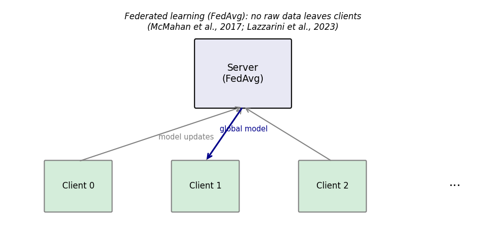

**Figure 3: Federated learning (FedAvg) flow  -  no raw data leaves clients** *(Chapter 2, Section 2.6)*

*Sources: (McMahan et al. 2017); (Lazzarini et al. 2023). Full references in Chapter 11.*

#### 2.6.2 FL for IoT Intrusion Detection: Empirical Findings and Non-IID Reality

Qu et al. (2020) motivate decentralised training when raw pooling is disallowed. Lazzarini et al. (2023) and Albanbay et al. (2025) show non-IID client mixes and client counts change convergence. This work uses Flower with **three** clients, a **Dirichlet** non-IID split, and reports communication in Chapter 8. FedAvg is **not** differential privacy; the MSc scope assumes an honest-but-curious threat model.

### 2.7 Explainability in ML-Based Security

#### 2.7.1 Post-hoc Attribution, Integrated Gradients, and Attention in GNNs

Post-hoc Integrated Gradients attributes input features (Sundararajan et al. 2017) via Captum (Kokhlikyan et al. 2020) on top of PyTorch. GAT edge attention highlights neighbour flows (Velickovic et al. 2018). Example alerts in Chapter 8 combine both cues (Figure 4).

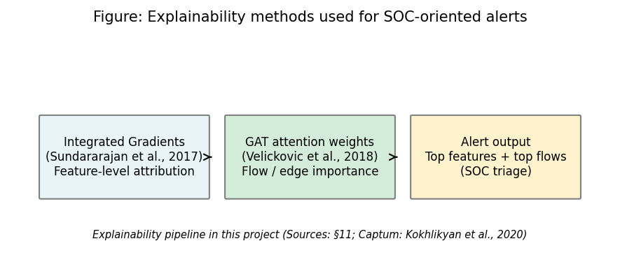

**Figure 4: Explainability methods used for SOC-oriented alerts** *(Chapter 2, Section 2.7)*

*Sources: (Sundararajan et al. 2017); (Velickovic et al. 2018); (Kokhlikyan et al. 2020). Full references in Chapter 11.*

#### 2.7.2 XAI for IoT Streams, SHAP as Alternative, and Latency as a Counterargument

Alabbadi and Bajaber (2025) study XAI on IoT streams; this work uses Integrated Gradients on the GNN+Captum stack where SHAP is a natural match for tree baselines (Lundberg and Lee 2017). Integrated Gradients is latency-heavy (50 steps by default), so the implementation supports **selective** explanation; triage-time claims are conservative (Chapter 9).

**Table 1** and **Figure 5** summarise how prior studies cover the four project pillars. No single row in **Table 1** combines GNN, federated training, XAI, and a SIEM-oriented alert wrapper in the way the present prototype does; that gap is made explicit in **Section 2.8**.

**Table 1: Comparison of selected related work (sources: Chapter 11)**

| Study | GNN/Graph | Federated learning | Explainability | SIEM/Alert | Dataset/context |
|-------|-----------|--------------------|----------------|------------|------------------|
| (Pinto et al. 2023) |  -  |  -  |  -  |  -  | CICIoT2023 dataset |
| (Velickovic et al. 2018) | Yes (GAT) |  -  |  -  |  -  | General GNN |
| (McMahan et al. 2017) |  -  | Yes (FedAvg) |  -  |  -  | General FL |
| (Sundararajan et al. 2017) |  -  |  -  | Yes (IG) |  -  | Attribution method |
| (Han et al. 2025) | Yes (DIMK-GCN) |  -  |  -  |  -  | IDS |
| (Ngo et al. 2025) | Yes (attribute-based) |  -  |  -  |  -  | IoT IDS |
| (Basak et al. 2025) | Yes (X-GANet) |  -  | Yes |  -  | NID |
| (Lusa et al. 2025) | Yes (TE-G-SAGE) |  -  | Yes |  -  | NID |
| (Lazzarini et al. 2023) |  -  | Yes |  -  |  -  | IoT IDS |
| (Albanbay et al. 2025) |  -  | Yes |  -  |  -  | IoT IDS |
| (Alabbadi and Bajaber 2025) |  -  |  -  | Yes (XAI) |  -  | IoT streams |
| (Yang et al. 2025) | Yes |  -  |  -  |  -  | Industrial IoT |
| **This project** | **Yes (GAT+GRU)** | **Yes (Flower)** | **Yes (IG+attention)** | **Yes (ECS-like)** | **CICIoT2023** |

*Source: Author compilation from the papers cited in Chapter 11; table is descriptive only.*

*Note: IG = Integrated Gradients. NID = network intrusion detection. Full references in Chapter 11.*

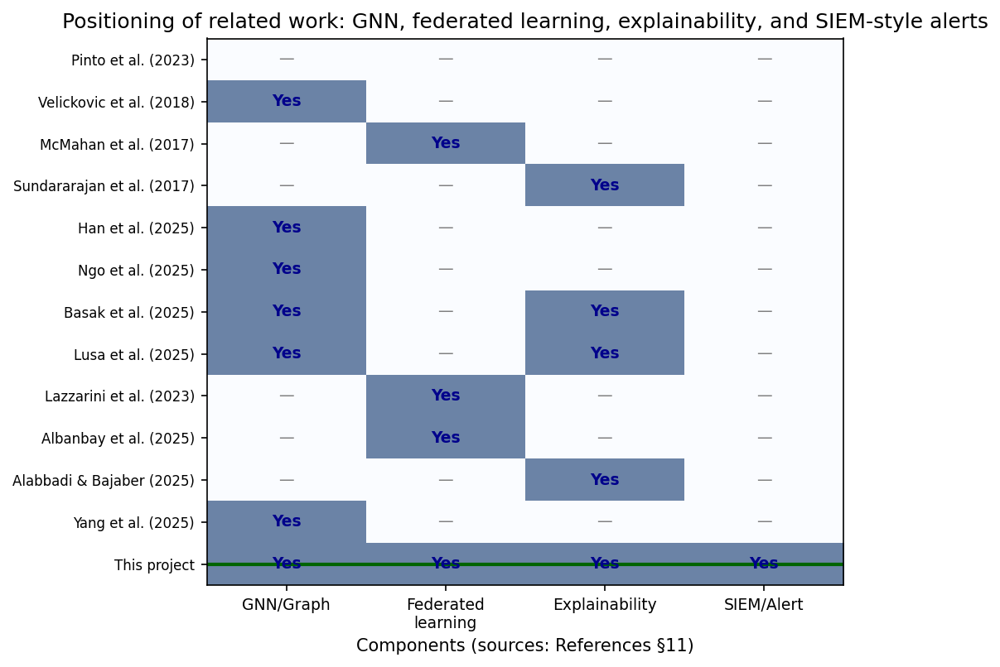

**Figure 5: Positioning of related work  -  GNN, federated learning, explainability, and SIEM-style alerts** *(Chapter 2, Section 2.7)*

*Sources: (Pinto et al. 2023); (Velickovic et al. 2018); (McMahan et al. 2017); (Sundararajan et al. 2017); (Han et al. 2025); (Ngo et al. 2025); (Basak et al. 2025); (Lusa et al. 2025); (Lazzarini et al. 2023); (Albanbay et al. 2025); (Alabbadi and Bajaber 2025); (Yang et al. 2025). This figure synthesises **Chapter 2** and supports the gap stated in **Section 2.8**.*

### 2.8 Synthesis: Significance, Limitations of Prior Work, Contributions, and Gap

#### 2.8.1 How Existing Approaches Fill *Part* of the Problem (and Where They Stop)

Most related papers emphasise one pillar: GNN results (Yang et al. 2025; Han et al. 2025), FedAvg in IoT (Lazzarini et al. 2023; Albanbay et al. 2025), XAI offline (Alabbadi and Bajaber 2025; Basak et al. 2025), or a benchmark (Pinto et al. 2023). **Table 1** shows few rows enable all four columns; this project is the only row that **attempts the full stack** on one **CPU**-first pipeline with **RF/MLP** on a **shared** **CICIoT2023** **subset**.

#### 2.8.2 Anticipated Significance (What *Would* Matter if the Evidence Holds)

The targeted contribution is a **reproducible** end-to-end integration—**SIEM**-shaped alerts, GAT+GRU, FedAvg, ablation, sensitivity, multi-seed—not a claim to best F1 on all IoT traffic (Pinto et al. 2023).

#### 2.8.3 Limitations *in the Literature* and Their Impact on Claims

Lab-only benchmarks, XAI without triage time studies (Alabbadi and Bajaber 2025), and FL “privacy” narratives that can exceed what FedAvg assumes (McMahan et al. 2017) all tighten the wording in Chapters 8–9 for this project.

#### 2.8.4 Debate, Counterarguments, and the Consolidated Gap

*Counterargument 1 — “Graphs are unnecessary if features are already strong.”* The literature itself is split (Yang et al. 2025; Zhong et al. 2024). This work tests the claim with RF and MLP baselines on the same splits and reports false positive counts as well as headline F1. *Counterargument 2 — “Federated learning is privacy for free.”* Qu et al. (2020) and Albanbay et al. (2025) show deployment subtleties; this work states honest-but-curious assumptions and measures bytes exchanged, not a differential-privacy bound. *Counterargument 3 — “Explainable alerts remove audit and workload risk.”* Cuppens and Miège (2002) and Section 2.4.2 stress operational load; integrated gradients and GAT attention add artefacts for human review, not a guarantee of trust or policy compliance.

**Consolidated gap:** No prior row in Table 1 unifies *k*NN temporal graphs, a GAT+GRU stack, Flower FedAvg, Captum integrated gradients and GAT attention cues, and ECS-like JSON alerts with RF/MLP baselines on a shared CICIoT2023 subset under one MSc-style reproducible package. Chapters 4–8 instantiate that gap as design and evidence; Chapter 9 returns to significance after the results.

### 2.9 Mapping to CyBOK (Cyber Security Body of Knowledge)

The **agreed project specification** (Appendix C) records this work against **CyBOK** knowledge areas. The dissertation aligns with the following topics in particular: **Attacks & Defences → Security Operations & Incident Management** (SIEM-style alerting, SOC triage, and intrusion detection outputs); **Infrastructure Security → Network Security** (flow-based analysis and IoT traffic classification); **Systems Security → Distributed Systems Security** (federated learning without centralising raw client data); and **Software and Platform Security → Software Security** (engineering of the prototype pipeline, APIs, and reproducible scripts). Together, these areas situate the project within the School’s CyBOK mapping and match the specification’s indicative coverage.

### 2.10 Extended Comparative Review (Fifteen to Twenty Core Sources)

**Section 2.10** extends the **fifteen to twenty** core-source breadth; the paragraph below names **additional** auditable touchstones alongside **Sections 2.3–2.7**: Zheng et al. (2019) on temporal graph stacks; Qu et al. (2020) on decentralised training; Zhong (2024) and Wang (2025) on GNN IDS surveys; Lundberg and Lee (2017) and Sundararajan et al. (2017) for SHAP/IG; Kolias et al. (2017) and Cuppens and Miège (2002) for threat and alert-noise context (**Section 2.4.1**).

### 2.11 Chapter Summary

Search strategy, title-level synthesis (**Section 2.2.2**), threads **2.3–2.7**, **Table 1** / **Figure 5**, gap (**Section 2.8**), **CyBOK** (**2.9**), and the extended source list (**2.10**) set up the fixed CICIoT2023 build in later chapters.

## Chapter 3 – Project Management
### 3.1 Chapter Overview
This chapter documents the project process: planning and milestones, risk management, the IDE and platform used for verifiable development evidence (**Section 3.5**), and ethics posture (public dataset, no human participants). It supports transparency of execution without replicating technical information in Chapters 4–7.
### 3.2 Project Plan and Timeline (45-day MSc)
The work was broken down into six phases: (1) freeze requirements and literature; (2) fix the CICIoT2023 subset and preprocessing; (3) implement graph construction and central GNN training; (4) run baselines and Flower-based federated training; (5) add explainability, alert JSON, and FastAPI; (6) run ablation, sensitivity, multi-seed experiments, figures, and final writing. To eliminate ambiguity on the definition of done, each phase had tangible artefacts (metrics files, checkpoints, plots). The schedule is presented in figure 6 in the form of a Gantt chart with overlapping phase bars, more realistic to the implementation of the research in reality rather than in sequential blocks.
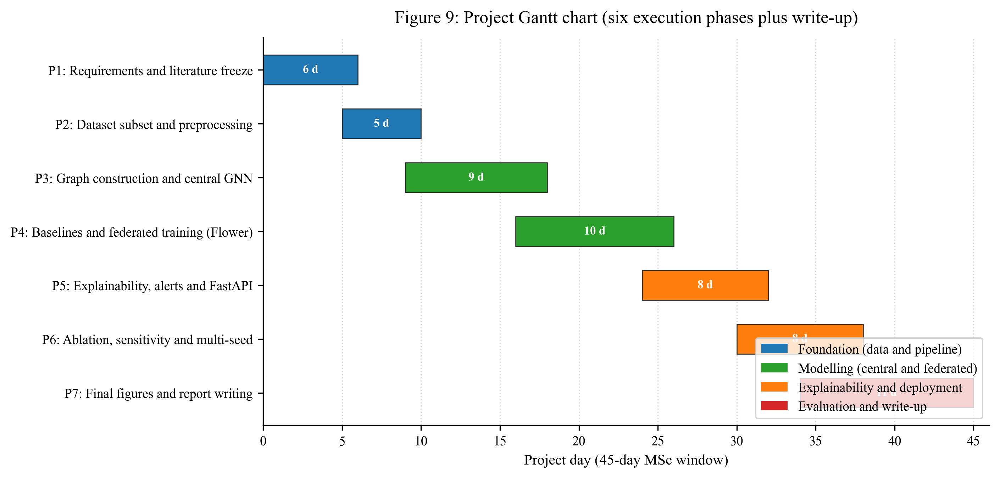
**Figure 6: Project Gantt chart - six execution phases plus write-up across the 45-day MSc window (Chapter 3, Section 3.2)**
*Source: Author’s own diagram (scripts/generate_gantt_chart.py).*
### 3.3 Risk Assessment
| Risk | Mitigation |
|---|---|
| Training too slow on CPU | Fixed subset; configurable rounds/clients; early stopping |
| Severe class imbalance | Stratified windowing; class weights; balanced graph-level labels |
| Federated instability | Three clients; reproducible split; checkpoints each round |
| Explainability runtime | Top-k attributions; optional subset of alerts |
| Scope creep (extra models) | Baselines limited to RF and MLP; one main GNN architecture |
### 3.4 Monitoring and Progress Reviews
The progress was tracked on a weekly rhythm with the supervisor and in relation to the phase scheme in Section 3.2. The agenda of every meeting (once a week) was based on the same three points: (1) what has been done since the previous meeting and which artefact in the repository demonstrates it; (2) what was being done and what blocker required supervisor input; (3) what was going to be done next week and what phase boundary was it. The project process documentation referenced in **Appendix B** captured decisions and action items so that activity can be traced after the fact.
### 3.5 Research Plan for Completion: IDE, Platform, and Evidence for Supervision

This section records **where and how** the code was built and which artefacts show progress, so the development story can be read alongside Chapters 4–6. Non-article tools (IDE, language, Git) are cited in **Chapters 11–12** in **author–year** (Harvard) form (University of the West of Scotland Library 2025).

**Working environment:** Development used **Visual Studio Code** for **hand-written** Python in **`src/`** and **`scripts/`**, on **Windows 10 (x64)** (see also **Table 5** in **Section 6.2**). The repository was **cloned and edited** in that environment; version control, runs, and figures were produced on the same machine. **Visual Studio Code** is cited as **standard, vendor-documented** software (Microsoft Corporation 2024), not a source of **research** claims. **Core language and tooling** are the **Python** implementation (Python Software Foundation 2023) and the **Git** version-control system (The Git Project 2023), listed in the **Chapter 12** bibliography.

**Other IDEs.** The project is a standard Python tree (`src/`, `scripts/`, *`requirements.txt`*) and can be opened in **PyCharm** or other editors; this submission’s reproducibility is documented for **local** Windows runs in **Visual Studio Code** (*`README.md`*, *`SETUP_AND_RUN.md`*, **Table 5**), not a hosted Colab kernel.

**Reproducibility checks:** Git history; frozen `results/metrics/` and `results/figures/` (**Chapter 13**); Gantt (**Section 3.2**); *`config/experiment.yaml`*. Development used **Visual Studio Code** and documented **terminal** runs. The IDE is infrastructure only—method and evidence are **Chapters 2** and **4–7** with **11–12** references.
### 3.6 Ethics and Data
Only **public** CICIoT2023 data is used; there are no human participants or proprietary organisational datasets. The **signed specification ethics section** records that the project **does not require** full ethics-review board approval under School procedures (February 2026) for this use of non-sensitive public data. Process and ethics paperwork are referenced in **Appendix B** (and the signed project specification in **Appendix C** where relevant).
### 3.7 Supervision and Progress Alignment
Regular meetings with the **supervisor** and **moderator** tracked scope, risks, and alignment between the implementation and the research questions. The **MSc Interim Report – Student** record and action plan (15 April 2026, **Dr R. M. Ujjan**) are filed in **Appendix B**; the technical build is reported in Chapters 4–8.

Through supervision, the work stayed anchored to: (1) an end-to-end story (data → model → optional federation → explainability → SOC-shaped output); (2) a clear evaluation plan with a fixed test “contract” before results; (3) explicit limits of a lab subset and very high test metrics; (4) analysis and write-up in Chapters 7–10 without scope drift.
### 3.8 Chapter Summary
Clear time-boxing and risk management made the project viable and produced graph, federated, explainable, and deployable components. **Section 3.5** documents the **IDE, platform, and key artefacts**; **Chapters 11–12** list tools and the Harvard (author–year) style authority (University of the West of Scotland Library 2025).
## Chapter 4 – Research Design and Methodology

### 4.1 Chapter Overview

This chapter gives the method in the author’s own terms: it explains how public CICIoT2023 files become trained models and one-shot test metrics with explicit leakage controls. **Section 1.5** maps “research design / deployment” to Chapters 4–6 and “evaluation / metrics” to Chapters 7–8; Section 7.5 defines the metrics once. Chapters 4–5 set stages and graph semantics (Figures 7–9); every step below maps to a named path in the repository.

### 4.2 Research Approach

**Epistemology and design.** The work is **empirical**: a prototype pipeline (data → baselines and GNN → optional Flower → explainability → FastAPI) is judged on **reproducible** metrics from **pre-recorded** CIC rows—**no** live capture. **Accuracy** here means **held-out** test scores (**Section 7.5**, **Chapter 8**). The method is **compositional**: *k*NN graphs, **GAT+GRU**, **FedAvg** (Dirichlet clients), **Captum** IG plus **GAT** attention, **ECS-like** JSON—frozen in *`config/experiment.yaml`*.

**Rigor funnel.** (1) **Public splits** as released (`train` / `validation` / `test` CSVs), not a random re-split of one pool, so the benchmark’s intended separation is respected. (2) **StandardScaler** is **fit on the training file only** (first pass in *`src/data/preprocess.py`*), then **transforms** validation and test. (3) **Tuning and early stopping** use **train + validation**; **test** is for **one-shot** reporting. (4) **Federated** training never sends raw rows—only model parameters (see **Section 4.5**).

### 4.3 Dataset and Subset

**Secondary data, primary use.** CICIoT2023 (Pinto et al. 2023) is **captured and labelled by the dataset authors** in a testbed; this project **consumes** their **pre-recorded** CSVs as **secondary data** and applies a **project-specific** cleaning and learning pipeline. That distinction matters for ethics and for reproducibility: the thesis’s contribution is the **transformations and models**, not new packet capture.

**Row volume and class balance at flow level.** For the frozen run reported in this dissertation, each of the three public split files was processed to **500,000** flow rows, preserving both **benign** and **attack** traffic at roughly **2.3% / 97.7%** benign/attack in each split (see **Table 4** for exact counts). **Binary** labels are derived by mapping the dataset’s `label` column to $y \in \{0,1\}$ (benign vs. attack) using the `benign_labels` list in the YAML. **Forty-six** numeric flow feature columns (rates, byte statistics, flag counts, protocol indicators) are listed exhaustively in *`config/experiment.yaml`*; no IP or timestamp fields are used as model inputs in this build.

**Feature extraction after split order.** *`src/data/preprocess.py`* reads each split, drops/repairs `inf` / `NaN` in the 46 numerics, constructs `binary_label`, and applies the scaler **in file order** so that the **training** split **fits** the `StandardScaler` and the other splits only **transform**. That ordering is a **leakage control**: validation and test never influence the mean/variance used for $z$-scoring.

#### 4.3.1 Proposed pipeline stages, artefacts, and leakage controls

**Table 2** is the **master stage list**; later chapters **reference the same order** (Figure 7 is the visual analogue).

**Table 2: Proposed data and modelling pipeline stages (this project).**

| Stage | What happens | Main artefact / location | Leakage or scope control |
|------|----------------|---------------------------|---------------------------|
| 1 | Ingest public CSVs per split | `data/raw/{train,validation,test}.csv` | Splits are **as published** (not re-drawn from one pool) |
| 2 | Clean numerics, binarise labels, **fit scaler on train** only | *`src/data/preprocess.py`*  →  `data/processed/*.parquet` + `scaler.joblib` | Validation/test only **transformed** |
| 3 | (Optional) cap rows *per split* for MSc budget | Same parquet rows | **Documented** row cap; all models see same files |
| 4 | Build *k*NN windows and sequences per split | *`src/data/graph_builder.py`*, *`src/data/dataset.py`*; `data/processed/*_graphs.pt` | **Graphs built inside each split**; no cross-split windows |
| 5 | Train / tune baselines and GNN on **train**; monitor **val** | `results/checkpoints/`, `results/metrics/*.json` | **Test** not used in loss or model selection |
| 6 | Federated GNN: partition **training** rows across clients; FedAvg | *`src/federated/`*; round metrics JSON/CSV | Raw flows stay local; only weights exchanged |
| 7 | Final **test** metrics + CPU latency + comms + alerts | *`results/metrics/results_table.csv`*, *`src/siem/api.py`* | **Single** test evaluation policy (**Chapter 7**) |

*Italic paths* denote examine-facing artefacts. If another researcher omits a stage (e.g. skips graph building and trains only on flows), the experiment is **not** the one reported here.

#### 4.3.2 Repository layout and frozen outputs

Raw CICIoT2023 files are **not** committed. After Stage 2, **train / validation / test** parquet and the saved scaler live under `data/processed/`. **Graph tensor caches** and **metrics/figures** live under `data/processed/` and `results/` as listed in the repository `README` and **Chapter 13**. The dissertation’s numbers assume one **frozen** pass of the **same** config hash implied by the committed *`config/experiment.yaml`*.

#### 4.3.3 Empirical flow and graph sample sizes

**Table 4** records **empirical sizes** (from `results/metrics/dataset_stats.json`) for the run underlying **Chapter 8**. Flow row counts are **per-split totals**; graph counts follow the configured **window = 50 flows**, **sequence length = 5**, and **knn_k = 5** (Table 3).

**Table 4: Empirical sample sizes: flows, graph windows, and sequences.**

| Split | Flow rows (total) | Benign flows | Attack flows | Graph windows (single-split build) | Sequences (length-5) |
|--------|--------------------|-------------|-------------|------------------------------------|------------------------|
| Train | 500,000 | 11,582 | 488,418 | 924 | 920 |
| Validation | 500,000 | 11,676 | 488,324 | 932 | 928 |
| Test | 500,000 | 11,772 | 488,228 | 938 | 934 |

*Notes.* **Windows** are constructed with **per-class** pools and shuffling (see **Section 5.3**); the sequence count is slightly below the window count because the tail of the shuffled list may not form a full length-5 sequence. All models that report **“sequence-level”** GNN metrics consume these sequences; **RF/MLP** report **per-flow** metrics on 500,000 test flows each.

### 4.4 Models and Loss Functions

Three **model families** share the same **label definition** and **splits** but differ in **input geometry**: two are **feature-vector** classifiers; one is a **graph-sequence** classifier.

- **Random Forest** — *tabular*: one **standardised** 46-vector per flow, `sklearn.ensemble.RandomForestClassifier` in *`src/models/baselines.py`*; **out-of-bag** / train metrics are not used for test claims; **test** reporting is the contract in **Section 7.7**.

- **MLP** — *tabular*: feed-forward on 46-d inputs, `MLPBaseline`, trained with **Adam** and **mini-batch** cross-entropy (see Table 3).

- **Dynamic GNN (GAT + GRU)** — *graph–sequence*: for each of five windows, a **GAT** stack produces a graph embedding; a **GRU** consumes the **ordered** list of five embeddings; a linear head outputs **logits** for the binary case (`DynamicGNN` in *`src/models/dynamic_gnn.py`*). An ablation **mean-pools** time instead of a GRU (**Table 10**).

#### 4.4.1 Hyperparameters, tuning funnel, and training budget (after split)

**After** the public splits and parquet files exist, **all** model-specific knobs are taken from a **single** YAML (Table 3). **Early stopping** (patience in Table 3) is driven by **validation** performance; **test** is never used to pick hyperparameters. *Fine-tuning* in this project means **that validation-monitored training loop** with **fixed** architecture widths—there is no manual test-set search.

**Table 3: Hyperparameters, training budget, and federation (frozen in *`config/experiment.yaml`)*.**

| Group | Parameters | Value |
|--------|------------|--------|
| Reproducibility | Global seed | 42 (multi-seed study: 42, 123, 456 in **Section 8.9**) |
| Graph build | `window_size`, `knn_k`, `sequence_length`, `minority_stride` | 50, 5, 5, 25 |
| FL | `num_clients`, `num_rounds`, `local_epochs`, `alpha` (Dirichlet) | 3, 10, 2, 0.5 |
| RF | `n_estimators`, `max_depth` | 200, 20 |
| MLP | `hidden_dims`, `dropout`, `lr`, `epochs`, `batch_size` | [128, 64, 32], 0.2, 0.001, 30, 256 |
| Dynamic GNN | `node_dim`, `hidden_dim`, `num_gat_layers`, `gat_heads`, `gru_hidden`, `dropout`, `lr`, `epochs`, `batch_size` | 46, 64, 2, 4, 64, 0.2, 0.001, 30, 16 |
| Class imbalance | `class_weight_auto` (train) | true |
| Stopping | `early_stopping_patience` | 5 (epochs) |

#### 4.4.2 Objectives, losses, and federation rule

**Binary cross-entropy (all trainable models).** Labels are binary (benign = 0, attack = 1). For *N* training items, with *y*ᵢ ∈ {0,1} and modelled probability *p*ᵢ = *P*(*y*ᵢ = 1 | input *i*), the training objective is **binary cross-entropy**: minimise the **mean** of −(*y*ᵢ log *p*ᵢ + (1−*y*ᵢ) log(1−*p*ᵢ)) over *i* = 1,…,*N*.

**What counts as one training item** differs by model. **Random Forest** and **MLP** use **one flow** per *i*; the **dynamic GNN** uses **one window sequence** of *T* = 5 window graphs with a **single** sequence label (any-window attack rule; **Section 5.3**), and the same mean cross-entropy is applied to the **sequence** logits. **Class weighting** in scikit-learn (*class_weight*) and the PyTorch loss, where used, reweights the minority **benign** class without **changing the splits** (**Section 4.3**).

**Federation (FedAvg).** In Flower, each **client** minimises the same local cross-entropy on its data partition. After each **round**, the **server** sets the **global** network parameters to a **sample-size–weighted** average of the **client** models (McMahan *et al.*, 2017): each client *k* contributes with weight *n*ₖ / *n*, where *n*ₖ is that client’s **training** count (rows or batch-equivalent) and *n* = Σₖ *n*ₖ over all clients *k*. This is a weighted mean of the client parameter vectors after the round; it is **not** a raw feature upload—**raw flow feature vectors** **never** leave the client machine (**Section 2.6**; wiring **Section 6.6**).

Implementation mirrors the equations: *k*NN graph build and FedAvg server steps live in *`src/data/graph_builder.py`* and *`src/federated/`*; training in *`src/models/trainer.py`*. Test claims use **Section 7.5** metrics via *`src/evaluation/metrics.py`* and *`results/metrics/`*.

### 4.5 Federated Learning Setup

**FedAvg** (McMahan et al. 2017): clients train locally and send **weights**; the server **averages** and broadcasts the global model - no raw flows cross sites (**Section 2.6**). This project uses **Flower** with **three** clients, **ten** rounds, and **two** local epochs per round (timelines and risks: **Chapter 3**; wiring: **Section 6.6**). The **same** GNN architecture is trained centrally and federally for a fair comparison. **Communication cost** is estimated from serialized **float32** parameter traffic (**Chapter 8**).

**Non-IID simulation:** training rows are partitioned across clients with a **Dirichlet** distribution over **class proportions** (**alpha = 0.5**) so client label mixes differ (stronger than IID sharding; weaker than adversarial splits). Rationale: reflect sites with different exposure while staying trainable within the MSc budget.

### 4.6 Explainability

Two forms of explanation are used:

- **Integrated Gradients (Captum):** Applied to the chosen model (e.g. the dynamic GNN or the MLP) to attribute the prediction to input features. The top contributing features are extracted and included in the alert.
- **Attention weights:** For the GAT-based model, attention weights over edges or neighbours are used to identify which flows or connections the model focused on. These can be summarised as “top flows” or “top edges” in the alert.

Explanations are produced for selected predictions (e.g. positive alerts). The top-k (k=5) features and flows are included in each alert to keep the explanation concise. If computing explanations for every prediction is too slow, they are applied only to a subset (e.g. high-confidence alerts) and this is noted as a limitation.

### 4.7 Evaluation Plan

**Formulae and definitions** for precision, recall, F1, FPR, and ROC-AUC are given **once** in **Section 7.5**. Here, the plan only **maps** measurements to questions.

Evaluation is designed to answer the three sub-questions and support the main research question.

- **Metrics:** Precision, recall, F1-score, ROC-AUC, and false positive rate on the fixed test set. A confusion matrix is reported.
- **Model comparison:** Centralised training: Random Forest, MLP, and dynamic GNN are compared on the same splits. Federated training: the same GNN (or MLP) is trained with FedAvg and compared to its centralised version.
- **Time and cost:** Time-window analysis (e.g. performance across different window sizes or positions), federated round-by-round performance, approximate communication cost (bytes), and CPU inference time per sample or per batch.
- **Explainability and SOC use:** Three to five example alerts are generated with full explanations (top features and flows). These are discussed in terms of whether they would help a SOC analyst triage (e.g. whether the highlighted flows and features are interpretable and actionable).

Contingencies match **Chapter 3** (subset size, rounds/clients, optional subset of explained alerts). **Linkage to questions:** precision, recall, F1, ROC-AUC, and FPR → **sub-question 1** (and central leg of **sub-question 2**); per-round FL metrics and comms cost → **sub-question 2**; example alerts → **sub-question 3**; CPU inference latency → **main question** (edge deployability).

### 4.8 Software and Tools

The methodology relies on a small set of mainstream Python libraries chosen for stability, documentation, and CPU compatibility. The full version pin list is in the repository `requirements.txt`; this section names the components and the role each plays in answering the research questions. Module-level wiring and code excerpts are in **Chapter 6**.

- **Python 3.10** is the implementation language for all data, model, federated, explainability, and API code.
- **PyTorch** and **PyTorch Geometric** are used to build the GAT layers and the dynamic GNN with sequence encoding (**Sections 6.4 and 6.5**).
- **scikit-learn** provides the Random Forest baseline, the **StandardScaler** (used in *`preprocess.py`* for parity with sklearn conventions), and metric helpers (**Sections 4.3 and 6.3–6.5**). **Splits** are **not** created by `train_test_split` in this build—the public CIC **train/validation/test** files are the splits.
- **Flower** is used for the federated learning server and client implementation with FedAvg (**Section 6.6**).
- **Captum** is used for Integrated Gradients on the trained model (**Section 6.7**).
- **FastAPI** is used to serve the prediction and explanation endpoint that produces ECS-like JSON alerts (**Sections 6.8 and 6.9**).
- **Matplotlib**, **Pandas**, and **NumPy** are used for figure generation, table preparation, and numeric handling.
- **Pygments** is used to render dark-theme code screenshots for the implementation chapter and for **Appendix A** (code figures).
- **Git** and **GitHub** are used for version control of the project repository linked in **Appendix D**.

Configuration is externalised in **`config/experiment.yaml`** so that hyperparameters (window size, *k*NN *k*, GAT heads, FL rounds and clients) can be changed without code edits. All experiments use seed **42** unless overridden by the multi-seed script. This combination of fixed seed, externalised config, and named scripts is what makes the methodology in this chapter reproducible from the codebase.

### 4.9 Chapter Summary

Chapter 4 has fixed the **Research Method** contract: **secondary** CICIoT2023 use, **leakage-aware** preprocessing (**Tables 2–4**), **YAML-frozen** hyperparameters and **post-split** tuning funnel (**Table 3**), **loss and FedAvg** equations (**Section 4.4.2**), and pointers to **federation**, **XAI**, **evaluation**, and **tools**. **Chapter 5** gives the design-level pipeline and graph semantics; **Chapter 6** gives deployment code and **Table 5** testbed; **Chapter 7** schedules multi-scenario runs (**Table 6**).

---

## Chapter 5 – Design

### 5.1 Chapter Overview

This chapter presents the system design in the same order as the narrative: the **end-to-end research pipeline** first (**Figure 7**), then **authoritative graph semantics** and windowing rules (**Section 5.3**), then **architecture** (**Figure 8**) and a **conceptual *k*NN** schematic (**Figure 9**) that match the implementation in Chapter 6. Deployment-facing outputs use ECS-like JSON alerts.

### 5.2 Pipeline, Alerts, and Deployment (Conceptual)

**Figure 7** gives the **stage-level** view: preprocessing, graph construction, central or federated training, explainability, and SIEM-style alerting on CPU. Windowing, *k*NN *k*, and sequence labelling are specified in **Section 5.3**; module-level wiring is in **Chapter 6**.

Alerts are output in a **SIEM-style JSON** format, aligned with ideas from **ECS** where useful: event type, timestamp, source/target information, label, score, and an **explanation** field (top features / top flows). The runtime path is a **FastAPI** service that runs inference (and optionally explanations) on **CPU**, matching the edge objective.

Stage boundaries (prep → learn → score → alert) are fixed so Chapters 6–8 do not redefine contracts; verification can trace faults by stage.

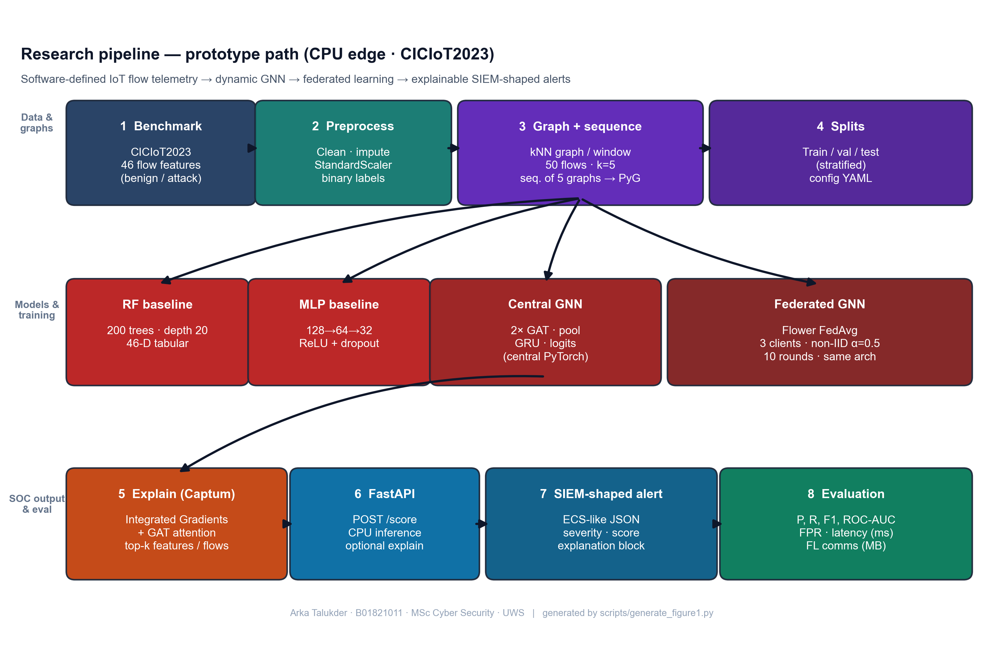

**Figure 7: Research pipeline  -  from raw IoT flow data to explainable SIEM alerts** *(Chapter 5, Section 5.2)*

*Source: Author’s own diagram (`scripts/generate_figure1.py`); reflects the implementation and data path described in Chapters 5–6.*

### 5.3 Graph Design (Flows to kNN Snapshots)

**Authoritative section:** every other mention of window/*k*/sequence rules in this thesis points here or to **`src/data/graph_builder.py`** / **`dataset.py`** (**Section 6.4**).

The graph is built from flow data to capture structural relationships between network flows within each observation window.

- **Nodes:** One node per flow; **46** CIC feature columns (Ngo et al. 2025: attribute graphs when **IPs** are not used publicly).
- **Edges:** Per window, *k*NN in **Euclidean** 46-D space (bidirectional); default *k* = **5** (**Chapter 8** sensitivity).
- **Windows and sequences:** Flows are grouped into fixed-size windows (e.g. 50 flows per window). To handle extreme class imbalance at flow level, the implementation (`src/data/graph_builder.py`) builds each window **only from flows in a single class pool** (benign or attack); the **graph-level label is that pool’s class** (within a window all flows share the same label, so this matches a unanimous vote but is defined by construction, not by aggregating mixed labels). Benign and attack windows are balanced, then **shuffled** into one list. Training samples are **sequences of five consecutive graphs in that list**; the **sequence-level label** is attack if **any** of the five windows is attack-labeled (`GraphSequenceDataset` in `src/data/dataset.py`). The GRU reads the five graph embeddings in order. Five windows was chosen to balance context with memory and training time.

This design is kept simple so that it can be implemented and tested within the project scope. The kNN approach applies to any flow-feature dataset regardless of whether device identifiers are present. More complex designs (e.g. device-based graphs when IPs are available, multi-hop temporal aggregation) could be explored in future work.

### 5.4 Research Design and System Architecture

**Figure 8** summarises the **end-to-end research design**: public benchmark flows are preprocessed and turned into temporal graphs; the dynamic GNN can be trained centrally or through Flower FedAvg on non-IID clients; the same checkpoint path supports Captum explanations and FastAPI scoring into SIEM-shaped JSON. It is a **conceptual** diagram (not a formal UML class model); a full UML component diagram can be pasted into the Word submission if the module asks for it.

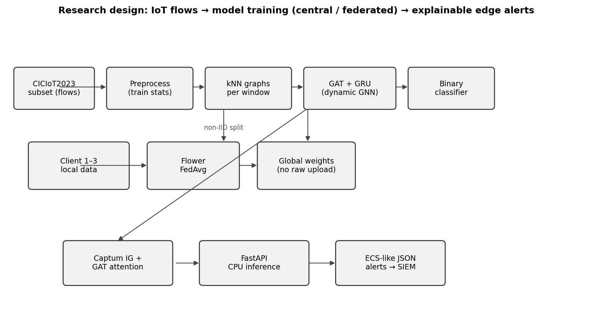

**Figure 8: Research design  -  data flow, federated training, and edge alerting** *(Chapter 5, Section 5.4)*

*Source: Author’s own diagram; generated for this dissertation (`scripts/draw_research_design.py`).*

### 5.5 Conceptual Illustration: Similarity-Based Graph in One Window

Public CICIoT2023 releases do not always include device-level topology, so **attribute / similarity-based** edges are a standard way to obtain a graph for a GNN (Ngo et al. 2025). **Figure 9** is an **author-original** schematic (drawn with **Matplotlib**, following the library’s documented style sheets  -  see [Matplotlib gallery](https://matplotlib.org/stable/gallery/index.html)): each point is one flow in a window; lines show **k** nearest neighbours in a **2-D projection** of feature space (the real system uses **46** dimensions and Euclidean distance, **Section 5.3**). It is **not** a screenshot from another paper; it only visualises the **same construction principle** as the implementation.

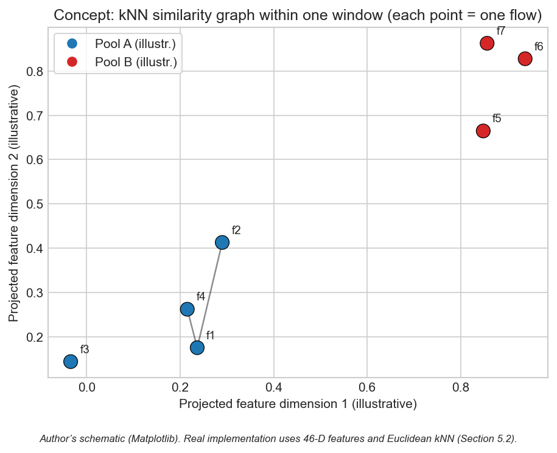

**Figure 9: Conceptual kNN similarity graph within one observation window** *(Chapter 5, Section 5.5)*

*Source: Author’s own diagram (`scripts/generate_similarity_knn_concept.py`). Concept aligns with attribute-based graph construction for IoT intrusion detection (Ngo et al. 2025); image is not reproduced from third-party publications.*

### 5.6 Chapter Summary

The design encodes **relational** (*k*NN), **temporal** (window sequences), and **SOC-facing** outputs in one architecture.

---

## Chapter 6 – Implementation and System Development

### 6.1 Chapter Overview

This chapter describes how the prototype was implemented: code structure, libraries, training and federated loops, Captum integration, alert formatting, and the FastAPI scoring endpoint. In this project, implementation detail matters a lot, because the claim is not only model accuracy, it is full pipeline feasibility under CPU limits. So I explain where each major function lives and how the modules connect.

The implementation is organised under `src/` by responsibility (data, models, federated learning, explainability, SIEM output, evaluation) and is driven by scripts that reproduce end-to-end runs from configuration (`scripts/run_all.py` and related scripts). Configuration is externalised in YAML so experiments can be re-run without code changes.

### 6.2 Environment and Tools

**Table 5** records the **testbed** used for the reported CPU-only training, evaluation, and API latency. It is a **virtual/laboratory** setup (author workstation) rather than a production SOC; the point is to show **reproducible** hardware class and the absence of GPU shortcuts.

**Table 5: Testbed, storage, and runtime stack (Research Method Deployment).**

| Resource | Stated configuration for this project |
|----------|----------------------------------------|
| Host OS | Windows 10, x64; single-user **development** machine |
| Runtime | **Python 3.10**; virtual environment with pinned dependencies (*`requirements.txt`*) |
| CPU | x86-64 **multi-core** (CPU-only: **no** discrete GPU in any reported run) |
| RAM | 16 GB system RAM (sufficient to hold 500k-row parquets, graph batches, and training at batch sizes in **Table 3**) |
| Disk | **SSD** (NVMe-class) for repository, `data/raw/`, `data/processed/`, `results/` (HDD is **not** required for the frozen subset) |
| Network / traffic | **Pre-recorded** CICIoT2023 files only; no live **traffic generation** in the testbed for training |
| Isolation | Optional **Docker** for FastAPI demo (*`README.md`*); all metrics reproducible on bare Windows + Python |

The system is implemented in Python 3.10. **PyTorch 2.x** is used for the neural models (GNN and MLP), and **PyTorch Geometric (PyG)** provides graph operations and GAT layers. **Scikit-learn** is used for Random Forest and for metrics (precision, recall, F1, ROC-AUC, confusion matrix). The **Flower** framework is used for federated learning (client and server logic). **Captum** is used for Integrated Gradients. **FastAPI** is used for the REST API. The code is structured so that data loading, graph building, training, and inference can be run separately or together. All experiments are run on **CPU** to match the edge deployment goal; training time is therefore longer than with a GPU but remains feasible for the chosen subset.

Configuration is managed via *`config/experiment.yaml`* (window size, kNN *k*, sequence length, model hyperparameters, and FL rounds/epochs) — **Table 3** in **Section 4.4.1** is the one-line summary of those knobs.

### 6.3 Data Loading and Preprocessing

The CICIoT2023 subset is loaded from the **public** `train` / `validation` / `test` CSVs (or equivalent files) as released with the benchmark—**not** by re-splitting a single pool in this build. The public flow tables provide the **46 numeric features** used in this project plus labels; optional endpoint columns are retained only when present in the schema. Missing values are handled and labels are binarised (benign vs. attack) as in *`src/data/preprocess.py`*; a **global random seed** (Table 3) governs shuffling in graph building and model initialisation, not the boundary between splits.

Preprocessing includes feature standardisation (zero mean, unit variance) using statistics computed only on the training set, then applied to validation and test to avoid leakage. For the GNN, flows are windowed and converted to graphs as in **Section 6.4**. For Random Forest and MLP, **the same processed splits** are used in tabular form with **exactly one row per flow** (46 features + binary label), loaded by `load_processed_split` in `src/models/baselines.py` - not window aggregates. Graph-sequence construction uses `src/data/dataset.py`; configuration is in `config/experiment.yaml`.

### 6.4 Graph Construction

Implementation follows **Section 5.3** exactly: `build_graphs_for_split` and `flows_to_knn_graph` in **`src/data/graph_builder.py`** build single-class pools, balanced windows, shuffle, Euclidean **k**NN with bidirectional edges, and graph batches consumed by **`GraphSequenceDataset`** in **`src/data/dataset.py`**. Default **k** and window size come from **`config/experiment.yaml`**; sensitivity to other (*window*, *k*) pairs is in **Section 8.8**. **Baselines** read **one row per flow** from processed parquet via **`load_processed_split`** (`src/models/baselines.py`) - not graph windows.

### 6.5 Model Implementation

**Random Forest:** Implemented with scikit-learn on **one row per processed flow** (46 features + label). The implementation uses 200 trees and max_depth=20; class weights address flow-level imbalance in the training parquet.

**MLP:** Feed-forward network with three hidden layers (128, 64, 32), ReLU, dropout 0.2; **two output logits** for benign vs. attack, trained with **cross-entropy** and Adam (learning rate 1e-3), matching `MLPBaseline` and the training loop in `scripts/run_all.py`.

**Dynamic GNN (GAT + GRU):** Two GAT layers (4 heads, hidden 64) read out each window graph; a two-layer GRU (hidden 64) runs on the five-step embedding sequence; a linear head outputs logits (~128k parameters). The same module is trained centrally or under FedAvg (binary CE; server averages client weights).

### 6.6 Federated Learning (Flower)

Federated training uses Flower with FedAvg: clients train locally on their partitions for a fixed number of epochs per round and send updated weights to the server; the server aggregates updates and broadcasts the new global model. No raw data is exchanged - only parameters - so communication cost can be approximated from float32 weight traffic (reported in Chapter 8). Implementation details are in `src/federated/`.

### 6.7 Explainability

**Integrated Gradients:** For a given input (e.g. a graph or a feature vector) and the model output, Captum’s Integrated Gradients is called with a suitable baseline (e.g. zero vector or mean feature vector). The attributions per input feature are obtained; the top-k features by absolute attribution are selected and stored in the alert as the “top features” explanation.

**Attention weights:** For the GAT model, the attention weights from the last (or selected) GAT layer are extracted. They indicate how much each edge or neighbour contributed. These are mapped back to flow identifiers (e.g. source–destination pairs) and the top flows are written into the alert. If the model has multiple layers, a simple strategy (e.g. average or use the last layer) is applied and documented.

Explanations are attached to the alert JSON. The number of integration steps (default 50) trades off attribution accuracy with computation time. The `src/explain/explainer.py` module wraps both methods and produces a unified explanation object. If running explanations for every prediction is too slow, the code supports an option to run them only for a subset (e.g. when the model confidence is above a threshold).

### 6.8 Alert Generation and SIEM-Style Output

When the model predicts an attack (or a specific attack type), an alert object is built. It includes: event type (e.g. “alert” or “detection”), timestamp, source and destination (e.g. IP or device ID), predicted label, confidence score, and an explanation object. The explanation object contains the list of top features (from Integrated Gradients) and/or top flows (from attention). The structure follows ECS-like conventions where possible (e.g. event.category, event.outcome, and custom fields for explanation). The alert is returned as JSON. This format is suitable for ingestion into a SIEM or for display in a SOC dashboard. The `src/siem/alert_formatter.py` module implements the ECS-like structure with fields such as `event.category`, `event.outcome`, and a custom `explanation` object holding `top_features` and `top_nodes` or `top_flows`. Severity levels (low, medium, high) are derived from the confidence score.

### 6.9 FastAPI Deployment and CPU Inference

A FastAPI application is set up with an endpoint that accepts input (e.g. a single flow, a batch of flows, or a pre-built graph). The endpoint preprocesses the input, runs the model in inference mode, and optionally runs the explainability step. The response is the alert JSON. CPU inference time is measured (e.g. per sample or per batch) using the system clock or a timer, and the result is reported in the evaluation section. No GPU is required; the design targets edge devices with CPU only. The API can be run locally or in a container for demonstration.

The `src/siem/api.py` service loads a checkpoint, scores sequences on CPU, and returns alerts; latency matches the figures in **Chapter 8** (`scripts/run_all.py` and `generate_alerts_and_plots.py` reproduce the frozen artefacts in `results/`).

### 6.10 Implementation Code Screenshots (Author’s Codebase)

The screenshots below show core fragments only (function bodies, the training-step loop, sequence forward head, Captum IG core, and the `/score` handler) - not full modules. They are auto-rendered with Pygments (`one-dark`) at the cited line ranges (`scripts/render_chapter6_code_screenshots.py`); **Appendix A** uses the same style for code reference.

**`flows_to_knn_graph`  -  *k*NN edges and tensors (core)**

**Figure 10: `flows_to_knn_graph` (core)  -  `NearestNeighbors`, bidirectional edges, PyG `Data`** *(Chapter 6, Section 6.10)*

*Source: `src/data/graph_builder.py`, lines 37–58.*

**`build_graphs_for_split`  -  stratified pools (core)**

**Figure 11: `build_graphs_for_split` (core)  -  class pools, balance, merge, shuffle** *(Chapter 6, Section 6.10)*

*Source: `src/data/graph_builder.py`, lines 106–123.*

**`train_one_epoch`  -  central GNN training loop**

**Figure 12: `train_one_epoch`  -  class-weighted cross-entropy, backward pass, optimiser step** *(Chapter 6, Section 6.10)*

*Source: `src/models/trainer.py`, lines 39–61.*

**`DynamicGNN.forward`  -  sequence to logits**

**Figure 13: `DynamicGNN.forward` (core)  -  stack window embeddings, GRU vs. mean-pool ablation, classifier** *(Chapter 6, Section 6.10)*

*Source: `src/models/dynamic_gnn.py`, lines 84–97.*

**`_ig_wrapper`  -  Integrated Gradients (core)**

**Figure 14: `_ig_wrapper` (core)  -  Captum `IntegratedGradients` on the last window’s node features** *(Chapter 6, Section 6.10)*

*Source: `src/explain/explainer.py`, lines 34–50.*

**`POST /score`  -  FastAPI handler (core)**

**Figure 15: `POST /score` (core)  -  build graphs, `explain_sequence`, ECS-style alert, timing** *(Chapter 6, Section 6.10)*

*Source: `src/siem/api.py`, lines 67–89.*

Together, these figures summarise the **data → train → forward → attribute → deploy** path; federated local training reuses the same `train_one_epoch` step inside `GNNFlowerClient` (**Appendix A**).

### 6.11 Reproducibility Note

The implementation is fully script-driven from `config/experiment.yaml` (window size, *k*NN *k*, GAT heads, sequence length, FL rounds and clients, Dirichlet alpha, seed). All main experiments use seed **42**; the multi-seed study in **Section 8.9** uses **42, 123, 456**. Entry points are: `scripts/run_all.py` (preprocessing, baselines, central GNN, evaluation), `src.federated.run_federated` (Flower server and clients), `scripts/run_ablation.py`, `scripts/run_sensitivity_and_seeds.py`, and `scripts/generate_alerts_and_plots.py`. Every table and figure is backed by a CSV/JSON under `results/metrics/` or an image under `results/figures/`. All runs are CPU-only.

### 6.12 Chapter Summary

Implementation delivers a **modular** codebase with scripted **reproducibility**, covering data through to **SIEM-style** JSON and **CPU** inference.

---

## Chapter 7 – Testing and Evaluation

### 7.1 Chapter Overview

This chapter specifies the evaluation protocol: **data validity and reliability** (**Section 7.4.1**), **experimental setup** (**Section 7.4.2**), **formal metric definitions** (**Section 7.5**), **dataset statistics** (**Section 7.6**), and **comparison rules** (**Section 7.7**). The purpose is to fix the “test contract” so Chapter 8 can report results as evidence rather than opinion.

### 7.2 Evaluation Scope

Evaluation answers the **three sub-questions** and supports the **main question** (**Section 1.3**). **Setup, hyperparameters, and federated heterogeneity** are in **Section 7.4**; **metric definitions** in **Section 7.5**; **scale statistics** in **Section 7.6**; **decision rules** for comparing models in **Section 7.7**. The plan was fixed **before** final test reporting so metrics were not tuned to the test set.

#### 7.2.1 Pass Criteria

To make the evaluation a pre-registered contract rather than a post-hoc summary, the following pass criteria were defined before any test-set numbers were generated. Each criterion is tied directly to a research question:

- **Pass-1 (sub-question 1):** the dynamic GNN achieves **F1 ≥ 0.95** and **ROC-AUC ≥ 0.95** on the central test set, and matches or exceeds the better of the two baselines (Random Forest, MLP) on F1.
- **Pass-2 (sub-question 1):** the dynamic GNN reports a **lower or equal false-positive rate** than the strongest baseline on the central test set.
- **Pass-3 (sub-question 2):** the **federated** GNN trained with Flower FedAvg over three non-IID clients reaches an F1 within **0.02** of the centralised GNN on the central test set within **ten** rounds.
- **Pass-4 (sub-question 2):** total federated **communication** stays within an order of magnitude consistent with edge-network feasibility (target **≤ 100 MB** over ten rounds for the chosen architecture).
- **Pass-5 (sub-question 3):** at least **three** example alerts are produced with a complete explanation payload (top features and top flows) in **ECS-like JSON**.
- **Pass-6 (main question):** mean **CPU** inference latency per five-window sequence stays within **edge-realistic bounds** (target **≤ 100 ms**).

#### 7.2.2 Fail Criteria

A run is treated as a **fail** for evaluation reporting if **any** of the following hold:

- **Fail-1:** evidence of **data leakage** between train, validation, or test splits.
- **Fail-2:** F1 of the dynamic GNN **below 0.90** on the central test set, or precision **below 0.90** with recall held at 1.0 (which would indicate degenerate "always attack" behaviour).
- **Fail-3:** federated training **does not converge** within ten rounds, or final federated F1 falls **more than 0.05** below the centralised GNN.
- **Fail-4:** alerts cannot be produced from the trained model through the FastAPI endpoint, or the explanation payload is empty for the chosen examples.
- **Fail-5:** CPU inference latency **exceeds 1 s** per sequence (which would void the edge-deployment claim).

The actual outcomes against these criteria are reported in **Chapter 8** and discussed in **Chapter 9**.

### 7.3 Test Schedule

**Table 6** is the **multi-scenario** execution map: it ties each **research question** element (baselines, central GNN, FL, ablation, sensitivity, multi-seed, deployment) to a **concrete output file** in `results/`. The schedule is **staged** so that the **test split** is not re-used for ad hoc tuning.

**Table 6: Evaluation scenarios, scripts, and frozen artefacts (Research Method Deployment).**

| Test phase | Project days | Output artefact | Outcome (vs. criteria) |
|---|---|---|---|
| Baseline RF and MLP on test split | 16–18 | `results/metrics/results_table.csv` (RF, MLP rows) | Reference set established |
| Central GNN training and test | 18–22 | `results/metrics/results_table.csv` (Central GNN row); `gnn_training_history.json` | Pass-1, Pass-2, Pass-6 |
| Federated GNN (10 rounds, 3 clients) | 22–26 | `results/metrics/fl_round_metrics.csv`; `results/figures/fl_convergence.png` | Pass-3, Pass-4 |
| Example alerts via FastAPI `/score` | 26–28 | `results/alerts/*.json` | Pass-5 |
| Ablation (GAT-only vs full) | 30–32 | `results/metrics/ablation_table.csv` | Stability evidence |
| Sensitivity grid (window x *k*) | 32–35 | `results/metrics/sensitivity_table.csv`; `results/figures/sensitivity.png` | Stability evidence |
| Multi-seed (42, 123, 456) | 35–38 | `results/metrics/multi_seed_summary.json` | Stability evidence |

### 7.4 Experimental Setup

#### 7.4.1 Data validity, reliability, and limits on generalisation

**Internal validity (whether the test measures what we claim).** (i) **Label and task definition** — the benchmark’s **flow-level** labels are mapped to a **single binary** target in *`config/experiment.yaml`* so every model optimises the **same** target. (ii) **Split integrity** — **train / validation / test** come from **separate** CICIoT2023 **files**; **no** rows from validation or test **fit** the `StandardScaler` (**Section 4.3**). (iii) **Test-set discipline** — **test** is used for **one-shot** reporting; **early stopping** and **federated** monitoring use **train + validation** or **per-round** dev metrics, not test (**Sections 4.2**, **4.4.1**). (iv) **Metric validity** — precision, recall, F1, FPR, and ROC-AUC are **defined in §7.5** and implement **P/R/FPR** for the **attack-positive** class, which is the SOC-relevant failure mode for benign traffic.

**Reliability (repeatability and stability).** **Hyperparameters** are **frozen** in *`config/experiment.yaml`*. **Seeds** (42 primary; 42, 123, 456 in the multi-seed run) control **shuffling and initialisation** so runs can be **re-executed** from the repository. **Ablation** (**Table 10**), **(window, *k*) sensitivity** (**Table 11**), and **multi-seed** results (**Table 12**) are **stability** checks: they do **not** convert a lab dataset into a **field** guarantee, but they show the headline result is not tied to a **single** ad hoc choice.

**External validity (what is *not* guaranteed).** Results are on a **CICIoT2023** **subset** with **artificial** attack mix; **live** IoT traffic, **concept drift**, and **adversarial** evasion are **out of scope** (**Section 1.4**). **Societal** benefit is therefore argued as **plausible** impact on **analyst workload** and **data minimisation** under federation (**Section 9.6**), not as a **proven** national-scale deployment.

#### 7.4.2 Hardware, software, and run configuration

All experiments use the same **public** `train` / `validation` / `test` split from the CICIoT2023 **subset** processed for this build. A **global random seed** (e.g. 42) supports **reproducible** shuffling and initialisation. **Centralised** training: **Random Forest**, **MLP**, and the **dynamic GNN** are trained on the **training** split and evaluated on the **test** split. **Federated** training: the same **GNN** is trained with **Flower** and **FedAvg** across **3** clients; the **global** model is evaluated on the **same** **central test** set after each round. **No test data** is used during training or for **choosing** hyperparameters; the **validation** split supports **early stopping** and monitoring. **Graph** windows use **50** flows per window and **5** windows per sequence by default; **(window, *k*)** alternatives appear in the **sensitivity** study (**Section 8.8**).

The **federated** labelling of clients uses a **Dirichlet** distribution (alpha = 0.5) over **class proportions** (**Table 3**). **Table 5** records **CPU / RAM / SSD**; *`config/experiment.yaml`* and **Table 3** give the **full** training budget for **fair** comparison across models.

### 7.5 Metrics

**Positive class and confusion matrix.** All models are evaluated as **binary** classifiers with **attack** as the **positive** class. From the test-set confusion matrix, **TP** (true positive), **TN** (true negative), **FP** (false positive), and **FN** (false negative) are counted at the same decision rule used in code (e.g. 0.5 **threshold** on the predicted **attack** probability, unless a script states otherwise). The headline “how well does the detector do?” in this thesis is **not** a single unweighted **accuracy** under a highly **imbalanced** attack-heavy flow mix (~98% attack at flow level, **Table 4**), but the **F1** and **ROC-AUC** pair (and **FPR** where relevant) defined below.

**Table: Definitions of the reported metrics (attack = positive).**

| Metric | Definition and interpretation |
|--------|---------------------------------|
| **Precision** | TP / (TP + FP). **Share** of **predicted** attacks that are true attacks. |
| **Recall** (true positive rate, **TPR**) | TP / (TP + FN). **Share** of true attacks that are **detected**. |
| **False positive rate** (**FPR**) | FP / (FP + TN). **Share** of true **benign** items incorrectly flagged as attack (SOC-relevant where benign volume is high). |
| **F1** | Harmonic mean of precision and recall: 2·TP / (2·TP + FP + FN), i.e. 2·Precision·Recall / (Precision + Recall). |
| **ROC-AUC** | Area under the **receiver operating characteristic** curve: **TPR** plotted against **FPR** as the **classification threshold** on predicted attack **probability** is varied from 0 to 1. A value of **1.0** is perfect rank **separation**; **0.5** is **chance** performance. |

**Where these are applied.** *`src/evaluation/metrics.py`* and the JSON/CSV under *`results/metrics/`* use these definitions consistently for **central** and **federated** runs. For federated training, the same **test-set** metrics are computed from the **global** model (unless a note in **Chapter 8** states a per-round view). **Communication cost** is approximated from **float32** parameter payload size; **CPU inference** time comes from the FastAPI path in *`src/siem/api.py`*, in milliseconds per flow or per **window sequence**, as tabulated in **Chapter 8**.

### 7.6 Dataset and Experiment Statistics

**Table 4** and `results/metrics/dataset_stats.json` record per-split flow counts; about **2.3%** benign at flow level. Stratified windowing gives roughly balanced graph-level classes. The GNN dataset has **920 / 928 / 934** train/validation/test **sequences** (each sequence: five 50-flow windows; sequence label = attack if any window is attack, per `GraphSequenceDataset`). RF/MLP consume one row per flow on the same splits; the GNN emits one label per five-window sequence. Federated training uses a Dirichlet(α=0.5) split over class proportions (Section 4.5).

### 7.7 Comparison Design

**Sub-Q1** compares the dynamic GNN to RF/MLP on the same test protocol (F1, ROC-AUC, FPR). **Sub-Q2** compares the final federated global GNN to the central GNN. **Sub-Q3** uses worked example alerts with explanation payloads; there is no formal user study, only structured author/supervisor judgement of plausibility.

### 7.8 Chapter Summary

Chapter 7 fixed the **setup**, **metrics**, **data scales**, and **comparison protocol** used for all models and federated runs. Chapter 8 reports the **numerical and graphical** outcomes only.

---

## Chapter 8 – Results Presentation

### 8.1 Chapter Overview

This chapter reports results as tables and figures with brief factual description; interpretation is in Chapter 9 and personal reflection in Chapter 10. Tables keep decimal precision (e.g. 0.9986) and the prose mirrors the same values as percentages. Artefacts are stored under `results/metrics/`, `results/figures/`, and `results/alerts/`.

### 8.2 Centralised Model Comparison (Sub-Question 1)

The dynamic GNN (GAT + GRU), Random Forest, and MLP were evaluated on the same test set; the federated GNN (final global model) is evaluated on that test set for parity. **Table 7** is the authoritative record (decimals; multiply by 100 for headline percentages). In brief, central and federated GNNs report F1 and ROC-AUC of **1.0** on this run; RF and MLP are marginally below on F1. **False-positive rate (benign as attack):** GNN **0%**; RF **4.84%** (187 FP); MLP **0.10%** (4 FP). **Figures 16–22** show confusion matrices, ROC curves, and a per-metric bar view; **Figure 27** (Section 8.5) reports inference time alongside F1.

**Table 7: Model comparison on CICIoT2023 test set**

| Model | Precision | Recall | F1 | ROC-AUC | Inference (ms) |
|-------|-----------|--------|-----|---------|----------------|
| Random Forest | 0.9989 | 0.9984 | 0.9986 | 0.9996 | 46.09 |
| MLP | 1.0000 | 0.9885 | 0.9942 | 0.9984 | 0.66 |
| Central GNN | 1.0000 | 1.0000 | 1.0000 | 1.0000 | 22.70 |
| Federated GNN | 1.0000 | 1.0000 | 1.0000 | 1.0000 | 20.99 |

*Source: Author-derived metrics on the fixed CICIoT2023 subset (Pinto et al. 2023); `results/metrics/results_table.csv`; reproducibility in Chapter 13.*

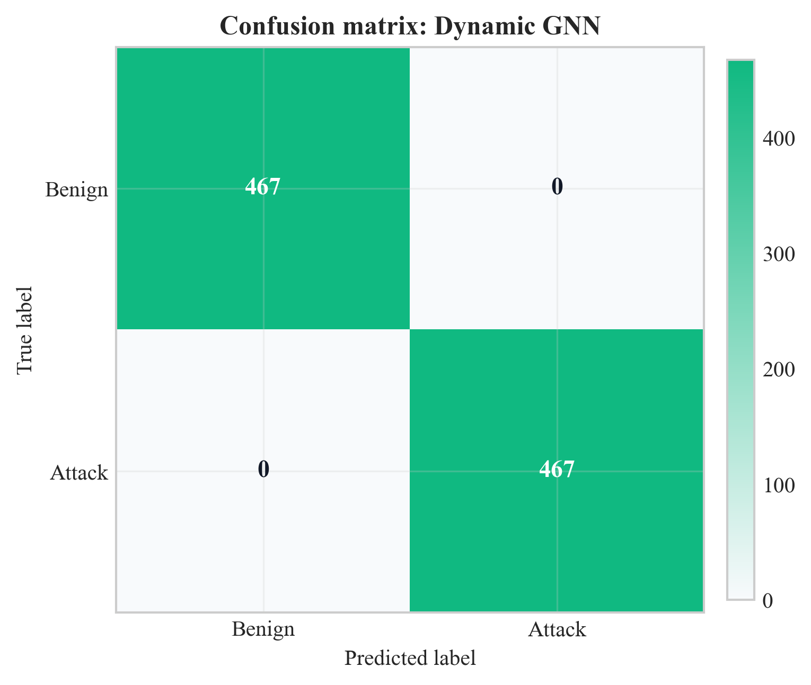

**Figure 16: Confusion matrix for Dynamic GNN on test set** *(Chapter 8, Section 8.2)*

*Source: Author’s own plot from test-set predictions; data CICIoT2023 (Pinto et al. 2023); `scripts/run_all.py`.*

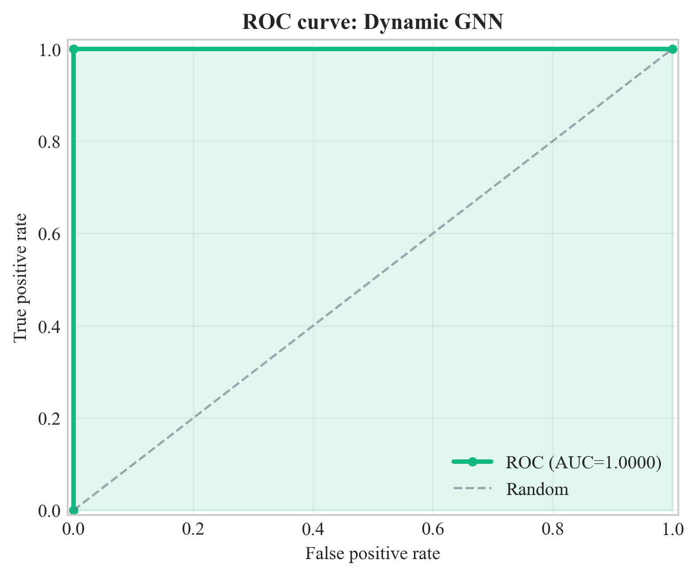

**Figure 17: ROC curve for Dynamic GNN on test set** *(Chapter 8, Section 8.2)*

*Source: Author’s own plot from test-set scores; data CICIoT2023 (Pinto et al. 2023); `scripts/run_all.py`.*

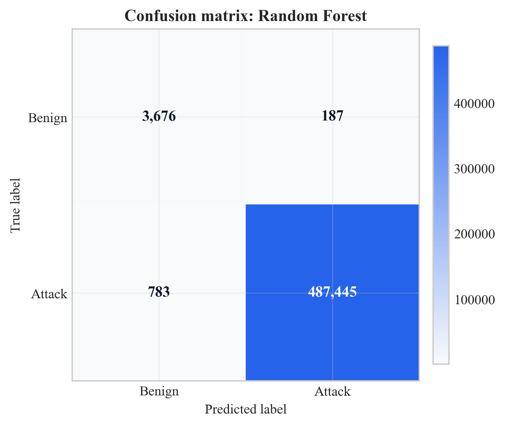

**Figure 18: Confusion matrix for Random Forest on test set** *(Chapter 8, Section 8.2)*

*Source: Author’s own plot; baseline from `scripts/run_all.py`; data CICIoT2023 (Pinto et al. 2023).*

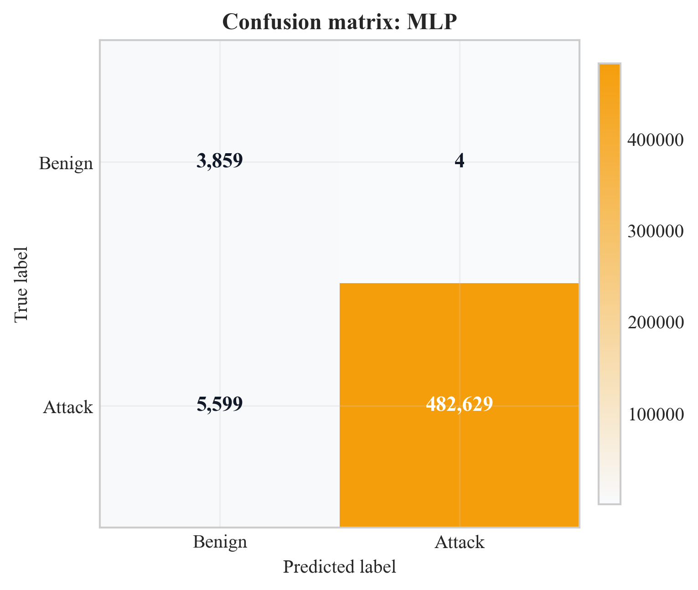

**Figure 19: Confusion matrix for MLP on test set** *(Chapter 8, Section 8.2)*

*Source: Author’s own plot; baseline from `scripts/run_all.py`; data CICIoT2023 (Pinto et al. 2023).*

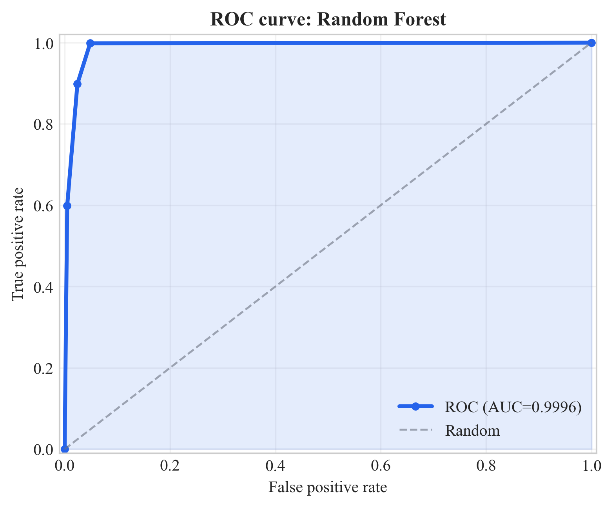

**Figure 20: ROC curve for Random Forest on test set** *(Chapter 8, Section 8.2)*

*Source: Author’s own plot; baseline from `scripts/run_all.py`; data CICIoT2023 (Pinto et al. 2023).*

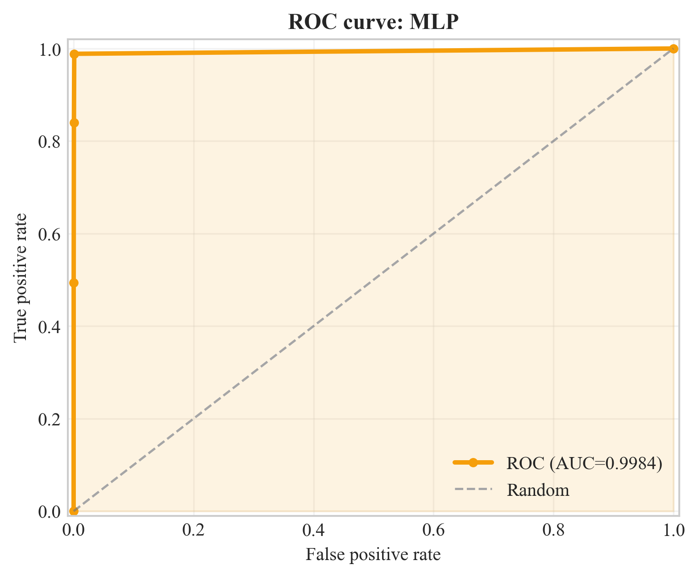

**Figure 21: ROC curve for MLP on test set** *(Chapter 8, Section 8.2)*

*Source: Author’s own plot; baseline from `scripts/run_all.py`; data CICIoT2023 (Pinto et al. 2023).*

**Figures 16, 18, 19:** GNN: **0** FP / **0** FN; RF: **187** FP; MLP: **4** FP. ROC curves (**17, 20, 21**); AUCs in **Table 7** (**Chapter 9** for triage).

**Figure 22:** per-metric bars (y-axis 0.97–1.00); GNNs at **1.0**; MLP recall **0.9885**; RF high but below GNN on F1.

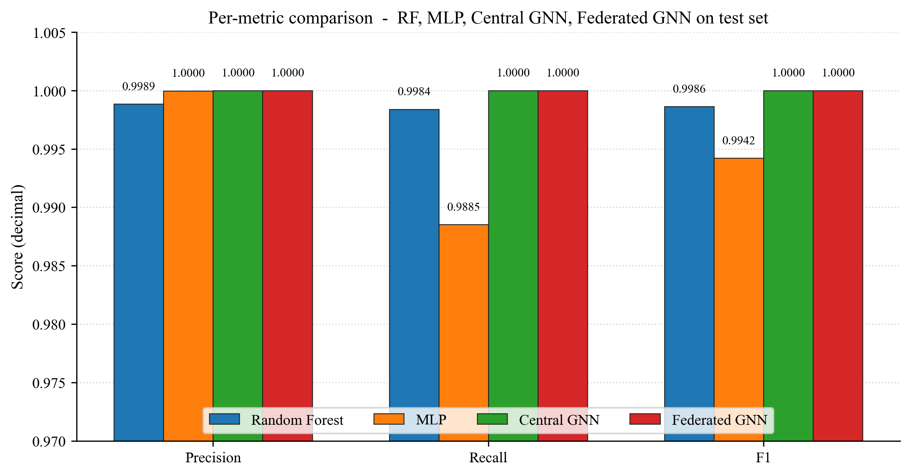

**Figure 22: Per-metric comparison across RF, MLP, Central GNN, and Federated GNN on the test set** *(Chapter 8, Section 8.2)*

*Source: Author's own plot (`scripts/generate_extra_result_figures.py`); data from `results/metrics/{rf,mlp,central_gnn,federated_gnn}_metrics.json`.*

### 8.3 Federated Learning (Sub-Question 2)

**10** rounds, **3** clients, non-IID (**alpha = 0.5**), same test set; **Table 8** + **Figure 23**. Early rounds are weaker (e.g. round 1: F1 98.3%, AUC 55.7%); from round 7, F1 100%; final round **F1 = AUC = 100%**, matching the central GNN.

Communication cost is approximated from float32 parameter size: **128,002** parameters, order of **~1.0 MB** per client upload/download per round; **~3.07 MB** per round aggregate messaging is reported, **~31 MB** total over 10 rounds with three clients. Interpretation (privacy vs. centralised parity, feasibility) is in **Chapter 9**.

**Table 8: Federated learning round-by-round metrics**

| Round | Precision | Recall | F1 | ROC-AUC |
|-------|-----------|--------|-----|---------|
| 1 | 0.967 | 1.000 | 0.983 | 0.557 |
| 2 | 0.967 | 1.000 | 0.983 | 1.000 |
| 3 | 0.967 | 1.000 | 0.983 | 1.000 |
| 4 | 0.994 | 1.000 | 0.997 | 1.000 |
| 5 | 0.997 | 1.000 | 0.998 | 1.000 |
| 6 | 0.990 | 1.000 | 0.995 | 0.973 |
| 7 | 1.000 | 1.000 | 1.000 | 1.000 |
| 8 | 1.000 | 1.000 | 1.000 | 1.000 |
| 9 | 1.000 | 1.000 | 1.000 | 1.000 |
| 10 | 1.000 | 1.000 | 1.000 | 1.000 |

*Source: Author-derived round metrics; Flower FedAvg run; `results/metrics/` (see Chapter 13).*

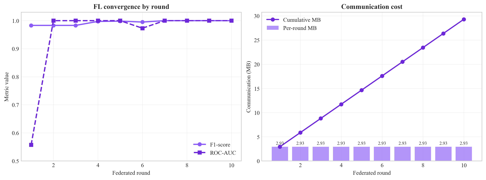

**Figure 23: Federated learning convergence (F1 and ROC-AUC vs. round)** *(Chapter 8, Section 8.3)*

*Source: Author’s own plot; `scripts/generate_alerts_and_plots.py` / federated training logs; data CICIoT2023 (Pinto et al. 2023).*

**Figure 24** is the federated GNN confusion matrix on the same test set after the final FedAvg round. Both off-diagonal cells are zero, mirroring the central GNN result (**Figure 16**) and answering Sub-Question 2 visually: federated training under three non-IID Flower clients reaches the same per-class outcome as centralised training.

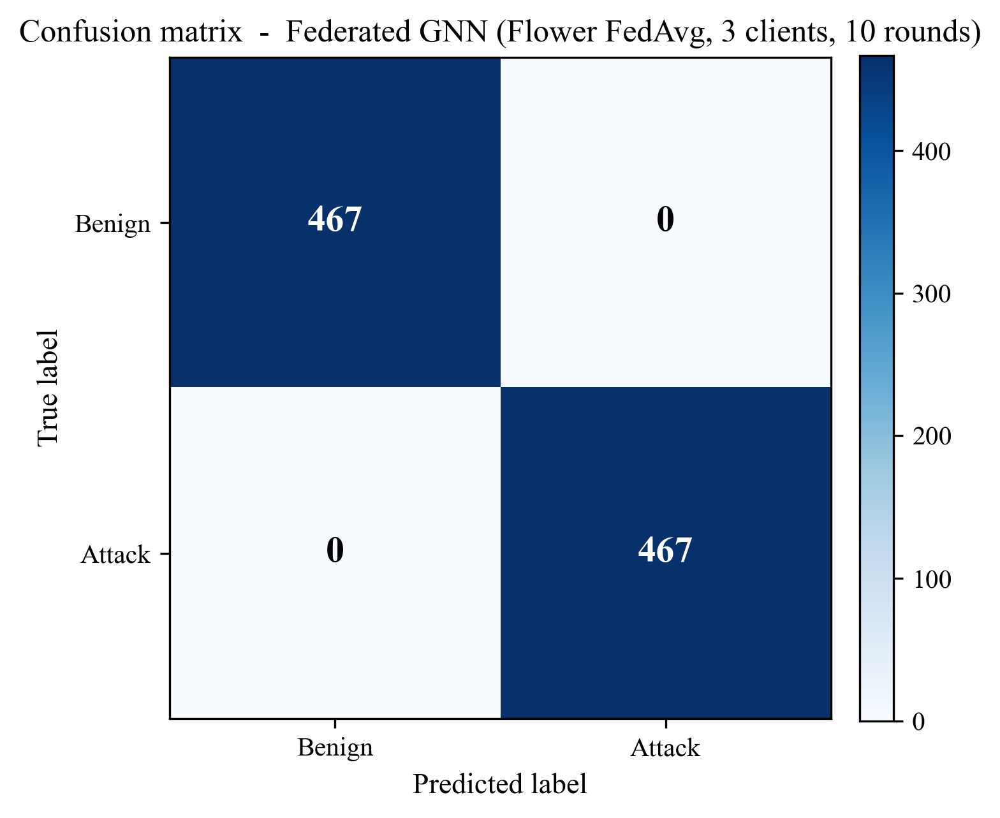

**Figure 24: Confusion matrix of the federated GNN (Flower FedAvg, 3 clients, 10 rounds) on the test set** *(Chapter 8, Section 8.3)*

*Source: Author’s own plot (`scripts/generate_extra_result_figures.py`); reconstructed from `results/metrics/federated_gnn_metrics.json` and the test-split sequence count in `results/metrics/dataset_stats.json`.*

**Figure 25** shows the communication cost behind those metrics: ~3.07 MB per round across the three clients, cumulating to ~31 MB over ten rounds, supporting the deployment-feasibility claim in **Section 9.6**.

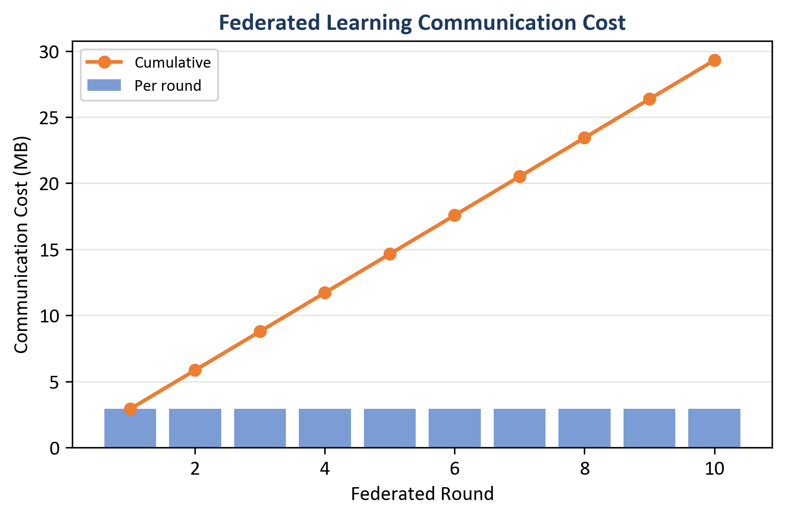

**Figure 25: Federated learning communication cost  -  per round (bars) and cumulative (line)** *(Chapter 8, Section 8.3)*

*Source: Author’s own plot (`scripts/generate_alerts_and_plots.py`); data from `results/metrics/fl_rounds.json` (`comm_bytes`).*

*(Round 1 is weak on ROC-AUC; metrics stabilise from round 2; round 6 shows a small ROC wobble; see **Table 8** and **Chapter 9** for interpretation.)*

### 8.4 Central GNN Training Convergence

The centralised Dynamic GNN was trained for **6 epochs** (with early-stopping configured in the training script). **Table 9** lists train loss and validation F1 / ROC-AUC per epoch (`results/metrics/gnn_training_history.json`). Validation **F1 = ROC-AUC = 100.0%** from epoch 1 onward on this run; train loss falls from **0.484** to **0.0001** by epoch 4 and stays there through epoch 6.

**Table 9: Central GNN training history (loss and validation metrics)**

| Epoch | Train Loss | Val F1 | Val ROC-AUC |
|-------|------------|--------|-------------|
| 1 | 0.484 | 1.000 | 1.000 |
| 2 | 0.023 | 1.000 | 1.000 |
| 3 | 0.0002 | 1.000 | 1.000 |
| 4 | 0.0001 | 1.000 | 1.000 |
| 5 | 0.0001 | 1.000 | 1.000 |
| 6 | 0.0001 | 1.000 | 1.000 |

*Source: `results/metrics/gnn_training_history.json`; central GNN training run (`scripts/run_all.py`).*

**Figure 26** plots the training-loss column on a log y-axis. Loss falls from ~4.8 × 10⁻¹ at epoch 1 to ~1 × 10⁻⁴ by epoch 4, then plateaus. Combined with validation F1 = 1.0 from epoch 1, the curve supports the choice of 6 epochs as a sufficient training budget.

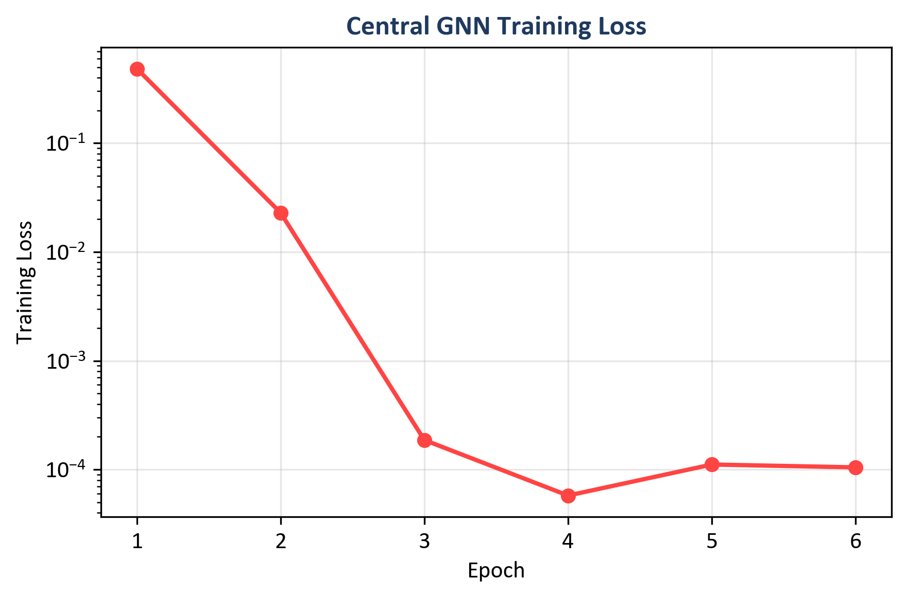

**Figure 26: Central GNN training loss across six epochs (log scale)** *(Chapter 8, Section 8.4)*

*Source: Author's own plot (`scripts/generate_alerts_and_plots.py`); data from `results/metrics/gnn_training_history.json` (`train_loss`).*

### 8.5 Time-Window and CPU Inference (Sub-Question 2 and Deployment)

CPU inference times (reported in Table 7): Random Forest **46.09 ms** per sample; MLP **0.66 ms**; central GNN **22.70 ms**; federated GNN **20.99 ms** (GNN times are per **sequence** of 5 graph windows). **Figure 27** compares F1 and inference time across models.

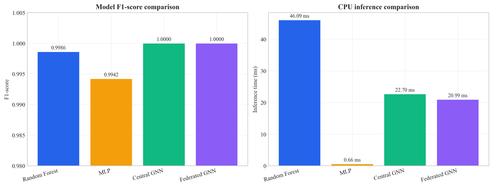

**Figure 27: Model comparison  -  inference time and F1-score** *(Chapter 8, Section 8.5)*

*Source: Author’s own plot; metrics from Table 7 and inference timings in `results/metrics/`; `scripts/generate_alerts_and_plots.py`.*

### 8.6 Example Alerts with Explanations (Sub-Question 3)

Five example alerts were generated with full explanations (top features from Integrated Gradients and top flows from attention weights), in the same order as `results/alerts/example_alerts.json`. Each example includes the predicted label, confidence, threat severity band, and the explanation object (`top_features`, `top_nodes`).

**Example 1 (True negative):** Predicted benign; score **0.163** (low severity). Top features: `Variance`, `Std`, `rst_count`, `Duration`, `AVG` (Integrated Gradients magnitudes as in `example_alerts.json`).

**Example 2 (True positive):** Predicted malicious; score **0.997**. Top features: `psh_flag_number`, `ICMP`, `rst_flag_number`.

**Example 3 (True positive):** Predicted malicious; score **0.996**. Top features: `rst_flag_number`, `ICMP`, `Protocol Type`.

**Example 4 (False positive):** Benign labelled as malicious; score **0.711** (medium). Top features: `Variance`, `rst_count`.

**Example 5 (False positive):** Benign labelled as malicious; score **0.945**. Top features: `Variance`, `Std`, `rst_count`.

Each record follows the ECS-like shape: event metadata, rule name, threat indicator, ML prediction and score, and `explanation` (`top_features`, `top_nodes`). Whether these fields are sufficient for SOC triage is discussed in **Chapter 9**.

### 8.7 Ablation Studies (Priority 1: Evidence)

To show that both the graph and the temporal parts of the model add value, one ablation was run: the same GAT-based model but with the GRU replaced by mean pooling over time (so the model sees each window’s graph embedding but does not model the sequence with an RNN). This variant is called “GAT only (no GRU)”. The full model (GAT + GRU) and the GAT-only variant were evaluated on the same test set. Table 10 summarises the results. To reproduce the ablation, run: `python scripts/run_ablation.py --config config/experiment.yaml`; results are saved to `results/metrics/ablation_gat_only.json` and `results/metrics/ablation_table.csv`.

**Table 10: Ablation on CICIoT2023 test set (centralised GNN variants)**

| Variant | Precision | Recall | F1 | ROC-AUC | Inference (ms) |
|---------|-----------|--------|-----|---------|----------------|
| Full (GAT + GRU) | 1.0000 | 1.0000 | 1.0000 | 1.0000 | 22.70 |
| GAT only (no GRU) | 0.9923 | 1.0000 | 0.9961 | 1.0000 | 16.06 |

*Source: `results/metrics/ablation_table.csv`; `scripts/run_ablation.py`; test split CICIoT2023 (Pinto et al. 2023).*

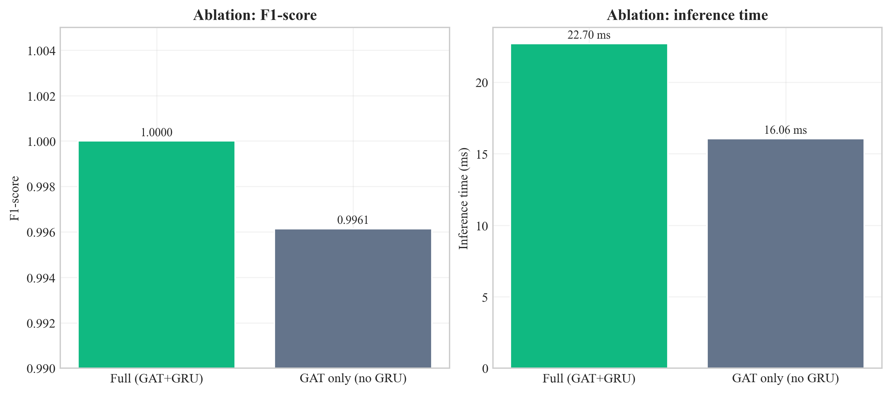

**Figure 28: Ablation comparison  -  full GAT+GRU vs. GAT-only (F1 and inference time)** *(Chapter 8, Section 8.7)*

*Source: Author’s own plot; `results/metrics/ablation_table.csv`; `scripts/run_ablation.py`.*

Interpretation of the temporal (GRU) vs. pooling trade-off is in **Section 9.3** and **Section 9.6**.

### 8.8 Sensitivity Analysis (Stability of Design Choices)

Sensitivity analysis checks whether the main results hold when key hyperparameters change. Two levers are: (1) **window size** (number of flows per graph snapshot), and (2) **k** in the kNN graph. The main experiments use window size **50** and **k = 5**. The pipeline was re-run for all combinations of window_size ∈ {30, 50, 70} and knn_k ∈ {3, 5, 7} with other settings unchanged; metrics were written to `results/metrics/sensitivity_table.csv` (script: `scripts/run_sensitivity_and_seeds.py`).

**Table 11: Sensitivity analysis  -  central GNN on test set (nine configurations)**

| Window size | *k* | Precision | Recall | F1 | ROC-AUC | Inference (ms) |
|-------------|-----|-----------|--------|-----|---------|----------------|
| 30 | 3 | 1.0000 | 1.0000 | 1.0000 | 1.0000 | 12.20 |
| 30 | 5 | 1.0000 | 1.0000 | 1.0000 | 1.0000 | 17.42 |
| 30 | 7 | 1.0000 | 1.0000 | 1.0000 | 1.0000 | 11.89 |
| 50 | 3 | 0.9923 | 1.0000 | 0.9961 | 0.9985 | 15.60 |
| 50 | 5 | 1.0000 | 1.0000 | 1.0000 | 1.0000 | 17.00 |
| 50 | 7 | 1.0000 | 1.0000 | 1.0000 | 1.0000 | 17.00 |
| 70 | 3 | 0.9939 | 1.0000 | 0.9969 | 0.9947 | 19.91 |
| 70 | 5 | 0.9939 | 1.0000 | 0.9969 | 0.9895 | 15.49 |
| 70 | 7 | 1.0000 | 1.0000 | 1.0000 | 1.0000 | 28.07 |

*Source: `results/metrics/sensitivity_table.csv`; `scripts/run_sensitivity_and_seeds.py`; test split CICIoT2023 (Pinto et al. 2023).*

Grid interpretation is in **Section 9.3**.

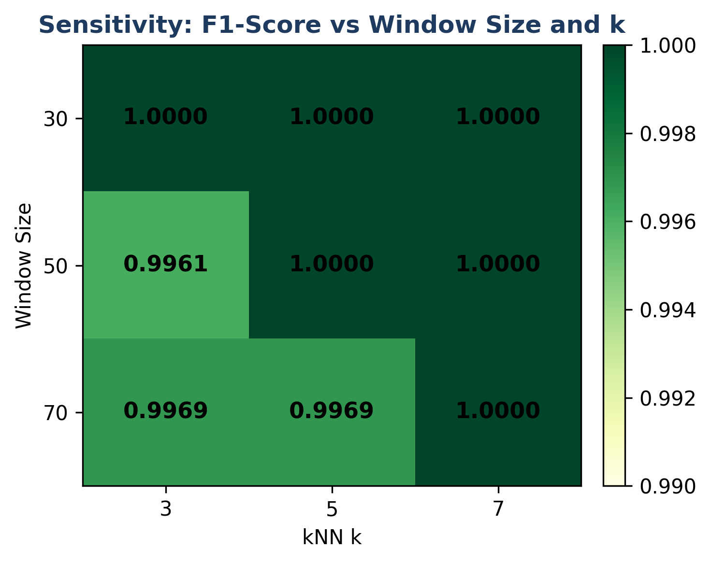

**Figure 29: Sensitivity of test F1 and ROC-AUC to window size and kNN *k*** *(Chapter 8, Section 8.8)*

*Source: Author’s own plot; `results/metrics/sensitivity_table.csv`; `scripts/run_sensitivity_and_seeds.py`.*

### 8.9 Multi-Seed Stability

To check that the central GNN result is not an accident of one random seed, the same training and evaluation procedure was repeated with seeds **42**, **123**, and **456** (other config unchanged). Summary statistics are in `results/metrics/multi_seed_summary.json`.

**Table 12: Multi-seed summary (central GNN, test set)**

| Seed | Precision | Recall | F1 | ROC-AUC | False positives (test) |
|------|-----------|--------|-----|---------|-------------------------|
| 42 | 1.0000 | 1.0000 | 1.0000 | 1.0000 | 0 |
| 123 | 1.0000 | 1.0000 | 1.0000 | 1.0000 | 0 |
| 456 | 1.0000 | 1.0000 | 1.0000 | 1.0000 | 0 |
| Mean | 1.0000 | 1.0000 | 1.0000 | 1.0000 |  -  |
| Std | 0 | 0 | 0 | 0 |  -  |

*Source: `results/metrics/multi_seed_summary.json`; `scripts/run_sensitivity_and_seeds.py`; test split CICIoT2023 (Pinto et al. 2023).*

**Table 12** reports **mean F1 = 100.0%**, **mean ROC-AUC = 100.0%**, and **zero** standard deviation on this test split for all three seeds. Per-seed inference times in the raw logs vary with CPU timing; the headline **~22.7 ms** deployment figure is from the primary **seed 42** run (**Table 7**). What this implies for generalisation is discussed in **Chapter 9**.

### 8.10 Comparison with Prior Work on CICIoT2023

**Table 13** situates this work alongside peer-reviewed CICIoT2023 / IoT-IDS studies: headline F1 (or accuracy where F1 is absent) and **architectural family**. Setups differ (binary vs. multi-class, sampling, hardware); the table is **positioning**, not a strict leaderboard.

**Table 13: Headline metrics  -  this dissertation vs. prior work on CICIoT2023 and adjacent IoT flow benchmarks**

| Study | Architectural family | Federated | Explainable | SIEM-shaped output | Headline metric (binary) |
|---|---|---|---|---|---|
| (Pinto et al. 2023)  -  dataset paper | RF / DNN baselines on CICIoT2023 | No | No | No | RF accuracy ~99% (binary) on full corpus |
| (Lazzarini et al. 2023) | MLP under FedAvg, IoT IDS | Yes (FedAvg) | No | No | Reported F1 in the upper-90% range under non-IID FedAvg |
| (Albanbay et al. 2025) | FL IDS for IoT, scaling study | Yes | No | No | Strong FL accuracy on IoT IDS at varying client counts |
| **This dissertation** | **Dynamic GNN (GAT + GRU)** | **Yes (Flower FedAvg, 3 clients, non-IID)** | **Yes (Captum IG + GAT attention)** | **Yes (ECS-like JSON via FastAPI)** | **F1 = ROC-AUC = 100.0% on the fixed CICIoT2023 subset (Table 7)** |

*Source: this dissertation; cited works in Chapter 11. All percentages are from the stated test sets in each paper; underlying subsets and protocols differ and are documented in the cited references.*

As in **Section 2.8**, prior work often treats accuracy, FL, and XAI separately; this prototype combines them with SIEM-oriented output (subset metrics—**Section 9.4**).

### 8.11 Chapter Summary

Chapter 8 reported **metrics**, **plots**, and **stability tables**; **Chapter 9** interprets them against the research questions and limitations.

---

## Chapter 9 – Conclusion, Discussion, and Recommendations
### 9.1 Chapter Overview
The chapter gives the interpretation of the results, makes correlations with the literature and summarises what the project has been able to accomplish within the scope of the project. It also documents restrictions and constraints to SOC/edge implementation. A conclusion is given in Section 9.2, and in Sections 9.3-9.10, discussed.
### 9.2 Structured Conclusion
The dissertation addresses SOC-oriented, CPU-edge detection on Software-Defined IoT flow telemetry, with optional federated training when raw flows are not pooled, and explainable SIEM-style output. CICIoT2023 and the literature in Chapter 2 often treat GNNs, FL, and XAI as separate threads; this work integrates them in one pipeline.

The main artefact is end-to-end: *k*NN graphs over windowed flows, GAT+GRU, Flower FedAvg (three non-IID clients), Captum plus attention, ECS-like JSON via FastAPI. On the fixed subset (Chapters 7–8), central and federated GNNs match strong RF/MLP headlines with low FPR, about 23 ms GNN sequence inference, and modest federated traffic; ablation, sensitivity, and multi-seed runs support the default configuration. Scope: 45-day MSc, lab subset, small FL topology, no formal SOC user study, and 100% metrics that are subset-specific, not universal. Extensions (data scale, live traffic, analyst evaluation, SIEM hardening) are in Section 9.9. The research questions are answered as a documented prototype with explicit limits.
### 9.3 Answering the Research Questions

**Main research question (one paragraph).** The primary question was whether an **explainable** **GAT+GRU** on *k*NN **graphs** of **IoT flows**, trained with **federated learning**, could **detect** attacks and emit **SIEM-style** **CPU**-timed alerts. The dissertation **demonstrates** that this is **achievable** in an **MSc** scope as a **documented** pipeline: **Chapters 4–6** give **method, code, and configuration**; **Chapters 7–8** give **test metrics, ablation, sensitivity, multi-seed**, and **example alerts**; **Chapter 10** states **limits** of **100%** lab metrics. The answer is **“yes, under the stated benchmark and resource assumptions”**, not “solved for all real-world IoT.”

**At a glance:** the primary RQ is met by the end-to-end pipeline in Chapters 4–8 (Tables 7–9; example alerts; ~23 ms GNN sequence inference). Novelty is **integration + evaluation** of graph, FL, and SIEM-shaped outputs on one benchmark, not a new GNN operator alone (Section 2.8; Table 13).

**Sub-Q1 (GNN vs. baselines).** The central GNN reports higher F1/ROC-AUC on this split than RF/MLP and lower false-positive load on the held-out set (Table 7), consistent with relational–temporal modelling on top of strong flow features (Pinto et al. 2023).

**Sub-Q2 (Federation).** The federated global model matches the central GNN on the test metrics (Table 8; Figures 23–25), with on the order of 31 MB cumulative parameter traffic over ten rounds (Chapter 8)—feasible at MSc scale, not a large-fleet production proof.

**Sub-Q3 (Triage).** Worked example alerts in Section 8.6 pair Integrated Gradients feature ranks with GAT node cues; plausibility is argued in Section 9.6, not via a user study.

**Stability (Sections 8.7–8.9).** Ablation shows a small F1 margin for keeping the GRU (Table 10; Figure 28). Sensitivity: default (50,5) is within a wide good region, with some (70,·) settings dipping on ROC-AUC (Table 11; Figure 29). Multi-seed tables repeat the headline test outcome for three seeds (Table 12), which reduces one-off init luck but does not prove field validity (see Section 7.4.1).
### 9.4 Strengths and Limitations
**Strengths:** The dissertation delivers one reproducible path from CICIoT2023 through *k*NN graphs, GAT+GRU, optional Flower FedAvg, and SIEM-shaped, CPU-timed FastAPI output, with baselines, FL, and stability runs on the same protocol. *k*NN edges follow the rationale in Ngo et al. (2025) when device IPs are absent; stratified windowing mitigates class skew at flow level. The main contribution is integration (contrast Table 1 and Section 2.8), not a new graph operator in isolation.

**Limitations:** An MSc time-box and a subset of a lab dataset—no field generalisation claim. *k*NN is a feature-space proxy, not a physical topology graph. Federated learning is three clients and ten rounds, not a large deployment. Explanations rest on a small set of example alerts and qualitative plausibility review, not a user study. Perfect headline metrics are split-specific; interpret them with Section 7.4.1 and Chapter 10.
### 9.5 Use of University and Course Materials
This project used **UWS** module material and the library’s research databases. **COMP11023 *Research Methods and Design*** underpinned the design-science framing in **Chapter 4** and the test-contract view in **Chapter 7**; **COMP11024 *Master’s Project*** framed milestones and reporting. **Dr Raja Ujjan** and **Muhsin Hassanu** (moderator) oversaw project reviews; **Dr Daune West** supported programme-level milestones. Citations in **Chapter 11** use Harvard (author–year) as described by the **University of the West of Scotland Library** (2025).
### 9.6 Practical Implications

**Why this work matters (societal and organisational importance).** Insecure consumer and industrial IoT devices and overloaded SOC queues are a widespread concern: missed intrusions carry safety and continuity risk, while false alarms waste scarce analyst time (Section 1.2; ENISA 2017, Chapter 11). This project does not claim to have “solved” that problem at national scale; it contributes engineering evidence that a CPU-first, explained, and optionally federated detector can be built and measured end-to-end. On the reported test split, the GNN had no benign-as-attack false positives, whereas Random Forest and MLP had non-zero FPR (Table 7)—a pattern that, *if* it held in production, would reduce analyst noise. Federated training exchanges weights only, supporting data-minimising collaboration when raw flows cannot be pooled, but this is not a substitute for legal or contractual review.

**Implications for practice (conditional on pilot validation).** (1) Edge deployment: sub-23 ms per GNN sequence on CPU (Section 8.5; Table 7) is consistent with near–real-time scoring on a class of gateways (Table 5). (2) Analyst use: ECS-like JSON and explanation fields are a plausible handover to SIEM pipelines; a formal usability study is out of scope (Section 1.4). (3) Limitation: benefits are inferred from the CICIoT2023 lab run; live traffic, drift, and adversarial evasion need further work (Section 9.9).

**Stability and staged adoption.** Ablation (Section 8.7), the sensitivity grid (Section 8.8), and multi-seed runs (Section 8.9) are the main reliability arguments for the headline configuration. In production, a sensible path would be passive monitoring, then assisted triage using explanation fields, with human escalation and periodic retraining to handle drift.
### 9.7 Relation to Literature
The literature (e.g. Velickovic et al. 2018) supports GNNs for network or security data. Through this project, we show that a dynamic GNN can be trained and compared against baselines on IoT flow data. **Han et al. (2025)** and **Ngo et al. (2025)** report that graph-based and attribute-based construction can improve detection. This work validates that a kNN feature-similarity graph remains usable when device identifiers are unavailable.
Federated learning using FedAvg (McMahan et al. 2017) is shown to work with Flower, with performance similar to centralised training. **Lazzarini et al. (2023)** and **Albanbay et al. (2025)** also report that FedAvg can sustain accuracy in **their** IoT intrusion-detection settings. Measured **Flower** runs converged in **7** global rounds, with **≈ 31 MB** of cumulative weight traffic over **10** rounds (**Chapter 8**), which supports a feasibility argument for federated deployment at student scale. Alert output is augmented with explainability through Integrated Gradients (Sundararajan et al. 2017) and GAT attention (Velickovic et al. 2018), in line with calls for more interpretable security ML. Example alerts show highlighted features (e.g. `psh_flag_number`, ICMP, `rst_flag_number`) that are consistent with the attack context described by **Alabbadi and Bajaber (2025)**. Within the stated scope, the dissertation **instantiates the integration gap** identified in **Section 2.8**—combining dynamic graphs, Flower FedAvg, XAI, and SIEM-shaped outputs on one benchmark and codebase.
### 9.8 Summary of the Project
In brief: a CICIoT2023-driven, CPU-feasible pipeline (*k*NN graphs, GAT+GRU, Flower when needed, Integrated Gradients plus attention, FastAPI) answers the main research question and sub-questions on the documented test contract in Chapter 8. Federated and central GNNs align; alerts carry explanation fields. Stability artefacts are under `results/metrics/`.
### 9.9 Recommendations for Future Work
- **Scale:** larger CICIoT2023 slices or additional IoT datasets; more federated clients and per–attack-type metrics to stress FedAvg under stronger non-IID splits.
- **Field validation:** permitted live traffic, drift and evasion tests beyond CICIoT2023 lab assumptions.
- **Human factors:** short SOC user study on explanation usefulness (author and supervisor review caps what can be claimed today).
- **Methods:** alternative graph construction (not only *k*NN), other temporal architectures, selective Integrated Gradients (latency versus coverage), other explainers versus attention-only.
- **Integration:** connect FastAPI to a production SIEM (e.g. Elastic, Splunk) and measure end-to-end triage.
- **Ablations:** extend Section 8.7 with explicit *k*NN versus alternatives and Integrated Gradients versus attention-only to firm up design choices.
### 9.10 Chapter Summary
This chapter answers the main questions within the documentation limits, relates findings to prior work, and points to scaling, evaluation, and publication routes with a credible path forward.
## Chapter 10 – Critical Self-Evaluation
### 10.1 Chapter Overview
This chapter is a critical reflection on the project, which discusses the aspects of the project that went well, which were difficult, what was learned, and what would be done differently in the event the work is repeated. It is a complement (as opposed to a duplicate) of the academic constraints in Chapter 9 as it is process-oriented, time-constrained decisions, and individual development.
I maintain this reflection to the actual build path as opposed to abstract statements. There were good decisions to make. Others were tardy and put pressure. Honest writing of this chapter assists in demonstrating independent judgement and the reasons given as to why there are still limits in the existing version despite the achievement of the technical objectives.
### 10.2 Planning, Scope, and Risk.
The project was planned to be within a 45-day MSc time frame. I had early chosen to work with an unchangeable subset of CICIoT2023, and to model three federated clients, as opposed to a large fleet. Part of those choices were practical disk, RAM, and training time, but they were also technical: a smaller, controlled sub-set allows one to more easily rerun experiments and to debug the pipeline when things **fail**. The trade-off becomes clear: higher scores on a subsample may not necessarily translate to the wild. I attempted to address criticism of the toy datasets by (1) clearly indicating the limits in Chapter 9, (2) comparing to strong baselines (RF, MLP) in the same splits, and (3) including ablation, sensitivity and multi-seed runs to ensure that the headline metrics do not represent a fortuitous configuration.
What I would do better with more time: discuss with my supervisor an accurate boundary on the size of a subset and a one-page data contract in the dissertation to ease the process of reading the repo (I can reproduce it, but I would include a one-page data contract to indicate to the reader that the information is in the dissertation).
### 10.3 Literature and Alignment with the Questions
The literature review was purposely combined with IoT intrusion detection, SIEM / SOC workflows, GNNs, federated learning, and explainable AI. The difference I defended was not that no one used GNNs - many papers do - but that it is still fairly uncommon to have explainable dynamic graphs, federated training, and outputs in the form of SIEM-like **alerts** in a single CPU-based prototype, even in student-scale **work**. Staying on track of that storyline during implementation was occasionally not easy: it is so easy to put in all the good ideas (more clients, more attacks, and more explainers). I needed to keep eliminating peripheral ideas, to guard the main questions.
One obvious weakness is still: no official user study involving practising analysts. I assessed usefulness of explanation along with my supervisor and by reading the alert JSON as if I was triaging. That is justifiable of an MSc, but not indicative of practical use. Given a repeat of the project, I would set the three semi-structured interviews with volunteers aside a week (including fellow students performing the role of SOC) and a small Likert questionnaire - not publication-quality, but not necessarily dependent solely on **intuition**.
### 10.4 Implementation: What Was Harder Than It Looked
The construction of the pipeline end-to-end consisted of gluing together PyTorch, PyTorch Geometric, Flower, Captum and FastAPI. Libraries are recorded, but not between: batched graph tensor shapes, the same scaler and splits between federated clients, and explainability that can be run on a single sequence without scaling out of memory. The slowest delays were data and graphs: stratified windowing to ensure that the labels on the graphs are balanced, but the data in the flows are highly unbalanced, required multiple iterations to learn to stop collapsing to always attack.
The concept of federated learning was simple (FedAvg) but the operationally fiddly: the server needed to be started first, followed by clients, non-IID partitions need to be trained, and per-round metrics should be logged in a form that I could later plot. I am content that on my federated performance was equal to centralised; I know also that three clients and ten rounds are not a stress test.
On the good side, I organized the code into modules (data, graph, models, federated, explainability, API) to allow me to replace parts—for example, to run ablation by replacing the temporal head without altering the GAT stack. That modularity worked in my favor after I added `scripts/run_sensitivity_and_seeds.py`: on the whole it re-used the same training entry points with various YAML overrides.
### 10.5 Results, Honesty, and the “100%” Question
At the point when test F1 and ROC-AUC reached 1.0, I felt relief and secondly I felt suspicious. Perfect metrics typically imply one of: (a) the **task on this slice of data** is easy, (b) there is **leakage** (I checked splits carefully: no overlap between train/val/test at sequence level), or (c) the test set is small enough that a small number of mistakes can shift the **score**. In this case, the test set consists of 934 sequences; there can be 0 errors but that **cannot** be interpreted as “solved” IoT security. I attempted to make it quite clear in Chapter 9. The ablation was informative: removing the GRU did not increase precision/F1 error much, so the model is not entirely redundant. The sensitivity grid showed that not all (window, *k*) pairs are equally good — there is more to the story than a single **scalar** headline.
In case I sound warnings, it is not accidental. I would prefer that a reader has trust in me in terms of transparency than to bragging.
### 10.6 What I Learned (Skills and Mindset)
Technically, I got to think in graphs (nodes are flows, kNN edges are similarity), in time (sequences of snapshots). I got to know the fundamentals of federated optimisation and that naive assumptions are violated by non-IID data. I came to know the extent of explainability is presentation (what we put in the JSON) as much as it is the algorithm (Integrated Gradients).
Personally, I got to know time-boxing: The sensitivity and multi-seed run was planned late, they ran, but I would start stability experiments earlier next time to avoid that writing-up waits on jobs running at night. Another thing that I learned was to document when coding - save of commit messages, config/experiment.yaml, and CSV output came to my rescue when I had forgotten what run generated what figure.
### 10.7 Time Management: What I Would Reorder
At the beginning, data loading and graph constructions were underestimated. Federated setup overestimated when the trend was obvious, but the initial week of Flower debugging was a slog. After stabilising, explainability + FastAPI was quicker. With hindsight I would allocate: week 1 - data contract + baseline; week 2 - GNN + central training; week 3 - federated + API; week 4 - explainability + plots; buffer - ablation and sensitivity. I primarily made use of the buffer in stability runs; in a different timeline I could have foregone one of the fancy plots in favor of a user interview.
In general, the project fulfilled my personal criterion: a unified system, evidence-based arguments, and boundaries. It is not even production-ready, but it is earnest research engineering at MSc level and I am proud of the bits that were painful yet functional.
### 10.8 Chapter Summary
The scoped realism, modularity and honest limits are critical reflection that I would repeat on a subsequent project in research, technical delivery, and planning practice.
## Chapter 11 – References

This chapter lists every source cited in the body (Chapters 1–10) in Harvard (author–year) form, with DOIs or stable URLs where available. The list was maintained in a **reference manager** (single database) so each in-text citation matches one entry below (University of the West of Scotland Library, 2025). The items are the papers, standards, and tools used to support the thesis claims; implementation tools also appear in **Chapter 12** where they informed the build but were not used as **research** evidence in the main argument.
Alabbadi, A. and Bajaber, F. (2025) 'An intrusion detection system over the IoT data streams using eXplainable artificial intelligence (XAI)', Sensors, 25(3), p. 847. Available at: https://doi.org/10.3390/s25030847
Albanbay, N., Tursynbek, Y., Graffi, K., Uskenbayeva, R., Kalpeyeva, Z., Abilkaiyr, Z. and Ayapov, Y. (2025) 'Federated learning-based intrusion detection in IoT networks: performance evaluation and data scaling study', Journal of Sensor and Actuator Networks, 14(4), p. 78. Available at: https://doi.org/10.3390/jsan14040078
Basak, M., Kim, D.-W., Han, M.-M. and Shin, G.-Y. (2025) 'X-GANet: an explainable graph-based framework for robust network intrusion detection', Applied Sciences, 15(9), p. 5002. Available at: https://doi.org/10.3390/app15095002
Cuppens, F. and Miège, A. (2002) 'Alert correlation in a cooperative intrusion detection framework', in Proceedings of the 2002 IEEE Symposium on Security and Privacy, pp. 202-215. Available at: https://doi.org/10.1109/secpri.2002.1004372
Elastic N.V. (2023) *Elastic Common Schema (ECS) Reference* [Online]. Santa Clara, CA: Elastic. Available at: https://www.elastic.co/guide/en/ecs/current/ (Accessed: 20 April 2026).
ENISA (2017) *Baseline security recommendations for IoT in the context of critical information infrastructures*. Heraklion: European Union Agency for Network and Information Security. Available at: https://doi.org/10.2824/03228
Han, Z., Zhang, C., Yang, G., Yang, P., Ren, J. and Liu, L. (2025) 'DIMK-GCN: a dynamic interactive multi-channel graph convolutional network model for intrusion detection', Electronics, 14(7), p. 1391. Available at: https://doi.org/10.3390/electronics14071391
Kokhlikyan, N., Miglani, V., Martin, M., Wang, E., Reynolds, J., Melnikov, A., Lunova, N. and Reblitz-Richardson, O. (2020) 'Captum: a unified and generic model interpretability library for PyTorch', arXiv preprint arXiv:2009.07896. Available at: https://doi.org/10.48550/arXiv.2009.07896
Kolias, C., Kambourakis, G., Stavrou, A. and Voas, J. (2017) 'DDoS in the IoT: Mirai and other botnets', Computer, 50(7), pp. 80-84. Available at: https://doi.org/10.1109/mc.2017.201
Lazzarini, R., Tianfield, H. and Charissis, V. (2023) 'Federated learning for IoT intrusion detection', AI, 4(3), pp. 509-530. Available at: https://doi.org/10.3390/ai4030028
Lundberg, S.M. and Lee, S.I. (2017) 'A unified approach to interpreting model predictions', in Advances in Neural Information Processing Systems, 30, pp. 4765-4774. Available at: https://doi.org/10.48550/arXiv.1705.07874
Lusa, R., Pintar, D. and Vranic, M. (2025) 'TE-G-SAGE: explainable edge-aware graph neural networks for network intrusion detection', Modelling, 6(4), p. 165. Available at: https://doi.org/10.3390/modelling6040165
McMahan, H.B., Moore, E., Ramage, D., Hampson, S. and Agüera y Arcas, B. (2017) 'Communication-efficient learning of deep networks from decentralized data', in Proceedings of the 20th International Conference on Artificial Intelligence and Statistics (AISTATS), PMLR 54, pp. 1273-1282. Available at: https://doi.org/10.48550/arXiv.1602.05629
Ngo, T., Yin, J., Ge, Y.-F. and Wang, H. (2025) 'Optimizing IoT intrusion detection - a graph neural network approach with attribute-based graph construction', Information, 16(6), p. 499. Available at: https://doi.org/10.3390/info16060499
Pinto, C., Dadkhah, S., Ferreira, R., Zohourian, A., Lu, R. and Ghorbani, A.A. (2023) 'CICIoT2023: a real-time dataset and benchmark for large-scale attacks in IoT environment', Sensors, 23(13), p. 5941. Available at: https://doi.org/10.3390/s23135941
Qu, Y., Gao, L., Luan, T.H., Xiang, Y., Yu, S., Li, B. and Zheng, G. (2020) 'Decentralized Privacy Using Blockchain-Enabled Federated Learning in Fog Computing', IEEE Internet of Things Journal, 7(6), pp. 5171-5183. Available at: https://doi.org/10.1109/JIOT.2020.2977383
Sundararajan, M., Taly, A. and Yan, Q. (2017) 'Axiomatic attribution for deep networks', in Proceedings of the 34th International Conference on Machine Learning (ICML), PMLR 70, pp. 3319-3328. Available at: https://doi.org/10.48550/arXiv.1703.01365
Velickovic, P., Cucurull, G., Casanova, A., Romero, A., Lio, P. and Bengio, Y. (2018) 'Graph attention networks', in International Conference on Learning Representations (ICLR). Available at: https://doi.org/10.48550/arXiv.1710.10903
Wang, R., Zhao, J., Zhang, H., He, L., Li, H. and Huang, M. (2025) 'Network traffic analysis based on graph neural networks: a scoping review', Big Data and Cognitive Computing, 9(11), p. 270. Available at: https://doi.org/10.3390/bdcc9110270
Yang, S., Pan, W., Li, M., Yin, M., Ren, H., Chang, Y., Liu, Y., Zhang, S. and Lou, F. (2025) 'Industrial Internet of Things intrusion detection system based on graph neural network', Symmetry, 17(7), p. 997. Available at: https://doi.org/10.3390/sym17070997
Zheng, L., Li, Z., Li, J., Li, Z. and Gao, J. (2019) 'AddGraph: Anomaly Detection in Dynamic Graph Using Attention-based Temporal GCN', in Proceedings of the Twenty-Eighth International Joint Conference on Artificial Intelligence (IJCAI-19), pp. 4419-4425. Available at: https://doi.org/10.24963/ijcai.2019/614
Zhong, M., Lin, M., Zhang, C. and Xu, Z. (2024) 'A survey on graph neural networks for intrusion detection systems: methods, trends and challenges', Computers and Security, 141, p. 103821. Available at: https://doi.org/10.1016/j.cose.2024.103821
## Chapter 12 – Bibliography
This bibliography lists wider readings, technical documentation, and standards consulted during the project that supported design and implementation decisions but were not directly cited as evidence in the body. Entries are grouped to mirror the topics covered in Chapters 2–8.
Frameworks, libraries, and tooling used in the implementation (Chapter 6).
Beutel, D.J., Topal, T., Mathur, A., Qiu, X., Fernandez-Marques, J., Gao, Y., Sani, L., Li, K.H., Parcollet, T., Gusmão, P.P.B. de and Lane, N.D. (2020) 'Flower: a friendly federated learning research framework', arXiv preprint arXiv:2007.14390. Available at: https://doi.org/10.48550/arXiv.2007.14390
Fey, M. and Lenssen, J.E. (2019) 'Fast graph representation learning with PyTorch Geometric', in ICLR 2019 Workshop on Representation Learning on Graphs and Manifolds. Available at: https://doi.org/10.48550/arXiv.1903.02428
Microsoft Corporation (2024) *Visual Studio Code* [Online]. Redmond, WA: Microsoft Corporation. Available at: https://code.visualstudio.com/ (Accessed: 20 April 2026).
Paszke, A., Gross, S., Massa, F., Lerer, A., Bradbury, J., Chanan, G., Killeen, T., Lin, Z., Gimelshein, N., Antiga, L., Desmaison, A., Köpf, A., Yang, E., DeVito, Z., Raison, M., Tejani, A., Chilamkurthy, S., Steiner, B., Fang, L., Bai, J. and Chintala, S. (2019) 'PyTorch: an imperative style, high-performance deep learning library', in Advances in Neural Information Processing Systems 32 (NeurIPS 2019), pp. 8024-8035. Available at: https://doi.org/10.48550/arXiv.1912.01703
Pedregosa, F., Varoquaux, G., Gramfort, A., Michel, V., Thirion, B., Grisel, O., Blondel, M., Prettenhofer, P., Weiss, R., Dubourg, V., Vanderplas, J., Passos, A., Cournapeau, D., Brucher, M., Perrot, M. and Duchesnay, E. (2011) 'Scikit-learn: machine learning in Python', Journal of Machine Learning Research, 12, pp. 2825-2830. Available at: https://doi.org/10.48550/arXiv.1201.0490
Standards and reference frameworks for the SIEM and SOC context (Chapters 1, 2 and 6).

*ENISA (2017) and Elastic N.V. (2023) appear in **Chapter 11** because they are cited in the body; they are not repeated here.*

Rashid, A., Chivers, H., Lupu, E., Martin, A. and Schneider, S. (2021) The Cyber Security Body of Knowledge (CyBOK), version 1.1. Bristol: National Cyber Security Centre (UK) and University of Bristol. Available at: https://www.cybok.org/media/downloads/CyBOK_v1.1.0.pdf
Strom, B.E., Applebaum, A., Miller, D.P., Nickels, K.C., Pennington, A.G. and Thomas, C.B. (2018) MITRE ATT&CK: design and philosophy. Bedford, MA: The MITRE Corporation. Available at: https://attack.mitre.org/docs/ATTACK_Design_and_Philosophy_March_2020.pdf
Project administration and referencing (Chapters 1, 3, 9, 11).
University of the West of Scotland (2025) *Master’s Project* (module COMP11024: project administration, assessment, and reporting — 2025/26). Paisley: School of Computing, Engineering and Physical Sciences, University of the West of Scotland.
University of the West of Scotland Library (2025) *Harvard (author–year) style guide* [Online]. Paisley: UWS Library. Available at: https://libguides.uws.ac.uk/harvard
## Chapter 13 – Appendices
This chapter contains the required appendices for submission.
### Appendix A: Project code

**`config/experiment.yaml`**
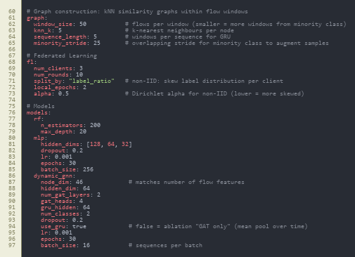
**`src/data/preprocess.py`**
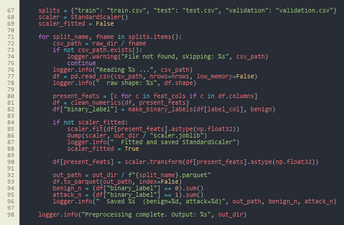
**`src/data/graph_builder.py`** — `flows_to_knn_graph`

**`src/data/graph_builder.py`** — `build_graphs_for_split`
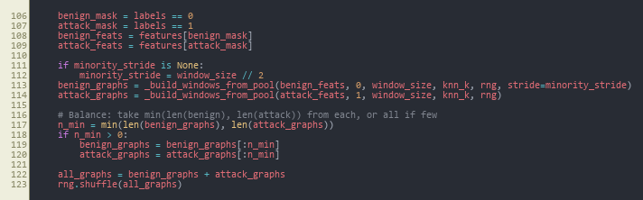
**`src/data/dataset.py`** — `GraphSequenceDataset`
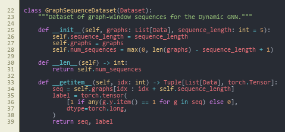
**`src/data/dataset.py`** — `get_dataloaders`
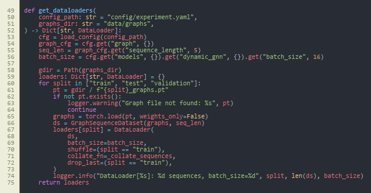
**`src/models/baselines.py`**
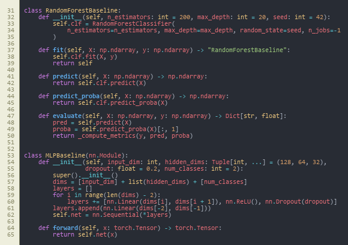
**`src/models/dynamic_gnn.py`** — `DynamicGNN.forward`

**`src/models/trainer.py`** — `train_one_epoch`

**`src/explain/explainer.py`** — `explain_sequence`
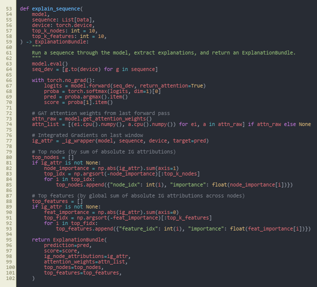
**`src/federated/run_federated.py`**
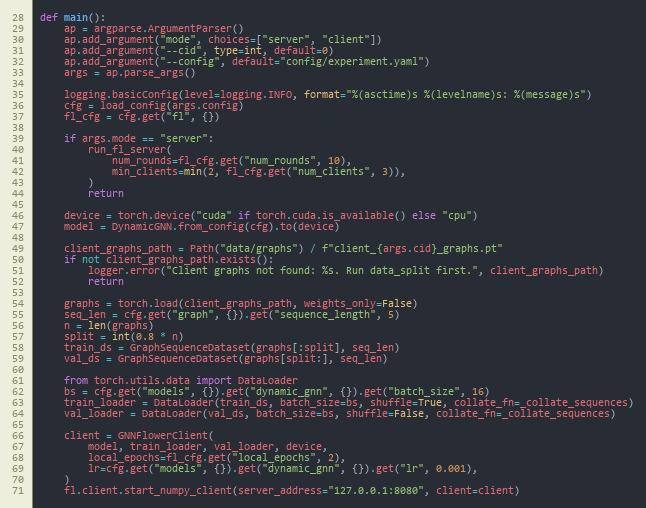
**`src/federated/client.py`** — `GNNFlowerClient`
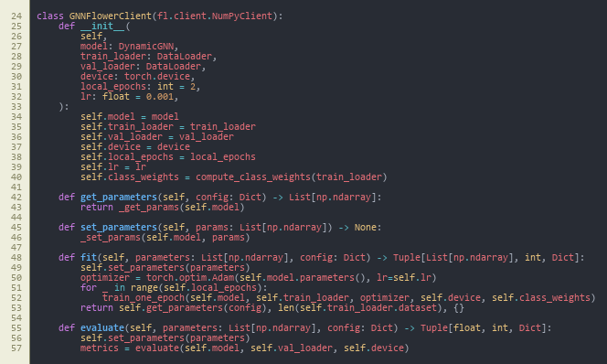
**`src/federated/server.py`** — `run_fl_server`
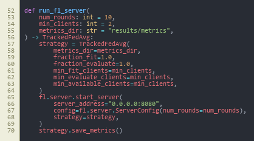
**`src/siem/api.py`** — `POST /score`

### Appendix B: Project Process Documents
The following extract reproduces the project process and meeting record **as filed for supervision**; layout follows the source forms.
**MSc ****PROJECT (COMP1****1024****)**
**PROJECT PROCESS DOCUMENTATION**
**Student: ****Arka Talukder****	****(B01821011)****	****	****	****	****Supervisor****: Dr. Raja Ujjan**
**Meeting Number: 1-6****	****	****	****	 Date/Time: 29/01/2026 - 06/03/2026**
**Agenda for meeting:**
Project title selection and approval
Project specification and scope discussion
Interim report structure and guidelines
Literature review and research gap alignment
Methodology and experimental design review
Progress on data pipeline and model implementation
**Discussion of agenda items:**
Throughout all meetings, the project passed through title-selection to interim report completion. The supervisor discussed and approved the project title: Explainable Dynamic Graph Neural Network SIEM of Software-Defined IoT using Edge AI and Federated Learning on 10 and 11 February 2026. Once approved, we made it clear what we wanted. Kaggle- CICIoT2023 flow data, which is a dynamic GNN with GAT and GRU, federated learning with non-IID data, and SIEM alert generation will be used in the project.
Project specification was checked. The four key sections that the supervisor concurred with were dynamic GNN, federated learning, explainability, and SIEM integration. The structure of the interim report was also discussed. It consists of three sections: literature review, methodology and the plan to complete it.
I gave an update on the literature review. The supervisor provided comments on the table of research gap and the way of comparing my project with the related work. We have checked the methodology section. These were graph construction, model architectures (Random Forest, MLP, centralised GNN, federated GNN) and evaluation metrics.
I showed the progress of the implementation. This included the data pipeline, graph builder, all four models, federated learning with Flower, explainability with Captum and the FastAPI SIEM endpoint. According to the supervisor, the implementation is in line with the research objectives. There was a discussion on the interim report draft. I will get competency in the following meeting.
**Overview of action plan agreed upon:**
- Have interim report approved by the supervisor during the following meeting.
- Make last minute adjustments depending on the feedback of the supervisor.
- Final experiments and results chapter on the dissertation.
- Keep records and repeatability of experiments.
**Notes:**
Supervisor has insisted on a clear correspondence between research questions, research method and research findings. Good records of experiments and fixed seeds to be used in future were recommended. The project will be completed in good time.
In this reporting period, I had frequent supervisory meetings with Sir Dr. Raja Ujjan to talk about my dissertation project on Explainable dynamic graph neural network SIEM on Software-Defined IoT.
**TO BE COMPLETED BY THE STUDENT, WITH COMMENTS FROM THE SUPERVISOR.**
Please complete all sections below
| Name | Arka Talukder | Student ID | B01821011 |
|---|---|---|---|
| Supervisor | Dr. Raja Ujjan | Start Date | 29/01/2026 |
| Mode of Study | Online | Dates of Meetings (include dates of all meetings) | 06/02/2026 (Online) 13/02/2026 (Online) 10/02/2026 (Online) – Title selection 11/02/2026 (Online) – Title approval 20/02/2026 (Online) 06/03/2026 (Online) |
| Mode of Study | Online | Dates of Meetings (include dates of all meetings) |  |
| Description of Meetings | During the initial sessions (6 February), we talked about the scope of project and what should the interim report cover. Both the title of the project and the supervisor approved the project title on 10 and 11 February. Subsequently, we worked on the **E****xplainable dynamic graph neural network SIEM for Software-Defined IoT.** The structure of literature review, research gap and methodology design were discussed in later meetings. The supervisor provided feedback on the graph construction, options of the model, and measures of evaluation. We also talked about the way how to organize the interim report and how to be clear in presenting the work. Late meetings revised my progress in the implementation and the draft of the interim report. I have shown the data pipeline, four models (Random Forest, MLP, centralised GNN, federated GNN) and explainability module, and SIEM API. The interim report is about 80% complete. The supervisor will be a final approber in the following week. |
|---|---|
| Summary of work undertaken this month. |
|---|
| During this month, I completed most of the work needed for the interim report. Key achievements include: •	Title of the project passed (1011 February 2026) •	Written literature review, including the security of the IoT, SDIoT, ML to detect intrusions, GNNs, federated learning, and explainable AI. •	Gap table gap research table filled comparing my project and the related work. Methodology section completed: dataset (CICIoT2023), preprocessing, model architectures, evaluation metrics. •	Data pipeline deployed: loaded (CICIoT2023 loaded), preprocessed, normalised, exported (as Parquet). •	Construction of graphs used: kNN builder, windowing, sequence dataset. All four models used: Random Forest, MLP, centralised dynamic GNN (GAT+GRU), federated GNN. * Federated learning configuration: Flower architecture, non-IID data division, 10 rounds simulation. •	Explainability: GAT attention weights and Integrated Gradients ( Captum ) oss: Siem integration: FastAPI endpoint that emits ECS-formatted JSON alerts. Plan to complete section with schedule and contingency plans. •	Interim report draft is ready (around 80%); waiting to be approved by the supervisor. |
| What work will you undertake next month? |
|---|
| In the upcoming period, I will focus on: Obtaining supervisor approval for the interim report Finalising any edits based on supervisor feedback Completing final experiments and generating all figures (confusion matrices, ROC curves, FL convergence) Writing the Results and Discussion chapters for the final dissertation Conducting sensitivity analysis if time permits Writing Conclusion and Critical Reflection Final proofreading and submission I remain on schedule for timely completion. |
| Please detail reasons for any absence including the total number of days absent (annual leave, conference attendance, field research, ill health etc)? |
|---|
| **I missed 27/02/2026 meeting due to GP appointment ** |
| Statement from Supervisor (including any issues which should be brought to the attention of School, indication of satisfactory process thus far and whether or not attendance has been satisfactory) |
|---|
|  |
| Signed (student) |  | Date | 12/03/2026 |
|---|---|---|---|
| Signed (MSc Dissertation Supervisor) |  | Date |  |
### Appendix C: Project Specification
University of the West of Scotland
School of Computing, Engineering and Physical Sciences
MSc Cyber Security Project Specification
Student name: Arka Talukder
Banner ID: B01821011
Email: b01821011@studentmail.uws.ac.uk
Project being undertaken on part-time or full-time basis: Full-time
MSc Programme: MSc Cyber Security
MSc Programme Leader: Dr. Raja Ujjan
Approved by supervisor? Yes/No: Yes
Project Title:
| Explainable Dynamic Graph Neural Network SIEM for Software-Defined IoT using Edge AI and Federated Learning |
|---|
Research Question to be answered:
| Main question:
How can an explainable dynamic graph neural network, trained with federated learning, detect attacks in Software-Defined IoT flow data and create SIEM alerts that support SOC work on CPU edge devices?

Sub questions:
1) Does a dynamic graph model improve detection compared to simple baselines?
2) Can federated learning keep similar performance without sharing raw data?
3) Can the model provide clear explanations that help alert triage? |
|---|
Outline (overview) and overall aim of project:
| The IoT devices find application in homes, health, and industry. There are numerous gadgets that are vulnerable to attack. A Security Operations Centre (SOC) requires fast, accurate and simple to understand alerts. In this project, a small prototype of an anomaly and attack detector of Software-Defined IoT networks based on network flow logs will be constructed. The devices will be represented as nodes and the flows as edges in graphs where each time window of traffic is converted into a graph. A dynamic graph neural network (GNN) is going to be trained to learn trends throughout a sequence of graph windows and determine whether a window is benign or malicious. The model will also be trained on a simple federated learning setup (FedAvg) with 2 to 3 simulated clients to minimize data sharing across sites and be able to match real SOC environments. Each alert (such as the most important flows and flow features, etc.) will have an explanation to support SOC triage generated by the system. I will test the prototype by running it on CPU and measure inference time to ensure that it can be used in edges. The flow dataset (which will be assumed locally available) will be used in the project (CICIoT2023). The scope is a development-grade SIEM integration to make the work possible in 45 days: the system is going to produce SIEM-ready JSON alerts (ECS-style fields) and a small FastAPI scoring endpoint. Implementing a complete SIEM stack (Elastic or Wazuh) is not part of the project, and will be recorded as future work. |
|---|
Objectives (list of tasks to be undertaken to achieve overall aim of the project and to answer the research question posed):
| **Objectives and tasks:** **Literature review and problem framing** Carry out a search across IEE, MDPI and sciencedirect(2023-2025) Review dynamic GNN intrusion detection, federated learning for security, and explainable AI for SOC. Define the final data fields, window size, and evaluation metrics. Outcome will be at least two page review and gap analysis. **Data preparation and graph construction** Use CICIoT2023 flow records and select a manageable subset for training. Build time-window graphs: nodes as devices (IP or device ID), edges as flows, features on edges. Create a repeatable preprocessing script and dataset loader. **Baselines and central DynamicGNN model** Train simple baselines (Random Forest and small MLP) on tabular features. Implement a practical dynamic GNN (graph attention per window plus GRU over windows) and train centrally. **Federated learning simulation** Split training data into 2 to 3 clients. Train the same model with Flower FedAvg and log round metrics and communication size. **Explainability and SOC alert output** Produce explanations for sample alerts using Integrated Gradients (Captum) and attention weights. Output an explanation bundle with top features and top flows. Create SIEM-style JSON alerts (ECS-like) and a small FastAPI endpoint for scoring. Maintaining git repository from data ingestion. **Evaluation and report writing** Compare baselines vs central GNN vs federated GNN. Report precision, recall, F1, ROC-AUC, and false alarm rate. Report CPU inference time and a short SOC workflow example for alert triage. outcome will be results notebook, figures, validates CSV, data and report **Evaluation plan:** Use one fixed train, validation, and test split and keep it the same for all models. Include confusion matrices and false positives per time window. For federated learning, plot round-by-round performance and estimate total bytes sent. Provide 3 to 5 example alerts with explanations and discuss if they are useful for SOC decisions. **Risk control and fall back plan:** If CICIoT2023 is too large, use a smaller subset of devices and days. If federated training is slow, reduce the number of rounds and clients but keep the comparison. If Integrated Gradients is slow, run it only on selected alerts and keep attention-based explanations for all alerts. |
|---|
CyBOK Knowledge Areas (Please check at least two relevant areas your project going to be covered):
| Human, Organisational & Regulatory Aspects | Risk Management & Governance |
|---|---|
| Human, Organisational & Regulatory Aspects | Law & Regulation |
| Human, Organisational & Regulatory Aspects | Human Factors |
| Human, Organisational & Regulatory Aspects | Privacy & Online Rights |
| Attacks & Defences | Malware & Attack Technologies |
| Attacks & Defences | Adversarial Behaviours |
| Attacks & Defences | Security Operations & Incident Management |
| Attacks & Defences | Forensics |
| Systems Security | Cryptography |
| Systems Security | Operating Systems & Virtualisation Security |
| Systems Security | Distributed Systems Security |
| Systems Security | Formal Methods for Security |
| Systems Security | Authentication, Authorisation & Accountability |
| Software and Platform Security | Software Security |
| Software and Platform Security | Web & Mobile Security |
| Software and Platform Security | Secure Software Lifecycle |
| Infrastructure Security | Applied Cryptography |
| Infrastructure Security | Network Security |
| Infrastructure Security | Hardware Security |
| Infrastructure Security | Cyber Physical Systems |
| Infrastructure Security | Physical Layer and Telecommunications Security |
Indicative reading list (references to be correctly presented) and resources:
| Albanbay, N., Tursynbek, Y., Graffi, K., Uskenbayeva, R., Kalpeyeva, Z., Abilkaiyr, Z. and Ayapov, Y., 2025. Federated Learning-Based Intrusion Detection in IoT Networks: Performance Evaluation and Data Scaling Study. Journal of Sensor and Actuator Networks, [online] 14(4), p.78. Available at: Alabbadi, A. and Bajaber, F., 2025. An Intrusion Detection System over the IoT Data Streams Using eXplainable Artificial Intelligence (XAI). Sensors, 25(3), p.847. Available at: Basak, M., Kim, D.-W., Han, M.-M. and Shin, G.-Y., 2025. X-GANet: An Explainable Graph-Based Framework for Robust Network Intrusion Detection. Applied Sciences, 15(9), p.5002. Available at: Han, Z., Zhang, C., Yang, G., Yang, P., Ren, J. and Liu, L., 2025. DIMK-GCN: A Dynamic Interactive Multi-Channel Graph Convolutional Network Model for Intrusion Detection. Electronics, [online] 14(7), p.1391. Available at: Lazzarini, R., Tianfield, H. and Charissis, V., 2023. Federated Learning for IoT Intrusion Detection. AI, [online] 4(3), pp.509–530. Available at: Luša, R., Pintar, D. and Vranić, M., 2025. TE-G-SAGE: Explainable Edge-Aware Graph Neural Networks for Network Intrusion Detection. Modelling, 6(4), p.165. Available at: Ngo, T., Yin, J., Ge, Y.-F. and Wang, H., 2025. Optimizing IoT Intrusion Detection—A Graph Neural Network Approach with Attribute-Based Graph Construction. Information, 16(6), p.499. Available at: Pinto, C., Sajjad Dadkhah, Ferreira, R., Alireza Zohourian, Lu, R. and Ghorbani, A.A., 2023. CICIoT2023: A Real-Time Dataset and Benchmark for Large-Scale Attacks in IoT Environment. Sensors, 23(13), pp.5941–5941. Available at: Wang, R., Zhao, J., Zhang, H., He, L., Li, H. and Huang, M., 2025. Network Traffic Analysis Based on Graph Neural Networks: A Scoping Review. Big Data and Cognitive Computing, 9(11), p.270. Available at: Yang, S., Pan, W., Li, M., Yin, M., Ren, H., Chang, Y., Liu, Y., Zhang, S. and Lou, F., 2025. Industrial Internet of Things Intrusion Detection System Based on Graph Neural Network. Symmetry, [online] 17(7), pp.997–997. Available at: Zhong, M., Lin, M., Zhang, C. and Xu, Z., 2024. A Survey on Graph Neural Networks for Intrusion Detection Systems: Methods, Trends and Challenges. Computers & Security, 141, pp.103821–103821. Available at: |
|---|
Marking scheme:
|  |
|---|
Supervisor:
| Dr. Raja Ujjan |
|---|
Moderator:
| Muhsin Hassanu |
|---|
Programme Leader:
| Dr. Raja Ujjan |
|---|
Date specification submitted:
| 11/02/2026 |
|---|
Please complete the ‘ethics’ form below for all projects.
**School of ****Computing, Engineering and Physical Sciences**
**MSc PROJECT ****–**** ****REQUIREMENT FOR ETHICAL APPROVAL**
**SECTION 1: TO BE COMPLETED BY THE STUDENT**
Does your proposed research involve: research with human subjects (including requirements gathering and product/software testing), access to company documents/records, private or sensitive data, questionnaires, surveys, focus groups and/or other interview techniques? Does your research entail any process which requires ethical approval? (Please enter √ in the appropriate box)
| YES |  | **You must submit an application for approval to the Ethics Review Manager** |
|---|---|---|
| NO | No | You do not need to submit an application to the Ethics Review Manager |
**Name of Student (Print name): Arka Talukder**
**Signature: **
**Date: 11/02/2026**
**SECTION 2: TO BE COMPLETED BY THE PROJECT SUPERVISOR**
I understand that the above project does not require ethical approval.
**Supervisor (print name)****:** **Dr. Raja Ujjan**
**Signature**:
**Date****: 10/02/2026**
**IMPORTANT: please note that by signing this form all signatories are confirming that any potential ethical issues have been considered and, where necessary, an application for ethical approval has been/will be made via the Ethical Review Manager software. **
**Any project requiring ethical approval, but which has not been given approval will not be accepted for marking. **
**Ethical approval cannot be sought in retrospect****.**
### Appendix D: Optional repository and dataset reference
#### D.1 Project source code (GitHub)
- Repository: https://github.com/imark0007/Dissertation_Project
#### D.2 Dataset source used in this project (Kaggle)
- Kaggle dataset page: https://www.kaggle.com/datasets/himadri07/ciciot2023
#### D.3 Official dataset source (UNB/CIC reference)
- Dataset page: https://www.unb.ca/cic/datasets/iotdataset-2023.html
