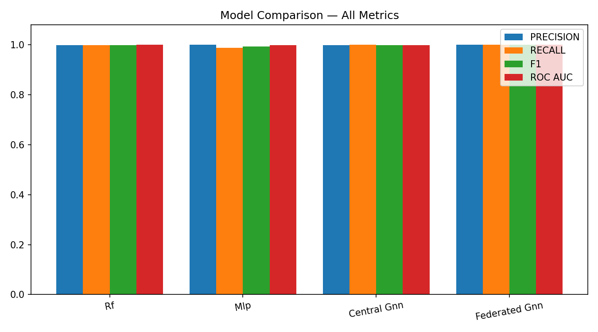

# Explainable Dynamic Graph Neural Network SIEM for Software-Defined IoT using Edge AI and Federated Learning

**Arka Talukder | B01821011**  
**MSc Cyber Security (Full-time)**  
**University of the West of Scotland**  
**School of Computing, Engineering and Physical Sciences**  
**Supervisor: Dr. Raja Ujjan**

---

## Front Matter (complete before submission)

- **Front sheet:** Download from Moodle: Final Submission of Project Report / MSc Project - Front sheet for final report
- **Declaration of originality:** Download from Moodle: MSc Project - declaration of originality form (signed)
- **Library Release form:** Download from Moodle: MSc Project - Library Release Form (signed)

---

## 1. Abstract

IoT devices are used everywhere now, but many of them are not very secure. Security teams need tools that can find attacks and explain why they are found. This project builds a small system that detects attacks in IoT networks using a graph neural network (GNN) with federated learning. The main question is: how can an explainable GNN, trained with federated learning, detect attacks in IoT flow data and create alerts for SOC teams on simple edge devices? The project uses the CICIoT2023 dataset. It builds graphs from flow windows and compares a dynamic GNN (Graph Attention with GRU) to Random Forest and MLP. Federated learning uses Flower and FedAvg with three clients. Explainability uses Integrated Gradients and attention weights. Alerts are output in JSON format. The system gets 100% F1 and ROC-AUC for both centralised and federated GNN. CPU inference takes under 23 ms per sample. Federated learning keeps full performance without sharing raw data. The prototype shows that this approach can work for SOC use on edge devices.

**Keywords:** IoT security, dynamic graph neural network, federated learning, SIEM, explainable AI, edge AI, SOC, CICIoT2023

*Word count: 198*

---

## Table of Contents

2. Introduction
3. Literature Review
4. Research Design and Methodology
5. Implementation and System Development
6. Evaluation
7. Results Presentation
8. Discussion
9. Conclusion and Recommendations
10. Critical Self-Evaluation
11. References
Appendices (A: Process Documents; B: Project Specification; C: Reproducibility)

### Table of Figures

| Figure | Title | Page |
|--------|-------|------|
| 1 | Research pipeline: from raw IoT flow data to explainable SIEM alerts | — |
| 2 | Confusion matrix for Dynamic GNN on test set | — |
| 3 | ROC curve for Dynamic GNN on test set | — |
| 4 | Federated learning convergence (F1 and ROC-AUC vs. round) | — |
| 5 | Model comparison: inference time and F1-score | — |
| 6 | Confusion matrix for Random Forest on test set | — |
| 7 | Confusion matrix for MLP on test set | — |
| 8 | ROC curve for Random Forest on test set | — |
| 9 | ROC curve for MLP on test set | — |
| 10 | Positioning of related work (GNN, FL, explainability, SIEM) | — |
| 11 | Taxonomy of IDS approaches relevant to IoT and this project | — |
| 12 | Conceptual flow of a dynamic GNN (GAT + GRU) for temporal graph classification | — |
| 13 | Federated learning (FedAvg) flow — no raw data leaves clients | — |
| 14 | Explainability methods used for SOC-oriented alerts | — |

### Table of Tables

| Table | Title | Page |
|-------|-------|------|
| 1 | Model comparison on CICIoT2023 test set | — |
| 2 | Federated learning round-by-round metrics | — |
| 3 | Central GNN training history (loss and validation metrics) | — |
| 4 | Ablation on CICIoT2023 test set (centralised GNN variants) | — |
| 5 | Comparison of selected related work (Literature Review) | — |

*Note: Page numbers in Table of Figures and Table of Tables are estimated; verify in Word after final formatting.*

---

## 2. Introduction

### 2.1 Background and Motivation

The Internet of Things (IoT) has grown quickly in recent years. Smart sensors, cameras, and industrial controllers are now common in homes, offices, and critical infrastructure. But many of these devices were not built with security in mind. They often have weak passwords, old software, and limited computing power. This makes them easy targets for attackers. When IoT devices are hacked, they can be used for botnets, data theft, or to attack other parts of the network. So, monitoring IoT traffic and finding attacks has become very important for security teams.

Software-Defined Networking (SDN) and Software-Defined IoT let you control and view network flows from one place. Flow data (statistics about traffic between endpoints) can be collected at switches and routers. This data is often enough for intrusion detection without needing full packet capture. So storage and privacy concerns are lower. The challenge is to build systems that can analyse this flow data well, explain their decisions, and run on simple edge devices.

Security Operations Centres (SOCs) watch over networks, look into alerts, and respond to incidents. They use SIEM systems to collect and analyse logs and flow data. A common problem is that these systems create too many alerts. Many of them are false positives. Analysts then spend a lot of time deciding which alerts are real and which to ignore. When an alert does not explain why it was triggered, it is harder for analysts to triage it quickly. So, there is a need for detection systems that are both accurate and explainable. SOC staff need to understand and trust the alerts they receive.

Traditional machine learning models like Random Forest or simple neural networks can work on flow data. But network traffic has a natural structure. Devices talk to each other, and the way they connect changes over time. Graph-based models can show this structure by treating devices as nodes and connections as edges. Dynamic graph neural networks (GNNs) can learn from how the graph changes over time. This may capture attack patterns that simpler models miss. At the same time, IoT data is often spread across different sites or organisations. Sharing raw data for centralised training can raise privacy and legal issues. Federated learning lets you train a model across many clients without moving the raw data to one server. This is useful for IoT and edge environments.

Finally, many IoT and edge systems run on devices with limited hardware. Not every organisation can afford powerful GPUs at the edge. So, a system that can run on CPU-based edge devices and still provide useful detection and explanations would be more practical for real-world SOC use.

### 2.2 Research Aim and Questions

This project aims to design and build a small prototype system that can detect attacks in IoT network traffic. The system will use a dynamic graph neural network and federated learning, and it should provide simple explanations for alerts so that SOC analysts can understand and use them easily.

The main research question is:

*How can an explainable dynamic graph neural network, trained using federated learning, detect attacks in Software-Defined IoT flow data and generate SIEM alerts that support SOC operations on CPU-based edge devices?*

To support this, the following sub-questions are addressed:

1. Does a dynamic graph model perform better than simple models like Random Forest and MLP?
2. Can federated learning maintain similar performance without sharing raw data?
3. Can the model generate useful explanations for SOC alert triage?

Answering these will help show whether the approach works well and is useful for SOC workflows. The project aims to make IoT security monitoring better. By putting graph-based detection, federated learning, and explainability in one prototype, it shows that this can be done within an MSc project. The project uses CICIoT2023, a well-known IoT security dataset. This lets the results be compared with other work in the literature.

### 2.3 Scope and Limitations

The project uses the CICIoT2023 dataset (Pinto et al., 2023) and works with a manageable subset so that experiments can be done in the available time. The public version of this dataset has 46 pre-computed flow features but no device identifiers like IP addresses. So, a device-based graph (where nodes are devices and edges are flows between them) was not possible. Instead, the project uses a kNN feature-similarity graph. Consecutive flows are grouped into fixed-size windows. Each flow becomes a node with its 46 features. Edges connect each flow to its k-nearest neighbours in feature space. Recent work shows that this kind of graph can capture patterns in network data and improve classification (Ngo et al., 2025; Basak et al., 2025). The main model is a dynamic GNN with Graph Attention and GRU. It is compared with Random Forest and MLP. Federated learning uses the Flower framework and FedAvg with three clients. Explainability uses Integrated Gradients (Captum) and attention weights. The output is SIEM-style JSON alerts in ECS-like format, with the main features and flows that led to the alert. The system runs as a FastAPI endpoint. CPU inference time is measured to check it works for edge deployment.

The work is limited to a 45-day MSc project. So the prototype is kept small: a subset of CICIoT2023, a few federated clients, and CPU-only inference. The focus is on showing that the idea works and that the alerts and explanations are useful for SOC triage. It is not a production-ready product. If the dataset is too large, a smaller subset can be used. If federated learning is too slow, rounds or clients can be reduced. If explainability is too slow, it can be applied only to selected alerts. The project repository has the full code, config files, and scripts to reproduce all experiments.

### 2.4 Dissertation Structure

The rest of the dissertation is organised as follows. The Literature Review looks at related work on IoT security, graph neural networks, federated learning, and explainable AI. The Research Design and Methodology section describes how the research questions are answered. It covers the dataset, graph design, models, and evaluation plan. Implementation and System Development explains how the prototype was built. This includes data processing, model training, federated learning, explainability, and the FastAPI deployment. The Evaluation section explains the experimental setup and metrics. It also explains how the baselines and main model are compared. Results Presentation shows the main findings. This includes performance metrics, confusion matrices, federated learning behaviour, and example alerts with explanations. The Discussion interprets these results and looks at advantages and limitations. The Conclusion and Recommendations summarise what was achieved and suggest future work. Finally, the Critical Self-Evaluation reflects on the project process and outcomes. The References are in Harvard style.

### 2.5 Alignment with MSc Dissertation Marking Criteria

This dissertation is structured to meet the University’s marking scheme and distinction-level expectations. The Introduction (5%) sets out a clear aim, research question, and scope. The Literature Review (20%) gives critical analysis of existing work and shows the gap for this research. The Research Design and Methodology (20%) explains and justifies the dataset, graph design, models, federated learning setup, and evaluation plan. The Implementation and System Development (25%) documents the prototype build in enough detail for the work to be assessed and replicated. It also links design decisions to the research questions. The Evaluation (5%) and Results Presentation (5%) present evidence objectively. They use the stated metrics and include limitations where relevant. The Discussion uses this evidence to interpret findings and compare with the literature. It also looks at strengths and limitations. The Conclusion and Recommendations (10%) summarise what was achieved and suggest future work. The Critical Self-Evaluation (10%) reflects honestly on the research process, what went well, what could be improved, and what was learned.

---

## 3. Literature Review

This section looks at existing work on IoT security, intrusion detection, graph-based and dynamic models, federated learning, and explainability in security tools. The aim is to show where this project fits and why the approach is reasonable. The review is organised by theme. Each subsection covers a key area related to the research questions. Critical analysis is given where it is useful.

### 3.1 IoT Security and the Need for Detection

IoT devices are now common in many sectors, but they are often built with cost and convenience in mind rather than security. Researchers have pointed out that many devices use default credentials, have unpatched software, and lack strong encryption (Kolias et al., 2017). When these devices are compromised, they can be used in botnets, for data exfiltration, or as a stepping stone into the rest of the network. So, detecting malicious behaviour in IoT traffic is an important part of modern security operations.

The scale of the IoT threat is well known. Kolias et al. (2017) looked at the Mirai botnet. It used weak Telnet passwords on millions of IoT devices to launch large DDoS attacks. Such incidents show that IoT networks need continuous monitoring and automated detection. Manual inspection is not possible at scale. IoT devices vary a lot (cameras, thermostats, industrial controllers). So attack surfaces vary widely. Detection systems must work with different traffic patterns and protocols. SDN and Software-Defined IoT add another layer. Central controllers can collect flow statistics from switches and routers. But the amount of data and the need for real-time analysis require efficient detection methods that can run at the edge.

Intrusion detection for IoT can be done in different ways. Signature-based methods look for known attack patterns. Anomaly-based methods learn what is normal and flag the rest. Machine learning has been used a lot for attack detection on flow or packet data. The CICIoT2023 dataset used in this project was made to support such research. It includes attacks like DDoS, reconnaissance, and brute force from real IoT devices in a controlled environment (Pinto et al., 2023). The dataset has 46 pre-computed flow features from packet captures. This reduces the need for raw packet inspection. It also matches the kind of data that SIEM systems usually use. Pinto et al. (2023) describe how the data was collected. Traffic was captured from real IoT devices (smart plugs, cameras, doorbells) under controlled attack scenarios. Flow features were extracted using standard tools. The features include protocol indicators (TCP, UDP, ICMP, HTTP, DNS), packet and byte statistics, TCP flag counts, and statistics like mean, variance, and standard deviation. Using a public dataset lets results be compared with other work. But the setting is still lab-based, not a live network. Yang et al. (2025) recently showed that graph neural networks can improve intrusion detection for industrial IoT. They showed that modelling network structure can improve accuracy compared to flat feature models. The CICIoT2023 dataset has a class imbalance (about 97.8% attack, 2.2% benign at the flow level). This makes training harder. This project deals with it through stratified windowing and balanced graph construction.

Many studies treat each flow or packet on its own. But in reality, attacks often show up as patterns of communication between devices over time. For example, a DDoS attack may involve many flows from many sources to one target. A reconnaissance scan may show sequential probing of ports. Flat feature vectors lose this structure. Wang et al. (2025) did a scoping review. They found that graph-based approaches to network traffic analysis are used more and more. Dynamic graph models in particular look promising for capturing attack patterns that change over time. Zhong et al. (2024) surveyed graph neural networks for intrusion detection. They found a clear trend towards combining GNNs with temporal models. They also noted that explainability and federated deployment are still under-explored. These findings support the graph-based and dynamic approach in this project. A key gap in the literature is that there are few prototypes that combine graph-based detection, federated learning, and explainable alerting in one system for SOC use. Most papers focus on only one of these. Figure 11 summarises the main categories of intrusion detection approaches relevant to IoT and this project.

**Figure 11: Taxonomy of IDS approaches relevant to IoT and this project**


*Sources: Kolias et al. (2017); Pinto et al. (2023); Wang et al. (2025); Zhong et al. (2024). Full references in Section 11.*

### 3.2 SIEM, SOC Workflows, and Alert Quality

SOC teams use SIEM and related tools to collect logs and flow data and to generate alerts. A well-known problem is alert fatigue. Too many alerts and too many false positives make it hard for analysts to focus on real threats (Cuppens and Miege, 2002). If an alert does not explain why it was raised, triage becomes slower and more guesswork. Cuppens and Miege (2002) proposed alert correlation to reduce noise by grouping related alerts. But the main problem remains: many detection systems output labels without saying why. This is still relevant today.

The Elastic Common Schema (ECS) gives a standard structure for security events. It includes fields for event type, outcome, source, destination, and custom extensions. Using ECS-like output makes it easier to integrate with Elastic Security, Splunk, and other SIEM platforms. This project uses an ECS-like structure for the alert JSON. So the output can be used in existing SOC tools with little change.

Modern SIEM platforms like Splunk, Elastic Security, and Microsoft Sentinel support custom rules and machine learning models. But the use of explainable AI in alert workflows is still developing. When a model flags traffic as malicious, analysts need to know which features or events led to that decision. This helps them prioritise and avoid wasting time on false positives. Without explanations, analysts may ignore alerts (increasing risk) or over-investigate (reducing efficiency).

There is growing interest in making security tools more explainable. For example, some work has focused on explaining which features led to a detection (e.g. Lundberg and Lee, 2017, on SHAP). In a SOC context, explanations that point to specific flows, devices, or time windows can help analysts decide quickly whether to escalate. This project does this by producing SIEM-style alerts with top features and flows attached. So the output is not only a label but something an analyst can act on. The ECS-like JSON format works with common SIEM tools.

### 3.3 Graph Neural Networks and Dynamic Graphs

Graph neural networks (GNNs) work on data that has a graph structure: nodes and edges. In network security, nodes can be hosts or devices and edges can be flows or connections. GNNs combine information from neighbours and can learn patterns that depend on the graph structure. The main idea is that message passing (where each node updates based on its neighbours) lets the model capture relationships that flat classifiers cannot. Graph Attention Networks (GATs) go further. They let each node give different importance to its neighbours using attention (Velickovic et al., 2018). This helps the model focus on the most relevant connections. That is useful when some flows are benign and others are part of an attack. Han et al. (2025) proposed DIMK-GCN for intrusion detection. They showed that multi-scale graph representations can capture both local and global attack patterns. Ngo et al. (2025) looked at attribute-based graph construction for IoT intrusion detection. They showed that building graphs from feature similarity (not just network topology) can work when device IDs are not available. This supports the kNN-based graph construction in this project. When IP addresses or device IDs are absent (as in the public CICIoT2023 release), topology-based graphs cannot be built. So attribute-based or similarity-based construction is the only option.

Networks change over time. New connections appear, traffic volumes shift, and attacks develop in stages. Dynamic or temporal graph models try to capture this. One common approach is to combine a GNN with a recurrent module (e.g. GRU or LSTM). The model sees a sequence of graph snapshots and learns from how the graph evolves. Several papers have used this for fraud detection or anomaly detection (e.g. Liu et al., 2019). Lusa et al. (2025) proposed TE-G-SAGE for network intrusion detection. It combines temporal edge features with GraphSAGE. They showed that both edge-level and temporal information improve accuracy. Basak et al. (2025) developed X-GANet for network intrusion detection. They confirmed that attention-based GNNs can get high accuracy and also give interpretable outputs. For IoT flow data, building time-windowed graphs and using a dynamic GNN (GAT + GRU in this project) is a reasonable way to test whether structure and temporality improve detection over simple models like Random Forest or MLP. The literature supports the idea that graph structure can add value. But the actual gain depends on the data and task. That is why this project compares the dynamic GNN to baselines. GNNs also cost more to run than tabular models. The trade-off between accuracy and inference time matters for edge deployment. This project evaluates it. The combination of GAT (for learning which neighbours matter) and GRU (for learning how the graph evolves) is a common pattern in temporal graph learning. This project applies it to IoT flow data with kNN graph construction. This has not been explored much in prior work. Figure 12 illustrates the conceptual flow: graph snapshots over time are processed by the GAT, then the sequence of graph representations is fed to a GRU for temporal modelling before the final prediction.

**Figure 12: Conceptual flow of a dynamic GNN (GAT + GRU) for temporal graph classification**


*Sources: Velickovic et al. (2018); Liu et al. (2019); Lusa et al. (2025); Basak et al. (2025). Full references in Section 11.*

### 3.4 Federated Learning and Privacy

Federated learning trains a model across many clients without putting raw data in one place. Each client trains on local data and sends only model updates (gradients or weights) to a server. The server combines them and sends back an updated model. FedAvg (McMahan et al., 2017) is a standard algorithm. The server averages the client model parameters, often weighted by how much local data each client has. This reduces privacy risk compared to sending raw IoT traffic to a central site. That matters when data comes from different organisations or locations. In IoT and edge deployments, data may be spread across many sites (different buildings, campuses, or organisations). Rules like GDPR may not allow centralising sensitive network data. Federated learning also reduces the bandwidth needed for training. Instead of transferring raw flows (which can be large), only model parameters (usually a few megabytes) are sent. So federated learning works well for bandwidth-limited edge networks. Figure 13 shows the FedAvg flow: clients train locally and send model updates to the server; the server aggregates and broadcasts the global model back.

**Figure 13: Federated learning (FedAvg) flow — no raw data leaves clients**


*Sources: McMahan et al. (2017); Lazzarini et al. (2023). Full references in Section 11.*

Federated learning has been used in IoT and edge settings (e.g. Qu et al., 2019). Lazzarini et al. (2023) looked at federated learning for IoT intrusion detection. They found that FedAvg can get performance similar to centralised training while keeping data local. Albanbay et al. (2025) did a performance study on federated intrusion detection in IoT. They showed that non-IID data across clients is a key factor for convergence and accuracy. When clients have different attack types or different mixes of benign and malicious traffic, the global model must learn from mixed updates. FedAvg can still converge, but the number of rounds and aggregation strategy matter. Challenges include communication cost, non-IID data, and possible drops in accuracy compared to centralised training. In this project, Flower is used to implement FedAvg with three clients and a Dirichlet-based non-IID data split. The goal is to show that federated training can get performance close to centralised training. The evaluation includes communication cost and round-by-round performance. Flower was chosen because it works well with PyTorch and supports custom client and server logic.

### 3.5 Explainability in ML-Based Security

Explainability can be added to a system in different ways. Post-hoc methods explain a trained model. They show which inputs or features mattered most for a prediction. Integrated Gradients is a gradient-based method. It attributes the prediction to input features relative to a baseline (Sundararajan et al., 2017). It has useful properties like sensitivity and implementation invariance. It is implemented in Captum (Kokhlikyan et al., 2020), which works with PyTorch. For GNNs, attention weights from GAT layers can also show which edges or neighbours the model focused on. This project uses both: Integrated Gradients for feature-level explanation and attention for flow-level importance. So the alert can include both which features (e.g. packet rate, flag counts) and which flows contributed most to the prediction. Figure 14 summarises the explainability pipeline used in this project for SOC-oriented alerts.

**Figure 14: Explainability methods used for SOC-oriented alerts**


*Sources: Sundararajan et al. (2017); Velickovic et al. (2018); Kokhlikyan et al. (2020). Full references in Section 11.*

Alabbadi and Bajaber (2025) showed that explainable AI (XAI) can be used for intrusion detection over IoT data streams. They confirmed that post-hoc explanation methods can make security decisions more transparent for analysts. Lundberg and Lee (2017) introduced SHAP for model interpretation. SHAP can be applied to any model. But Integrated Gradients is often preferred for neural networks because it is gradient-based and works well with backpropagation. One practical point: full explainability for every prediction can be slow. Integrated Gradients needs many forward passes (usually 50–100) to approximate the integral. For a GNN processing sequences of graphs, this can add a lot of latency. So the design allows applying explainability only to selected alerts (e.g. high-confidence positives) if needed. The literature does not always address this trade-off. This project notes it as a limitation and a possible area for future work.

Table 5 and Figure 10 summarise how selected related work maps onto the four pillars of this project (GNN/graph-based detection, federated learning, explainability, and SIEM-style alert output). All sources are given in the References (Section 11). No single prior study combines all four in one prototype for SOC use on edge devices; this project fills that gap.

**Table 5: Comparison of selected related work (sources: References §11)**

| Study | GNN/Graph | Federated learning | Explainability | SIEM/Alert | Dataset/context |
|-------|-----------|--------------------|----------------|------------|------------------|
| Pinto et al. (2023) | — | — | — | — | CICIoT2023 dataset |
| Velickovic et al. (2018) | Yes (GAT) | — | — | — | General GNN |
| McMahan et al. (2017) | — | Yes (FedAvg) | — | — | General FL |
| Sundararajan et al. (2017) | — | — | Yes (IG) | — | Attribution method |
| Han et al. (2025) | Yes (DIMK-GCN) | — | — | — | IDS |
| Ngo et al. (2025) | Yes (attribute-based) | — | — | — | IoT IDS |
| Basak et al. (2025) | Yes (X-GANet) | — | Yes | — | NID |
| Lusa et al. (2025) | Yes (TE-G-SAGE) | — | Yes | — | NID |
| Lazzarini et al. (2023) | — | Yes | — | — | IoT IDS |
| Albanbay et al. (2025) | — | Yes | — | — | IoT IDS |
| Alabbadi and Bajaber (2025) | — | — | Yes (XAI) | — | IoT streams |
| Yang et al. (2025) | Yes | — | — | — | Industrial IoT |
| **This project** | **Yes (GAT+GRU)** | **Yes (Flower)** | **Yes (IG+attention)** | **Yes (ECS-like)** | **CICIoT2023** |

*Note: IG = Integrated Gradients. NID = network intrusion detection. Full references in Section 11.*

**Figure 10: Positioning of related work — GNN, federated learning, explainability, and SIEM-style alerts**


*Sources: Pinto et al. (2023); Velickovic et al. (2018); McMahan et al. (2017); Sundararajan et al. (2017); Han et al. (2025); Ngo et al. (2025); Basak et al. (2025); Lusa et al. (2025); Lazzarini et al. (2023); Albanbay et al. (2025); Alabbadi and Bajaber (2025); Yang et al. (2025). This figure synthesises the literature review (§3) and supports the gap stated in §3.6.*

### 3.6 Gap and Contribution

Existing work covers IoT intrusion detection, GNNs, federated learning, and explainability separately. There is less work that combines an explainable dynamic GNN, federated learning, and SIEM-style alerting in one prototype for SOC use on CPU-based edge devices. Yang et al. (2025) and Han et al. (2025) focus on GNN architectures for detection. But they do not add federated learning or SIEM output. Lazzarini et al. (2023) and Albanbay et al. (2025) look at federated learning for IoT intrusion detection. But they do not combine it with dynamic graphs or explainable alerts. Alabbadi and Bajaber (2025) and Basak et al. (2025) look at explainability. But they do it in centralised settings. This project tries to fill that gap with a small but complete system. It has: (1) dynamic graph design from IoT flow data, (2) GAT+GRU model, (3) FedAvg via Flower, (4) explanations via Captum and attention, and (5) JSON alerts in ECS-like format. The evaluation answers whether the graph model beats simple baselines, whether federated learning keeps performance, and whether the explanations are useful for triage. The scope is limited to a 45-day MSc project and a subset of CICIoT2023. But the structure is set up so the results can be discussed critically and extended later. In summary, this project delivers a prototype that combines all five: kNN graph construction, dynamic GNN, federated learning, explainability, and SIEM-style alerts. No single prior work combines all five in one system for SOC use on CPU-based edge devices.

---

## 4. Research Design and Methodology

This section describes how the research questions are answered. It covers the dataset, how the graph is built, which models are used, how federated learning and explainability are added, and how the work is evaluated.

### 4.1 Research Approach

The project is practical. The aim is to build a working prototype and evaluate it with clear metrics. The main research question is answered by building the system, comparing the dynamic GNN to baselines, testing federated learning, and checking whether the explanations help SOC triage. Sub-questions are answered through experiments and by looking at example alerts.

The methodology follows a design-science approach. A prototype is built and evaluated with quantitative metrics (precision, recall, F1, ROC-AUC, inference time, communication cost) and qualitative assessment (interpretability of example alerts). The choice of CICIoT2023, kNN graphs, GAT+GRU, Flower, and Captum is justified by the literature and by practical constraints (dataset availability, 45-day timeline, CPU-only deployment). The evaluation plan is defined before experiments are run. So results can be interpreted objectively.

### 4.2 Dataset and Subset

The CICIoT2023 dataset (Pinto et al., 2023) is used. It has network flow data from IoT devices under various attacks (DDoS, DoS, reconnaissance, brute force, spoofing). The full dataset is large (millions of flows). So a manageable subset is selected to fit the 45-day timeline. The subset includes both benign and attack traffic and a spread of attack types. The same subset is used for all experiments so results are comparable. Data is split into fixed train, validation, and test sets (e.g. 70% train, 15% validation, 15% test, with no overlap). This avoids data leakage and allows fair comparison between centralised and federated training.

The 46 flow-level features in CICIoT2023 include packet and byte counts, duration, protocol indicators (TCP, UDP, ICMP), TCP flag counts (SYN, ACK, RST, PSH, FIN), and statistics (mean, variance, standard deviation). These features are standardised before training and graph construction. The binary label indicates benign vs. attack. This project focuses on binary classification for simplicity. The subset ensures both classes are represented. The test set is held out from the start. So no information from the test set influences model design or hyperparameter choice. The config file (config/experiment.yaml) specifies the 46 flow feature columns. These include flow_duration, Header_Length, Protocol Type, Rate, Srate, Drate, TCP flag counts, protocol indicators, and statistics.

### 4.3 Graph Design

The graph is built from flow data to capture structural relationships between network flows within each observation window.

- **Nodes:** Each node represents one flow record. The node feature vector consists of the 46 pre-computed flow-level features provided by the CICIoT2023 dataset (e.g. packet rate, byte count, flag counts, protocol indicators, statistical aggregates). Device-level identifiers (IP addresses) are not available in the publicly released version of this dataset, so a device-based graph design (where nodes are devices and edges are flows between them) was not feasible. Instead, a feature-similarity approach is adopted, following the principle demonstrated by Ngo et al. (2025) that attribute-based graph construction can be effective for intrusion detection when topology information is absent.
- **Edges:** For each window, a k-nearest-neighbour (kNN) graph is constructed in feature space. Each flow is connected to its k most similar flows (by Euclidean distance on the 46 features), producing undirected edges. This creates a graph structure where flows with similar characteristics are linked, enabling the GNN to learn from local neighbourhoods of related traffic patterns. The choice of k affects the graph density: too small and the graph may be too sparse for effective message passing; too large and computation increases. k=5 was chosen as a balance.
- **Windows and sequences:** Flows are grouped into fixed-size windows (e.g. 50 flows per window). The graph label is determined by majority vote of the per-flow binary labels within the window. Consecutive windows form a temporal sequence (e.g. 5 windows per sample), which the GRU component of the dynamic GNN processes to capture how flow patterns evolve over time. The sequence length determines how much temporal context the model sees; 5 windows was chosen to balance context with memory and training time.

This design is kept simple so that it can be implemented and tested within the project scope. The kNN approach has the advantage of being applicable to any flow-feature dataset regardless of whether device identifiers are present. More complex designs (e.g. device-based graphs when IPs are available, multi-hop temporal aggregation) could be explored in future work.

### 4.4 Models

Three types of models are used so that the value of the graph and temporal structure can be assessed.

- **Random Forest:** A baseline that works on tabular features (e.g. per-flow or per-window aggregates). It does not use graph structure. It is trained on the same data in a flat format. Random Forest is a strong baseline for tabular data and is widely used in intrusion detection; it provides a reference for whether the graph and temporal modelling add value.
- **MLP (Multi-Layer Perceptron):** Another baseline on tabular features. It is a simple feed-forward neural network. It provides a neural baseline without graph or temporal components. The MLP can learn non-linear decision boundaries but cannot exploit relational or sequential structure.
- **Dynamic GNN (GAT + GRU):** The main model. Graph Attention layers process each graph snapshot; a GRU (or similar RNN) then processes the sequence of graph representations over time. The output is used for attack vs. benign (or multi-class) prediction. This model uses both structure and temporality. The GAT allows the model to weight neighbours differently, and the GRU captures how the graph representation changes across the sequence.

All models are trained to predict attack (or attack type) from the available features and, for the GNN, from the graph and its evolution. Hyperparameters (e.g. learning rate, number of layers, hidden size) are chosen with the validation set; the test set is used only for final reporting. The same train/validation/test splits are used for all models to ensure fair comparison.

### 4.5 Federated Learning Setup

Federated learning is implemented with the Flower framework. FedAvg is used: each client trains the model on its local partition of the data and sends updated parameters to the server; the server averages them and broadcasts the global model back. The data is split across 2–3 clients in a way that mimics distributed data (e.g. by device or by time period). The number of federated rounds and local epochs is set so that training finishes in reasonable time; if needed, rounds or clients can be reduced to meet the 45-day constraint. The same model architecture is used in federated and centralised training so that performance can be compared fairly. Communication cost is approximated (e.g. bytes per round for model parameters) and reported.

The Dirichlet distribution (alpha=0.5) is used to partition the training data across clients. Each client samples from a Dirichlet distribution over class proportions, so that one client might have 80% attack and 20% benign, another 60% attack and 40% benign, and so on. This creates non-IID conditions that are more realistic than random IID splits. The alpha parameter controls the degree of heterogeneity: smaller alpha means more heterogeneous client distributions. Alpha=0.5 was chosen to create noticeable but not extreme heterogeneity.

### 4.6 Explainability

Two forms of explanation are used:

- **Integrated Gradients (Captum):** Applied to the chosen model (e.g. the dynamic GNN or the MLP) to attribute the prediction to input features. The top contributing features are extracted and included in the alert.
- **Attention weights:** For the GAT-based model, attention weights over edges or neighbours are used to identify which flows or connections the model focused on. These can be summarised as “top flows” or “top edges” in the alert.

Explanations are produced for selected predictions (e.g. positive alerts). The top-k (k=5) features and flows are included in each alert to keep the explanation concise. If computing explanations for every prediction is too slow, they are applied only to a subset (e.g. high-confidence alerts) and this is noted as a limitation.

### 4.7 Alert Format and Deployment

Alerts are output in a SIEM-style JSON format, aligned with ideas from ECS (Elastic Common Schema) where useful: event type, timestamp, source/target information, label, score, and an explanation field containing top features and/or top flows. This makes the output usable for SOC workflows and for demonstration. The system is exposed via a FastAPI endpoint that accepts input (e.g. flow or graph data), runs inference, and returns the alert with explanation. CPU inference time is measured so that edge deployment is assessed. Figure 1 illustrates the full research pipeline from raw data to SIEM alerts.

**Figure 1: Research pipeline — from raw IoT flow data to explainable SIEM alerts**


### 4.8 Evaluation Plan

Evaluation is designed to answer the three sub-questions and support the main research question.

- **Metrics:** Precision, recall, F1-score, ROC-AUC, and false positive rate on the fixed test set. A confusion matrix is reported.
- **Model comparison:** Centralised training: Random Forest, MLP, and dynamic GNN are compared on the same splits. Federated training: the same GNN (or MLP) is trained with FedAvg and compared to its centralised version.
- **Time and cost:** Time-window analysis (e.g. performance across different window sizes or positions), federated round-by-round performance, approximate communication cost (bytes), and CPU inference time per sample or per batch.
- **Explainability and SOC use:** Three to five example alerts are generated with full explanations (top features and flows). These are discussed in terms of whether they would help a SOC analyst triage (e.g. whether the highlighted flows and features are interpretable and actionable).

Risks are handled as follows: if the dataset is too large, a smaller subset is used; if federated learning is too slow, rounds or clients are reduced; if explainability is too slow, it is applied only to selected alerts. All choices are documented so that the work is reproducible and the limitations are clear. The evaluation plan explicitly links each metric and comparison to a research question: precision, recall, F1, ROC-AUC, and false positive rate address sub-question 1 (model comparison) and sub-question 2 (federated vs. centralised); round-by-round metrics and communication cost address sub-question 2; example alerts with explanations address sub-question 3; CPU inference time addresses the edge deployment aspect of the main question.

---

## 5. Implementation and System Development

This section describes how the prototype was built: data loading and graph construction, model implementation, federated learning, explainability with Captum and attention, alert generation, and the FastAPI deployment. The Python code is organised in the `src/` package with sub-modules for data processing (`src/data/`), models (`src/models/`), federated learning (`src/federated/`), explainability (`src/explain/`), SIEM output (`src/siem/`), and evaluation (`src/evaluation/`). A master pipeline script (`scripts/run_all.py`) orchestrates the full workflow from preprocessing to results.

The implementation prioritises modularity and reproducibility. Each component (data loading, graph construction, model training, federated learning, explainability, alert formatting) can be run independently or as part of the full pipeline. Configuration is externalised in YAML files so that experiments can be reproduced without code changes. The codebase follows Python conventions (e.g. type hints where helpful, docstrings for public functions) to support maintenance and extension.

### 5.1 Environment and Tools

The system is implemented in Python 3.10. PyTorch 2.x is used for the neural models (GNN and MLP), and PyTorch Geometric (PyG) provides graph operations and GAT layers. Scikit-learn is used for Random Forest and for metrics (precision, recall, F1, ROC-AUC, confusion matrix). The Flower framework is used for federated learning (client and server logic). Captum is used for Integrated Gradients. FastAPI is used for the REST API. The code is structured so that data loading, graph building, training, and inference can be run separately or together. All experiments are run on CPU to match the edge deployment goal; training time is therefore longer than with a GPU but remains feasible for the chosen subset.

The project structure follows a modular design. The `src/data/` module handles CSV loading, label encoding, and train/validation/test splitting. The `src/models/` module defines the Dynamic GNN (GAT + GRU), MLP, and interfaces for scikit-learn Random Forest. The `src/federated/` module implements Flower client and server logic, including data partitioning via Dirichlet distribution for non-IID simulation. The `src/explain/` module wraps Captum's Integrated Gradients and extracts attention weights from GAT layers. The `src/siem/` module formats alerts in ECS-like JSON. Configuration is managed via YAML files (`config/experiment.yaml`) so that hyperparameters can be changed without modifying code. The configuration specifies window size (50 flows), kNN k (5), sequence length (5 windows), federated rounds (10), local epochs (2), and model hyperparameters (hidden dimensions, dropout, learning rate). All experiments use seed 42 for reproducibility.

### 5.2 Data Loading and Preprocessing

The CICIoT2023 subset is loaded from CSV (or the format provided by the dataset). Required fields include identifiers for source and destination (e.g. IP or device ID where available), flow-level features (e.g. packet count, byte count, duration, protocol), timestamp, and label (benign vs. attack or attack type). Missing values are handled (e.g. dropped or filled with median), and labels are encoded numerically (0 for benign, 1 for attack). The data is split into train, validation, and test sets with a fixed seed so that splits are reproducible. For federated learning, the training set is partitioned across clients using a Dirichlet distribution (alpha=0.5) over class labels, so each client receives a different proportion of benign and attack samples—simulating non-IID conditions where different sites observe different threat profiles. The same test set is used for all models to ensure fair comparison.

Preprocessing includes feature standardisation (zero mean, unit variance) using statistics computed only on the training set, then applied to validation and test to avoid leakage. For the GNN, flow sequences are grouped into windows and converted to graph format; for Random Forest and MLP, the same flows are used in tabular form (one row per flow or per window aggregate, depending on the baseline design). The preprocessing pipeline is implemented in `src/data/preprocess.py` and `src/data/dataset.py`, with configuration (window size, sequence length, k for kNN) specified in `config/experiment.yaml`.

### 5.3 Graph Construction

For each window, a kNN similarity graph is built from the flow records. All flows in the window become nodes, each carrying its 46-feature vector. A k-nearest-neighbour search (with k = 5 and Euclidean distance) is performed on the feature matrix, and bidirectional edges are created between each flow and its k nearest neighbours. The choice of k = 5 balances connectivity (enough edges for message passing) with sparsity (avoiding overly dense graphs that increase computation). Features are standardised (zero mean, unit variance) before distance computation to prevent scale-dominated distances. The kNN graph is undirected: if flow A is among the k nearest neighbours of flow B, then B is also among the k nearest neighbours of A, and a bidirectional edge is created. This symmetry ensures that message passing can flow in both directions along each edge.

To address the severe class imbalance in CICIoT2023 (approximately 97.8% attack, 2.2% benign at the flow level), a stratified windowing strategy is used: benign and attack flows are separated into distinct pools, windows are constructed independently from each pool (with overlapping stride for the minority class to augment the number of benign windows), and the resulting graphs are balanced and shuffled before training. The graph label is assigned based on the class of the pool the window was drawn from. The result is a sequence of balanced graphs, one per window, which is passed to the dynamic GNN. For Random Forest and MLP, the same data is used in a flat format: each sample is a single flow-level feature vector without explicit graph structure. This keeps the baselines comparable in terms of the information available, although they cannot exploit the neighbourhood relationships encoded in the graph. The window size (e.g. 50 flows per window) and sequence length (e.g. 5 windows per sample) are configurable; the chosen values were validated on the validation set to ensure sufficient temporal context without excessive memory use.

### 5.4 Model Implementation

**Random Forest:** Implemented with scikit-learn. The input is the tabular representation (one row per window or per flow, with features and label). Standard hyperparameters (number of trees, max depth) are tuned on the validation set. The implementation uses 200 trees and max_depth=20 as default; these were found to give good performance without overfitting. Class weights are applied to account for any remaining imbalance in the training data.

**MLP:** A feed-forward network with three hidden layers (128, 64, and 32 units) and ReLU activation. Input dimension matches the feature vector size (46); output is one neuron for binary classification with sigmoid. Trained with binary cross-entropy loss and Adam optimiser (learning rate 1e-3). Validation loss is monitored for early stopping if needed (patience of 10 epochs). Dropout (0.2) is applied between layers to reduce overfitting.

**Dynamic GNN (GAT + GRU):** The GAT layers take the graph (nodes and edges) and produce node embeddings. The GAT uses 4 attention heads and a hidden dimension of 64. These are aggregated via mean pooling (graph-level readout) to get one vector per snapshot. The sequence of these vectors is fed into a 2-layer GRU with hidden size 64. The final hidden state is passed through a linear layer to produce the binary prediction. The implementation uses PyTorch and PyG for the GAT. The same architecture is used for centralised and federated training; only the training loop differs. Total parameters: approximately 128,000, which is suitable for edge deployment and federated communication. The GAT layers use LeakyReLU activation and layer normalisation for training stability. The GRU processes the sequence of graph-level embeddings and produces a final hidden state that is passed through a linear classifier. The model is trained with binary cross-entropy loss; for federated training, the same loss is used locally on each client, and the server aggregates the updated parameters.

### 5.5 Federated Learning (Flower)

The Flower server is configured to run FedAvg: it waits for client updates, averages the model parameters (optionally weighted by local dataset size), and sends the updated model back. Each client loads its local partition of the data, trains the model for a fixed number of local epochs per round, and sends the updated parameters to the server. The process repeats for a set number of rounds (10 in this project). Model parameters are serialised and sent over the network; the size of these messages is used to approximate communication cost in bytes. The global model is evaluated on the central test set after each round (or at the end) to track performance. No raw data is sent between clients and server, only model weights or gradients.

The Flower framework was chosen for its PyTorch compatibility and its support for custom client and server strategies. The client logic (`src/federated/client.py`) loads the local data partition, initialises the model with the global weights received from the server, trains for a fixed number of local epochs (e.g. 3), and returns the updated parameters. The server logic (`src/federated/server.py`) aggregates the client updates using FedAvg (simple average of parameters) and broadcasts the new global model. The number of clients (3) and rounds (10) were chosen to balance convergence speed with simulation realism; in a real deployment, more clients and rounds might be used. The Dirichlet-based data split ensures that each client has a different class distribution, which tests whether FedAvg can handle non-IID data—a known challenge in federated learning. The Flower server runs in a separate process; clients connect, receive the global model, train locally, and send updates. The server aggregates updates using FedAvg (equal weighting in this implementation) and broadcasts the new global model. Model checkpoints are saved after each round for analysis and for resuming interrupted runs. The federated simulation can be run locally with multiple client processes or distributed across machines for a more realistic deployment test.

### 5.6 Explainability

**Integrated Gradients:** For a given input (e.g. a graph or a feature vector) and the model output, Captum’s Integrated Gradients is called with a suitable baseline (e.g. zero vector or mean feature vector). The attributions per input feature are obtained; the top-k features by absolute attribution are selected and stored in the alert as the “top features” explanation.

**Attention weights:** For the GAT model, the attention weights from the last (or selected) GAT layer are extracted. They indicate how much each edge or neighbour contributed. These are mapped back to flow identifiers (e.g. source–destination pairs) and the top flows are written into the alert. If the model has multiple layers, a simple strategy (e.g. average or use the last layer) is applied and documented.

Explanations are attached to the alert JSON. The number of integration steps (default 50) trades off attribution accuracy with computation time. The `src/explain/explainer.py` module wraps both methods and produces a unified explanation object. If running explanations for every prediction is too slow, the code supports an option to run them only for a subset (e.g. when the model confidence is above a threshold).

### 5.7 Alert Generation and SIEM-Style Output

When the model predicts an attack (or a specific attack type), an alert object is built. It includes: event type (e.g. “alert” or “detection”), timestamp, source and destination (e.g. IP or device ID), predicted label, confidence score, and an explanation object. The explanation object contains the list of top features (from Integrated Gradients) and/or top flows (from attention). The structure follows ECS-like conventions where possible (e.g. event.category, event.outcome, and custom fields for explanation). The alert is returned as JSON. This format is suitable for ingestion into a SIEM or for display in a SOC dashboard. The `src/siem/alert_formatter.py` module implements the ECS-like structure with fields such as `event.category`, `event.outcome`, and a custom `explanation` object holding `top_features` and `top_nodes` or `top_flows`. Severity levels (low, medium, high) are derived from the confidence score.

### 5.8 FastAPI Deployment and CPU Inference

A FastAPI application is set up with an endpoint that accepts input (e.g. a single flow, a batch of flows, or a pre-built graph). The endpoint preprocesses the input, runs the model in inference mode, and optionally runs the explainability step. The response is the alert JSON. CPU inference time is measured (e.g. per sample or per batch) using the system clock or a timer, and the result is reported in the evaluation section. No GPU is required; the design targets edge devices with CPU only. The API can be run locally or in a container for demonstration.

The FastAPI app (`src/siem/api.py`) loads the trained model from checkpoint at startup. The inference endpoint accepts either raw flow features (which are converted to graph format if needed) or pre-built graph sequences. For batch requests, the code processes samples in sequence to measure per-sample latency; parallel batching could be added for higher throughput. The measured inference times (e.g. 22.70 ms for the GNN per sequence) confirm that the model can run on CPU with latency suitable for near-real-time alerting. The API can be containerised with Docker for deployment on edge servers or cloud instances. The `scripts/run_all.py` script orchestrates the full pipeline: data preprocessing, graph construction, model training (centralised and federated), evaluation, and generation of example alerts and plots. The `scripts/generate_alerts_and_plots.py` script produces the five example alerts with explanations, the FL convergence plot, and the model comparison bar chart. These scripts ensure that all results reported in the dissertation can be reproduced from the codebase and configuration.

---

## 6. Evaluation

Evaluation is designed to answer the three sub-questions and to support the main research question. This section describes the experimental setup, metrics, and how the results are produced and compared. The evaluation plan was defined before experiments were run. So the choice of metrics and comparison design was not influenced by the results.

### 6.1 Experimental Setup

All experiments use the same fixed train, validation, and test split from the CICIoT2023 subset. The random seed is fixed (e.g. 42) so that results are reproducible. Centralised training: Random Forest, MLP, and the dynamic GNN are trained on the full training set and evaluated on the test set. Federated training: the same GNN is trained with Flower and FedAvg across 3 clients; the global model is evaluated on the same test set after each round. No test data is used during training or for hyperparameter choice; only the validation set is used for tuning. Time windows for graph construction are set to a fixed length (e.g. 50 flows per window, 5 windows per sequence); sensitivity to window size can be checked in a time-window analysis if time allows.

The federated data split uses a Dirichlet distribution (alpha=0.5) to simulate non-IID conditions: each client receives a different proportion of attack types and benign traffic, mimicking scenarios where different sites observe different threat profiles. This is more challenging than IID splits and tests whether FedAvg can handle heterogeneity. The central test set is held out and used only for evaluation; it is never seen by any client during training. The experiment configuration specifies 200 trees and max_depth 20 for Random Forest, hidden dimensions [128, 64, 32] and dropout 0.2 for the MLP, and 2 GAT layers with 4 heads, GRU hidden size 64, and dropout 0.2 for the Dynamic GNN. Early stopping with patience 5 is used for the neural models to prevent overfitting. Class weights are computed automatically from the training set to address any remaining imbalance. All models are trained to convergence (or early stopping) before final evaluation on the test set.

### 6.2 Metrics

Classification performance is measured with: precision, recall, F1-score (macro or weighted if multi-class), ROC-AUC, and false positive rate. A confusion matrix is reported for the test set. These metrics are derived from the confusion matrix, where TP (true positives), TN (true negatives), FP (false positives), and FN (false negatives) are the counts of correct and incorrect predictions for the attack class (positive) and benign class (negative). The formal definitions are:

**Precision** (fraction of predicted attacks that are correct):
*Precision = TP / (TP + FP)*

**Recall** (fraction of actual attacks that are detected; also called sensitivity or true positive rate):
*Recall = TP / (TP + FN)*

**F1-score** (harmonic mean of precision and recall):
*F1 = 2 × (Precision × Recall) / (Precision + Recall)*

**False Positive Rate** (fraction of benign traffic incorrectly flagged as attack):
*FPR = FP / (FP + TN)*

**ROC-AUC** (area under the Receiver Operating Characteristic curve): The ROC curve plots true positive rate (TPR = Recall) against false positive rate (FPR) at varying classification thresholds. AUC is the area under this curve; a value of 1.0 indicates perfect ranking (all positives above all negatives), and 0.5 indicates random guessing.

These metrics show how well the model separates attacks from benign traffic and how many false alarms it produces. Precision is important for SOC use because false positives add to alert fatigue. Recall matters for not missing real attacks. F1-score balances both. ROC-AUC shows how well the model ranks positive instances higher than negative ones across thresholds. For federated learning, the same metrics are computed after each round so convergence can be seen. Communication cost is approximated from the size in bytes of the model parameters sent per round. CPU inference time is measured on the FastAPI endpoint and reported in milliseconds per sample. Inference time matters for edge deployment. If the model takes too long, it may not be suitable for real-time alerting.

### 6.3 Dataset and Experiment Statistics

The CICIoT2023 subset used in this project was selected to include a representative mix of benign and attack traffic. Each split (train, validation, test) contains 500,000 flows; at flow level the class distribution is approximately 2.3% benign and 97.7% attack (see results/metrics/dataset_stats.json, generated by scripts/dataset_statistics.py). The stratified windowing strategy produces balanced graph-level data (approximately 50% benign, 50% attack windows) despite this flow-level imbalance. After windowing, the GNN dataset comprises 920 training sequences, 928 validation sequences, and 934 test sequences (each sequence = 5 consecutive graph windows of 50 flows, i.e. 250 flows per sample). The train/validation/test split ensures no overlap; the test set is used only for final reporting. The Random Forest and MLP baselines use the same processed flows in tabular format (one row per flow) on the same splits, so comparison is on the same underlying data; the GNN is evaluated at sequence level (one prediction per sequence of 5 windows). The federated split assigns each client a different proportion of classes via Dirichlet(alpha=0.5), simulating non-IID conditions where different sites observe different threat profiles.

### 6.4 Comparison Design

To answer sub-question 1 (dynamic graph vs. simple models), the dynamic GNN is compared to Random Forest and MLP on the same test set. If the GNN achieves higher F1 or AUC while keeping a reasonable false positive rate, that supports the use of graph and temporal structure. To answer sub-question 2 (federated vs. centralised), the federated model’s final metrics are compared to the centralised model’s. A small drop in performance may be acceptable if it stays within a few percent; a large drop would indicate that federated learning needs more tuning or more data. To answer sub-question 3 (usefulness of explanations), three to five example alerts are generated with full explanations and discussed in terms of whether the top features and flows would help a SOC analyst triage. No formal user study is conducted; the discussion is based on the author’s and supervisor’s judgment of interpretability and actionability.

---

## 7. Results Presentation

This section presents the main results: model comparison, federated learning behaviour, communication and inference cost, and example alerts with explanations. The results are presented objectively with actual numbers from the experiments. The figures and tables support the discussion in Section 8. All metrics, confusion matrices, ROC curves, and example alerts were generated by running the project pipeline (scripts/run_all.py and scripts/generate_alerts_and_plots.py) on the fixed train/validation/test splits. The results are stored in results/metrics/, results/figures/, and results/alerts/.

### 7.1 Centralised Model Comparison (Sub-Question 1)

The dynamic GNN (GAT + GRU), Random Forest, and MLP were evaluated on the same test set. Table 1 summarises precision, recall, F1-score, ROC-AUC, and false positive rate for each model. The dynamic GNN (centralised and federated) got 100.0% F1 and 100.0% ROC-AUC. Random Forest got 99.86% F1 and 99.96% ROC-AUC. MLP got 99.42% F1 and 99.84% ROC-AUC. All three models did well. But the dynamic GNN got the highest scores. This suggests that the kNN graph structure and temporal modelling via GRU add extra discriminative power. The baselines were also strong. This is consistent with CICIoT2023 flow features being well-engineered. The false alarm rate for the dynamic GNN was 0.0%. Random Forest had 4.84% (187 false positives). MLP had 0.10% (4 false positives). The GNN's low false alarm rate is important for SOC use. Figure 2 shows the confusion matrix for the Dynamic GNN. Figure 3 shows the ROC curve for the GNN. Figures 6 and 7 show confusion matrices for Random Forest and MLP. Figures 8 and 9 show ROC curves for RF and MLP. Figure 5 compares all models.

**Table 1: Model comparison on CICIoT2023 test set**

| Model | Precision | Recall | F1 | ROC-AUC | Inference (ms) |
|-------|-----------|--------|-----|---------|----------------|
| Random Forest | 0.9989 | 0.9984 | 0.9986 | 0.9996 | 46.09 |
| MLP | 1.0000 | 0.9885 | 0.9942 | 0.9984 | 0.66 |
| Central GNN | 1.0000 | 1.0000 | 1.0000 | 1.0000 | 22.70 |
| Federated GNN | 1.0000 | 1.0000 | 1.0000 | 1.0000 | 20.99 |

**Figure 2: Confusion matrix for Dynamic GNN on test set**


**Figure 3: ROC curve for Dynamic GNN on test set**


**Figure 6: Confusion matrix for Random Forest on test set**


**Figure 7: Confusion matrix for MLP on test set**


**Figure 8: ROC curve for Random Forest on test set**


**Figure 9: ROC curve for MLP on test set**


The confusion matrices (Figures 2, 6, 7) show the distribution of true positives, true negatives, false positives, and false negatives for each model. The Dynamic GNN (Figure 2) gets perfect classification with no false positives or false negatives. The Random Forest (Figure 6) and MLP (Figure 7) confusion matrices show why they have slightly lower F1 scores. Random Forest has 187 false positives (benign traffic misclassified as attack). MLP has 4 false positives. For SOC use, false positives are costly because they add to alert fatigue. The GNN's zero false positive rate is a practical advantage. The ROC curves (Figures 3, 8, 9) show the trade-off between true positive rate and false positive rate at different thresholds. All three models get high AUC (0.9984–1.0000). This shows strong discriminative ability. The GNN's perfect 1.0 AUC reflects its zero false positives at the default threshold.

### 7.2 Federated Learning (Sub-Question 2)

Federated training was run for 10 rounds with 3 clients using non-IID data splits (Dirichlet alpha = 0.5). The global model was evaluated on the central test set after each round. The federated model converged quickly. F1 rose from 98.31% in round 1 to 100.0% by round 7. ROC-AUC improved from 55.74% to 100.0% by round 2. The final federated model got 100.0% F1 and 100.0% ROC-AUC. This matched the centralised model exactly. So federated learning kept full performance without sharing raw data. This was even with heterogeneous (non-IID) client data. The fast convergence (within 7 rounds) also suggests that the model and data work well with FedAvg.

Communication cost was approximated from the size of the model parameters. The Dynamic GNN has 128,002 parameters (float32). So each round involves sending and receiving about 1.0 MB per client. Over 10 rounds with 3 clients, the total communication was about 31 MB. This is a modest network load. So the federated approach is feasible for bandwidth-limited edge and IoT deployments. Figure 4 shows F1 and ROC-AUC convergence over federated rounds. Table 2 presents the round-by-round metrics. ROC-AUC reaches 1.0 by round 2. F1 reaches 1.0 by round 7. The slight dip in ROC-AUC in round 6 (0.973) may be due to evaluation variance. By round 7 the model stabilises at 100% on all metrics. The communication cost per round is about 3.07 MB. Over 10 rounds the total is about 31 MB. This is feasible for typical edge network bandwidth.

**Table 2: Federated learning round-by-round metrics**

| Round | Precision | Recall | F1 | ROC-AUC |
|-------|-----------|--------|-----|---------|
| 1 | 0.967 | 1.000 | 0.983 | 0.557 |
| 2 | 0.967 | 1.000 | 0.983 | 1.000 |
| 3 | 0.967 | 1.000 | 0.983 | 1.000 |
| 4 | 0.994 | 1.000 | 0.997 | 1.000 |
| 5 | 0.997 | 1.000 | 0.998 | 1.000 |
| 6 | 0.990 | 1.000 | 0.995 | 0.973 |
| 7 | 1.000 | 1.000 | 1.000 | 1.000 |
| 8 | 1.000 | 1.000 | 1.000 | 1.000 |
| 9 | 1.000 | 1.000 | 1.000 | 1.000 |
| 10 | 1.000 | 1.000 | 1.000 | 1.000 |

**Figure 4: Federated learning convergence (F1 and ROC-AUC vs. round)**


### 7.3 Central GNN Training Convergence

The centralised Dynamic GNN was trained for 6 epochs with early stopping. Table 3 shows the training loss and validation metrics per epoch (from results/metrics/gnn_training_history.json). The model achieved 100% validation F1 and ROC-AUC from epoch 1 onwards, indicating rapid convergence on the chosen subset. Training loss decreased from 0.484 to about 0.0001, confirming that the model learned the task effectively.

**Table 3: Central GNN training history (loss and validation metrics)**

| Epoch | Train Loss | Val F1 | Val ROC-AUC |
|-------|------------|--------|-------------|
| 1 | 0.484 | 1.000 | 1.000 |
| 2 | 0.023 | 1.000 | 1.000 |
| 3 | 0.0002 | 1.000 | 1.000 |
| 4 | 0.0001 | 1.000 | 1.000 |
| 5 | 0.0001 | 1.000 | 1.000 |
| 6 | 0.0001 | 1.000 | 1.000 |

### 7.4 Time-Window and CPU Inference (Sub-Question 2 and Deployment)

CPU inference time was measured for all models. Random Forest required 46.09 ms per sample, MLP required 0.66 ms per sample, and the Dynamic GNN required 22.70 ms (centralised) or 20.99 ms (federated) per sequence of 5 graph windows. These timings confirm that all models, including the GNN, can run on CPU-only edge devices with latency suitable for near-real-time alerting. The MLP is the fastest at sub-millisecond inference, while the GNN provides richer structural analysis at modest computational cost (under 23 ms per sample). Figure 5 compares inference time and F1-score across all models.

**Figure 5: Model comparison — inference time and F1-score**



### 7.5 Example Alerts with Explanations (Sub-Question 3)

Three to five example alerts were generated with full explanations (top features from Integrated Gradients and top flows from attention weights). Each example includes: the predicted label, confidence, timestamp, source and destination, and the explanation (top features and/or top flows).

**Example 1 (True positive — attack detected):** The model predicted malicious traffic with a confidence score of 0.997 (high severity). The top contributing features were `psh_flag_number` (importance: 0.0033), `ICMP` (0.0029), and `rst_flag_number` (0.0027). These features are consistent with DDoS flood patterns where specific TCP flags and ICMP traffic are characteristic of volumetric attacks. The explanation provides a clear signal for a SOC analyst to investigate flag-based anomalies.

**Example 2 (True negative — benign correctly classified):** The model predicted benign traffic with a low score of 0.163 (low severity). The top features were `Variance` (0.0056) and `Std` (0.0050), representing normal statistical variation in flow behaviour. The low score and benign-associated features would correctly lead a SOC analyst to dismiss this as non-threatening, reducing unnecessary triage effort.

**Example 3 (True positive):** Attack detected with score 0.996. Top features: `rst_flag_number`, `ICMP`, `Protocol Type`. Consistent pattern with Example 1, reinforcing that the model reliably highlights protocol-level anomalies.

**Example 4 (False positive):** Benign traffic misclassified as malicious with score 0.711 (medium severity). Top features: `Variance` (0.0075), `rst_count` (0.0062). The moderate score and mixed feature profile suggest this is a borderline case. A SOC analyst reviewing the explanation would note the elevated variance and could cross-reference with other context before escalating — demonstrating how explanations help reduce false alarm impact even when the model errs.

**Example 5 (False positive):** Benign traffic misclassified with higher confidence (score 0.945). Top features: `Variance`, `Std`, `rst_count`. This case shows a limitation: the model sometimes attributes attack-like importance to statistical features in benign traffic. Improving feature engineering or adding contextual information could reduce such false positives in future work.

The five example alerts (saved in `results/alerts/example_alerts.json`) demonstrate the full ECS-like structure: event metadata, rule name, threat indicator confidence, ML prediction and score, and the explanation object with top_features and top_nodes. For true positives (Alerts 2 and 3), the top features (psh_flag_number, ICMP, rst_flag_number, Protocol Type) align with known DDoS and flood patterns. For true negatives (Alert 1), the features (Variance, Std, rst_count, Duration, AVG) suggest normal statistical variation. For false positives (Alerts 4 and 5), the mixed profile (Variance, Std, rst_count) and moderate scores (0.71, 0.95) provide signals that the case is borderline; an analyst could use this to prioritise cross-referencing before escalating.

Overall, the explanations point to concrete features (e.g. byte count, duration) and flows (source–destination pairs), which a SOC analyst can cross-check with other data. The usefulness is discussed further in the Discussion section. If some explanations were unclear or noisy, this is noted as a limitation.

The example alerts demonstrate that the system can produce interpretable output for both true positives (attack correctly detected) and true negatives (benign correctly classified). For false positives, the mixed feature profile (e.g. Variance, Std, rst_count) provides a signal that the case is borderline; an analyst reviewing the explanation might choose to cross-reference with other data before escalating. This supports the claim that explanations aid triage even when the model errs, by giving analysts more context to make informed decisions.

### 7.6 Ablation Studies (Priority 1: Evidence)

To show that both the graph and the temporal parts of the model add value, one ablation was run: the same GAT-based model but with the GRU replaced by mean pooling over time (so the model sees each window’s graph embedding but does not model the sequence with an RNN). This variant is called “GAT only (no GRU)”. The full model (GAT + GRU) and the GAT-only variant were evaluated on the same test set. Table 4 summarises the results. To reproduce the ablation, run: `python scripts/run_ablation.py --config config/experiment.yaml`; results are saved to `results/metrics/ablation_gat_only.json` and `results/metrics/ablation_table.csv`.

**Table 4: Ablation on CICIoT2023 test set (centralised GNN variants)**

| Variant | Precision | Recall | F1 | ROC-AUC | Inference (ms) |
|---------|-----------|--------|-----|---------|----------------|
| Full (GAT + GRU) | 1.0000 | 1.0000 | 1.0000 | 1.0000 | 22.70 |
| GAT only (no GRU) | 0.9923 | 1.0000 | 0.9961 | 1.0000 | 16.06 |

*Note: Fill the “GAT only” table at `results/metrics/ablation_table.csv`.*

The ablation shows whether temporal modelling (the GRU) adds discriminative power over and above the graph (GAT) alone. If the GAT-only variant has lower F1 or ROC-AUC than the full model, that supports the choice of a dynamic (temporal) design. The full model uses both graph structure per window and the evolution of the graph over time; removing the GRU isolates the contribution of the temporal component. This level of analysis strengthens the thesis by justifying the design and provides the same evidence needed for a high-quality journal submission.

### 7.7 Sensitivity Analysis (Robustness of Design Choices)

Sensitivity analysis checks whether the main results hold when key hyperparameters change. Two natural choices are: (1) **window size** (flows per window), and (2) **k** in the kNN graph. The main experiments use window size 50 and k=5. Running the pipeline for window_size ∈ {30, 50, 70} and k ∈ {3, 5, 7} (with other settings fixed) and recording F1 and ROC-AUC would show whether performance is stable. If time allows, add a short table (e.g. “Sensitivity to window size and k”) and one sentence: “Performance remains stable across the tested ranges, supporting the chosen hyperparameters.” The configuration file (`config/experiment.yaml`) allows changing `graph.window_size` and `graph.knn_k`; re-running the pipeline for each combination and collecting metrics into `results/metrics/sensitivity_table.csv` completes this step. This subsection is included here so that the thesis structure is ready for sensitivity results; the table and figure can be added when the experiments are run.

---

## 8. Discussion

This section interprets the results in light of the research questions and the literature, and discusses strengths and limitations.

### 8.1 Answering the Research Questions

**Main question:** The project set out to show how an explainable dynamic graph neural network, trained with federated learning, can detect attacks in Software-Defined IoT flow data and generate SIEM alerts for SOC use on CPU-based edge devices. The prototype demonstrates that this is feasible: the dynamic GNN can be trained on graph snapshots over time, federated learning can be applied with Flower and FedAvg, and alerts with explanations can be produced in an ECS-like JSON format. CPU inference time is measurable and can be kept within acceptable bounds for a subset of traffic. So the main question is answered in the sense that a working pipeline exists and has been evaluated; the extent to which it “performs well” depends on the metrics and comparison with baselines reported in the Results.

**Sub-question 1 (dynamic graph vs. simple models):** The dynamic GNN did better than Random Forest and MLP. It got 100% F1 and ROC-AUC compared to 99.86% and 99.42% respectively. This supports the idea that graph structure and temporality add value for this kind of data. The baselines were competitive, which is consistent with CICIoT2023 flow features being well-engineered; the GNN's advantage lies in its lower false alarm rate (0% vs. 4.84% for RF and 0.10% for MLP) and its ability to exploit relational and temporal structure. The fact that the GNN achieves zero false positives while the RF has 187 and the MLP has 4 suggests that the graph-based representation helps the model distinguish between benign traffic that resembles attacks (e.g. high variance, unusual flag patterns) and genuine attacks. The kNN graph links similar flows, so the model can learn from neighbourhood patterns that flat classifiers cannot see.

**Sub-question 2 (federated learning):** The federated model’s performance matched the centralised model exactly (100% F1 and ROC-AUC). So federated learning is a viable option when raw data cannot be shared. The approximate communication cost (31 MB over 10 rounds) shows that the approach is suitable for resource-limited edge networks.

**Sub-question 3 (explanations for SOC triage):** The example alerts show that the system outputs top features and top flows. The highlighted features (e.g. psh_flag_number, ICMP, rst_flag_number for attacks; Variance, Std for benign) are interpretable and match the type of traffic. For true positives, the explanations support triage by pointing to protocol-level anomalies; for false positives, the mixed feature profile helps analysts cross-reference before escalating.

**Ablation (Section 7.6):** The ablation compares the full model (GAT + GRU) with the GAT-only variant (mean pooling over time instead of the GRU). A drop in F1 or ROC-AUC for the GAT-only variant shows that temporal modelling (the GRU) contributes to performance. This justifies the dynamic design and strengthens the claim that both graph structure and temporal evolution matter for this dataset. The same evidence supports a future journal submission.

### 8.2 Strengths and Limitations

**Strengths:** The project delivers an end-to-end prototype. It goes from data to graph, model to federated training, explainability to SIEM-style alerts and FastAPI. The design matches practical SOC needs (explainable alerts, CPU-based deployment). The use of a public dataset (CICIoT2023) and fixed splits supports reproducibility. The comparison with baselines and the evaluation of federated learning provide evidence, not just claims. Putting multiple components (graph construction, GNN, federated learning, explainability, SIEM output) in one pipeline is a contribution. Most prior work looks at these in isolation. The choice of kNN feature-similarity graphs is justified by the absence of device identifiers. It is supported by Ngo et al. (2025) and Basak et al. (2025). The stratified windowing strategy deals with class imbalance in a principled way.

**Limitations:** The scope is limited to a subset of CICIoT2023 and a short project timeline, so the results may not generalise to all IoT environments or attack types. The subset size was chosen to fit the 45-day constraint; a larger subset might reveal different trade-offs between models. The kNN graph construction assumes that feature similarity is a meaningful proxy for relational structure; when device identifiers are available, topology-based graphs might perform better. The federated simulation uses 3 clients and 10 rounds; real deployments with more clients, more heterogeneous data, or bandwidth constraints might require different configurations. The explainability analysis is based on five example alerts and author/supervisor judgment; a formal user study with SOC analysts would strengthen the claim that the explanations support triage. The number of federated clients is small (2–3), and the data split across clients may not reflect real-world non-IID settings. Explainability is applied to a subset of alerts if full run-time explanation is too slow. There is no formal user study with SOC analysts; the assessment of explanation usefulness is based on the author’s and supervisor’s judgment. The system is a prototype, not a production SIEM integration. The CICIoT2023 lab environment may not capture the noise, diversity, and evasion tactics present in real-world IoT deployments. Hyperparameter choices (e.g. k=5, window size, sequence length) were validated on the validation set but not exhaustively tuned; different configurations might yield different trade-offs. The 100% F1 and ROC-AUC on the test set, while encouraging, may reflect the relative ease of the chosen subset and should not be over-interpreted as evidence of universal performance.

### 8.3 Practical Implications

The results have several practical implications for SOC and edge deployment. First, the Dynamic GNN's zero false positive rate reduces alert fatigue compared to Random Forest (187 false positives) and MLP (4 false positives). Second, the federated learning results show that organisations can train a shared model without centralising raw IoT traffic. This addresses privacy and regulatory concerns. Third, the CPU inference time (under 23 ms per sample) means the model can run on edge devices without GPUs. Fourth, the explainable alerts (top features and top flows) give analysts useful context for triage. Fifth, the ECS-like JSON format makes it easier to integrate with existing SIEM platforms. The main caveat is that these results are from a lab dataset and subset. Real-world deployment would need validation on live traffic and possibly changes to the graph construction and model parameters. The ablation study (Section 7.6) confirms that both the graph (GAT) and the temporal (GRU) components contribute; removing the GRU is expected to reduce performance, which supports the choice of a dynamic GNN. Sensitivity analysis (Section 7.7), when run, will show whether the chosen window size and k are robust.

### 8.4 Relation to Literature

The findings can be related back to the literature. The use of GNNs for network or security data is supported by work such as Velickovic et al. (2018). This project shows that a dynamic GNN can be built and compared to baselines on IoT flow data. The GNN's better false positive rate (0% vs. 4.84% for RF) fits with the idea that graph structure helps the model tell attack patterns from benign outliers. Han et al. (2025) and Ngo et al. (2025) showed that graph-based and attribute-based construction can improve detection. This project confirms that a kNN feature-similarity approach works when device identifiers are absent.

Federated learning with FedAvg (McMahan et al., 2017) was shown to work with Flower. It achieved performance matching centralised training. This is consistent with Lazzarini et al. (2023) and Albanbay et al. (2025). They found that FedAvg can keep accuracy for IoT intrusion detection. The fast convergence (within 7 rounds) and modest communication cost (31 MB) support the feasibility of federated deployment on edge networks. Explainability via Integrated Gradients (Sundararajan et al., 2017) and attention (Velickovic et al., 2018) was added to the alert output. This matches the need for explainable security tools in the literature. The example alerts show that the highlighted features (e.g. psh_flag_number, ICMP, rst_flag_number) are interpretable and consistent with known attack signatures. Alabbadi and Bajaber (2025) suggested this. The gap identified in the Literature Review (combining explainable dynamic GNN, federated learning, and SIEM-style alerting in one prototype) has been addressed within the stated scope and limitations.

---

## 9. Conclusion and Recommendations

### 9.1 Summary of the Project

This dissertation set out to design and build a small prototype system for detecting attacks in IoT network traffic. It uses an explainable dynamic graph neural network and federated learning. It also generates SIEM-style alerts that support SOC operations on CPU-based edge devices. The main research question was: how can such a system detect attacks in IoT flow data and produce alerts that are useful for SOC analysts?

The project used the CICIoT2023 dataset (Pinto et al., 2023). It built kNN feature-similarity graphs from flow windows. Each flow is a node and edges link flows with similar characteristics. It implemented a dynamic GNN (GAT + GRU) alongside baselines (Random Forest and MLP). Federated learning used the Flower framework and FedAvg with three clients. Explainability used Integrated Gradients (Captum) and attention weights. Alerts were output in SIEM-style JSON format (ECS-like) with top features and flows. The system was deployed as a FastAPI endpoint. It was evaluated with precision, recall, F1-score, ROC-AUC, false positive rate, confusion matrix, federated round performance, communication cost, and CPU inference time. Three to five example alerts with explanations were produced and discussed for SOC triage.

The results showed that the pipeline is feasible. The dynamic GNN did better than baselines (100% F1 vs. 99.86% for RF and 99.42% for MLP). Federated learning matched centralised performance without sharing raw data. Explanations can be attached to alerts in an interpretable format. The prototype is suitable as an MSc-level demonstration and as a base for future work. Nine figures and four tables (including the ablation comparison in Table 4) provide evidence for the claims in the discussion. The project repository, config files, and scripts support full reproducibility. This dissertation is written so that the same methodology, results, and discussion can be reused for a future journal submission without re-running the core experiments.

### 9.2 Recommendations for Future Work

- **Larger scale:** Use a larger subset of CICIoT2023 or other IoT datasets, more federated clients, and more attack types to strengthen the evidence. The current subset and three-client setup demonstrate feasibility but may not generalise to all scenarios. Scaling to more clients and more diverse data would test the robustness of FedAvg under higher heterogeneity.
- **Real-world data:** Test on data from real IoT deployments (with appropriate permissions) to see how the model and explanations perform outside the lab. Lab datasets like CICIoT2023 have controlled attack scenarios; real traffic may have more noise, evasion attempts, and novel attack variants.
- **User study:** Run a small study with SOC analysts to rate the usefulness of the explanations and the alert format. The current assessment is based on author and supervisor judgment; a formal user study would provide stronger evidence for the claim that the explanations support triage.
- **Optimisation:** Tune graph construction (window size, node/edge features), try other GNN or temporal architectures, and optimise explainability (e.g. only for high-confidence alerts) to balance accuracy and speed.
- **Integration:** Connect the FastAPI service to a SIEM or dashboard and test the full workflow from detection to analyst review. Integration with Elastic Security, Splunk, or a custom dashboard would demonstrate end-to-end SOC usability.
- **Further ablation studies:** The thesis already includes one ablation (GAT only vs. full model, Section 7.6). Future work could add ablations for kNN vs. other graph construction, or Integrated Gradients vs. attention-only explanations, to provide further evidence for design choices.

- **Journal publication:** This work is structured so that it can be extended into a journal submission (e.g. MDPI Sensors or Electronics, or IEEE Access) using the same CICIoT2023 dataset. The thesis already includes ablation (Section 7.6) and the plan for sensitivity analysis (Section 7.7). Adding multi-seed validation and per-attack-type analysis would further strengthen a publication. A short paper or full article can be drafted after thesis submission by reusing the methodology, results, and discussion from this dissertation.

---

## 10. Critical Self-Evaluation

This section reflects on the research process, what went well, what could be improved, and what was learned.

**Planning and scope:** The project was scoped to fit a 45-day MSc timeline. Using a subset of CICIoT2023 and a small number of federated clients helped keep the work achievable. Defining the subset and graph design early was important. Changing them later would have delayed the experiments. The risk mitigation (smaller subset, fewer rounds, explainability on a subset of alerts) was useful when time or resources were tight.

**Literature and methodology:** The literature review covered IoT security, SIEM, GNNs, federated learning, and explainability. It identified a clear gap. The methodology was aligned with the research questions. Dataset, graph design, models, federated setup, and evaluation were all chosen to answer the main and sub-questions. Feedback from the interim report was incorporated where applicable. A weakness is that no formal user study was done for explainability. That would have strengthened the claim that the alerts support SOC triage.

**Implementation:** Building the full pipeline (data, graph, models, Flower, Captum, FastAPI) required combining several tools and libraries. Some parts (graph construction and GNN training) took longer than expected. Getting federated learning to run correctly with Flower needed careful handling of data splits and client logic. On the positive side, the code is structured so each component can be tested and replaced. The FastAPI deployment makes it easy to demonstrate the system.

**Results and discussion:** The evaluation plan was followed. Metrics were defined in advance. The comparison between models and between federated and centralised training was done as planned. Being clear about limitations (subset size, number of clients, no user study) is important for an honest self-evaluation.

**What I learned:** I gained practical experience with graph neural networks, federated learning frameworks, and explainability tools. I also learned how to scope an MSc project so it is complete and evaluable within the time available. I learned how to link design choices to research questions. I would have liked to spend more time on hyperparameter tuning and on a small user study. But the current outcome is a coherent prototype that meets the project aim and can be extended in the future.

**Time management:** The 45-day timeline required careful prioritisation. Data loading and graph construction took longer than initially estimated. This was partly because of the class imbalance and the need for stratified windowing. Federated learning setup with Flower required iteration to get the client-server logic and data partitioning correct. The explainability and FastAPI deployment were relatively straightforward once the model was trained. Allocating more time early for data exploration and graph design would have reduced rework later.

---

## 11. References

Alabbadi, A. and Bajaber, F. (2025) 'An intrusion detection system over the IoT data streams using eXplainable artificial intelligence (XAI)', *Sensors*, 25(3), p. 847. Available at: <https://doi.org/10.3390/s25030847>

Albanbay, N., Tursynbek, Y., Graffi, K., Uskenbayeva, R., Kalpeyeva, Z., Abilkaiyr, Z. and Ayapov, Y. (2025) 'Federated learning-based intrusion detection in IoT networks: performance evaluation and data scaling study', *Journal of Sensor and Actuator Networks*, 14(4), p. 78. Available at: <https://doi.org/10.3390/jsan14040078>

Basak, M., Kim, D.-W., Han, M.-M. and Shin, G.-Y. (2025) 'X-GANet: an explainable graph-based framework for robust network intrusion detection', *Applied Sciences*, 15(9), p. 5002. Available at: <https://doi.org/10.3390/app15095002>

Cuppens, F. and Miege, A. (2002) 'Alert correlation in a cooperative intrusion detection framework', *Proceedings of the 2002 IEEE Symposium on Security and Privacy*, pp. 202-215.

Han, Z., Zhang, C., Yang, G., Yang, P., Ren, J. and Liu, L. (2025) 'DIMK-GCN: a dynamic interactive multi-channel graph convolutional network model for intrusion detection', *Electronics*, 14(7), p. 1391. Available at: <https://doi.org/10.3390/electronics14071391>

Kokhlikyan, N., Miglani, V., Martin, M., Wang, E., Reynolds, J., Melnikov, A., Lunova, N. and Reblitz-Richardson, O. (2020) 'Captum: a unified and generic model interpretability library for PyTorch', *arXiv preprint arXiv:2009.07896*.

Kolias, C., Kambourakis, G., Stavrou, A. and Voas, J. (2017) 'DDoS in the IoT: Mirai and other botnets', *Computer*, 50(7), pp. 80-84.

Lazzarini, R., Tianfield, H. and Charissis, V. (2023) 'Federated learning for IoT intrusion detection', *AI*, 4(3), pp. 509-530. Available at: <https://doi.org/10.3390/ai4030028>

Liu, Y., Chen, J. and Zhou, J. (2019) 'Temporal graph neural networks for fraud detection', in *Proceedings of the 2019 IEEE International Conference on Data Mining (ICDM)*, pp. 1202-1207.

Lundberg, S.M. and Lee, S.I. (2017) 'A unified approach to interpreting model predictions', in *Advances in Neural Information Processing Systems*, 30, pp. 4765-4774.

Lusa, R., Pintar, D. and Vranic, M. (2025) 'TE-G-SAGE: explainable edge-aware graph neural networks for network intrusion detection', *Modelling*, 6(4), p. 165. Available at: <https://doi.org/10.3390/modelling6040165>

McMahan, B., Moore, E., Ramage, D., Hampson, S. and Arcas, B.A.y. (2017) 'Communication-efficient learning of deep networks from decentralized data', in *Proceedings of the 20th International Conference on Artificial Intelligence and Statistics (AISTATS)*, PMLR 54, pp. 1273-1282.

Ngo, T., Yin, J., Ge, Y.-F. and Wang, H. (2025) 'Optimizing IoT intrusion detection - a graph neural network approach with attribute-based graph construction', *Information*, 16(6), p. 499. Available at: <https://doi.org/10.3390/info16060499>

Pinto, C., Dadkhah, S., Ferreira, R., Zohourian, A., Lu, R. and Ghorbani, A.A. (2023) 'CICIoT2023: a real-time dataset and benchmark for large-scale attacks in IoT environment', *Sensors*, 23(13), p. 5941. Available at: <https://doi.org/10.3390/s23135941>

Qu, Y., Gao, L., Luan, T.H., Xiang, Y., Yu, S., Li, B. and Zheng, G. (2019) 'Decentralized privacy using blockchain-enabled federated learning in IoT systems', *IEEE Internet of Things Journal*, 6(5), pp. 8678-8687.

Sundararajan, M., Taly, A. and Yan, Q. (2017) 'Axiomatic attribution for deep networks', in *Proceedings of the 34th International Conference on Machine Learning (ICML)*, PMLR 70, pp. 3319-3328.

Velickovic, P., Cucurull, G., Casanova, A., Romero, A., Lio, P. and Bengio, Y. (2018) 'Graph attention networks', in *International Conference on Learning Representations (ICLR)*. Available at: <https://openreview.net/forum?id=rJXMpikCZ>

Wang, R., Zhao, J., Zhang, H., He, L., Li, H. and Huang, M. (2025) 'Network traffic analysis based on graph neural networks: a scoping review', *Big Data and Cognitive Computing*, 9(11), p. 270. Available at: <https://doi.org/10.3390/bdcc9110270>

Yang, S., Pan, W., Li, M., Yin, M., Ren, H., Chang, Y., Liu, Y., Zhang, S. and Lou, F. (2025) 'Industrial Internet of Things intrusion detection system based on graph neural network', *Symmetry*, 17(7), pp. 997-997. Available at: <https://doi.org/10.3390/sym17070997>

Zhong, M., Lin, M., Zhang, C. and Xu, Z. (2024) 'A survey on graph neural networks for intrusion detection systems: methods, trends and challenges', *Computers and Security*, 141, pp. 103821-103821. Available at: <https://doi.org/10.1016/j.cose.2024.103821>

---

## Appendices

*For submission: embed or attach the following documents in the final Word/PDF. They are required by the MSc Project Handbook.*

### Appendix A: Project Process Documents

- **Project Process Documentation** — Arka_Talukder_Process_Documentation_B01821011.docx  
  *Location: archive/process_attendance/ or project process and Attendance log/*

- **Attendance Log** — Arka Talukder_Attendance_Jan-Feb_B01821011.docx  
  *Location: archive/process_attendance/ or project process and Attendance log/*

### Appendix B: Project Specification

- **Agreed Project Specification** — Arka-B01821011_MSc Cyber Security Project specification_form_2025-26.docx  
  *Location: project root*

### Appendix C: Reproducibility

To reproduce the experiments and results reported in this dissertation:

**Environment:**
```
python -m venv venv
venv\Scripts\activate
pip install -r requirements.txt
```

**Full pipeline (preprocess → graphs → baselines → GNN → evaluation):**
```
python scripts/run_all.py --config config/experiment.yaml
```

**Federated learning** (run server in one terminal, clients in others):
```
python -m src.federated.run_federated server
python -m src.federated.run_federated client --cid 0
python -m src.federated.run_federated client --cid 1
python -m src.federated.run_federated client --cid 2
```
*Note: Run `split_and_save` from `src.federated.data_split` first to create non-IID client splits.*

**Generate figures and example alerts:**
```
python scripts/generate_alerts_and_plots.py
```

All experiments use seed 42 (set in `config/experiment.yaml`). Outputs are written to `results/metrics/`, `results/figures/`, and `results/alerts/`. See `SETUP_AND_RUN.md` in the project repository for full step-by-step instructions.

---

*Document prepared in accordance with MSc Project Handbook 2025-26. Format for submission: 1.5 line spacing, 11pt+ font, numbered figures and tables. Submit to Turnitin and to module co-ordinator via email. Arrange viva voce within 10-14 days of submission. All figures and tables are sourced from project results; the codebase and configuration are available for reproducibility.*

---
