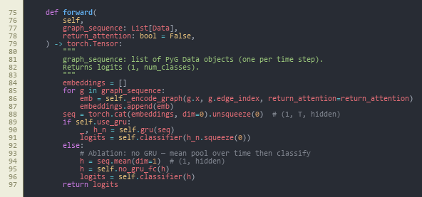
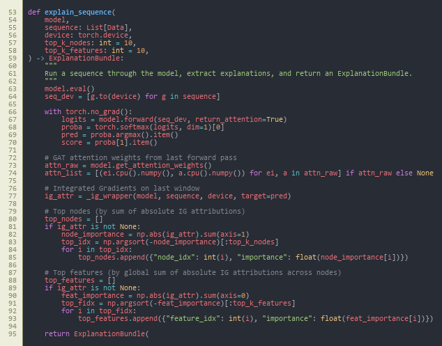
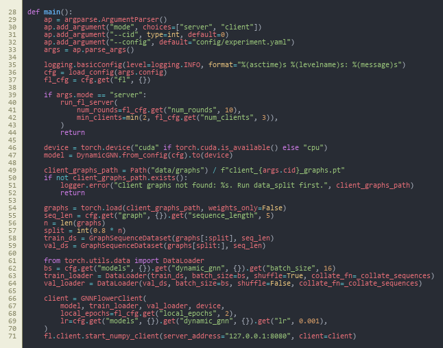

# Explainable Dynamic Graph Neural Network SIEM for Software-Defined IoT using Edge AI and Federated Learning

**Arka Talukder | B01821011**  
**MSc Cyber Security (Full-time)**  
**University of the West of Scotland**  
**School of Computing, Engineering and Physical Sciences**  
**Supervisor: Dr. Raja Ujjan**

---

## 1. Abstract

Internet of Things (IoT) deployments produce large flow telemetry that Security Operations Centres (SOCs) must triage on CPU-only edge infrastructure. Detectors should be accurate, privacy-aware, and explainable, so analysts can act on alerts without extra investigation delay.
This dissertation develops an end-to-end prototype on CICIoT2023 (Pinto et al. 2023). Flows are standardised, grouped into windows, converted into kNN similarity graphs, and classified by a dynamic GNN (GAT + GRU) built with PyTorch Geometric. The same architecture is trained centrally and with Flower FedAvg across three non-IID clients (Dirichlet alpha = 0.5). Explainability combines Captum Integrated Gradients and GAT attention, and results are served as ECS-like JSON through a FastAPI endpoint.
Results. On the held-out test split, central and federated GNN runs achieve F1 = 100% and ROC-AUC = 100% with zero false positives, while Random Forest and MLP achieve F1 = 99.86% and 99.42%. Mean CPU inference is about 23 ms per five-window sequence, and federated communication is about 31 MB over ten rounds. Ablation, sensitivity, and multi-seed checks support these findings.
Keywords: IoT security, dynamic graph neural network, federated learning, SIEM, explainable AI, edge AI, SOC, CICIoT2023

---

## Acknowledgements

I would like to thank my supervisor, Dr. Raja Ujjan, who provided technical support, feedback on design and evaluation, and support during the project. I also want to thank my moderator, Muhsin Hassanu, as she reviewed the interim work and helped to refine the final report.
I also owe a debt of gratitude to Dr. Daune West who helped me and gave me academic support during the submission period. I would like to thank School and programme staff in terms of module materials and guidance on submissions, and the MSc Project co-ordinator in terms of administrative communication regarding the milestones and ethics.
Lastly, I would like to thank friends and family that tolerate me during intensive writing and experiment runs.

---

## List of Abbreviations

| Abbrev. | Definition |
|---|---|
| API | Application Programming Interface |
| AUC | Area Under the (ROC) Curve |
| CPU | Central Processing Unit |
| ECS | Elastic Common Schema (log/alert shape used as a guide) |
| FedAvg | Federated Averaging (McMahan et al. 2017) |
| FL | Federated Learning |
| FN | False Negative |
| FP | False Positive |
| FPR | False Positive Rate |
| GAT | Graph Attention Network |
| GNN | Graph Neural Network |
| GRU | Gated Recurrent Unit |
| IG | Integrated Gradients |
| IoT | Internet of Things |
| IID | Independent and Identically Distributed (data split) |
| JSON | JavaScript Object Notation |
| kNN | k-Nearest Neighbours (graph construction) |
| MLP | Multi-Layer Perceptron |
| non-IID | Non-identical client data distributions |
| PyG | PyTorch Geometric |
| ROC | Receiver Operating Characteristic |
| SDN | Software-Defined Networking |
| SIEM | Security Information and Event Management |
| SOC | Security Operations Centre |
| TN | True Negative |
| TP | True Positive |
| UML | Unified Modelling Language |
| XAI | Explainable Artificial Intelligence |

*Note: In the final Word file, abbreviations in the first column may be coloured (e.g. dark red) to match the programme’s preferred sample layout.*

---

## Table of Contents

**List of Abbreviations**

**Acknowledgements**

**Chapter 1 – Introduction**  
- 1.1 Chapter Overview  
- 1.2 Background and Motivation  
- 1.3 Research Aim and Questions  
  - 1.3.1 Objectives  
- 1.4 Scope and Limitations  
- 1.5 Dissertation Structure  
- 1.6 Alignment with the Marking Criteria in the Project Specification  
  - 1.6.1 Where Each Technical Topic Is Stated Once (Clarity and Non-Repetition)  
- 1.7 Chapter Summary  

**Chapter 2 – Literature Review**  
- 2.1 Chapter Overview  
- 2.2 Themes and Structure  
- 2.3 IoT Security and the Need for Detection  
- 2.4 SIEM, SOC Workflows, and Alert Quality  
- 2.5 Graph Neural Networks and Dynamic Graphs  
- 2.6 Federated Learning and Privacy  
- 2.7 Explainability in ML-Based Security  
- 2.8 Gap and Contribution  
- 2.9 Mapping to CyBOK (Cyber Security Body of Knowledge)  
- 2.10 Extended Comparative Review (Fifteen to Twenty Core Sources)  
- 2.11 Chapter Summary  

**Chapter 3 – Project Management**  
- 3.1 Chapter Overview  
- 3.2 Project Plan and Timeline (45-day MSc)  
- 3.3 Risk Assessment  
- 3.4 Monitoring and Progress Reviews  
- 3.5 Ethics and Data  
- 3.6 Interim Report Feedback Incorporated  
- 3.7 Chapter Summary  

**Chapter 4 – Research Design and Methodology**  
- 4.1 Chapter Overview  
- 4.2 Research Approach  
- 4.3 Dataset and Subset  
- 4.4 Models  
- 4.5 Federated Learning Setup  
- 4.6 Explainability  
- 4.7 Evaluation Plan  
- 4.8 Software and Tools  
- 4.9 Chapter Summary  

**Chapter 5 – Design**  
- 5.1 Chapter Overview  
- 5.2 Pipeline, Alerts, and Deployment (Conceptual)  
- 5.3 Graph Design (Flows to kNN Snapshots)  
- 5.4 Research Design and System Architecture  
- 5.5 Conceptual Illustration: Similarity-Based Graph in One Window  
- 5.6 Chapter Summary  

**Chapter 6 – Implementation and System Development**  
- 6.1 Chapter Overview  
- 6.2 Environment and Tools  
- 6.3 Data Loading and Preprocessing  
- 6.4 Graph Construction  
- 6.5 Model Implementation  
- 6.6 Federated Learning (Flower)  
- 6.7 Explainability  
- 6.8 Alert Generation and SIEM-Style Output  
- 6.9 FastAPI Deployment and CPU Inference  
- 6.10 Implementation Code Screenshots (Author’s Codebase)  
- 6.11 Reproducibility Note  
- 6.12 Chapter Summary  

**Chapter 7 – Testing and Evaluation**  
- 7.1 Chapter Overview  
- 7.2 Evaluation Scope  
  - 7.2.1 Pass Criteria  
  - 7.2.2 Fail Criteria  
- 7.3 Test Schedule  
- 7.4 Experimental Setup  
- 7.5 Metrics  
- 7.6 Dataset and Experiment Statistics  
- 7.7 Comparison Design  
- 7.8 Chapter Summary  

**Chapter 8 – Results Presentation**  
- 8.1 Chapter Overview  
- 8.2 Centralised Model Comparison (Sub-Question 1)  
- 8.3 Federated Learning (Sub-Question 2)  
  - 8.3.1 What Federated Learning Produced (Reading the Curves and the Table)  
- 8.4 Central GNN Training Convergence  
- 8.5 Time-Window and CPU Inference (Sub-Question 2 and Deployment)  
- 8.6 Example Alerts with Explanations (Sub-Question 3)  
- 8.7 Ablation Studies (Priority 1: Evidence)  
- 8.8 Sensitivity Analysis (Stability of Design Choices)  
- 8.9 Multi-Seed Stability  
- 8.10 Comparison with Prior Work on CICIoT2023  
- 8.11 Chapter Summary  

**Chapter 9 – Conclusion, Discussion, and Recommendations**  
- 9.1 Chapter Overview  
- 9.2 Structured Conclusion (Programme Format)  
- 9.3 Answering the Research Questions  
- 9.4 Strengths and Limitations  
- 9.5 Use of University and Course Materials  
- 9.6 Practical Implications  
- 9.7 Relation to Literature  
- 9.8 Summary of the Project  
- 9.9 Recommendations for Future Work  
- 9.10 Chapter Summary  

**Chapter 10 – Critical Self-Evaluation**  
- 10.1 Chapter Overview  
- 10.2 Planning, Scope, and Risk  
- 10.3 Literature and Alignment with the Questions  
- 10.4 Implementation: What Was Harder Than It Looked  
- 10.5 Results, Honesty, and the “100%” Question  
- 10.6 What I Learned (Skills and Mindset)  
- 10.7 Time Management: What I Would Reorder  
- 10.8 Chapter Summary  

**Chapter 11 – References**  
**Chapter 12 – Bibliography**  
**Chapter 13 – Appendices** (A: process; B: specification; C: handbook Appendix 1 code figures; D: handbook Appendix 4 optional)

### Table of Figures

**Numbering rule:** Body figures are **Figure 1–Figure 29** in **strict order of first appearance** (Chapter 2 → Chapter 3 → Chapter 5 → Chapter 6 → Chapter 8). Within **Chapter 5**, subsection order is **5.2 pipeline → 5.3 graph specification → 5.4–5.5 figures**, so **Figures 7–9** match that reading order. Each caption states **Chapter** and **Section** (or **Appendix C**). Handbook **code extracts** in Appendix C keep labels **Figure A1-1**–**Figure A1-6** (they are not part of the 1–29 sequence). Refresh page numbers in Word after pagination.

| Figure | Title (chapter, section) | Page |
|--------|--------------------------|------|
| 1 | Taxonomy of IDS approaches (Ch. 2, Section 2.3) |  -  |
| 2 | Conceptual dynamic GNN flow  -  GAT + GRU (Ch. 2, Section 2.5) |  -  |
| 3 | Federated learning (FedAvg) flow (Ch. 2, Section 2.6) |  -  |
| 4 | Explainability methods for SOC-oriented alerts (Ch. 2, Section 2.7) |  -  |
| 5 | Positioning of related work  -  four pillars (Ch. 2, Section 2.7) |  -  |
| 6 | Project Gantt chart  -  six execution phases plus write-up (Ch. 3, Section 3.2) |  -  |
| 7 | Research pipeline  -  raw flows to SIEM alerts (Ch. 5, Section 5.2) |  -  |
| 8 | Research design  -  data flow, FL, edge alerting (Ch. 5, Section 5.4) |  -  |
| 9 | Conceptual *k*NN similarity graph in one window (Ch. 5, Section 5.5) |  -  |
| 10 | Code: `flows_to_knn_graph` core (Ch. 6, Section 6.10) |  -  |
| 11 | Code: `build_graphs_for_split` core (Ch. 6, Section 6.10) |  -  |
| 12 | Code: `train_one_epoch` training step (Ch. 6, Section 6.10) |  -  |
| 13 | Code: `DynamicGNN.forward` (Ch. 6, Section 6.10) |  -  |
| 14 | Code: `_ig_wrapper` / Integrated Gradients (Ch. 6, Section 6.10) |  -  |
| 15 | Code: FastAPI `POST /score` core (Ch. 6, Section 6.10) |  -  |
| 16 | Confusion matrix  -  Dynamic GNN (Ch. 8, Section 8.2) |  -  |
| 17 | ROC curve  -  Dynamic GNN (Ch. 8, Section 8.2) |  -  |
| 18 | Confusion matrix  -  Random Forest (Ch. 8, Section 8.2) |  -  |
| 19 | Confusion matrix  -  MLP (Ch. 8, Section 8.2) |  -  |
| 20 | ROC curve  -  Random Forest (Ch. 8, Section 8.2) |  -  |
| 21 | ROC curve  -  MLP (Ch. 8, Section 8.2) |  -  |
| 22 | Per-metric comparison  -  RF, MLP, Central GNN, Federated GNN (Ch. 8, Section 8.2) |  -  |
| 23 | Federated learning convergence  -  F1 and ROC-AUC vs. round (Ch. 8, Section 8.3) |  -  |
| 24 | Confusion matrix  -  Federated GNN (Ch. 8, Section 8.3) |  -  |
| 25 | Federated learning communication cost  -  per round and cumulative (Ch. 8, Section 8.3) |  -  |
| 26 | Central GNN training loss curve  -  six epochs (log scale) (Ch. 8, Section 8.4) |  -  |
| 27 | Model comparison  -  inference time and F1 (Ch. 8, Section 8.5) |  -  |
| 28 | Ablation  -  full GAT+GRU vs. GAT-only (Ch. 8, Section 8.7) |  -  |
| 29 | Sensitivity  -  window size and *k* (Ch. 8, Section 8.8) |  -  |
| A1-1 … A1-6 | Appendix C  -  handbook code figures (`DynamicGNN`, graph builder, explainer, Flower, FastAPI) |  -  |

### Table of Tables

**Numbering rule:** Tables are **Table 1–Table 8** in **strict order of first appearance** (literature comparison first, then Chapter 8). Refresh page numbers in Word after pagination.

| Table | Title (chapter, section) | Page |
|-------|--------------------------|------|
| 1 | Comparison of selected related work (Ch. 2, Section 2.7) |  -  |
| 2 | Model comparison on CICIoT2023 test set (Ch. 8, Section 8.2) |  -  |
| 3 | Federated learning round-by-round metrics (Ch. 8, Section 8.3) |  -  |
| 4 | Central GNN training history (Ch. 8, Section 8.4) |  -  |
| 5 | Ablation  -  centralised GNN variants (Ch. 8, Section 8.7) |  -  |
| 6 | Sensitivity analysis  -  nine (*window*, *k*) configs (Ch. 8, Section 8.8) |  -  |
| 7 | Multi-seed summary  -  central GNN (Ch. 8, Section 8.9) |  -  |
| 8 | Comparison with prior work on CICIoT2023 (Ch. 8, Section 8.10) |  -  |

---

## Chapter 1 – Introduction
### 1.1 Chapter Overview
This chapter presents the project background, IoT flow telemetry, SOC alert volume and the practical limitation at the edge node of a CPU. It describes the rationale behind the inclusion of dynamic graph learning, federated training, and explainable alerts in the same pipeline, followed by the research aim, sub-questions, scope, and structure of the chapters to ensure that subsequent chapters in the work are focused on method, implementation, and evidence.
### 1.2 Background and Motivation
The Internet of Things (IoT) has grown at a very rapid pace in residential, workplace, campus and factory locations. There are now smart plugs, cameras, sensors and controllers everywhere. Most of these devices are small, low priced and limited and in most cases, security is not given much consideration during design. This has left weak credentials, patching, and misconfiguration as a common occurrence in actual deployments.
This implies that there is a high exposure to attack. A compromised IoT device may be used in botnet activities, service denial, credential theft or subsequent lateral movement into the broader infrastructure. Such situations are not uncommon in security reports. Due to this, constant surveillance of network behaviour is not a choice, particularly where there are mixed old and new devices.
Software-defined techniques (such as SDN and software-defined IoT) enable switch and router operators to monitor switch flow statistics and router flow statistics centrally. Intrusion detection can be achieved with flow summaries, without full packet capture, often enough, reducing the storage pressure and alleviating some of the privacy concerns. The remaining question is to accurately analyse such flows, to explain decisions in a way that can be used by analysts, and in a manner which can be done on hardware which is realistic at the edge (which is often CPU-only).
The networks are monitored, alerts investigated, and incident response coordinated by Security Operations Centres (SOCs) typically in connection with SIEM platforms that consolidate logs and events derived by flow. Another real-life challenge is the problem of alert fatigue: large numbers of alerts and a high number of false positives decrease the time that analysts have to devote to real incidents. Alerts which are simply a label with no information as to why the model fired take even longer to triage. This necessitates accurate and explainable detectors hence staff can have confidence in outputs and can take action as time runs out.
Random Forests or feed-forward networks can be used to apply traditional models to tabular flow features, but traffic is relational: flows are like neighbours in feature space, have common endpoints in the presence of identifiers, or occur in bursts of traffic, which are meaningful as a whole. Graph models consider flows to be nodes and the adjacent related flows are connected using edges (in this case, kNN links in feature space since the public CICIoT2023 release does not support device-level topology). Dynamic GNNs build upon this concept by training on how the snapshots of the graph change within short periods of time. Individually, IoT data can also be spread out across locations where it is legally or politically challenging to pool raw flows; federated learning trains a single shared model, but maintains raw data locally. Most IoT gateways cannot also take on a GPU in each segment and a CPU pipeline able to emit SIEM friendly JSON is more of a deployable result than a GPU only laboratory result.
### 1.3 Research Aim and Questions
This project will develop and implement a software-defined flow data-based, dynamically trained, federated training, and practical explanation output-based reproducible prototype to detect IoT attacks and provide triage of SOC. It works on realistically constrained feasibility, particularly CPU execution and non-IID federated partitions and ensures that the pipeline is easy to understand when used by security operations.
The primary research question will be:
What is the way to have an explainable dynamic graph neural network, which is trained via federated learning, to identify attacks in the Software-Defined IoT flow data and provide SIEM alerts, which may be used to support SOC operations on CPU-based edge devices?
To substantiate it, the sub-questions are discussed below:
1.	Is there a better effect of dynamic graph model compared to simple models such as Random Forest and MLP?
2.	Is it possible to keep the same level of performance with federated learning without the sharing of raw data?
3.	Is the model able to produce meaningful explanations to SOC alert triage?
Contributions (in this dissertation):
•	A flow telemetry-to-kNN similarity-graphs prototype that is end-to-end, CPU-based and trains a dynamic GNN (GAT + GRU), and results in SIEM-shaped JSON alerts.
•	Comparison between a centralised and federated architecture with the same architecture under Flower FedAvg with non-IID client partitions.
•	An explainability route that integrates Integrated Gradients (feature attribution) with GAT attention (flow and structure cues) with ablation, sensitivity, and multi-seed support.
•	A reproducibility trail in submission ready format as configuration, scripts, chapter mappings and artefacts in the form of appendices.
CICIoT2023 is used in the work to compare choices and metrics with outcomes of previous studies and yet fit within a budget of an MSc time-box and resources.
#### 1.3.1 Objectives
The project has the following specific objectives to provide answers to the above research questions. All of these objectives are artefacts deliverable which are revisited in Chapters 4-8 as evidence:
1.	Literature objective. Critically review IoT intrusion detection, graph and dynamic GNN techniques, federated learning and explainable AI to security, and determine the gap that this project addresses (Chapter 2).
2.	Dataset objective. Choose a sample of CICIoT2023 that comprises both benign and attack traffic that is manageable, repair train/validation/test splits and record preprocessing (Sections 4.3 and 6.3).
3.	Modelling objective. A controlled comparison (Sections 4.4 and 6.5) of two flow-level baselines (Random Forest, MLP) and one dynamic GNN (GAT + GRU).
4.	Federated objective. Train on three non-IID clients (ten rounds) with Flower FedAvg, and test the global checkpoint on the central test set (Sections 4.5, 6.6 and 8.3).
5.	Explainability objective. Add Captum Integrated Gradients to GAT attention to obtain per-alert top features and top flows ( Sections 4.6, 6.7 and 8.6).
6.	SIEM objective. Serve the model through a FastAPI endpoint that returns ECS-like JSON alerts and report CPU inference latency (Sections 6.8, 6.9 and 8.5).
7.	Evaluation objective. Establish metrics, ablation, sensitivity and multi-seed tests and present results in figures and tables (Chapters 7 and 8).
8.	Reflect and write-up goal. Write up in a final report in accordance with the UWS guideline and MSc Project Handbook with a critical self-evaluation (Chapters 9 and 10).
### 1.4 Scope and Limitations
The project implements CICIoT2023 (Pinto et al. 2023) in a manageable subset in 45 days MSc. Flow level features are publicly exposed but unreliable device topology fields are not, to construct the complete host graph. Due to this, this implementation has flow nodes equipped with kNN feature-similarity edges and using a GAT+GRU model stack as explained in Section 2.5 and defined in Section 5.3.
It covers the baselines of Random Forest and MLP, Flower FedAvg federation, Captum explainability, and ECS-like alerts of FastAPI. Production SIEM integration, formal SOC user studies and large multi-organisation federation are outside of the scope. Details of technical implementation are specifically focused in Chapters 4 to 7 to eliminate repetitive text.
Limitations (overview): no production SIEM deployment, no formal study of SOC users, CPU-only training and inference, three federated clients and ten rounds in reported federated run. The headline measures are subset measures and are candidly talked about in Chapter 9. Following the risk treatment in Chapter 3 are contingency decisions, like reduced data and reduced rounds should it be necessary. The repository, config/experiment.yaml and execution notes are used to reproduce Chapter 13 content.
### 1.5 Dissertation Structure
The sequence of the chapters conforms to UWS MSc final-report template and Updated Guideline for Final Report. It contains front matter, technical body chapters, reference, and appendix in the order to be expected but all the materials are unique to this project topic and evidence.
In Chapter 2, literature is critically reviewed, with the comparative subsection of Section 2.10 being fifteen to twenty pages long to address fifteen to twenty key sources. Chapter 3 captures time, risks and process of ethics. Chapter 4 includes a definition of research design and methodology. Chapter 5 defines design of pipeline and graph. The implementation modules and integration points are recorded in chapter 6. Testing protocol, and metric formulae are defined in chapter 7. The results are recorded in Chapter 8 in the form of evidence, with little interpretation. Chapter 9 has discussion, conclusions and recommendations that are associated with research questions. In Chapter 10, the first-person critical self-evaluation is given. There are references and bibliography in chapters 11 and 12. Appendices such as process records, specification, reproducibility material, and handbook code-figure evidence, are found in chapter 13.
The chapter mapping is:
| Criterion (weight) | Where it is addressed in this dissertation |
|---|---|
| Introduction (5%) | Chapter 1 - aim, questions, scope, structure |
| Literature (20%) | Chapter 2 - critical review, comparison table, figures, gap |
| Research design (20%) | Chapters 4–5 - methodology, dataset, graph and system design |
| Implementation (25%) | Chapter 6 - build, modules, tooling, reproducibility |
| Evaluation (5%) | Chapter 7 - protocol, metrics, setup |
| Results presentation (5%) | Chapter 8 - tables and figures, minimal interpretation |
| Conclusions & recommendations (10%) | Chapter 9 - answers to questions, implications, limits, future work |
| Critical self-evaluation (10%) | Chapter 10 - reflection on process and learning |
### 1.6 Alignment with the Marking Criteria in the Project Specification
The dissertation is organised against the marking criteria and weightings recorded in the agreed Project Specification (Appendix B). That is the same grid you committed to in formally submitted progress work: Introduction 5%; Context / Literature Review 20%; Research Design 20%; Implementation (Practical Work) 25%; Evaluation 5%; Presentation of Results 5%; Conclusions and Recommendations 10%; Critical Self-Evaluation 10% (total 100%).
The chapter mapping is:
### 1.7 Chapter Summary
Chapter 1 framed the SOC and IoT problem context, stated the research questions, and defined scope and boundaries, mapping the report to the marking criteria in Section 1.6. Chapter 2 next reviews the literature.
## Chapter 2 – Literature Review
### 2.1 Chapter Overview
This chapter reviews prior work on IoT intrusion detection, SOC/SIEM alerting needs, graph and dynamic GNN methods, federated learning, and explainable AI in security. The aim is clear. I need to show what other studies did well, what they did not cover, and how that leads to the design choices in this dissertation. Dataset counts, split statistics, and configuration details are kept for the methodology and evaluation chapters (Section 7.6 and Section 6.2) so this chapter stays analytical, not a second methods section.
The literature is grouped by theme so each block ties to the research questions in Section 1.3. Section 2.3 covers IoT threat context and CICIoT2023; Section 2.4 covers SIEM/SOC workflows and alert quality; Sections 2.5 and 2.6 cover graph and dynamic GNN ideas and federated learning; Section 2.7 covers explainability in ML-based security; Sections 2.8 to 2.10 cover the gap, CyBOK mapping, extended comparison, and summary. Technical numbers and experiment design are left to later chapters so this review does not duplicate methodology.
### 2.2 Themes and structure
### 2.3 IoT Security and the Need for Detection
The IoT devices have become prevalent in numerous industries, yet they are commonly constructed with affordability and convenience in consideration and not security. Researchers have indicated that a large portion of devices are default-credentialed, run unpatched software, and lack strong encryption (Kolias et al. 2017). Once such devices are compromised, they may be used in botnets, to steal data, or as a beachhead to the rest of the network. Therefore, the detection of malicious behaviour in IoT traffic is a valuable aspect of the current security practice.
The magnitude of the threat of the IoT is not unknown. Kolias et al. (2017) have examined the Mirai botnet. It exploited weak Telnet passwords on millions of IoT devices to do massive DDoS attacks. This is because such incidences indicate that IoT networks must be monitored and detected automatically. Scalability: manual inspection cannot be done at scale. There is a wide range of IoT devices (cameras, thermostats, industrial controllers). And there are diverse attack surfaces. The detection systems need to be able to deal with varying traffic patterns and protocols. Software-Defined IoT and SDN bring about another level. Flow statistics can be gathered on switches and routers by central controllers. However, high data volume and the need for real-time analysis necessitate effective detection techniques, which can be executed at the edge.
IoT intrusion can be detected in various manners. The signature-based techniques seek common attack signatures. Anomaly-based approaches are used to learn normal and to mark the anomalies. The attack detection on flow or packet data has been performed a lot using machine learning. The dataset of CICIoT2023 that is used in this project was made to support such research. It involves such attacks as DDoS, reconnaissance, and brute force of real IoT devices in a controlled environment (Pinto et al. 2023). There are 46 fixed flow features in the dataset which are pre-computed over a packet capture. This minimises the inspection of raw packets. It is also similar to the type of data that the SIEM systems typically work with. Pinto et al. (2023) explain the method of collection of data. Traffic was recorded by real IoT devices (smart plugs, cameras, doorbells) in controllable attack scenarios. The flow features were derived with the help of standard tools. It has such features as protocol indicators (TCP, UDP and ICMP) and packet and byte statistics, TCP flag counts and statistics such as mean, variance, and standard deviation. The results obtained with the help of a public dataset allow comparing them with others. However, it is lab-based, as opposed to a live network. Recently, Yang et al. (2025) demonstrated that graph neural networks have the potential to enhance intrusion detection to industrial IoT. They demonstrated that the accuracy of modelling network structure can be better than flat feature models. CICIoT2023 dataset is skewed in terms of classes (approximately, 97.8% attack, 2.2% benign at the flow level). This complicates training. It is addressed in this project by stratified windowing and the construction of balanced graphs.
Several studies consider each flow or packet individually. But in practice, attacks can manifest themselves in form of temporal patterns of communication between devices. As an example, there can be a DDoS attack where there are numerous flows of numerous sources to a single target. Sequential probing of ports may be indicated by a reconnaissance scan. Flat feature vectors are deprived of this structure. Wang et al. (2025) did a scoping review. They discovered that graph methods of analyzing network traffic are increasingly being applied. The specific graph model (dynamic graphs) is promising to be useful in capturing time-varying patterns of attacks. Zhong et al. (2024) surveyed the use of graph neural networks in intrusion detection. They discovered a definite tendency in using GNNs along with temporal models. They also mentioned that explainability and federated deployment remain an under-explored area. These results justify the dynamic approach and graph-based approach in this project. The main gap in the literature consists in the fact that few prototypes are offered in the literature that combine graph-based detection, federated learning and explainable alerting in a single system to be used by SOC. The majority of the papers deal with one of them. The key categories of intrusion detection methods that can be applied to IoT and this project are summarized in figure 1.

**Figure 1: Taxonomy of IDS approaches relevant to IoT and this project (Chapter 2, Section 2.3)**
*Sources: Kolias et al. (2017); Pinto et al. (2023); Wang et al. (2025); Zhong et al. (2024). Full references in Chapter 11.*
### 2.4 SIEM, SOC Workflows, and Alert Quality
SIEM and other tools like them collect logs and flow information and generate alerts with the help of SOC teams. An example of these problems is the issue of alert fatigue. The high rate of false positives and a large number of alerts make the task of the analysts more complicated to focus on the real threats (Cuppens and Miège 2002). Triage cannot be effective when an alert does not include explaining why it was raised, and is rather a guess. Cuppens and Miège (2002) suggested alert correlation to minimize noise by clustering similar alerts. The biggest problem though is that most detection systems give labels without any explanation as to why. This is applicable even today.
Elastic Common Schema (ECS) provides a common pattern of security events. It has event type, outcome, source, destination and custom extensions fields. Its ECS-like output can be more easily integrated with Elastic Security and Splunk and other SIEM products. This project uses an ECS-like format of the alert JSON. That way, the output can be used in the current SOC tools with minimal modification.
Existing SIEM tools include Splunk, Elastic Security, and Microsoft Sentinel that have machine learning models and custom rules. The explainable AI use in alert workflows is still in its infancy. With the knowledge of what features or events led to a decision to consider traffic malicious, analysts can learn the nature of the decision made by the model. This helps them to prioritize and do away with time wastage in false positives. Analysts can either disregard warnings (an ever-increasing danger) or over-investigate (makes them less efficient).
Various initiatives are increasingly interested in terms of making security tools explainable. One such example is some work that has focused on characterizing the attributes that led to a detection (e.g. SHAP by Lundberg and Lee, 2017). Explanations that point to some flows, devices or time windows can be given in a SOC environment and therefore enable analysts to make quick decisions to escalate or not. This project does this by developing SIEM like alerts with the most desirable features and flows attached. In such a manner that the product is not only a piece of labelling, but something which can be acted on by an analyst. The ECS- compatible JSON format can be used with popular SIEM tools.
### 2.5 Graph Neural Networks and Dynamic Graphs
Graph neural networks (GNNs) are used on data that is structured into graphs: nodes and edges. The nodes may be hosts or devices and the edges may be flows or connections in network security. GNNs can combine information with their neighbours, and can learn patterns, which can be informed by the graph structure. The thing is that the relationships among the messages (so that the node updates based on its neighbours) of the model can be projected onto the flat classifiers. Even more are Graph Attention Networks (GATs). They enable their nodes to give their neighbours different attention based weights (Velickovic et al. 2018). This assists the model to concentrate on the most pertinent connections. This comes in handy where certain flows are benign and others part of an attack. Han et al. (2025) suggested DIMK-GCN as an intrusion detector. They showed that the patterns of attacks (both local and global) can be modeled with multi-scale graph structures. Ngo et al. (2025) explored the use of attributes as a method of constructing a graph in identifying IoT intrusion. They showed that with feature similarity (instead of the network topology) to form graphs, they could construct without device IDs. This is biased towards the kNN-based graph-building in this project. When the IP addresses or device IDs are no longer accessible (when the public CICIoT2023 release is released), there can be no topology-based graphs built. Then it is only attribute based or similarity based construction.
Networks change over time. New relationships, change in traffic volumes and attacks are being accumulated. This is attempted to be modeled by dynamic or temporal graph models. The common approach is to make a GNN that has a recurrent module (e.g. GRU or LSTM). The model receives a progression of graph snapshots, and learns by observing the development of the graph. A number of papers have used it to detect or have detected fraud (e.g. Zheng et al. 2019) or detected anomaly. Lusa et al. (2025) suggested TE-G-SAGE to detect intrusion into the networks. It is a combination of temporal edge features and GraphSAGE. They demonstrated the edge-level and temporal information enhance accuracy. Basak et al. (2025) added X-GANet to the network intrusion detection. They verified both that attention-based GNNs can achieve high accuracy, as well as that they provide interpretable results. In the case of IoT flow data, a reasonable method to assess whether the structure and the temporality enhances detection compared to simple models, such as Random Forest or MLP, is to construct time-windowed graphs and apply a dynamic GNN (GAT + GRU in this project). The literature is in favor of the notion that graph structure can be value-added. Nonetheless, the actual profit will be informed by the information and task. The reason why this project compares the dynamic GNN with baselines is because of this reason. Tabular models are also cheaper to run as compared to GNNs. The accuracy and inference time trade-off is important to the edge deployment. It is assessed in this project. GAT (learn about which neighbours to consider) combined with GRU (learn about how the graph changes) is a typical trend in temporal graph learning. In this project it is applied on the flow data of the internet of things with the help of kNN graph. This has not been ventured into extensively in the past. Figure 2 shows the flow conceptually: the snapshots of the graph-at-a-point in time are inputted into the GAT and the sequence of the graph-representations are inputted into a GRU to perform temporal modelling and finally the prediction is made.

**Figure 2: Conceptual flow of a dynamic GNN (GAT + GRU) for temporal graph classification (Chapter 2, Section 2.5)**
*Sources: Velickovic et al. (2018); Zheng et al. (2019); Lusa et al. (2025); Basak et al. (2025). Full references in Chapter 11.*
### 2.6 Federated Learning and Privacy
Federated learning learns a model using a large number of clients without centralizing raw data. All clients do their training with local data and transmit only model updates (gradients or weights) to a server. The server integrates them and responds with a new model. A typical algorithm is FedAvg (McMahan et al. 2017). The server averages the client model parameters and in most cases, these are weighted according to the amount of local data each client has. This minimizes privacy threat as opposed to transmitting raw IoT traffic to a central location. This is important when the data is provided by various organisations or places. With IoT and edge deployments, data can be distributed over a large number of locations (a variety of buildings, campuses or organisations). Laws such as GDPR might not permit centralisation of sensitive network data. The bandwidth required to train is also minimized by Federated learning. Raw flows (which can be massive) are not transferred but instead model parameters (typically a few megabytes) are transferred. So federated learning is effective with edge networks that are bandwidth limited. Figure 3 depicts the FedAvg flow: clients locally train and transmit model updates to the server; the server aggregates, and transmits the global model back.

**Figure 3: Federated learning (FedAvg) flow - no raw data leaves clients (Chapter 2, Section 2.6)**
*Sources: McMahan et al. (2017); Lazzarini et al. (2023). Full references in Chapter 11.*
The concept of federated learning has been applied to the IoT and in the context of the fog-edge (e.g. Qu et al. 2020). Lazzarini et al. (2023) investigated federated learning to identify IoT intrusions. They discovered that FedAvg has the ability to achieve the same performance as centralised training, but without data being moved. Albanbay et al. (2025) did a performance study on federated intrusion detection in IoT. They demonstrated that convergence and accuracy rely on non-IID data among clients. The global model needs to learn mixed updates when there are diverse types of attacks or diverse combinations of benign and malicious traffic among the clients. It is possible to converge FedAvg, but the rounds and aggregation policy are important. Difficulties are the cost of communication, non-IID data, and potential decreases in accuracy relative to centralised training. Flower is employed in this project to run FedAvg with three clients and a Dirichlet-based non-IID data split. The idea is to demonstrate that federated training can achieve similar performance to centralised training. The assessment entails the price of communication and roundwise performance. Flower was selected as it is compatible with PyTorch and custom client and server logic.
### 2.7 Explainability in ML-Based Security
Explainability can be added to a system in different ways. A trained model is explained using post-hoc techniques. They indicate the most important inputs or features to use to make a prediction. Integrated Gradients is a gradient based approach. It assigns the prediction to input features in comparison to a baseline (Sundararajan et al. 2017). It has some handy features such as sensitivity and implementation invariance. It is applied to Captum (Kokhlikyan et al. 2020), using PyTorch. In the case of GNNs, the weights of attention in GAT layers can also be used to indicate the edges or neighbours which the model concentrated on. In this project, both: Integrated Gradients to explain features and Attention to explain importance at the flow level are used. So the alert can include both which features (e.g. packet rate, flag counts) and which flows contributed most to the prediction. Figure 4 summarises the explainability pipeline to be applied in this project to SOC-oriented alerts.

**Figure 4: Explainability methods used for SOC-oriented alerts (Chapter 2, Section 2.7)**
*Sources: Sundararajan et al. (2017); Velickovic et al. (2018); Kokhlikyan et al. (2020). Full references in Chapter 11.*
Alabbadi and Bajaber (2025) used explainable AI (XAI) intrusion detection in IoT data streams. The researchers validated the use of post-hoc explanation methods like this approach to increase explainability of security actions to the analyst. Lundberg and Lee proposed SHAP to explain the model (2017). SHAP can be used to explain any model. Nevertheless, the authors mention that Integrated Gradients are a preferred explainer for a neural network as it is a gradient-based explainer and works well with backpropagation. A practical observation regarding our methodology is that complete explainability can be slow for each prediction. Integrated gradients need many functions forward to estimate the integral. For our GNN that works with sequences of graphs, this can induce a lot of latency. Our design enables users to apply explanations selectively, such as exclusively on high confidence positives, if desired. Not all papers do go on to comment on this trade off. We record it as a limitation and potential future work.
There are still missing elements in the XAI pillar that makes it unfortunate. Stronger reporting is a good example of explanation latency versus analyst value which will need to be done in operational settings less technical papers do explain methods, but none report whether the explanations help real triage within stringent time limits.
Table 1 and Figure 5 summarise the alignment of some selected related work with the four pillars of the project (GNN/graph-based detection; federated learning; explainability; and SIEM-style alert output). All citations appear in the References section (Chapter 11). To the best of our knowledge, no previous work has combined all the four in one prototype for SOC for edge devices.
Table 1: Comparison of selected related work (sources: Chapter 11)
| Study | GNN/Graph | Federated learning | Explainability | SIEM/Alert | Dataset/context |
|---|---|---|---|---|---|
| Pinto et al. (2023) | - | - | - | - | CICIoT2023 dataset |
| Velickovic et al. (2018) | Yes (GAT) | - | - | - | General GNN |
| McMahan et al. (2017) | - | Yes (FedAvg) | - | - | General FL |
| Sundararajan et al. (2017) | - | - | Yes (IG) | - | Attribution method |
| Han et al. (2025) | Yes (DIMK-GCN) | - | - | - | IDS |
| Ngo et al. (2025) | Yes (attribute-based) | - | - | - | IoT IDS |
| Basak et al. (2025) | Yes (X-GANet) | - | Yes | - | NID |
| Lusa et al. (2025) | Yes (TE-G-SAGE) | - | Yes | - | NID |
| Lazzarini et al. (2023) | - | Yes | - | - | IoT IDS |
| Albanbay et al. (2025) | - | Yes | - | - | IoT IDS |
| Alabbadi and Bajaber (2025) | - | - | Yes (XAI) | - | IoT streams |
| Yang et al. (2025) | Yes | - | - | - | Industrial IoT |
| This project | Yes (GAT+GRU) | Yes (Flower) | Yes (IG+attention) | Yes (ECS-like) | CICIoT2023 |
*Source: Author compilation from the papers cited in Chapter 11; table is descriptive only.*

**Figure 5: Positioning of related work - GNN, federated learning, explainability, and SIEM-style alerts (Chapter 2, Section 2.7)**
Sources: Pinto et al. (2023); Velickovic et al. (2018); McMahan et al. (2017); Sundararajan et al. (2017); Han et al. (2025); Ngo et al. (2025); Basak et al. (2025); Lusa et al. (2025); Lazzarini et al. (2023); Albanbay et al. (2025); Alabbadi and Bajaber (2025); Yang et al. (2025). This figure synthesises Chapter 2 and supports the gap stated in Section 2.8.
### 2.8 Gap and Contribution
Previous research has addressed IoT intrusion detection and graph neural networks (GNNs) and explainability alone and on IoT intrusion detection only federated learning. As an illustration, the work of Yang and colleagues (2025) examines GNN architectures for IoT intrusion detection. Han et al. (2025) study GAT-GRU for network-wide attack detection. Lazzarini et al. (2023) and Albanbay et al. (2025) examined the use of federated learning in IoT intrusion detection. The papers by Alabbadi and Bajaber (2025) and Basak et al. (2025) examine how explainable IoT intrusion detection is. In the present work we put together a minor but complete prototype which integrates (1) the construction of kNN graphs from IoT flow data, (2) a GAT+GRU dynamic GNN, (3) FedAvg federated averaging through Flower, and (4) Captum and GAT attention.
### 2.9 Mapping to CyBOK (Cyber Security Body of Knowledge)
The job specification of the agreement (Appendix B) records this work against CyBOK knowledge areas. Of special note in the application process is that it aligns to the following topics and sub-topics: Attacks & Defences → Security Operations & Incident Management (SIEM-style alerting, SOC triage and intrusion detection outputs); Infrastructure Security → Network Security (flow-based, and IoT traffic classification); Systems Security → Distributed Systems Security (federated learning, without centralising the raw client data); Software and Platform Security → Software Security (engineering of the prototype pipeline, APIs and reproducible scripts). The project is consistently placed within the School’s CyBOK mapping and the specification’s indicative coverage.
### 2.10 Extended Comparative Review (Fifteen to Twenty Core Sources)
The programme guideline requests between fifteen and twenty important papers in the literature review. Themes developed with primary citations were already developed in earlier sections. In this subsection, we group other comparisons to ensure the breadth requirement is clear: (1) temporal graphs and anomalies - Zheng et al. (2019) present attention-based temporal GCNs on dynamic graphs; that body of work encourages the use of a sequence learner (here, a GRU) on top of graph snapshots instead of considering each window individually. (2) Federated and fog environment - Qu et al. (2020) address the concept of decentralised privacy patterns in the environment of fog computing; the current work is not associated with blockchain, but the article can assist in positioning the reasons why edge sites might not allow the pooling of raw data. (3) Surveys and scoping reviews - Zhong et al. (2024) and Wang et al. (2025) provide an overview of the applications of GNNs in intrusion detection and the areas where the technology still lacks explainability and deployment. (4) SHAP vs. gradient methods - SHAP values are described by Lundberg and Lee (2017); the two methods used in this project are Integrated Gradients (Sundararajan et al. 2017) and GAT attention due to their ability to use the PyTorch + Captum stack; however, SHAP can be used as well with a tree or tabular baseline. (5) IoT threat situation - Kolias et al. (2017) report about Mirai-type botnets, which is the reason why flow-level DDoS patterns are prominent in IoT benchmarks. (6) Alert operations - Cuppens and Miège (2002) present early alert-correlation concepts which are more akin to contemporary practice of SIEM despite format evolving to JSON and ECS-like fields.
### 2.11 Chapter Summary
Dynamic GNNs, federated learning, and XAI are supported in the literature to detect intrusion, but seldom combined with SIEM-oriented outputs to edge SOC workflows. Table 1 and Figure 5 reveal that gap in terms of pillar. The following chapters shift the focus to what this project created: the fixed dataset processing, kNN time-varying graphs, the GAT + GRU stack, the Flower FedAvg, Captum, and ECS-like alerts delivered via FastAPI.
## Chapter 3 – Project Management
### 3.1 Chapter Overview
This chapter documents the project process: planning and milestones, risk management, ethics posture (public dataset, no human participants), and how interim feedback was incorporated. It helps in transparency of execution without replicating technical information in Chapters 4-7.
### 3.2 Project Plan and Timeline (45-day MSc)
The work was broken down into six phases: (1) freeze requirements and literature; (2) fix the CICIoT2023 subset and preprocessing; (3) implement graph construction and central GNN training; (4) run baselines and Flower-based federated training; (5) add explainability, alert JSON, and FastAPI; (6) run ablation, sensitivity, multi-seed experiments, figures, and final writing. To eliminate ambiguity on the definition of done, each phase had tangible artefacts (metrics files, checkpoints, plots). The schedule is presented in figure 6 in the form of a Gantt chart with overlapping phase bars, more realistic to the implementation of the research in reality rather than in sequential blocks.

**Figure 6: Project Gantt chart - six execution phases plus write-up across the 45-day MSc window (Chapter 3, Section 3.2)**
*Source: Author’s own diagram (scripts/generate_gantt_chart.py).*
### 3.3 Risk Assessment
| Risk | Mitigation |
|---|---|
| Training too slow on CPU | Fixed subset; configurable rounds/clients; early stopping |
| Severe class imbalance | Stratified windowing; class weights; balanced graph-level labels |
| Federated instability | Three clients; reproducible split; checkpoints each round |
| Explainability runtime | Top-k attributions; optional subset of alerts |
| Scope creep (extra models) | Baselines limited to RF and MLP; one main GNN architecture |
### 3.4 Monitoring and Progress Reviews
The progress was tracked on a weekly rhythm with the supervisor and in relation to the phase scheme in Section 3.2. The agenda of every meeting (once a week) was based on the same three points: (1) what has been done since the previous meeting and which artefact in the repository demonstrates it; (2) what was being done and what blocker required supervisor input; (3) what was going to be done next week and what phase boundary was it. The project process documentation which is referenced in Appendix A captured decisions and action items in such a way that activity can be traced even after the memory.
### 3.5 Ethics and Data
No human subjects or proprietary organisational data is involved; it is public CICIoT2023 data only. The signed section of the specification ethics describes confirmation of supervisor that the project does not need complete ethics-review board approval according to School procedures (February 2026), which corresponds to the use of non-sensitive public data only. The handbook also requires process and ethics paperwork, which can be found in Appendix A/B.
### 3.6 Interim Report Feedback Incorporated
The MSc Project Handbook dictates that any feedback about the interim report (written and verbal by supervisor and moderator) will have to be considered in the final submission. Following interim submission, feedback strengthened: (1) maintaining the end-to-end story (data → model → federation → explainability → SOC-shaped output) not just literature but (2) tightening evaluation plan (not reporting numbers) (3) being explicit about limits of a lab subset and very high test metrics (4) save effort on final analysis and write-up, not scope creep.
Activities associated with the final dissertation are: fulfilling the entire evaluation and results chapters (Chapters 7 and 8) with tables and figures as promised at interim; including ablation, sensitivity, and multi-seed checks to demonstrate the result stability (more than the interim contingency of dropping sensitivity in the event of time constraint); enhancing critical reflection (Chapter 10) on methodology, federation, and the 100% metrics question. Any other recommendations of the interim review are recognized as constraints and future research in Chapter 9.
### 3.7 Chapter Summary
Clear time-boxing and risk management made the project viable and capable of producing graph, federated, explainable and deployable components.
## Chapter 4 – Research Design and Methodology
### 4.1 Chapter Overview
The chapter establishes the methodology with which the research questions are answered: the approach to research, the motivation to use a split, the choice of a model (RF, MLP, dynamic GNN), the creation of a federated learning system, the plan of explainability, and the plan of evaluation. Chapter 5 (Figures 7, 8 and 9) specifies design level pipeline overview, graph semantics and system architecture, Chapter 6 specifies implementation details, and Section 7.5 specifies metric definitions to ensure the report does not repeat itself.
### 4.2 Research Approach
The project is feasible. The goal is to develop a functioning prototype and test it using definite metrics. The construction of the system, the comparisons of the dynamic GNN with baselines, the federated learning and the investigation of whether the explanations are useful to the SOC triage answers the main research question. Sub-questions are solved with the help of experiments and examination of example alerts.
The design-science approach is used as the methodology. A prototype is created and tested using quantitative (precision, recall, F1, ROC-AUC, inference time, communication cost) and qualitative (interpretability of example alerts) measures. CICIoT2023, kNN graphs, GAT +GRU, Flower, and Captum have been selected based on the literature and practical considerations (available dataset, 45-day timeline, only CPU implementation). Assessment plan is stipulated prior to experiments. Thus, the interpretation of results can be objective.
### 4.3 Dataset and Subset
The CICIoT2023 dataset (Pinto et al. 2023) is used. It contains network flow information of IoT devices in different attacks (DDoS, DoS, reconnaissance, brute force, spoofing). The entire data is extensive (millions of flows). A manageable subset is thus chosen to be within the 45-day timeline. The subset consists of both benign and attack traffic as well as a distribution of attack types. All experiments are performed on the same subset to compare the results. The data is divided into fixed train, validation and test sets (e.g. 70% train, 15% validation, 15% test, no overlap). This prevents data leakage and enables equitable comparison in between centralised and federated training.
CICIoT2023 has 46 numeric flow features (rates, counts, protocol indicators, TCP flag statistics, etc. - see (Pinto et al. 2023)). The column list in code is config/experiment.yaml. Attributes are standardised on train statistics only, and then run on validation and test. Binary labels (benign vs. attack) are used. The subset retains the two classes; the test split is only retained until the final reporting.
Pinto et al. (2023) explain the capture of CICIoT2023 in an experimental IoT testbed with benign operation and numerous attack conditions and release with per-flow features that can be used to test real-time detection performance. This dissertation does not re-collect the traffic, it uses that public release in such a way that the preprocessing, splits, and models can be verified by others.
#### 4.3.1 Where the Data Lives (repository Layout)
Raw CICIoT2023 files are huge and are not stored in Git. Raw CSV (or unpacked archive) should be found in a local checkout in a directory like data/raw/ (see README.md in the repository). Train / validation / test parquet split and metrics can be found in data/processed/ and results/ after preprocessing respectively. The dissertation tabular (table and figure) figures were generated using a single frozen subset, and the scripts used in Chapter 13; re-running the same preprocessing script will give the same number of rows to another researcher who downloads the entire public dataset.
### 4.4 Models
There are three models that are employed to be able to evaluate the value of the graph and the temporal structure.
•	Random Forest: A baseline on the tabular flow-level data: each training/testing instance is a single processed flow (the same 46 standardised features as in the graph pipeline), and no graph structure. Learned on the train/test parquet splits (src/models/baselines.py).
•	MLP (Multi-layer perceptron): The same flow-level model as Random Forest - a feed-forward network on 46-dimensional rows without graph or time modelling (MLPBaseline in src/models/baselines.py).
•	Dynamic GNN (GAT + GRU): The main model. Each snapshot of a graph is processed by multiple graph attention layers; the sequence of graph representations through time is processed by a GRU (or other RNN). Attack vs. benign (or multi-class) prediction is done using the output. This model involves the application of both temporal and structure. The GAT enables the model to assign neighbouring weights differently and the GRU learns the dynamics of the graph representation through the sequence.
All the models are trained to forecast attack (or attack type) based on the available features and, in the case of GNN, on the graph and its development. The choice of hyperparameters (e.g. learning rate, number of layers, hidden size) is made on the validation set, and the test set is not used until final reporting. All models are split in the same train/validation/test splits so that they can be fairly compared.
### 4.5 Federated Learning Setup
FedAvg (McMahan et al. 2017): clients locally train and transfer weights, the server averages and broadcasts the global model - no raw flows inter-sites (Section 2.6). In this project, Flower will be used with three clients and ten rounds with two local epochs per round (timelines and risks: Chapter 3; wiring: Section 6.6). The identical GNN architecture is trained both centrally and federally to provide a fair comparison. Communication cost is based on estimated float32 parameter traffic (Chapter 8).
Non-IID simulation: Dirichlet distribution (alpha = 0.5) on training rows among clients (label mixes vary) to create client splits. Rationale: reflect sites with varying exposure and remain within MSc budget.
### 4.6 Explainability
There are two types of explanation:
•	Integrated Gradients (Captum): This is applied to the model being used (e.g. the dynamic GNN or the MLP) to assign the prediction to input features. The most contributing features are filtered out and placed in the alert.
Attention weights: In the GAT-based model, attention weights on edges or neighbours are applied to determine the flows or connections which the model concentrated on. These can be generalised as top flows or top edges in the alert.
Predictions (e.g. positive alerts) are selected and an explanation is generated. Each alert contains the top-k (k=5) features and flows so that the explanation is not too long. When it is too slow to compute explanations of all the predictions, they are only applied to a subset (e.g. high-confidence alerts) and this is marked out as a limitation.
### 4.7 Evaluation Plan
Precision, recall, F1, FPR and ROC-AUC formulae and definitions appear once in Section 7.5. In this case, measurements are only mapped to questions.
The three sub-questions are set to be answered through evaluation to back up the primary research question.
The metrics include: Precision, recall, F1-score, ROC-AUC, and false positive rate on the fixed test set. A confusion matrix is illustrated.
•	Comparison of models: Centralised training: Comparison of the splits of the models between the Centralised training: Random Forest, MLP, and dynamical GNN. Federated training: the identical GNN (or MLP) is now trained using FedAvg and contrasted to its centralised counterpart.
Time and cost: time-window analysis (e.g. performance with various window sizes or positions), federated round-by-round performance, approximate communication cost (bytes) and CPU inference time per sample or per batch.
•	Use of explainability and SOC: Three to five example alerts are created that are fully explained (top features and flows). These are addressed with respect to whether they would assist a SOC analyst to triage (e.g. whether the emphasized flows and features can be interpreted and acted upon).
Contingency is equal to Chapter 3 (size of subset, number of rounds/client, optional subset of explained alerts). Connection to questions: precision, recall, F1, ROC-AUC, and FPR to sub-question 1 (and central leg of sub-question 2); per- round FL metrics and comms cost to sub-question 2; example alerts to sub-question 3; CPU inference latency to main question (edge deployability).
### 4.8 Software and Tools
The approach is based on a few mainstream Python libraries that are selected on the basis of their stability, documentation, and compatibility on the CPU. The complete pin list is in the repository requirements.txt; this section identifies the components and how each component contributes to the answers of research questions. Chapter 6 has module-level wiring, and code snippets.
Python 3.10 The implementation code of all data, model, federated, explainability, and API code is based on Python 3.10.
The GAT layers and the dynamic GNN with sequence encoding (Sections 6.4 and 6.5) are built with the help of PyTorch and PyTorch Geometric.
•	scikit-learn offers the helpers of train/validation/test splitting, scalers, and the metrics (Sections 6.3 and 6.5).
•	The federated learning server and client implementation with FedAvg are implemented with flower (Section 6.6).
•	Integrated Gradients on the trained model are done with captum (Section 6.7).
Prediction and explanation endpoint: This endpoint serves ECS-like JSON alerts (Sections 6.8 and 6.9) with the help of FastAPI.
Figure generation, table creation and numeric operations are done using Matplotlib, Pandas and NumPy.
Pygments is applied to dark-theme code screen shots in the implementation chapter, and in Appendix C.
Version control of a project repository that is linked in Appendix D is done using Git and GitHub.
The externalisation of configuration is in the form of config/experiment.yaml to enable hyperparameters (window size, kNN k, GAT heads, FL rounds and clients) to be modified without modification of code. The seed 42 is used in all experiments except when multi-seed script is used. It is this fixed seed, externalised config and named scripts which allow the methodology in this chapter to be reproducible out of the codebase.
### 4.9 Chapter Summary
Chapter 4 has established research stance, data, models, federation, XAI ingredients, evaluation plan and software and tools. Chapter 5 provides graph and pipeline design structure; Chapter 6 provides implementation detail.
## Chapter 5 – Design
### 5.1 Chapter Overview
The same sequence of the system design used in the narrative is provided in this chapter: end-to-end research pipeline (Figure 7), authoritative graph semantics and windowing rules (Section 5.3), architecture (Figure 8) and a conceptual kNN schematic (Figure 9) corresponding to the implementation in Chapter 6. Outputs facing deployments are based on ECS-like JSON alerts.
### 5.2 Pipeline, Alerts, and Deployment (Conceptual)
The stage-level view is provided in Figure 7: preprocessing, constructing the graph, central or federated training, explainability and SIEM-style alerting on CPU. Section 5.3 defines windowing, kNN k, sequence labelling, Chapter 6 defines module-level wiring.
Alerts are formatted as SIEM-style JSON, which is in line with concepts in ECS where useful: event type, timestamp, source/target information, label, score and an explanation field (top features / top flows). The runtime path is a Fast AI service that is inferred (and can have explanations) on CPU, corresponding to the edge objective.
There are also the pipeline view, which determines the responsibility limits between stages. Deterministic data preparation phases such as preprocessing and graph building, the learning phase (central or federated), and the alert formatting (post-inference) should not alter values of predictions. This division aids verification since the faults can be tracked by phase instead of examining a single huge monolithic script.
The second design value is the clarity of the communication. Implementation and evaluation chapters can rely on the same assumptions in the pipeline by referencing the fixed stage contract without redefining the assumptions. This decreases chapter drift, and aids in maintaining the consistency of figure interpretation.

**Figure 7: Research pipeline - from raw IoT flow data to explainable SIEM alerts (Chapter 5, Section 5.2)**
*Source: Author’s own diagram (scripts/generate_figure1.py); reflects the implementation and data path described in Chapters 5–6.*
### 5.3 Graph Design (Flows to kNN Snapshots)
Documented section: all other references to window/k/sequence rules in this thesis refer to this section or to src/data/graph_builder.py / dataset.py (Section 6.4).
The graph is constructed based on flow information to obtain structural relationships among network flows in each observation window.
•	Nodes: Each node is a single flow record. The node feature vector is the 46 flow-level features, which are pre-computed by the CICIoT2023 dataset (e.g. packet rate, bytes count, flag counts, protocol indicators, statistical aggregates). In the publicly available version of this dataset, device level identifiers (IP addresses) are not provided and therefore a device based graph (where nodes are devices and edges are flows between nodes) could not be constructed. Rather, a feature-similarity methodology is taken, based on the principle that feature-based graph generation can be useful in intrusion detection in the presence of no topology information as evidenced by Ngo et al. (2025).
•	Edges: Each window has a k-nearest-neighbour (kNN) graph built in feature space. The flows are linked to k most similar flows (with Euclidean distance on the 46 features) in every direction, creating undirected edges. This forms a graph architecture in which similar flows are connected allowing the GNN to learn based on local neighbourhoods of similar traffic patterns. The value of k has an influence on the density of the graph: any value smaller can result in the graph being too sparse to pass messages efficiently; any value larger can result in more computation. k = 5 was selected as a trade-off (see sensitivity analysis in Chapter 8).
•	Windows and sequences: windows are made of fixed-size flows (e.g. 50 flows in a window). To address an extreme imbalance in classes at flow level, the implementation (src/data/graph_builder.py) only constructs each window based on flows in a single class pool (benign or attack); the graph-level label is that pools class (within a window all flows have the same label, so this is a unanimous vote but defined by construction, not by aggregating mixed labels). Benign and attack windows are matched, and randomly combined into a list. Training samples consist of sequences of five successive graphs in that list; the sequence-level label is attack if any of the five windows is attack-labeled ( GraphSequenceDataset in src/data/dataset.py). GRU sequentially reads the five graph embeddings. To balance context and memory, as well as training time, five windows were chosen.
This design has been maintained simple to be implemented and tested within the project scope. The kNN algorithm can be used on any flow-feature data whether device identifiers exist or not. Future work could consider more intricate designs (e.g. device-based graphs in the case of IPs, multi-hop temporal aggregation, etc.) and consider additional features of temporal aggregation (temporality, scaling, and forecastability).
### 5.4 Research Design and System Architecture
Figure 8 provides a summary of the end-to-end research design: the preprocessed public benchmark flows are converted to temporal graphs, the dynamic GNN can be trained on a central server or by Flower FedAvg on non-IID clients, and the same checkpoint can be used to generate Captum explanations and FastAPI scoring to SIEM-shaped JSON. It is a conceptual drawing (not a formal UML class model); a complete UML component drawing may be cut and pasted into the Word submission where module requires such.

**Figure 8: Research design - data flow, federated training, and edge alerting (Chapter 5, Section 5.4)**
*Source: Author’s own diagram; generated for this dissertation (scripts/draw_research_design.py).*
### 5.5 Conceptual Illustration: Similarity-Based Graph in One Window
Devices Public CICIoT2023 releases do not necessarily have device-level topology, so attribute / similarity-based edges are a common method to get a graph to a GNN (Ngo et al. 2025). Figure 9 is a schematic (drawn with Matplotlib, in the documented style sheets - see Matplotlib gallery): every point is a single flow in a window; lines indicate k nearest neighbours in a projection of feature space (the real system is 46 dimensions and Euclidean distance, Section 5.3).). It is not one of the screenshots of another paper; it simply visualises the same construction principle as the implementation.

**Figure 9: Conceptual kNN similarity graph within one observation window (Chapter 5, Section 5.5)**
*Source: Author’s own diagram (scripts/generate_similarity_knn_concept.py). Concept aligns with attribute-based graph construction for IoT intrusion detection (Ngo et al. 2025); image is not reproduced from third-party publications.*
### 5.6 Chapter Summary
The design encodes relational (kNN), temporal (window sequences), and SOC-facing outputs in one architecture.
## Chapter 6 – Implementation and System Development
### 6.1 Chapter Overview
The chapter details the implementation of the prototype code structure, libraries, training and federated loops, Captum integration, alert formatting and the FastAPI scoring endpoint. Implementation detail is important in this project, since it is not just a model accuracy claim, but a complete pipeline feasibility at CPU limits. Thus I describe the location of every major function and the interconnection of the modules.
It is structured into implementation under src/ by responsibility (data, models, federated learning, explainability, SIEM output, evaluation) and is executed by scripts that recreate end-to-end runs based on configuration (scripts/run_all.py and scripts within it). Externalisation configuration in YAML allows experiments to be re-run without modifications to the code.
### 6.2 Environment and Tools
The Python 3.10 is used to implement the system. The neural models (GNN and MLP) are written in PyTorch 2.x, and graph operations and GAT layers are offered with the help of PyTorch Geometric (PyG). Random Forest is done with scikit-learn, as well as metrics (precision, recall, F1, ROC-AUC, confusion matrix). The Flower framework is used for federated learning (client and server logic). Captum is used for Integrated Gradients. FastAPI is used for the REST API. The code is designed in a manner that it allows data loading, building of graphs, training and inference to be executed individually or in combination. All the experiments are executed on CPU so that the time spent on training is longer than that spent on training with a GPU but can be considered in the selected subset.
The configuration is controlled through config/experiment.yaml (window size, kNN k, sequence length, model hyperparameters, and FL rounds/epochs).
### 6.3 Data Loading and Preprocessing
CSV (or the format the dataset is given in) loads the CICIoT2023 subset. The public flow tables show the 46 numeric attributes employed in this project in addition to the labels; optional endpoint columns are not saved, except where in the schema. Missing values are treated, labels are binarised (benign vs. attack) and fixed train/validation/test splits are generated with a fixed seed to ensure reproducibility.
Preprocessing involves feature standardisation(zero mean, unit variance) uses statistics that are computed on the training set only and applied to validation and test to prevent leakage. In the case of the GNN, the flows are windowed and transformed to graphs as shown in Section 6.4. In Random Forest and MLP, load_processed split loads the processed splits in tabular form with one row per flow (46 features + binary label) - not window aggregates. The code of graph-sequence is src/data/dataset.py; the configuration is found in config/experiment.yaml.
### 6.4 Graph Construction
It works as given in Section 5.3: build graphs to split and flows to knn graphs in src/data/graph builder.py build single-class pools, balanced windows, shuffle, Euclidean kNN with directed edges, and batches of graphs fed to GraphSequenceDataset in src/data/dataset.py. Default k and window size are specified in config/experiment.yaml; sensitivity to other (window, k) pairs is in Section 8.8. Flow-processed parquet processed with load processes (src/models/baselines.py) - not graph windows.
### 6.5 Model Implementation
Random Forest: scikit-learn implemented on each row of processed flows (46 features + label). It uses 200 trees and max depth=20; class weights means that there is flow-level imbalance in the training parquet.
MLP: Three hidden layers (128, 64, 32), ReLU, dropout 0.2; two benign and attack output logits, trained with cross-entropy and Adam (learning rate 1e-3), identical to MLPBaseline and training loop in scripts/run_all.py.
Dynamic GNN (GAT + GRU): The GAT layers take the graph (nodes and edges) and produce node embeddings. The GAT has 4 attention heads and a hidden dimension of 64. These are pooled together (using mean pooling (graph-level readout)) to obtain a single vector at each snapshot. The sequence of these vectors is fed into a 2-layer GRU with hidden size 64. The last hidden state is represented by a linear layer to generate the binary prediction. PyTorch and PyG are used to implement the GAT. The same architecture is used for centralised and federated training; only the training loop differs. Total parameters: about 128,000, which is appropriate for edge deployment and federated communication. The GAT layers are trained with LeakyReLU activation and layer normalisation. GRU takes the embeddings of the sequence of graphs and the resulting single hidden state is fed into a linear classifier. This model is also trained on binary cross-entropy loss; in the case of federated training, the loss is applied locally on each client to update its parameters, and the server collects the updated parameters.
### 6.6 Federated Learning (Flower)
Federated training Federated training uses Flower with FedAvg: clients will locally train on their partitions over a fixed number of epochs per round and send updated weights to the server; the server sums updates and sends out the new global model. There is no raw-data exchange - just parameters - therefore communication cost can be estimated using the float32 weight traffic (as reported in Chapter 8). The details of implementation can be found in src/federated/.
### 6.7 Explainability
Integrated Gradients: For a given input (e.g. a graph or a feature vector) and the model output, Captum’s Integrated Gradients is called with a suitable baseline (e.g. zero vector or mean feature vector). The attributes per input feature are retrieved; the k best attributes by absolute attribution are retrieved and saved in the alert in the form of the top features explanation.
Attention weights: In the GAT model, the attention weights of the final (or chosen) GAT layer are obtained. They express the contributions of each edge or neighbour. These are traced back to flow identifiers (e.g. sourcedestination pairs) and the top flows are recorded into the alert. In case the model contains more than one layer, then a simple approach (e.g. average or use the last layer) is used and recorded.
The alert JSON is accompanied by explanations. Integration steps (default 50) are a trade off between accuracy with attribution and computation time. Both methods are wrapped in the src/explain/explainer.py module and give a single explanation object. When running explanations on all predictions is too slow, the code has an option of running explanations on a subset (e.g. when the model confidence exceeds a threshold).
### 6.8 Alert Generation and SIEM-Style Output.
An alert object is constructed when the model predicts an attack (or a particular type of attack). It consists of: type of event (e.g. either alert or detection), time, source and destination (e.g. IP address or device ID), label prediction, confidence rating, and an explanation object. The list of top features (in terms of Integrated Gradients) and/or top flows (in terms of attention) is included in the explanation object. The structure is based on ECS-like conventions where feasible (e.g. event.category, event.outcome, and custom fields for explanation), and the custom fields are available to explain them. The alert is sent back in the form of JSON. This format can be ingested into a SIEM or shown on a SOC dashboard. The ECS-like structure is implemented in the src/siem/alert_formatter.py with the following fields: event.category, event.outcome and a custom explanation object which contains top_features and top_nodes or top flows. The level of severity (low, medium, high) is based on the level of confidence.
### 6.9 FastAPI Deployment and CPU Inference
A FastAPI application is set up with an endpoint that accepts input (e.g. a single flow, a batch of flows, or a pre-built graph). The endpoint does the preprocessing of the input, executes the model in the inference mode, and may execute the explainability step. The response is the alert JSON. The system clock or a timer measures CPU inference time (e.g. per sample or per batch) and reports the result in the evaluation section. No GPU is necessary; it is designed to support edge devices with CPU. The API can be locally executed or in a container to demonstrate.
The model is automatically loaded at startup by the FastAPI app (src/siem/api.py). The inference endpoint either accepts raw flow features (which are translated to graph form as necessary) or fixed graph sequences. In the case of batch requests, samples are run sequentially by the code to quantify the per-sample latency; batching can be made parallel to increase throughput. The reported inference times (e.g. 22.70 ms on GNN per sequence) demonstrate that the model is capable of running on CPU with latency that can be used to provide alerts in near-real time. Docker can be used to containerise the API to be deployed on edge servers or cloud instances. The scripts/run_all.py script coordinates the preprocessing, graph construction, baseline training, central GNN training, and metric/plot outputs of the centralised path. The federated training is implemented through the Flower entry points. The scripts/generate_alerts and plots.py script creates sample alerts, the FL convergence plot and other figures. The scripts make sure that all findings provided in the dissertation can be replicated based on the codebase and configuration.
### 6.10 Implementation Code Screenshots (Author’s Codebase)
The following screenshots are only portions of the core (function bodies, the training-step loop, sequence forward head, Captum IG core, and the /score handler) - not entire modules. These are automatically rendered with Pygments (one-dark) on the mentioned line ranges (scripts/render_chapter6_code_screenshots.py); examiner code reference is in the same style as in Appendix C.
flows_to_knn_graph - kNN edges and tensors (core)

**Figure 10: flows_to_knn_graph (core) - NearestNeighbors, bidirectional edges, PyG Data (Chapter 6, Section 6.10)**
*Source: src/data/graph_builder.py, lines 37–58.*
build_graphs_for_split - stratified pools (core)

**Figure 11: build_graphs_for_split (core) - class pools, balance, merge, shuffle (Chapter 6, Section 6.10)**
*Source: src/data/graph_builder.py, lines 106–123.*
train_one_epoch - central GNN training loop

**Figure 12: train_one_epoch - class-weighted cross-entropy, backward pass, optimiser step (Chapter 6, Section 6.10)**
*Source: src/models/trainer.py, lines 39–61.*
DynamicGNN.forward - sequence to logits

**Figure 13: DynamicGNN.forward (core) - stack window embeddings, GRU vs. mean-pool ablation, classifier (Chapter 6, Section 6.10)**
*Source: src/models/dynamic_gnn.py, lines 84–97.*
_ig_wrapper - Integrated Gradients (core)

**Figure 14: _ig_wrapper (core) - Captum IntegratedGradients on the last window’s node features (Chapter 6, Section 6.10)**
*Source: src/explain/explainer.py, lines 34–50.*
POST /score - FastAPI handler (core)

**Figure 15: POST /score (core) - build graphs, explain_sequence, ECS-style alert, timing (Chapter 6, Section 6.10)**
*Source: src/siem/api.py, lines 67–89.*
All these numbers put together recap the information so far train forward attribute deploy path federated local training reuses the same train one epoch step within GNNFlowerClient (Appendix C).
### 6.11 Reproducibility Note
The code is all script-based based on config/experiment.yaml (window size, kNN k, GAT heads, sequence length, FL rounds and clients, Dirichlet alpha, seed). Seed 42 is used in all main experiments, and in Section 8.9, a multi-seed experiment in which 42, 123, 456 are used. The scripts/run_all.py (preprocessing, baselines, central GNN, evaluation), src.federated.run_federated (Flower server and clients), scripts/run_ablation.py, scripts/run_sensitivity_and_seeds.py, and scripts/generate_alerts_and_plots.py are the entry points. Each table and figure is supported by a CSV/JSON at results/metrics/ or image at results/figures/. Each run is CPU only.
### 6.12 Chapter Summary
Implementation provides a scriptable reproducibility, including data all the way to SIEM-like JSON, and CPU inference.
## Chapter 7 – Testing and Evaluation
### 7.1 Chapter Overview
The evaluation protocol is defined in this chapter: the experimental set up, formal metrics definitions, statistics of the datasets and sequences, and the rules of comparison used uniformly in all the models. The reason is to correct the flaws of the “test contract” to enable Chapter 8 to report results as evidence and not opinion.
### 7.2 Evaluation Scope
Evaluation will answer the 3 sub questions and answer the primary question (Section 1.3). Section 7.4 contains setup and hyperparameters and federated heterogeneity, Section 7.5 contains metric definitions, scale statistics in Section 7.6, decision rules to compare models in Section 7.7. The plan was predetermined prior to final test reporting hence metrics was not tuned to the test set.
#### 7.2.1 Pass Criteria
To ensure that the evaluation was a pre-registered contract instead of a post-hoc summary the following pass criteria were established prior to the generation of test-set numbers. All the criteria are directly linked to a research question:
Pass-1 (sub-question 1): the dynamic GNN has F1 ≥ 0.95 and ROC-AUC ≥ 0.95 on the central test set, and is equal or higher than the test of the two baselines (Random Forest, MLP) on F1.
Pass-2 (sub-question 1): the dynamic GNN has a lower or equivalent false-positive rate as compared to the strongest baseline in the central test set.
Pass-3 (sub-question 2): the federated GNN that is trained using Flower FedAvg on three non-IID clients achieves an F1 within 0.02 of the centralised GNN on the central test set in ten rounds.
Pass-4 (sub-question 2): total federated communication remains within an order of magnitude that is feasible in edge-network (target 100 MB ten rounds with the selected architecture).
Pass-5 (sub-question 3): at least three example alerts (with a full description payload) are created in ECS-like JSON: top features and top flows.
Pass-6 (overall question): average CPU inferencing latency per five window sequence remains within edge realistic limits (target less than 100 ms).
#### 7.2.2 Fail Criteria
A run is considered a fail to evaluation reporting, when any of the following are true:
Fail-1: Data leakage on a train split, validation split or test split.
Fail-2: F1 of the dynamic GNN at the bottom of the test set is less than 0.90, or precision less than 0.90 with recall fixed at 1.0 (which would signify degenerate behaviour of always attack).
Fail-3: federated training does not converge after ten rounds or final federated F1 is less than 0.05 below the centralised GNN.
Fail-4: the trained model is not able to generate alerts by using the FastAPI endpoint, or the payload of the explanation is empty with regards to the selected cases.
Fail-5: Latency of CPU inference is over 1 s per sequence (induced a void or nullified the edge-deployment claim).
Chapter 8 and Chapter 9 report the actual results compared to these criteria, and discuss them.
### 7.3 Test Schedule
The following schedule is a table that will document the time when each of the above evaluation runs was completed. The dates in Figure 6 are project-day numbers of the Gantt chart:
| Test phase | Project days | Output artefact | Outcome (vs. criteria) |
|---|---|---|---|
| Baseline RF and MLP on test split | 16–18 | results/metrics/results_table.csv (RF, MLP rows) | Reference set established |
| Central GNN training and test | 18–22 | results/metrics/results_table.csv (Central GNN row); gnn_training_history.json | Pass-1, Pass-2, Pass-6 |
| Federated GNN (10 rounds, 3 clients) | 22–26 | results/metrics/fl_round_metrics.csv; results/figures/fl_convergence.png | Pass-3, Pass-4 |
| Example alerts via FastAPI /score | 26–28 | results/alerts/*.json | Pass-5 |
| Ablation (GAT-only vs full) | 30–32 | results/metrics/ablation_table.csv | Stability evidence |
| Sensitivity grid (window x k) | 32–35 | results/metrics/sensitivity_table.csv; results/figures/sensitivity.png | Stability evidence |
| Multi-seed (42, 123, 456) | 35–38 | results/metrics/multi_seed_summary.json | Stability evidence |
### 7.4 Experimental Setup
The same fixed train, validation and test split of the CICIoT2023 subset are used in all experiments. The random seed is set to a constant (e.g. 42) to make the results reproducible. Centralised training: The training of Random Forest, MLP, and the dynamic GNN are done on the entire training set and examined on the test set. Federated training: GNN is federatedly trained using Flower and FedAvg on 3 clients; the global model is tested on the same test set at the end of each round. Training does not involve any test data used; hyperparameter selection is not done using test data; tuning is done using the validation set. Graph construction time windows are fixed (e.g. 50 flows per window, 5 windows per sequence); the sensitivity of the window size can be verified during a time-window analysis (where time permits).
The federated split is simulated by the Dirichlet distribution (alpha = 0.5) to represent non-IID clients. The most important test set is withheld and is only evaluated. Hyperparameters and training parameters are sampled by following the model of config/experiment.yaml (summarised in Chapter 6), and identical splits are sampled across models to provide fair comparison.
### 7.5 Metrics
Performance in classification is assessed using: precision, recall, F1-score (macro or weighted when multi-class), ROC-AUC and false positive rate. The test set is reported to have a confusion matrix. These measures are based on the confusion table, in which TP (true positives), TN (true negatives), FP (false positives), and FN (false negatives) are the number of correct and incorrect predictions of the attack type (positive) and benign type (negative). The official definitions are:
Accuracy (percent of predicted attacks that are correct):
Recall (fraction of actual attacks that are detected; or sensitivity or true positive rate):
F1-score (harmonic mean of the precision and recall):
False Positive (fraction of benign traffic that was incorrectly identified as attack):
ROC-AUC (area under the Receiver Operating Characteristic curve): ROC curve is the graph or the plot of true positive rate (TPR = Recall) of false positive rate (FPR) at different classification levels. The area under this curve is known as AUC; when it equals 1.0, it means that the ranking is perfect (there are no negatives between the positive ones), and when it equals 0.5, it means that it is a random guess.
These measures indicate the effectiveness of the model at separating attacks and benign traffic and the number of false alarms generated by the model. The accuracy of SOC use is significant since false positives contribute to fatigue of alerts. Remember things so as not to miss actual attacks. F1-score balances both. ROC-AUC indicates the ranking capacity of the model of the positive instances above the negative instances with the increase of the threshold. In the case of federated learning, the identical metrics are calculated at the end of each round to observe convergence. The cost of communication can be estimated by the number of bytes of model sent per round. The time of CPU inference is recorded on the FastAPI endpoint and expressed in milliseconds per sample. The time of inference is important to edge deployment. The model might not be appropriate to real-time alerting when it requires too long.
### 7.6 Dataset and Experiment Statistics
To have a representative mix of benign and attack traffic, the CICIoT2023 subset employed in this project was chosen. Every split (train, validation, test) has 500,000 flows; on a flow level the distribution of classes is about 2.3% benign and 97.7% attack (see results/metrics/dataset_stats.json, which were created by scripts/dataset-statistics.py). This flow-level imbalance is smoothed out to create balanced graph-level data (about 50% benign, 50% attack windows) with the stratified windowing strategy. The GNN dataset after windowing has 920 training sequences, 928 validation sequences and 934 test sequences (each sequence = five consecutive graph snapshots on the shuffled graph list; each snapshot = 50 flows; sequence label = attack if any snapshot is attack-labeled - see GraphSequenceDataset). The train/validation/test split is such that there is no overlap; only final reporting is done using the test set. Both the Random Forest and MLP baselines are trained on the same processed flows (a single row per flow) on the same splits, thus they are compared on the same underlying data; the GNN is tested at the sequence level (one prediction per sequence of 5 windows). The federated split allocates the classes of each client differently through Dirichlet( alpha=0.5), which is an approximation of non-IID conditions, in which different sites see different threat distributions.
### 7.7 Comparison Design
The dynamic GNN is compared to the Random Forest and MLP, using the same test set, to answer sub-question 1 (dynamic graph vs. simple models). When the GNN will obtain better F1 or AUC with a significant false positive rate, this will justify the usage of graph and temporal structure. To address sub-question 2 (federated vs. centralised), the final measures in federated model are compared to centralised model. Any slight decrease in performance can be tolerated as long as it does not go beyond several percent; a significant decrease would suggest that federated learning requires additional tuning or additional data. Three to five sample alerts are created with full explanations to answer sub-question 3 (usefulness of explanations) discussing whether the top features and flows would be useful in triaging to a SOC analyst. There is no formal user study; the discussion is grounded in the judgement of the author and supervisor on the interpretability and actionability.
### 7.8 Chapter Summary
Chapter 7 corrected the configuration, metrics, data scales and comparison protocol of all models and federated run. The numerical and graphical results are only reported in chapter 8.
## Chapter 8 – Results Presentation
### 8.1 Chapter Overview
The results are presented in this chapter in tables and figures with a factual description, which is brief; interpretation is provided in Chapter 9 and personal reflection in Chapter 10. Tables retain the decimal value (e.g. 0.9986) and the prose reflects the same values in a percentage. The artefacts are stored in results/metrics, results/figures and results/alerts.
### 8.2 Comparing Centralised Models (Sub-Question 1)
Dynamic GNN (GAT + GRU), the Random Forest, and MLP were tested using the same test set. Table 2 lists the same values as decimals; here they are stated explicitly as percentages for quick comparison: Random Forest - Precision = 99.89%, Recall = 99.84%, F1 = 99.86%, ROC-AUC = 99.96%; MLP - Precision = 100.00%, Recall = 98.85%, F1 = 99.42%, ROC-AUC = 99.84%; Central GNN - Precision = Recall = F1 = ROC-AUC = 100.00%; Federated GNN (evaluated centrally on the same test set) - Precision = Recall = F1 = ROC-AUC = 100.00%. False positive (benign as attack): GNN 0.00, Random Forest 4.84 (187 false positives), MLP 0.10 (4 false positives). The confusion matrix of the Dynamic GNN is presented in figure 16. The ROC curve of the GNN is presented in Figure 17. Confusion matrices of Random Forest and MLP are presented in figure 17 and figure 18 respectively. ROC curves of RF and MLP are presented in Figures 19 and 20 respectively. Figure 27 is a comparison of inference time and F1 models.
A note on interpretation. The F1 and ROC-AUC values reported below reach a ceiling of 1.0 on this test split. This is reported as observed evidence, not as a claim of universal performance. A perfect score on a 934-sequence test set drawn from a single CICIoT2023 subset is consistent with two non-mutually-exclusive readings: (a) the binary benign-vs-attack task is well-separated by the engineered flow features at this scale, and (b) the stratified windowing produces sequences whose label is highly predictable once the GAT has converged. Section 10.5 returns to this honestly, and Sections 8.7–8.9 (ablation, sensitivity, multi-seed) are included precisely so the ceiling is not a single-configuration artefact.
Table 2: Model comparison on CICIoT2023 test set
| Model | Precision | Recall | F1 | ROC-AUC | Inference (ms) |
|---|---|---|---|---|---|
| Random Forest | 0.9989 | 0.9984 | 0.9986 | 0.9996 | 46.09 |
| MLP | 1.0000 | 0.9885 | 0.9942 | 0.9984 | 0.66 |
| Central GNN | 1.0000 | 1.0000 | 1.0000 | 1.0000 | 22.70 |
| Federated GNN | 1.0000 | 1.0000 | 1.0000 | 1.0000 | 20.99 |
*Source: Author-derived metrics on the fixed CICIoT2023 subset (Pinto et al. 2023); results/metrics/results_table.csv; reproducibility in Chapter 13. Decimal columns match the prose Key: lines above (e.g. RF F1 = 99.86% ↔ 0.9986).*

**Figure 16: Confusion matrix for Dynamic GNN on test set (Chapter 8, Section 8.2)**
*Source: Author’s own plot from test-set predictions; data CICIoT2023 (Pinto et al. 2023); scripts/run_all.py.*

**Figure 17: ROC curve for Dynamic GNN on test set (Chapter 8, Section 8.2)**
*Source: Author’s own plot from test-set scores; data CICIoT2023 (Pinto et al. 2023); scripts/run_all.py.*

**Figure 18: Confusion matrix for Random Forest on test set (Chapter 8, Section 8.2)**
*Source: Author’s own plot; baseline from scripts/run_all.py; data CICIoT2023 (Pinto et al. 2023).*

**Figure 19: Confusion matrix for MLP on test set (Chapter 8, Section 8.2)**
*Source: Author’s own plot; baseline from scripts/run_all.py; data CICIoT2023 (Pinto et al. 2023).*

**Figure 20: ROC curve for Random Forest on test set (Chapter 8, Section 8.2)**
*Source: Author’s own plot; baseline from scripts/run_all.py; data CICIoT2023 (Pinto et al. 2023).*

**Figure 21: ROC curve for MLP on test set (Chapter 8, Section 8.2)**
*Source: Author’s own plot; baseline from scripts/run_all.py; data CICIoT2023 (Pinto et al. 2023).*
Figure 16, 18, and 19 are the confusion matrices that report the counts of TP, TN, FP and FN per model. Figure 16 presents a zero FP and zero FN of the GNN on this test set. In Figure 17 and Figure 18, the numbers are 187 FP with the random forest and 4 FP with MLP (benign predicted as attack). The ROC curves (Figures 17, 20, and 21) are a plot of TPR versus FPR versus thresholds; the reported ROC-AUC values are found in Table 2. Chapter 9 has implications to SOC triage and model choice.
Figure 22 shows a graph of precision, recall, and F1 of the four models with zoomed y-axis of 0.97-1.00. GNN run is on the 1.0 ceiling on all the three metrics, MLP has a visual recall gap at 0.9885 and RF is at 0.998+ on all metrics.

**Figure 22: Per-metric comparison across RF, MLP, Central GNN, and Federated GNN on the test set (Chapter 8, Section 8.2)**
*Source: Author's own plot (scripts/generate_extra_result_figures.py); data from results/metrics/{rf,mlp,central_gnn,federated_gnn}_metrics.json.*
### 8.3 Federated Learning (Sub-Question 2)
Federated training was executed on 10 rounds and 3 clients and non-IID splits (Dirichlet alpha = 0.5). The global model was tested on the same central test set at the end of each round. Table 3 tabulates precision, recall, F1 and ROC-AUC per round; Figure 23 plots F1 and ROC-AUC vs. round. Key (same numbers as Table 3): round 1 F1 = 98.3%, ROC-AUC = 55.7%; from round 2 ROC-AUC = 100.0%; F1 reaches 100.0% from round 7; round 6 ROC-AUC = 97.3% while F1 = 99.5%. The last round reports F1 = ROC-AUC = 100.0% which is the same as the centralised GNN on this test set.
The cost of communication is estimated by the size of the float32 parameters: 128,002 parameters, order of 1.0 MB each client round-trip; 3.07 MB each round aggregate messaging; 31 MB in 10 rounds with 3 clients. Interpretation (privacy vs. centralised parity, feasibility) is in Chapter 9.
Table 3: Federated learning round-by-round metrics
| Round | Precision | Recall | F1 | ROC-AUC |
|---|---|---|---|---|
| 1 | 0.967 | 1.000 | 0.983 | 0.557 |
| 2 | 0.967 | 1.000 | 0.983 | 1.000 |
| 3 | 0.967 | 1.000 | 0.983 | 1.000 |
| 4 | 0.994 | 1.000 | 0.997 | 1.000 |
| 5 | 0.997 | 1.000 | 0.998 | 1.000 |
| 6 | 0.990 | 1.000 | 0.995 | 0.973 |
| 7 | 1.000 | 1.000 | 1.000 | 1.000 |
| 8 | 1.000 | 1.000 | 1.000 | 1.000 |
| 9 | 1.000 | 1.000 | 1.000 | 1.000 |
| 10 | 1.000 | 1.000 | 1.000 | 1.000 |
*Source: Author-derived round metrics; Flower FedAvg run; results/metrics/ (see Chapter 13).*

**Figure 23: Federated learning convergence (F1 and ROC-AUC vs. round) (Chapter 8, Section 8.3)**
*Source: Author’s own plot; scripts/generate_alerts_and_plots.py / federated training logs; data CICIoT2023 (Pinto et al. 2023).*
The final FedAvg round federated GNN confusion matrix on the same test set is shown in figure 24. Both off-diagonal cells are zero, as is the case with the central GNN result (Figure 16), and Sub-Question 2 can be answered by visual: federated training with three non-IID Flower clients achieves the same per-class result as centralized training.

**Figure 24: Confusion matrix of the federated GNN (Flower FedAvg, 3 clients, 10 rounds) on the test set (Chapter 8, Section 8.3)**
*Source: Author’s own plot (scripts/generate_extra_result_figures.py); reconstructed from results/metrics/federated_gnn_metrics.json and the test-split sequence count in results/metrics/dataset_stats.json.*
Figure 25 presents a chart of the communication cost behind those metrics: about 3.07 MB on average per round among the three clients, or about 31 MB per round on average over ten rounds, which substantiates the argument of deployment-feasibility in Section 9.6.

**Figure 25: Federated learning communication cost - per round (bars) and cumulative (line) (Chapter 8, Section 8.3)**
*Source: Author’s own plot (scripts/generate_alerts_and_plots.py); data from results/metrics/fl_rounds.json (comm_bytes).*
#### 8.3.1 What Federated Learning Produced (Reading the Curves and the Table)
Round 1 reaches Recall = 100.0% and F1 = 98.3% but ROC-AUC = 55.7%, indicating poor score ranking early. From round 2 ROC-AUC = 100.0%, and F1 reaches 100.0% from round 7. Round 6 is slightly dipped to ROC-AUC = 97.3% whilst F1 remains at 99.5% (a wobble and not a collapse as with non-IID FedAvg noise in Chapter 9). The federated checkpoint is as accurate as the central GNN on the reported test metrics.
### 8.4 Central GNN Training Convergence
The centralised Dynamic GNN was trained for 6 epochs (with early-stopping configured in the training script). Table 4 lists train loss and validation F1 / ROC-AUC per epoch (results/metrics/gnn_training_history.json). Validation F1 = ROC-AUC = 100.0% from epoch 1 onward on this run; train loss falls from 0.484 to 0.0001 by epoch 4 and stays there through epoch 6.
Table 4: Central GNN training history (loss and validation metrics)
| Epoch | Train Loss | Val F1 | Val ROC-AUC |
|---|---|---|---|
| 1 | 0.484 | 1.000 | 1.000 |
| 2 | 0.023 | 1.000 | 1.000 |
| 3 | 0.0002 | 1.000 | 1.000 |
| 4 | 0.0001 | 1.000 | 1.000 |
| 5 | 0.0001 | 1.000 | 1.000 |
| 6 | 0.0001 | 1.000 | 1.000 |
*Source: results/metrics/gnn_training_history.json; central GNN training run (scripts/run_all.py).*
Figure 26 plots the training-loss column on a log y-axis. Loss falls from ~4.8 × 10⁻¹ at epoch 1 to ~1 × 10⁻⁴ by epoch 4, then plateaus. Combined with validation F1 = 1.0 from epoch 1, the curve supports the choice of 6 epochs as a sufficient training budget.

**Figure 26: Central GNN training loss across six epochs (log scale) (Chapter 8, Section 8.4)**
*Source: Author's own plot (scripts/generate_alerts_and_plots.py); data from results/metrics/gnn_training_history.json (train_loss).*
### 8.5 Time-Window and CPU Inference (Sub-Question 2 and Deployment)
CPU inference times (indicated in Table 2): Random Forest 46.09 ms per sample; MLP 0.66 ms; central GNN 22.70 ms; federated GNN 20.99 ms (GNN times are per sequence of 5 graph windows). Figure 27 is a comparison of F1 and inference time of models.

**Figure 27: Model comparison - inference time and F1-score (Chapter 8, Section 8.5)**
*Source: Author’s own plot; metrics from Table 2 and inference timings in results/metrics/; scripts/generate_alerts_and_plots.py.*
### 8.6 Example Alerts with Explanations (Sub-Question 3)
Five example alerts were created with detailed explanations (top features of Integrated Gradients, top flows of attention weights), and in the same order as results/alerts/example alerts.json. Every example has the predicted label, confidence, and threat severity band and best features/best nodes (top_features, top_nodes) object.
Example 1 (True negative): Predicted benign; score 0.163 (low severity). Best features: Variance, Std, rst_count, Duration, AVG (Integrated Gradients magnitudes as in example_alerts.json).
Example 2 (True positive): The prediction is malicious; 0.997 score. Best features: psh_flag_number, ICMP, rst_flag_number.
Example 3 (True positive): Predicted malicious, score 0.996. Best features: rst_flag_number, ICMP, Protocol Type.
Example 4 (False positive): Benign with the score 0.711 (medium). Best attributes: Variance, rst_count.
Example 5 (False positive): Benign with a score of 0.945; malicious. Best features: Variance, Std, rst_count.
Each record follows the ECS-like shape: event metadata, rule name, threat indicator, ML prediction and score, and explanation (top_features, top_nodes). Whether these fields are sufficient for SOC triage is discussed in Chapter 9.
### 8.7 Ablation Studies (Priority 1: Evidence)
To demonstrate the value-adding contribution of both the graph and the time aspect of the model, one ablation was conducted: the same GAT-based model except that the GRU has been substituted with the mean pooling of time (the model views the graph embedding of each window but does not learn the order with an RNN). This type is referred to as GAT only (no GRU). The complete model (GAT + GRU) and the variant (GAT-only) were tested on the same test set. The summary of the results is in Table 5. This can be reproduced by running: python scripts/run ablation.py -config config/ experiment.yaml; the results are saved to results/metrics/ablation gat only.json and results/metrics/ ablation table.csv.
Table 5: Ablation on CICIoT2023 test set (centralised GNN variants)
| Variant | Precision | Recall | F1 | ROC-AUC | Inference (ms) |
|---|---|---|---|---|---|
| Full (GAT + GRU) | 1.0000 | 1.0000 | 1.0000 | 1.0000 | 22.70 |
| GAT only (no GRU) | 0.9923 | 1.0000 | 0.9961 | 1.0000 | 16.06 |
*Source: results/metrics/ablation_table.csv; scripts/run_ablation.py; test split CICIoT2023 (Pinto et al. 2023).*
Numeric summary (same as Table 5): full (GAT + GRU) - Precision = Recall = F1 = ROC-AUC = 100.00%, inference 22.70 ms; GAT-only (mean pool over windows) - Precision = 99.23%, Recall = 100.00%, F1 = 99.61%, ROC-AUC = 100.00%, inference 16.06 ms.

**Figure 28: Ablation comparison - full GAT+GRU vs. GAT-only (F1 and inference time) (Chapter 8, Section 8.7)**
*Source: Author’s own plot; results/metrics/ablation_table.csv; scripts/run_ablation.py.*
Interpretation of the temporal (GRU) vs. pooling trade-off is in Section 9.3 and Section 9.6.
### 8.8 Sensitivity Analysis (Stability of Design Choices)
Sensitivity analysis will test the principal results to be dependent on the changes in the hyperparameters. Two adjustment parameters are (1) window size (number of flows per snapshot of the graph), and (2) k in the kNN graph. The primary experiments are with window size 50 and k = 5. All combinations of window-size (30, 50, 70) and knn-k (3, 5, 7) with other settings held constant were re-run on the pipeline; results were written to results/metrics/sensitivity_table.csv (script: scripts/run_sensitivity and seeds.py).
Table 6: Sensitivity analysis - central GNN on test set (nine configurations)
| Window size | k | Precision | Recall | F1 | ROC-AUC | Inference (ms) |
|---|---|---|---|---|---|---|
| 30 | 3 | 1.0000 | 1.0000 | 1.0000 | 1.0000 | 12.20 |
| 30 | 5 | 1.0000 | 1.0000 | 1.0000 | 1.0000 | 17.42 |
| 30 | 7 | 1.0000 | 1.0000 | 1.0000 | 1.0000 | 11.89 |
| 50 | 3 | 0.9923 | 1.0000 | 0.9961 | 0.9985 | 15.60 |
| 50 | 5 | 1.0000 | 1.0000 | 1.0000 | 1.0000 | 17.00 |
| 50 | 7 | 1.0000 | 1.0000 | 1.0000 | 1.0000 | 17.00 |
| 70 | 3 | 0.9939 | 1.0000 | 0.9969 | 0.9947 | 19.91 |
| 70 | 5 | 0.9939 | 1.0000 | 0.9969 | 0.9895 | 15.49 |
| 70 | 7 | 1.0000 | 1.0000 | 1.0000 | 1.0000 | 28.07 |
*Source: results/metrics/sensitivity_table.csv; scripts/run_sensitivity_and_seeds.py; test split CICIoT2023 (Pinto et al. 2023).*
Grid interpretation is in Section 9.3.

**Figure 29: Sensitivity of test F1 and ROC-AUC to window size and kNN k (Chapter 8, Section 8.8)**
*Source: Author’s own plot; results/metrics/sensitivity_table.csv; scripts/run_sensitivity_and_seeds.py.*
### 8.9 Multi-Seed Stability
To verify that the central GNN is not by chance one of the outcomes of a specific random seed, the same training and evaluation process was repeated with seeds 42, 123 and 456 (other config held constant). Results/metrics/ multi-seed- summary.json contains summary statistics.
Table 7: Multi-seed summary (central GNN, test set)
| Seed | Precision | Recall | F1 | ROC-AUC | False positives (test) |
|---|---|---|---|---|---|
| 42 | 1.0000 | 1.0000 | 1.0000 | 1.0000 | 0 |
| 123 | 1.0000 | 1.0000 | 1.0000 | 1.0000 | 0 |
| 456 | 1.0000 | 1.0000 | 1.0000 | 1.0000 | 0 |
| Mean | 1.0000 | 1.0000 | 1.0000 | 1.0000 | - |
| Std | 0 | 0 | 0 | 0 | - |
*Source: results/metrics/multi_seed_summary.json; scripts/run_sensitivity_and_seeds.py; test split CICIoT2023 (Pinto et al. 2023).*
Table 7 displays mean F1 = 100.0%, mean ROC-AUC = 100.0 and zero standard deviation on this test split of the three seeds. The time to infer per-seed in the raw logs is dependent on CPU timing; the headline of 22.7 ms deployment is in the first seed 42 run (Table 2). The implication of this to generalisation is dealt with in Chapter 9.
### 8.10 Comparison with Prior Work on CICIoT2023
The UWS guideline requests the results to be compared with important existing works wherever feasible. Table 8 compares the headline figures of this dissertation with documented values of three peer-reviewed papers that as well examine machine-learning intrusion detection on CICIoT2023 or on directly similar IoT flow benchmarks. This comparison is reported in the form of headline F1 (or accuracy where F1 is omitted), and the architectural family of each system. The numbers are borrowed out of the mentioned articles; experimental environments vary among the studies (binary and multi-class, sampling method, hardware), and it is a scope-positioning table, not the actual ranking.
Table 8: Headline metrics - this dissertation vs. prior work on CICIoT2023 and adjacent IoT flow benchmarks
| Study | Architectural family | Federated | Explainable | SIEM-shaped output | Headline metric (binary) |
|---|---|---|---|---|---|
| Pinto et al. (2023) - dataset paper | RF / DNN baselines on CICIoT2023 | No | No | No | RF accuracy ~99% (binary) on full corpus |
| Lazzarini et al. (2023) | MLP under FedAvg, IoT IDS | Yes (FedAvg) | No | No | Reported F1 in the upper-90% range under non-IID FedAvg |
| Albanbay et al. (2025) | FL IDS for IoT, scaling study | Yes | No | No | Strong FL accuracy on IoT IDS at varying client counts |
| This dissertation | Dynamic GNN (GAT + GRU) | Yes (Flower FedAvg, 3 clients, non-IID) | Yes (Captum IG + GAT attention) | Yes (ECS-like JSON via FastAPI) | F1 = ROC-AUC = 100.0% on the fixed CICIoT2023 subset (Table 2) |
*Source: this dissertation; cited works in Chapter 11. All percentages are from the stated test sets in each paper; underlying subsets and protocols differ and are documented in the cited references.*
The gap in the reading is supported by the previous research: existing literature addresses the accuracy of detection and federated training independently; the new dissertation is the combination of the dynamic graph modelling, federated training, explainability, and SIEM-shaped output into a single CPU-based prototype. The metrics here are headline metrics that are subset specific and will be discussed in Section 9.4.
### 8.11 Chapter Summary
Chapter 8 reported metrics, plots, and stability tables; Chapter 9 interprets them against the research questions and limitations.
## Chapter 9 – Conclusion, Discussion, and Recommendations
### 9.1 Chapter Overview
The chapter gives the interpretation of the results, makes correlations with the literature and summarises what the project has been able to accomplish within the scope of the project. It also documents restrictions and constraints to SOC/edge implementation. A conclusion is given in Section 9.2, and in Sections 9.3-9.10, discussed.
### 9.2 Structured Conclusion (Programme Format)
The dissertation discussed SOC-oriented, CPU-edge intrusion detection of Software-Defined IoT flow telemetry, with the requirement of accurate models, privacy-preserving training on raw flows cannot be pooled, and explainable outputs that can be used in the SIEM-style workflow. The work is based on CICIoT2023 and previous literature that tends to consider GNNs, federated learning, and XAI as independent directions, rather than a single direction to deploy.
The main outcome is an end-to-end prototype: kNN feature-similarity graphs over windowed flows, a dynamic GNN (GAT + GRU), Flower FedAvg with three clients, Captum attributions and attention cues folded into ECS-like JSON via FastAPI. The central and federated GNN performed equally to strong RF and MLP baselines on headline accuracy on the fixed subset and splits described in Chapters 7-8, and fewer false alarms on the test split, sub-23 ms CPU inference per sequence, and small federated communication across ten rounds. Ablation, sensitivity and multi- seed checks are evidence of the same.
Limitations are stated explicitly: the range is 45 days of MSc work, a sub-sample of a lab dataset, a small federated topology, no formal SOC user study and headline 100 percent metrics that are subset-specific as opposed to universal.
Future: scaling data and customers, validation of live-traffic, evaluation facing analyst, tighter SIEM integration, publication-like breakdowns (per attack type, enhanced heterogeneity) are logical extensions; they are elaborated in Section 9.9. All in all, the chapters demonstrate that the research questions can be answered in a documented prototype, with candid boundaries and a well-defined way out of the thesis.
### 9.3 Answering the Research Questions
Main question: The project aimed to demonstrate how an explainable dynamic graph neural network, which was trained using federated learning, can identify attacks in Software-Defined IoT flow data and generate SIEM alerts to be used on CPU-based edge devices using SOC. The prototype shows that it is possible: the dynamic GNN can be trained on time snapshots of a graph, federated learning can be used with Flower and FedAvg, and explanatory alerts can be generated in an ECS-like format of a JSON. The inference time of a CPU can be measured and maintained within appropriate tolerable limits on a portion of the traffic. In this sense the main question is answered in that there is a working pipeline that has been assessed; how well the pipeline is working is determined by the metrics and comparison with the baselines in Chapter 8.
Sub question 1 (Dynamic graph vs. simple models): The dynamic GNN performed better than the random forest and MLP. It got 100% F1 and ROC-AUC compared to 99.86% and 99.42% respectively. This reinforces the notion that graph structure and temporality are value adding features to this type of data. Competitiveness of the baselines is aligned with the fact that CICIoT2023 flow features are well-engineered; the GNN has a higher benefit in a lower false alarm rate (0% vs. 4.84% with RF and 0.10% with MLP) and can use relational and temporal structure. The fact that the GNN delivers zero false positives, the RF delivers 187 and the MLP delivers 4, it can be concluded that the graph-based representation contributes to the model distinguishing attacks and benign traffic that looks like an attack (e.g. high variance, unusual flag patterns) against real attacks. The kNN graph connects similar flows and therefore the model is able to learn shapes in neighbourhoods that are not visible in the flat classifiers.
Sub-question 2 (federated learning): The federated model had the same performance as the centralised model (100% F1 and ROC-AUC). Federated learning then, is a possible alternative in the case of inability to share raw data. The scaling behavior of the approximate communication cost (31 MB in 10 rounds) demonstrates that the strategy can be used in resource-constrained edge networks.
Sub-question 3 (explaining SOC triage): The example alerts indicate that the system produces the best features and best flows. The features highlighted (e.g. psh_flag_number, ICMP, rst_flag_number to attacks; Variance, Std to benign) can be interpreted and fit the type of traffic. In true positives, the explanations justify triage by referring to anomalies on protocol level, in false positives, the mixed feature profile will assist the analyst to cross-reference and only escalate.
Ablation (Section 8.7): Full model (GAT + GRU) achieves an F1 = 1.0 and zero false positives on test set whereas GAT-only (mean pooling over windows) achieves F1 = 0.9961 with precision 0.9923 - a small but noticeable difference.p. That underpins retaining the GRU to the evolving temporal as opposed to merely pooling constant window representations. The latency trade-off (GAT-only is faster) is also displayed in the bar chart (Figure 28).
Sensitivity (Section 8.8): Across the nine (window, k) settings, F1 ranges from 0.9961 to 1.0000 and ROC-AUC from 0.9895 to 1.0000. Performance is good everywhere, but not the same: (50, 3) performs the same as GAT-only ablation on F1 (0.9961), which is compatible with a sparser graph (smaller k) moving decision boundaries with the same training budget. The selected default (50, 5) is in this grid with F1 = ROC-AUC = 1.0 and inference = -17 ms. Several other cells also reach F1 = 1.0 (e.g. all three settings at window 30; (50, 7); (70, 7)). Pairs (70, 3) and (70, 5) exhibit the biggest ROC-AUC dips (almost 0.99 -0.995) as recall remains 1.0 - a warning to revalidate window length and k when the data distribution is altered.s. On the whole, (50, 5) is substantially supported: complete F1/AUC and not too long latency; the pattern can be seen at a glance in Figure 29.
Multi-seed (Section 8.9): There are three seeds with the same metrics of the headline test (F1 and AUC 1.0, zero false positives). That adds some assurance that the primary outcome is not an accidental first-time initialisation, even though it does not eliminate optimism of datasets.
### 9.4 Strengths and Limitations
Strengths: The project provides an overall prototype. It transforms data into graph, model to federated training, explainability to SIEM-style alerts and FastAPI. The design corresponds to the practical SOC requirements (explainable alerts, CPU-based deployment). The work is reproducible thanks to a publicly available dataset (CICIoT2023) and fixed splits. The evidence is not mere claims but rather the comparison with baselines and the evaluation of federated learning. It is a contribution to put several elements (graph construction, GNN, federated learning, explainability, SIEM output) in a single pipeline. The majority of the previous studies considers them separately. The reason behind the use of kNN feature-similarity graphs is that there are no device identifiers. It is supported by Ngo et al. (2025) and Basak et al. (2025). The stratified windowing approach addresses the issue of imbalance in classes in a principled manner.
Limitations: The results are presented on a time-boxed MSc prototype and part of CICIoT2023, thus no guarantees of generalisation to this benchmark. The kNN graph is constructed on the basis of feature similarity (which is a proxy of structure in the absence of topology identifiers); topology-based graphs can be more desirable in the presence of identifiers of devices. The federated learning is displayed by means of a small simulation (3 clients, 10 rounds) and not by a large deployment. Explainability is tested on a small number of example alerts, and supervisor/author judgement; a formal study of the analysis would enhance the SOC-utility argument. Lastly, the lab character of CICIoT2023 and extremely high headline figures on this split ought to be interpreted as a subset-based, and not a universal, measure.
### 9.5 Use of University and Course Materials
The project used UWS programme materials and supervision during the entire project. The design-science framing of Chapter 4 and the test-contract reasoning of Chapter 7 were informed by COMP11023 Research Methods and Design; the structure of the report, the time of milestones, and the pattern of supervisor / moderator review of Chapter 3.6 were informed by COMP11024 Master's Project; Chapter 3.8 was informed by the Chapter list, marking weights, and front The citation style used in Chapter 11 and databases used to search the literature in Chapter 2 were found in the UWS Library Harvard libguide. The technical guidance was given to Dr Raja Ujjan (supervisor) on a weekly basis and interim drafts were reviewed by him; the interim submission was reviewed by Muhsin Hassanu (moderator); Dr Daune West assisted at the programme level milestones.
### 9.6 Practical Implications
The findings have a number of implications on practice on SOC and edge deployment. To begin with, zero false positive rate of the Dynamic GNN on this test set decreases alert fatigue in contrast to the Random Forest (187 false positives) and MLP (4 false positives). Second, the federated learning findings indicate that organisations can train a common model without having to centralise raw IoT traffic. This takes care of privacy and regulatory issues. Third, the time to run the CPU inference (less than 23 ms per sample in the main run) implies that the model can be executed on edge devices without GPUs. Fourth, explainable alerts (top features and top flows) provide analysts with helpful context in terms of triage. Fifth, it is easier to integrate into existing SIEM platforms since it is an ECS-like JSON format. The biggest limitation is that such results are based on a lab dataset and subset. In practice, real-world implementation would require testing on real traffic and may require adjustments of the graph structure and model parameters.
The combination of the ablation (Section 8.7), sensitivity grid (Section 8.8), and multi-seed runs (Section 8.9) is the type of stability evidence reviewers would like to see: not just accuracy in the headlines but that the numbers are not brittle to reasonable changes in hyperparameters. Practically, it would be adopted stepwise - initially passive monitoring with the current SOC workflow, followed by assisted triage, in which the explanation fields are used to rank the analyst queues, and escalation is kept under human control - with periodic metric inspection and re-training horizons to deal with traffic drift.
### 9.7 Relation to Literature
The literature on Velickovic et al. (2018) supports GNNs for network or security data. Through this project, we demonstrate that a dynamic GNN can be effectively constructed and baseline comparisons made on IoT flow data. We can definitely conclude here that it’s easier to get the graph to recognize a signal when it’s an infrequent occurrence compared to when it’s a frequent occurrence. Han and et al. (2025) and Ngo and et al. (2025) showed that detection can be enhanced through graph-based and attribute-based graph construction. Significantly, this project validates that a kNN feature-similarity approach performs well in the absence of device identifiers.
Federated learning using FedAvg (McMahan et al. 2017) is shown to work with Flower, achieving performance similar to centralised training. Research by Lazzarini et al. (2023) and Albanbay et al. (2025) also supports that FedAvg can sustain accuracy in there IoT intrusion detection. The convergence took 7 rounds and the communication cost was sufficient (31MB) to show the feasibility of federated deployment. The alert output was augmented with explainability through Integrated Gradients (Sundararajan et al. 2017) and attention (Velickovic et al. 2018), responding to a stated need in the literature for understandable and explainable security tools. The example alerts show that the highlighted features, such as psh_flag_number, ICMP, rst_flag_number, are intuitive and consistent with known signatures of these attacks according to Alabbadi and Bajaber (2025). Within the stated scope and limitations, the thesis has found a gap in the Literature Review, namely to combine.
### 9.8 Summary of the Project
The objective here of the dissertation was to design and implement a small prototype system for attacks in IoT networks. It mainly uses an explainable dynamic graph neural network and federated learning. It also creates alerts similar to SIEM for users of SOC through CPU-based edge devices. The central research question was: how can a prototype system use an explainable dynamic graph neural network and federated learning to detect attacks in IoT flow data?
According to the experimental results, on the fixed subset, the pipeline reached its goals. To begin with, the dynamic GNN achieved similar or better results as compared to the baselines on the headline metrics shown in Chapter 8. Then, federated training was shown to reach the same level as centralised GNNs. Thirdly, alerts and explanations were of SIEM style. All stability artefacts can be found in results/metrics/.
### 9.9 Recommendations for Future Work
- One way in which future research can improve on the current study is by scaling larger. This can be done by utilizing a larger subset of the CICIoT2023 or any other IoT datasets, utilizing more federated clients, and having more attack types to provide evidence for scientific arguments. The current two-client configuration seems workable, but it may reduce effectiveness under other scenarios. Increasing the number of clients and employing a wider range of data will test the stability of FedAvg against a higher level of heterogeneity.
- Real-world data play an essential role in the security of blockchains. Conduct a test utilizing information from a legitimate IoT deployment (make sure to get permission first). Assess the performance of the model and its interpretations outside the original laboratory and beneath the original assumptions.
- Datasets for labs include CICIoT2023 (that is the dataset we have used) relies on controlled attack scenario.We could conduct a short user study with SOC analysts to get ratings on the usefulness of explanations and alerts format. The authors and supervisors currently assess the research, but a user study would lend strong evidence to the claim that the explanations allow for triage.
- Find the best graph construction as well as node/edge features to an optimal window size; attempt other GNN or temporal architectures; optimise explainability; trade-off between accuracy & speed e.g. only for high-confidence alerts.
- Link the FastAPI service to a SIEM or dashboard, and then test the entire workflow from detection to analyst review Our dashboard will further integrate with Elastic Security, Splunk or a custom dashboard to showcase end-to-end SOC usability.
- Section 8.7 reveals the ablation performed on the full model and GAT. Future research can include additional experiments to compare kNN to other graph construction techniques. Also, can compare Integrated Gradients against attention-only explanations to add more evidence for design choices.
### 9.10 Chapter Summary
The pilot answer the question raised within documentation limits, relates findings to prior art and clarifies further scaling, evaluation and publication routes including credible path forward.
## Chapter 10 – Critical Self-Evaluation
### 10.1 Chapter Overview
This chapter is a critical reflection on the project, which discusses the aspects of the project that went well, which were difficult, what was learned, and what would be done differently in the event the work is repeated. It is a complement (as opposed to a duplicate) of the academic constraints in Chapter 9 as it is process-oriented, time-constrained decisions, and individual development.
I maintain this reflection to the actual build path as opposed to abstract statements. There were good decisions to make. Others were tardy and put pressure. Honest writing of this chapter assists in demonstrating independent judgement and the reasons given as to why there are still limits in the existing version despite the achievement of the technical objectives.
### 10.2 Planning, Scope, and Risk.
The project was planned to be within a 45-day MSc time frame. I had early chosen to work with an unchangeable subset of CICIoT2023, and to model three federated clients, as opposed to a large fleet. Part of those choices were practical disk, RAM, and training time, but they were also technical: a smaller, controlled sub-set allows one to more easily rerun experiments and to debug the pipeline when things fail.aks. The trade-off becomes clear: higher scores on a subsample may not necessarily translate to the wild. I attempted to address criticism of the toy datasets by (1) clearly indicating the limits in Chapter 9, (2) comparing to strong baselines (RF, MLP) in the same splits, and (3) including ablation, sensitivity and multi-seed runs to ensure that the headline metrics do not represent a fortuitous configuration.
What I would do better with more time: discuss with my supervisor an accurate boundary on the size of a subset and a one-page data contract in the dissertation to ease the process of reading the repo (I can reproduce it, but I would include a one-page data contract to indicate to the reader that the information is in the dissertation).
### 10.3 Literature and Alignment with the Questions
The literature review was purposely combined with IoT intrusion detection, SIEM / SOC workflows, GNNs, federated learning, and explainable AI. The difference I defended was not that no one used GNNs - many papers do - but that it is still fairly uncommon to have explainable dynamic graphs, federated training, and outputs in the form of SIEM-like graphs in a single CPU-based prototype, even in student-scale work.ork. Staying on track of that storyline during implementation was occasionally not easy: it is so easy to put in all the good ideas (more clients, more attacks, and more explainers). I needed to keep eliminating peripheral ideas, to guard the main questions.
One obvious weakness is still: no official user study involving practising analysts. I assessed usefulness of explanation along with my supervisor and by reading the alert JSON as if I was triaging. That is justifiable of an MSc, but not indicative of practical use. Given a repeat of the project, I would set the three semi-structured interviews with volunteers aside a week (including fellow students performing the role of SOC) and a small Likert questionnaire - not publication-quality, but not necessarily dependent solely on intuition.e.
### 10.4 Implementation: What Was Harder Than It Looked
The construction of the pipeline end-to-end consisted of gluing together PyTorch, PyTorch Geometric, Flower, Captum and FastAPI. Libraries are recorded, but not between: batched graph tensor shapes, the same scaler and splits between federated clients, and explainability that can be run on a single sequence without scaling out of memory. The slowest delays were data and graphs: stratified windowing to ensure that the labels on the graphs are balanced, but the data in the flows are highly unbalanced, required multiple iterations to learn to stop collapsing to always attack.
The concept of federated learning was simple (FedAvg) but the operationally fiddly: the server needed to be started first, followed by clients, non-IID partitions need to be trained, and per-round metrics should be logged in a form that I could later plot. I am content that on my federated performance was equal to centralised; I know also that three clients and ten rounds are not a stress test.
On the good side, I organized the code into modules (data, graph, models, federated, explainability, API) to allow me to replace parts - say, to run ablation, simply by replacing the temporal head without altering the GAT stack.k. That modularity worked in my favor after I added scripts/run_sensitivity_and_seeds.py: on the whole it just re-used essentially the same training entry points with various YAML overrides.
### 10.5 Results, Honesty, and the “100%” Question
At the point when test F1 and ROC-AUC reached 1.0, I felt relief and secondly I felt suspicious. Perfect metrics typically imply one of: (a) the task is on the slice of data is easy, (b) there is leakage (I checked splits carefully - no overlap between train/val/test at sequence level), or (c) the test set is small enough that a small number of mistakes can shift the score.e. In this case, the test set consists of 934 sequences; there can be 0 errors but it cannot be interpreted as solved IoT security. I attempted to make it quite clear in Chapter 9. The ablation was successful: the loss of the GRU did not increase the cost of precision/F1 too much, indicating that the entire model is not redundant. The sensitivity grid revealed that not all (window, k) pairs are equally good - there is more to the story than a scalar.r.
In case I sound warnings, it is not accidental. I would prefer that a reader has trust in me in terms of transparency than to bragging.
### 10.6 What I Learned (Skills and Mindset)
Technically, I got to think in graphs (nodes are flows, kNN edges are similarity), in time (sequences of snapshots). I got to know the fundamentals of federated optimisation and that naive assumptions are violated by non-IID data. I came to know the extent of explainability is presentation (what we put in the JSON) as much as it is the algorithm (Integrated Gradients).
Personally, I got to know time-boxing: The sensitivity and multi-seed run was planned late, they ran, but I would start stability experiments earlier next time to avoid that writing-up waits on jobs running at night. Another thing that I learned was to document when coding - save of commit messages, config/experiment.yaml, and CSV output came to my rescue when I had forgotten what run generated what figure.
### 10.7 Time Management: What I Would Reorder
At the beginning, data loading and graph constructions were underestimated. Federated setup overestimated when the trend was obvious, but the initial week of Flower debugging was a slog. After stabilising, explainability + FastAPI was quicker. With hindsight I would allocate: week 1 - data contract + baseline; week 2 - GNN + central training; week 3 - federated + API; week 4 - explainability + plots; buffer - ablation and sensitivity. I primarily made use of the buffer in stability runs; in a different timeline I could have foregone one of the fancy plots in favor of a user interview.
In general, the project fulfilled my personal criterion: a unified system, evidence-based arguments, and boundaries. It is not even production-ready, but it is earnest research engineering at MSc level and I am proud of the bits that were painful yet functional.
### 10.8 Chapter Summary
The scoped realism, modularity and honest limits are critical reflection that I would repeat on a subsequent project in research, technical delivery, and planning practice.
## Chapter 11 – References
This chapter lists all cited sources in UWS Harvard style, with DOIs or stable URLs where available.
Alabbadi, A. and Bajaber, F. (2025) 'An intrusion detection system over the IoT data streams using eXplainable artificial intelligence (XAI)', Sensors, 25(3), p. 847. Available at: https://doi.org/10.3390/s25030847
Albanbay, N., Tursynbek, Y., Graffi, K., Uskenbayeva, R., Kalpeyeva, Z., Abilkaiyr, Z. and Ayapov, Y. (2025) 'Federated learning-based intrusion detection in IoT networks: performance evaluation and data scaling study', Journal of Sensor and Actuator Networks, 14(4), p. 78. Available at: https://doi.org/10.3390/jsan14040078
Basak, M., Kim, D.-W., Han, M.-M. and Shin, G.-Y. (2025) 'X-GANet: an explainable graph-based framework for robust network intrusion detection', Applied Sciences, 15(9), p. 5002. Available at: https://doi.org/10.3390/app15095002
Cuppens, F. and Miège, A. (2002) 'Alert correlation in a cooperative intrusion detection framework', in Proceedings of the 2002 IEEE Symposium on Security and Privacy, pp. 202-215. Available at: https://doi.org/10.1109/secpri.2002.1004372
Han, Z., Zhang, C., Yang, G., Yang, P., Ren, J. and Liu, L. (2025) 'DIMK-GCN: a dynamic interactive multi-channel graph convolutional network model for intrusion detection', Electronics, 14(7), p. 1391. Available at: https://doi.org/10.3390/electronics14071391
Kokhlikyan, N., Miglani, V., Martin, M., Wang, E., Reynolds, J., Melnikov, A., Lunova, N. and Reblitz-Richardson, O. (2020) 'Captum: a unified and generic model interpretability library for PyTorch', arXiv preprint arXiv:2009.07896. Available at: https://doi.org/10.48550/arXiv.2009.07896
Kolias, C., Kambourakis, G., Stavrou, A. and Voas, J. (2017) 'DDoS in the IoT: Mirai and other botnets', Computer, 50(7), pp. 80-84. Available at: https://doi.org/10.1109/mc.2017.201
Lazzarini, R., Tianfield, H. and Charissis, V. (2023) 'Federated learning for IoT intrusion detection', AI, 4(3), pp. 509-530. Available at: https://doi.org/10.3390/ai4030028
Lundberg, S.M. and Lee, S.I. (2017) 'A unified approach to interpreting model predictions', in Advances in Neural Information Processing Systems, 30, pp. 4765-4774. Available at: https://doi.org/10.48550/arXiv.1705.07874
Lusa, R., Pintar, D. and Vranic, M. (2025) 'TE-G-SAGE: explainable edge-aware graph neural networks for network intrusion detection', Modelling, 6(4), p. 165. Available at: https://doi.org/10.3390/modelling6040165
McMahan, H.B., Moore, E., Ramage, D., Hampson, S. and Agüera y Arcas, B. (2017) 'Communication-efficient learning of deep networks from decentralized data', in Proceedings of the 20th International Conference on Artificial Intelligence and Statistics (AISTATS), PMLR 54, pp. 1273-1282. Available at: https://doi.org/10.48550/arXiv.1602.05629
Ngo, T., Yin, J., Ge, Y.-F. and Wang, H. (2025) 'Optimizing IoT intrusion detection - a graph neural network approach with attribute-based graph construction', Information, 16(6), p. 499. Available at: https://doi.org/10.3390/info16060499
Pinto, C., Dadkhah, S., Ferreira, R., Zohourian, A., Lu, R. and Ghorbani, A.A. (2023) 'CICIoT2023: a real-time dataset and benchmark for large-scale attacks in IoT environment', Sensors, 23(13), p. 5941. Available at: https://doi.org/10.3390/s23135941
Qu, Y., Gao, L., Luan, T.H., Xiang, Y., Yu, S., Li, B. and Zheng, G. (2020) 'Decentralized Privacy Using Blockchain-Enabled Federated Learning in Fog Computing', IEEE Internet of Things Journal, 7(6), pp. 5171-5183. Available at: https://doi.org/10.1109/JIOT.2020.2977383
Sundararajan, M., Taly, A. and Yan, Q. (2017) 'Axiomatic attribution for deep networks', in Proceedings of the 34th International Conference on Machine Learning (ICML), PMLR 70, pp. 3319-3328. Available at: https://doi.org/10.48550/arXiv.1703.01365
Velickovic, P., Cucurull, G., Casanova, A., Romero, A., Lio, P. and Bengio, Y. (2018) 'Graph attention networks', in International Conference on Learning Representations (ICLR). Available at: https://doi.org/10.48550/arXiv.1710.10903
Wang, R., Zhao, J., Zhang, H., He, L., Li, H. and Huang, M. (2025) 'Network traffic analysis based on graph neural networks: a scoping review', Big Data and Cognitive Computing, 9(11), p. 270. Available at: https://doi.org/10.3390/bdcc9110270
Yang, S., Pan, W., Li, M., Yin, M., Ren, H., Chang, Y., Liu, Y., Zhang, S. and Lou, F. (2025) 'Industrial Internet of Things intrusion detection system based on graph neural network', Symmetry, 17(7), p. 997. Available at: https://doi.org/10.3390/sym17070997
Zheng, L., Li, Z., Li, J., Li, Z. and Gao, J. (2019) 'AddGraph: Anomaly Detection in Dynamic Graph Using Attention-based Temporal GCN', in Proceedings of the Twenty-Eighth International Joint Conference on Artificial Intelligence (IJCAI-19), pp. 4419-4425. Available at: https://doi.org/10.24963/ijcai.2019/614
Zhong, M., Lin, M., Zhang, C. and Xu, Z. (2024) 'A survey on graph neural networks for intrusion detection systems: methods, trends and challenges', Computers and Security, 141, p. 103821. Available at: https://doi.org/10.1016/j.cose.2024.103821
## Chapter 12 – Bibliography
This bibliography lists wider readings, technical documentation, and standards consulted during the project that supported design and implementation decisions but were not directly cited as evidence in the body. Entries are grouped to mirror the topics covered in Chapters 2–8.
Frameworks, libraries, and tooling used in the implementation (Chapter 6).
Beutel, D.J., Topal, T., Mathur, A., Qiu, X., Fernandez-Marques, J., Gao, Y., Sani, L., Li, K.H., Parcollet, T., Gusmão, P.P.B. de and Lane, N.D. (2020) 'Flower: a friendly federated learning research framework', arXiv preprint arXiv:2007.14390. Available at: https://doi.org/10.48550/arXiv.2007.14390
Fey, M. and Lenssen, J.E. (2019) 'Fast graph representation learning with PyTorch Geometric', in ICLR 2019 Workshop on Representation Learning on Graphs and Manifolds. Available at: https://doi.org/10.48550/arXiv.1903.02428
Paszke, A., Gross, S., Massa, F., Lerer, A., Bradbury, J., Chanan, G., Killeen, T., Lin, Z., Gimelshein, N., Antiga, L., Desmaison, A., Köpf, A., Yang, E., DeVito, Z., Raison, M., Tejani, A., Chilamkurthy, S., Steiner, B., Fang, L., Bai, J. and Chintala, S. (2019) 'PyTorch: an imperative style, high-performance deep learning library', in Advances in Neural Information Processing Systems 32 (NeurIPS 2019), pp. 8024-8035. Available at: https://doi.org/10.48550/arXiv.1912.01703
Pedregosa, F., Varoquaux, G., Gramfort, A., Michel, V., Thirion, B., Grisel, O., Blondel, M., Prettenhofer, P., Weiss, R., Dubourg, V., Vanderplas, J., Passos, A., Cournapeau, D., Brucher, M., Perrot, M. and Duchesnay, E. (2011) 'Scikit-learn: machine learning in Python', Journal of Machine Learning Research, 12, pp. 2825-2830. Available at: https://doi.org/10.48550/arXiv.1201.0490
Standards and reference frameworks for the SIEM and SOC context (Chapters 1, 2 and 6).
ENISA (2017) Baseline security recommendations for IoT in the context of critical information infrastructures. Heraklion: European Union Agency for Network and Information Security. Available at: https://doi.org/10.2824/03228
Rashid, A., Chivers, H., Lupu, E., Martin, A. and Schneider, S. (2021) The Cyber Security Body of Knowledge (CyBOK), version 1.1. Bristol: National Cyber Security Centre (UK) and University of Bristol. Available at: https://www.cybok.org/media/downloads/CyBOK_v1.1.0.pdf
Strom, B.E., Applebaum, A., Miller, D.P., Nickels, K.C., Pennington, A.G. and Thomas, C.B. (2018) MITRE ATT&CK: design and philosophy. Bedford, MA: The MITRE Corporation. Available at: https://attack.mitre.org/docs/ATTACK_Design_and_Philosophy_March_2020.pdf
Project administration and referencing (Chapters 1, 3, 9, 11).
University of the West of Scotland (2025) MSc Project Handbook 2025-26 (COMP11024 Master's Project). Paisley: School of Computing, Engineering and Physical Sciences, University of the West of Scotland.
University of the West of Scotland Library (2025) Harvard referencing libguide. Paisley: UWS Library. Available at: https://libguides.uws.ac.uk/harvard
## Chapter 13 – Appendices
This chapter contains the required appendices for submission.
### Appendix A: Handbook Appendix 1 - Screenshots of project code
Handbook Appendix 1 code views must be provided as figures, each with a caption and a description of how to interpret the snippet within this dissertation. Figure A1-1–Figure A1-6 below meet that requirement.
The submission codebase generates the bitmaps so line numbers stay aligned with the files on disk. After editing source, regenerate with:
python scripts/render_appendix1_code_figures.py
Output directory: results/figures/appendix1/. These appear in the Table of Figures as Figure A1-1–Figure A1-6 (appendix labels), independent of the main-body sequence Figure 1–Figure 29. Chapter 6 (Section 6.10) and this appendix both use dark-theme, line-numbered core snippets (not full-file captures) to help examiners map prose to code.

**Figure A1-1 - Dynamic graph classifier: DynamicGNN sequence forward core (GRU vs. mean-pool ablation, logits). (Chapter 13, Appendix C.) Source: src/models/dynamic_gnn.py, lines 75–97.**
Caption (formal): Figure A1-1 - Core implementation of the dynamic GNN (DynamicGNN): node embedding, two GATConv layers with multi-head attention and dropout, per-window graph embedding, sequence encoding with GRU (or mean-pool when use_gru is false for ablation in Section 8.7), and two-class logits. Attention weights can be kept for explainability (return_attention_weights).
Interpretation: This is the primary learnable model in Chapters 5–6. Each time step is a PyTorch Geometric Data object (nodes = flows in a window, edges = kNN). _encode_graph runs GAT message passing and pools node states to one vector per window; forward walks the window sequence in time and either uses the GRU (full model) or mean-pools across time (ablation in Section 8.7). from_config binds hyperparameters to config/experiment.yaml, which supports the sensitivity study in Section 8.8.

**Figure A1-2 - Building a single-window kNN graph from rows of flow features. (Chapter 13, Appendix C.) Source: src/data/graph_builder.py, lines 37–58.**
Caption (formal): Figure A1-2 - flows_to_knn_graph: for one window of N flows with F features, fits sklearn.neighbors.NearestNeighbors (Euclidean), adds bidirectional edges between each node and its k nearest neighbours (capped when N is small), and returns a torch_geometric.data.Data with x, edge_index, and graph-level label y.
Interpretation: This is how graph structure is defined without device IPs (Chapter 1): similarity in the 46-dimensional flow-feature space stands in for physical topology. Bidirectional edges suit GAT. The caller supplies the graph label (benign vs. attack); that matches the stratified pool in Figure A1-3, not a per-flow vote—important when reading the evaluation chapters.

**Figure A1-3 - Stratified windowing so both classes appear in training graphs. (Chapter 13, Appendix C.) Source: src/data/graph_builder.py, lines 106–123.**
Caption (formal): Figure A1-3 - build_graphs_for_split: splits flows into benign and attack pools, builds sliding (or strided) windows from each pool via _build_windows_from_pool, balances class counts, shuffles, and logs totals—addressing severe imbalance in raw CICIoT2023.
Interpretation: This explains why training does not collapse to always predict attack despite a very high attack rate in the raw CSV (Chapter 4): windows are drawn within each class, so each graph's label matches its pool. minority_stride increases overlap for the smaller pool when needed. Window size and k for the dissertation come from config/experiment.yaml and feed the sensitivity grid in Section 8.8.

**Figure A1-4 - Post-hoc explanations: forward pass with attention, Integrated Gradients, top nodes/features. (Chapter 13, Appendix C.) Source: src/explain/explainer.py, lines 53–95.**
Caption (formal): Figure A1-4 - explain_sequence: runs the model with attention enabled, wraps Captum Integrated Gradients on the last window's node features (_ig_wrapper), sums absolute attributions to rank top nodes and top feature indices, and returns an ExplanationBundle for ECS-like JSON alerts.
Interpretation: This links Chapter 6 to Chapter 8 example alerts: SOC-facing explanations follow IG magnitudes and GAT attention from the same forward pass used at inference. IG is applied on the final graph in the sequence (design choice in code comments). If Captum is unavailable, behaviour degrades gracefully (HAS_CAPTUM in the same module).

**Figure A1-5 - Federated learning CLI: Flower server vs. client, local data, GNNFlowerClient. (Chapter 13, Appendix C.) Source: src/federated/run_federated.py, lines 28–71.**
Caption (formal): Figure A1-5 - main in run_federated.py: loads YAML config; server mode calls run_fl_server with num_rounds and minimum clients from fl in the config; client mode loads data/graphs/client_{cid}_graphs.pt, builds sequence loaders, instantiates GNNFlowerClient, and calls fl.client.start_numpy_client to 127.0.0.1:8080.
Interpretation: This is the entry point for Chapter 8 federated runs: each client trains only on its partition (non-IID split from src.federated.data_split). Rounds and client settings come from config/experiment.yaml under fl. The flow matches FedAvg in Chapter 2—local training, then server aggregation (src/federated/server.py, not shown).

**Figure A1-6 - HTTP API: POST /score builds graphs, runs explain_sequence, emits ECS-like alert JSON. (Chapter 13, Appendix C.) Source: src/siem/api.py, lines 67–89.**
Caption (formal): Figure A1-6 - FastAPI: startup loads weights and config; POST /score accepts flow windows, builds kNN graphs with knn_k from config via flows_to_knn_graph, calls explain_sequence (top-5 nodes and features), records wall-clock milliseconds, and returns format_ecs_alert together with prediction and score.
Interpretation: This is the deployment surface from Chapters 1 and 5: one HTTP call turns raw feature windows into SIEM-shaped JSON for triage. Inference k matches config/experiment.yaml, limiting train/serve skew. Chapter 8 latency figures refer to this synchronous CPU path.
### Appendix B: Project Process Documents
**MSc ****PROJECT (COMP1****1024****)**
**PROJECT PROCESS DOCUMENTATION**
**Student: ****Arka Talukder****	****(B01821011)****	****	****	****	****Supervisor****: Dr. Raja Ujjan**
**Meeting Number: 1-6****	****	****	****	 Date/Time: 29/01/2026 - 06/03/2026**
**Agenda for meeting:**
Project title selection and approval
Project specification and scope discussion
Interim report structure and guidelines
Literature review and research gap alignment
Methodology and experimental design review
Progress on data pipeline and model implementation
**Discussion of agenda items:**
Across all meetings, the project moved from title selection to interim report completion. On 10 and 11 February 2026, the project title: “**Explainable Dynamic Graph Neural Network SIEM for Software-Defined IoT using Edge AI and Federated Learning**” was discussed and approved by the supervisor. After approval, we clarified the scope. The project will use from **Kaggle****-**** CICIoT2023** flow data, a dynamic GNN with GAT and GRU, federated learning with non-IID data, and SIEM alert generation.
The project specification was reviewed. The supervisor agreed with the four main parts: dynamic GNN, federated learning, explainability, and SIEM integration. We also discussed the interim report structure. It has three parts: literature review, methodology, and plan for completion.
I shared progress on the literature review. The supervisor gave feedback on the research gap table and how to compare my project with related work. We reviewed the methodology section. This included graph construction, model architectures (Random Forest, MLP, centralised GNN, federated GNN), and evaluation metrics.
I presented the implementation progress. This covered the data pipeline, graph builder, all four models, federated learning with Flower, explainability with Captum, and the FastAPI SIEM endpoint. The supervisor noted that the implementation matches the research objectives. The interim report draft was discussed. I will seek approval in the next meeting.
**Summary of agreed action plan:**
• Obtain supervisor approval for the interim report in the next meeting
• Finalise any minor edits based on supervisor feedback
• Proceed with final experiments and results chapter for the dissertation
• Maintain documentation and reproducibility of all experiments
**Notes:**
Supervisor emphasised clear alignment between research questions, methodology, and results. Careful documentation of experiments and fixed seeds for reproducibility was advised. The project is on track for timely completion.
**TO BE COMPLETED BY THE STUDENT, WITH COMMENTS FROM THE SUPERVISOR.**
Please complete all sections below
| Name | Arka Talukder | Student ID | B01821011 |
|---|---|---|---|
| Supervisor | Dr. Raja Ujjan | Start Date | 29/01/2026 |
| Mode of Study | Online | Dates of Meetings (include dates of all meetings) | 06/02/2026 (Online) 13/02/2026 (Online) 10/02/2026 (Online) – Title selection 11/02/2026 (Online) – Title approval 20/02/2026 (Online) 06/03/2026 (Online) |
| Mode of Study | Online | Dates of Meetings (include dates of all meetings) |  |
| Description of Meetings | During this reporting period, I held regular supervisory meetings with Sir Dr. Raja Ujjan to discuss my dissertation project on **E****xplainable dynamic graph neural network SIEM for Software-Defined IoT.** In the first meetings (6 February), we discussed the project scope and what the interim report should include. On 10 and 11 February, the project title was selected and approved by the supervisor. After that, we focused on the project specification. This includes four main parts: dynamic GNN, federated learning, explainability, and SIEM integration. Later meetings covered the literature review structure, research gap, and methodology design. The supervisor gave feedback on graph construction, model choices, and evaluation metrics. We also discussed how to structure the interim report and present the work clearly. Recent meetings reviewed my implementation progress and the interim report draft. I presented the data pipeline, all four models (Random Forest, MLP, centralised GNN, federated GNN), explainability module, and SIEM API. The interim report is about 80% complete. I will seek final approval from the supervisor in the next week. |
|---|---|
| Summary of work undertaken this month. |
|---|
| During this month, I completed most of the work needed for the interim report. Key achievements include: • Project title approved (10–11 February 2026) • Literature review written, covering IoT security, SDIoT, ML for intrusion detection, GNNs, federated learning, and explainable AI • Research gap table completed, comparing my project with related work • Methodology section written: dataset (CICIoT2023), preprocessing, graph construction, model architectures, evaluation metrics • Data pipeline implemented: CICIoT2023 loaded, preprocessed, normalised, exported as Parquet • Graph construction implemented: kNN builder, windowing, sequence dataset • All four models implemented: Random Forest, MLP, centralised dynamic GNN (GAT+GRU), federated GNN • Federated learning setup: Flower framework, non-IID data splitting, 10-round simulation • Explainability: Integrated Gradients (Captum) and GAT attention weights • SIEM integration: FastAPI endpoint producing ECS-formatted JSON alerts • Plan for completion section written with timeline and contingency plans • Interim report draft completed (approximately 80%); awaiting supervisor approval. |
| What work will you undertake next month? |
|---|
| In the upcoming period, I will focus on: • Obtaining supervisor approval for the interim report
• Finalising any edits based on supervisor feedback
• Completing final experiments and generating all figures (confusion matrices, ROC curves, FL convergence)
• Writing the Results and Discussion chapters for the final dissertation
• Conducting sensitivity analysis if time permits
• Writing Conclusion and Critical Reflection
• Final proofreading and submission I remain on schedule for timely completion. |
| Please detail reasons for any absence including the total number of days absent (annual leave, conference attendance, field research, ill health etc)? |
|---|
| **I missed 27/02/2026 meeting due to GP appointment ** |
| Statement from Supervisor (including any issues which should be brought to the attention of School, indication of satisfactory process thus far and whether or not attendance has been satisfactory) |
|---|
|  |
| Signed (student) |  | Date | 12/03/2026 |
|---|---|---|---|
| Signed (MSc Dissertation Supervisor) |  | Date |  |
### Appendix C: Project Specification
University of the West of Scotland
School of Computing, Engineering and Physical Sciences
MSc Cyber Security Project Specification
Student name: Arka Talukder
Banner ID: B01821011
Email: b01821011@studentmail.uws.ac.uk
Project being undertaken on part-time or full-time basis: Full-time
MSc Programme: MSc Cyber Security
MSc Programme Leader: Dr. Raja Ujjan
Approved by supervisor? Yes/No: Yes
Project Title:
| Explainable Dynamic Graph Neural Network SIEM for Software-Defined IoT using Edge AI and Federated Learning |
|---|
Research Question to be answered:
| Main question:
How can an explainable dynamic graph neural network, trained with federated learning, detect attacks in Software-Defined IoT flow data and create SIEM alerts that support SOC work on CPU edge devices?

Sub questions:
1) Does a dynamic graph model improve detection compared to simple baselines?
2) Can federated learning keep similar performance without sharing raw data?
3) Can the model provide clear explanations that help alert triage? |
|---|
Outline (overview) and overall aim of project:
| Internet of Things devices are used in homes, health, and industry. Many devices are weak and can be attacked. A Security Operations Centre (SOC) needs alerts that are fast, accurate, and easy to understand.

This project will build a small prototype anomaly and attack detector for Software-Defined IoT networks using network flow logs. Each time window of traffic will be converted into a graph where devices are nodes and flows are edges. A dynamic graph neural network (GNN) will learn patterns across a sequence of graph windows and predict whether the window is benign or malicious.

To reduce data sharing between sites and to match real SOC environments, the model will also be trained with a simple federated learning setup (FedAvg) using 2 to 3 simulated clients. To support SOC triage, the system will generate an explanation for each alert, for example the most important flows and flow features. The prototype will run on CPU and I will measure inference time to check if it is suitable for edge use.

The project will use the CICIoT2023 flow dataset (assumed to be available locally). To keep the work possible in 45 days, the scope is a development-grade SIEM integration: the system will output SIEM-ready JSON alerts (ECS-style fields) and a small FastAPI scoring endpoint. Deploying a full SIEM stack (Elastic or Wazuh) is optional and will be documented as future work. |
|---|
Objectives (list of tasks to be undertaken to achieve overall aim of the project and to answer the research question posed):
| **Objectives and tasks:** **Literature review and problem framing** Carry out a search across IEE, MDPI and sciencedirect(2023-2025) Review dynamic GNN intrusion detection, federated learning for security, and explainable AI for SOC. Define the final data fields, window size, and evaluation metrics. Outcome will be at least two page review and gap analysis. **Data preparation and graph construction** Use CICIoT2023 flow records and select a manageable subset for training. Build time-window graphs: nodes as devices (IP or device ID), edges as flows, features on edges. Create a repeatable preprocessing script and dataset loader. **Baselines and central DynamicGNN model** Train simple baselines (Random Forest and small MLP) on tabular features. Implement a practical dynamic GNN (graph attention per window plus GRU over windows) and train centrally. **Federated learning simulation** Split training data into 2 to 3 clients. Train the same model with Flower FedAvg and log round metrics and communication size. **Explainability and SOC alert output** Produce explanations for sample alerts using Integrated Gradients (Captum) and attention weights. Output an explanation bundle with top features and top flows. Create SIEM-style JSON alerts (ECS-like) and a small FastAPI endpoint for scoring. Maintaining git repository from data ingestion. **Evaluation and report writing** Compare baselines vs central GNN vs federated GNN. Report precision, recall, F1, ROC-AUC, and false alarm rate. Report CPU inference time and a short SOC workflow example for alert triage. outcome will be results notebook, figures, validates CSV, data and report **Evaluation plan:** Use one fixed train, validation, and test split and keep it the same for all models. Include confusion matrices and false positives per time window. For federated learning, plot round-by-round performance and estimate total bytes sent. Provide 3 to 5 example alerts with explanations and discuss if they are useful for SOC decisions. **Risk control and fall back plan:** If CICIoT2023 is too large, use a smaller subset of devices and days. If federated training is slow, reduce the number of rounds and clients but keep the comparison. If Integrated Gradients is slow, run it only on selected alerts and keep attention-based explanations for all alerts. |
|---|
CyBOK Knowledge Areas (Please check at least two relevant areas your project going to be covered):
| Human, Organisational & Regulatory Aspects | Risk Management & Governance |
|---|---|
| Human, Organisational & Regulatory Aspects | Law & Regulation |
| Human, Organisational & Regulatory Aspects | Human Factors |
| Human, Organisational & Regulatory Aspects | Privacy & Online Rights |
| Attacks & Defences | Malware & Attack Technologies |
| Attacks & Defences | Adversarial Behaviours |
| Attacks & Defences | Security Operations & Incident Management |
| Attacks & Defences | Forensics |
| Systems Security | Cryptography |
| Systems Security | Operating Systems & Virtualisation Security |
| Systems Security | Distributed Systems Security |
| Systems Security | Formal Methods for Security |
| Systems Security | Authentication, Authorisation & Accountability |
| Software and Platform Security | Software Security |
| Software and Platform Security | Web & Mobile Security |
| Software and Platform Security | Secure Software Lifecycle |
| Infrastructure Security | Applied Cryptography |
| Infrastructure Security | Network Security |
| Infrastructure Security | Hardware Security |
| Infrastructure Security | Cyber Physical Systems |
| Infrastructure Security | Physical Layer and Telecommunications Security |
Indicative reading list (references to be correctly presented) and resources:
| Albanbay, N., Tursynbek, Y., Graffi, K., Uskenbayeva, R., Kalpeyeva, Z., Abilkaiyr, Z. and Ayapov, Y., 2025. Federated Learning-Based Intrusion Detection in IoT Networks: Performance Evaluation and Data Scaling Study. Journal of Sensor and Actuator Networks, [online] 14(4), p.78. Available at: Alabbadi, A. and Bajaber, F., 2025. An Intrusion Detection System over the IoT Data Streams Using eXplainable Artificial Intelligence (XAI). Sensors, 25(3), p.847. Available at: Basak, M., Kim, D.-W., Han, M.-M. and Shin, G.-Y., 2025. X-GANet: An Explainable Graph-Based Framework for Robust Network Intrusion Detection. Applied Sciences, 15(9), p.5002. Available at: Han, Z., Zhang, C., Yang, G., Yang, P., Ren, J. and Liu, L., 2025. DIMK-GCN: A Dynamic Interactive Multi-Channel Graph Convolutional Network Model for Intrusion Detection. Electronics, [online] 14(7), p.1391. Available at: Lazzarini, R., Tianfield, H. and Charissis, V., 2023. Federated Learning for IoT Intrusion Detection. AI, [online] 4(3), pp.509–530. Available at: Luša, R., Pintar, D. and Vranić, M., 2025. TE-G-SAGE: Explainable Edge-Aware Graph Neural Networks for Network Intrusion Detection. Modelling, 6(4), p.165. Available at: Ngo, T., Yin, J., Ge, Y.-F. and Wang, H., 2025. Optimizing IoT Intrusion Detection—A Graph Neural Network Approach with Attribute-Based Graph Construction. Information, 16(6), p.499. Available at: Pinto, C., Sajjad Dadkhah, Ferreira, R., Alireza Zohourian, Lu, R. and Ghorbani, A.A., 2023. CICIoT2023: A Real-Time Dataset and Benchmark for Large-Scale Attacks in IoT Environment. Sensors, 23(13), pp.5941–5941. Available at: Wang, R., Zhao, J., Zhang, H., He, L., Li, H. and Huang, M., 2025. Network Traffic Analysis Based on Graph Neural Networks: A Scoping Review. Big Data and Cognitive Computing, 9(11), p.270. Available at: Yang, S., Pan, W., Li, M., Yin, M., Ren, H., Chang, Y., Liu, Y., Zhang, S. and Lou, F., 2025. Industrial Internet of Things Intrusion Detection System Based on Graph Neural Network. Symmetry, [online] 17(7), pp.997–997. Available at: Zhong, M., Lin, M., Zhang, C. and Xu, Z., 2024. A Survey on Graph Neural Networks for Intrusion Detection Systems: Methods, Trends and Challenges. Computers & Security, 141, pp.103821–103821. Available at: |
|---|
Marking scheme:
|  |
|---|
Supervisor:
| Dr. Raja Ujjan |
|---|
Moderator:
| Muhsin Hassanu |
|---|
Programme Leader:
| Dr. Raja Ujjan |
|---|
Date specification submitted:
| 11/02/2026 |
|---|
Please complete the ‘ethics’ form below for all projects.
**School of ****Computing, Engineering and Physical Sciences**
**MSc PROJECT ****–**** ****REQUIREMENT FOR ETHICAL APPROVAL**
**SECTION 1: TO BE COMPLETED BY THE STUDENT**
Does your proposed research involve: research with human subjects (including requirements gathering and product/software testing), access to company documents/records, private or sensitive data, questionnaires, surveys, focus groups and/or other interview techniques? Does your research entail any process which requires ethical approval? (Please enter √ in the appropriate box)
| YES |  | **You must submit an application for approval to the Ethics Review Manager** |
|---|---|---|
| NO | No | You do not need to submit an application to the Ethics Review Manager |
**Name of Student (Print name): Arka Talukder**
**Signature: **
**Date: 11/02/2026**
**SECTION 2: TO BE COMPLETED BY THE PROJECT SUPERVISOR**
I understand that the above project does not require ethical approval.
**Supervisor (print name)****:** **Dr. Raja Ujjan**
**Signature**:
**Date****: 10/02/2026**
**IMPORTANT: please note that by signing this form all signatories are confirming that any potential ethical issues have been considered and, where necessary, an application for ethical approval has been/will be made via the Ethical Review Manager software. **
**Any project requiring ethical approval, but which has not been given approval will not be accepted for marking. **
**Ethical approval cannot be sought in retrospect****.**
### Appendix D: Handbook Appendix 4 (optional) - repository and dataset reference
#### D.1 Project source code (GitHub)
- Repository: https://github.com/imark0007/Dissertation_Project
#### D.2 Dataset source used in this project (Kaggle)
- Kaggle dataset page: https://www.kaggle.com/datasets/himadri07/ciciot2023
#### D.3 Official dataset source (UNB/CIC reference)
- Dataset page: https://www.unb.ca/cic/datasets/iotdataset-2023.html
