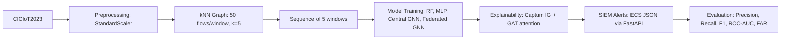

# MSc Interim Report

**Project Title:** Explainable Dynamic Graph Neural Network SIEM for Software-Defined IoT using Edge AI and Federated Learning

**Student Name:** Arka Talukder  
**Student Number:** B01821011  
**Programme:** MSc Cyber Security (Full-time)  
**Supervisor:** Dr. Raja Ujjan  
**University of the West of Scotland**

**Word count:** approximately 3,400 words (maximum 5,000 words)

---

## Introduction

This interim report is submitted at around the halfway stage of my MSc project. It describes in detail how I am conducting my research and gives my supervisor and moderator a clear view of the whole project. It is not a first draft of the final report, and it is not the first few chapters of the final report. The report has three required parts: (1) a summary literature review, (2) research methodology, and (3) a plan for completion. No final results are included here; results will be gathered, analysed and presented in the final report.

---

## 1. Summary Literature Review

This section critically summarises the current academic literature in my subject area and provides the academic framework for the research I am undertaking.

### 1.1 IoT Security and Intrusion Detection

The Internet of Things (IoT) has grown quickly. Many devices, such as smart sensors and cameras, are not built with strong security. Researchers show that they often use default passwords and lack strong encryption (Kolias et al., 2017). That study focuses on Mirai and similar botnets; it is descriptive rather than proposing a detection method, and it does not address flow-level analysis or Software-Defined IoT (SDIoT) environments. When these devices are compromised, they can be used in botnets or for data theft. Detecting malicious behaviour in IoT traffic is therefore important.

In Software-Defined IoT environments, network control is centralised in SDN controllers, which collect flow statistics (e.g. packet counts, byte counts, flow duration) from switches and routers. This flow-level view is exactly what datasets such as CICIoT2023 provide. The flow-level approach in this project therefore applies directly to SDIoT: SDN controllers can export flow records that feed into the same preprocessing and graph-building pipeline used here.

Intrusion detection can be signature-based or anomaly-based. Machine learning is widely used for both. The CICIoT2023 dataset (Pinto et al., 2023) provides flow-level data and many attack types from real IoT devices in a controlled environment. Pinto et al. use a lab setup with real devices; the dataset is large and public, but it is not from a live SDN deployment, and the subset used in this project is constrained by time. A limitation of many studies is that they look at each flow in isolation. In reality, attacks often show up as patterns over time. Wang et al. (2025) and Zhong et al. (2024) show that graph-based and dynamic graph methods are increasingly used for network traffic analysis. Wang et al. is a scoping review; it does not implement a system or evaluate on CICIoT2023. Zhong et al. survey GNNs for IDS but do not combine GNN with federated learning or SIEM-style alerting. They also note that explainability and federated learning remain under-explored. This gap motivates my project.

### 1.2 SIEM, SOC Workflows and Explainability

Security Operations Centres (SOCs) use SIEM systems to collect data and create alerts. A well-known issue is alert fatigue: too many alerts and too many false positives (Cuppens and Miege, 2002). Cuppens and Miege focus on alert correlation in a cooperative framework; their work is from 2002 and does not address ML-based detection or explainability, nor does it scale to modern IoT flow volumes. When an alert does not explain why it was raised, analysts need more time to triage. There is growing interest in explainable security tools (e.g. Lundberg and Lee, 2017). Lundberg and Lee propose SHAP for model interpretability; their work is generic and not tied to IoT or SIEM alerts, and they do not combine explainability with GNN or federated learning. In a SOC, explanations that point to specific flows or features help analysts decide whether to escalate. My project produces SIEM-style alerts with top features and top flows attached so that the output is useful for triage.

### 1.3 Graph Neural Networks and Dynamic Graphs

Graph neural networks (GNNs) work on data with nodes and edges. In security, nodes can be devices and edges can be connections. GNNs learn from the structure of the graph. Graph Attention Networks (GATs) let each node give different importance to its neighbours (Velickovic et al., 2018). Velickovic et al. evaluate GAT on citation and protein datasets; they do not apply it to network intrusion detection or flow-level data, and their scale is different from IoT traffic. Because networks change over time, many studies combine a GNN with a recurrent part (e.g. GRU or LSTM) over a sequence of graph snapshots (Liu et al., 2019). Liu et al. use temporal GNN for fraud detection, not IoT; their graph is built from transaction entities, not flow features, and they do not use federated learning or SIEM output.

The CICIoT2023 dataset I use does not provide device identifiers (e.g. IP addresses). So I cannot build a device-based graph. Instead I use a k-nearest neighbour (kNN) feature-similarity graph: flows are grouped into windows, each flow is a node, and edges connect similar flows in feature space. Ngo et al. (2025) and Basak et al. (2025) show that this kind of graph construction works for intrusion detection when topology is missing. Ngo et al. use attribute-based graphs and CICIoT but do not combine with federated learning or SIEM-style alerting. Basak et al. propose X-GANet for explainable NID but do not use federated learning or dynamic (GRU) modelling; their graph design differs from this project's kNN approach. This supports my design.

### 1.4 Federated Learning

Federated learning trains a model across many clients without moving raw data to one place. FedAvg (McMahan et al., 2017) averages client model parameters and reduces privacy risk. McMahan et al. focus on image classification and handwriting; they do not address IoT or network security, and their experiments use different data distributions. Lazzarini et al. (2023) found that FedAvg for IoT intrusion detection can match centralised performance. Lazzarini et al. use a different dataset and do not combine GNN with federated learning or SIEM-style alerting; their scale and model choice differ from this project. Albanbay et al. (2025) showed that non-IID data across clients affects convergence. Albanbay et al. test DNN/CNN models on up to 150 simulated devices; they do not use graph-based models or explainability, and their study focuses on data scaling rather than SOC integration. In my project I use Flower with three clients and a Dirichlet-based non-IID split to test whether federated training stays close to centralised performance.

### 1.5 Explainability in Security

Post-hoc explainability shows which features or inputs mattered for a prediction. Integrated Gradients (Sundararajan et al., 2017), implemented in Captum (Kokhlikyan et al., 2020), attributes the prediction to input features. Sundararajan et al. provide the theoretical foundation; they do not apply it to network intrusion or SIEM alerts. Kokhlikyan et al. describe the Captum library; it is generic and not tied to IoT or security; the integration with GNN and SIEM output is done in this project. GAT attention weights show which flows the model focused on. I use both. Alabbadi and Bajaber (2025) showed that explainable AI can make IoT detection decisions more transparent. Alabbadi and Bajaber use XAI for IoT streams but do not combine with GNN, federated learning, or SIEM-style ECS alerts; their architecture and deployment target differ from this project. Full explainability for every prediction can be slow, so my design allows using it only for selected alerts when needed.

### 1.6 Gap and Academic Framework

The literature covers different subsets of the four capabilities (GNN, federated learning, explainability, SIEM-style alerting) but none covers all four. Ngo et al. (2025) and Basak et al. (2025) use GNN for IoT intrusion detection but do not use federated learning or SIEM output; Basak adds explainability but not federated learning. Lazzarini et al. (2023) and Albanbay et al. (2025) use federated learning for IoT IDS but do not use GNN, explainability, or SIEM-style alerting. Alabbadi and Bajaber (2025) use explainability for IoT detection but not GNN, federated learning, or SIEM integration. Wang et al. (2025) and Zhong et al. (2024) survey GNN for network analysis and note that explainability and federated learning remain under-explored; they do not build a combined prototype. No study combines an explainable dynamic GNN, federated learning and SIEM-style alerting in one prototype for SOC use on CPU-based edge devices. My project addresses this gap. The academic framework for the research I am undertaking is: (1) graph and temporal structure for IoT flow data with kNN similarity graphs; (2) comparison with Random Forest and MLP to see if the graph model adds value; (3) federated learning with non-IID data to see if performance is kept without sharing raw data; and (4) explainable alerts to support SOC triage. The evaluation will use a fixed test set and clear metrics so that the results can be checked in the final report.

---

## 2. Research Methodology

This section describes in some detail how I intend to conduct (and am already conducting) my research. It makes clear the basis of my research method, how I intend to gather, analyse and interpret the results, the verifiable academic goal of the study, and how I will present the data to prove the rigour of the process and my interpretation of the results. It also gives a full description of the academic worth of my project and highlights areas I anticipate including in the critical reflection section of the final report.

### 2.1 Basis of the Research Method

The basis of my research method is a **development project with an experimental evaluation**. It is not a survey or a technology review or comparison only. I design and build a prototype (explainable dynamic GNN, federated learning, SIEM-style alerts) and then evaluate it with stated metrics. The main research question is: *How can an explainable dynamic graph neural network, trained using federated learning, detect attacks in Software-Defined IoT flow data and generate SIEM alerts that support SOC operations on CPU-based edge devices?* I answer it by building the system, running experiments, and comparing the dynamic GNN with Random Forest and MLP, testing federated versus centralised training, and checking whether the explanations help triage. The study has a verifiable academic goal: to test whether this combination is feasible and effective for IoT attack detection in a SOC setting.

### 2.2 Dataset and Data Handling

I use the CICIoT2023 dataset (Pinto et al., 2023). A manageable subset is chosen for the 45-day project. Data is split into fixed train, validation and test sets with no overlap. Preprocessing includes handling missing values, normalising features with StandardScaler, and binary labels (benign = 0, attack = 1). The dataset is heavily imbalanced at flow level. So for graph building I use stratified windowing: benign and attack flows are split into two pools, windows are built from each pool (with overlapping stride for the minority class), and the graphs are balanced and shuffled. Consecutive windows form a sequence of graphs for the GRU. The graph is built with kNN: each flow is a node with the flow-level features, and edges connect each flow to its k nearest neighbours in feature space (Euclidean distance). All settings are recorded in the project configuration file so that the work can be repeated.

### 2.3 Models

Three models are used. **Random Forest** and **MLP** work on flat (tabular) features. The **dynamic GNN** uses GAT layers on each graph and a GRU over the sequence of graph embeddings, then a classifier. The same GNN architecture is used for both centralised and federated training so that performance can be compared fairly.

**Design justification.** The graph parameters are chosen to balance expressiveness and computational cost. A window size of 50 flows per graph allows enough structure for the GNN while keeping sequences manageable; Ngo et al. (2025) use similar windowing for attribute-based graphs. k=5 for kNN ensures each node has local neighbours without excessive connectivity. A sequence length of 5 windows gives the GRU sufficient temporal context for attack patterns. The Dirichlet alpha=0.5 for federated splits creates moderate non-IID (Albanbay et al., 2025 use similar settings); lower alpha would skew more severely. Binary classification (benign vs attack) is used because the project focuses on detection for SOC triage rather than fine-grained attack classification; multi-class labels could be added in future work.

### 2.4 Evaluation Metrics and Equations

Performance is measured with standard classification metrics. The following equations are used in the project for evaluation.

**Precision** (Eq. 1) is the proportion of predicted positives that are truly positive:

\text{Precision} = \frac{TP}{TP + FP} \quad \text{(Eq. 1)}

**Recall** (Eq. 2) is the proportion of true positives that are correctly predicted:

\text{Recall} = \frac{TP}{TP + FN} \quad \text{(Eq. 2)}

**F1-score** (Eq. 3) combines precision and recall (harmonic mean):

\text{F1} = \frac{2 \times \text{Precision} \times \text{Recall}}{\text{Precision} + \text{Recall}} \quad \text{(Eq. 3)}

**False alarm rate (FAR)** (Eq. 4) is the proportion of true benign samples wrongly classified as attack:

\text{FAR} = \frac{FP}{FP + TN} \quad \text{(Eq. 4)}

**ROC-AUC** is the area under the Receiver Operating Characteristic curve (plot of true positive rate versus false positive rate). A **confusion matrix** reporting true positives (TP), false positives (FP), true negatives (TN) and false negatives (FN) is also used. These metrics are implemented in the project code and will be computed on the held-out test set. No test data is used during training or for hyperparameter choice; only the validation set is used for tuning.

### 2.5 How Results Are Gathered

I run the full pipeline: preprocessing, graph building, training (centralised and federated), and evaluation. A fixed random seed is used so that runs can be repeated. For federated learning, the training set is split across three clients with a Dirichlet distribution to create non-IID splits. Flower runs FedAvg for a set number of rounds with a fixed number of local epochs per client. Explainability uses Integrated Gradients (Captum) on the last graph's node features and GAT attention weights to obtain top features and top flows. Alerts are output in ECS-like JSON. The FastAPI endpoint is used to measure CPU inference time. All metrics are logged to files; ROC curves and confusion matrix plots are generated and saved for use in the final report.

### 2.6 How Results Are Analysed and Interpreted

Sub-question 1 (graph versus baselines) will be answered by comparing the dynamic GNN to Random Forest and MLP on the same test set using precision, recall, F1, ROC-AUC and false alarm rate. Sub-question 2 (federated versus centralised) will be answered by comparing the final federated model to the centralised model and by reporting convergence per round and communication cost. Sub-question 3 (usefulness of explanations) will be answered by producing example alerts with full explanations and discussing whether the top features and flows would help a SOC analyst. No formal user study is planned; the discussion will be based on the clarity and usefulness of the explanations.

### 2.7 How Data Will Be Presented to Prove Rigour

I will present the data I have collected in a way that proves the rigour of the process of my research and my interpretation of the results. (1) A results table will show precision, recall, F1, ROC-AUC, false alarm rate (and where relevant false positives) and inference time for each model (Random Forest, MLP, centralised GNN, federated GNN). (2) Confusion matrices and ROC curves for the main models will be included as figures. (3) Federated learning convergence (e.g. F1 and AUC per round) and communication cost will be reported. (4) CPU inference times will be given so that edge deployment can be assessed. (5) Example alerts with explanations will be shown and discussed. All design choices (dataset subset, graph parameters, hyperparameters) are recorded in the project configuration so that the work can be replicated. The test set is used only for final reporting. Limitations will be stated clearly so that the reader can judge the reliability and significance of the results. Figure 1 below describes the high-level research design and flow from data to evaluation; detailed result figures (e.g. ROC curves, confusion matrices) will be included in the final report once the experiments are complete.

**Figure 1. Research pipeline flowchart.**

*Figure 1.* Research pipeline: CICIoT2023 flows are preprocessed (StandardScaler), converted to kNN graphs (50 flows/window, k=5), grouped into sequences of 5 windows, and fed to RF, MLP, central GNN, and federated GNN. Explainability (Captum IG and GAT attention) produces SIEM-style ECS JSON alerts via FastAPI. Evaluation uses Precision, Recall, F1, ROC-AUC, and FAR.

### 2.8 Academic Worth

The research methodology section of this interim report should be a full description of the academic worth of my project, which may only have been described in a brief overview in the project specification. The project has academic worth because it (1) addresses a gap in the literature by combining explainable dynamic GNN, federated learning and SIEM-style alerting in one prototype; (2) uses a public dataset and a defined evaluation plan so that results can be compared and reproduced; (3) tests specific, answerable questions (graph versus baselines, federated versus centralised, usefulness of explanations); and (4) will include limitations and critical reflection in the final report.

### 2.9 Critical Reflection (Anticipated for the Final Report)

It is crucial that my final report contains a section on critical reflection of my work. In that section I will reflect on how well the research has been conducted, what errors I have made, and how reliable, accurate or significant my results are. In this interim report I highlight the following areas of my study that I anticipate including in that critical reflection: the choice of kNN graphs instead of device-based graphs (because the dataset has no device identifiers); the use of stratified windowing for class imbalance; the small number of federated clients and the lack of a formal user study for explainability; the trade-off between explainability coverage and speed (e.g. applying explanations only to selected alerts); and the reliability and significance of the results. I will incorporate feedback from this interim report into that section.

---

## 3. Plan for Completion

This section briefly describes the current status of my project and in more detail describes how I intend to progress it to completion. It also includes an indication of how I will proceed if the results I collect are in some way deficient.

### 3.1 Current Status (Brief)

At the halfway stage, the following is in place. The literature has been reviewed and the gap identified. The data pipeline (preprocessing, stratified windowing, kNN graph building, sequences) is implemented. Random Forest, MLP and the dynamic GNN are implemented; training and evaluation have been run. Federated learning (Flower, FedAvg, three clients, non-IID split) has been run and the global model evaluated. Explainability (Integrated Gradients and attention) is built in and attached to alerts. SIEM-style JSON alerts and the FastAPI endpoint are in place. The full pipeline runs from start to end. The project code is organised under the source package (data, models, federated, explain, siem, evaluation) and the main pipeline is in the scripts. No final result numbers are reported in this interim report; they will be collated and presented in the final report.

### 3.2 How I Intend to Progress to Completion (In More Detail)

Table 1 gives a week-by-week plan from the current midpoint to final submission.

| Week | Tasks |
|------|-------|
| Week 1 | Run final experiments (centralised baselines, centralised GNN, federated GNN); collate metrics; generate ROC curves and confusion matrices |
| Week 2 | Sensitivity checks (if time); finalise code comments and README; begin writing results chapter |
| Week 3 | Complete results chapter; insert figures and tables; write discussion; link to research questions |
| Week 4 | Write conclusion; critical self-evaluation; incorporate interim report feedback |
| Week 5 | Finalise references (Harvard style); proofread; structure and word count check |
| Week 6 | Submission deadline; buffer for revisions and supervisor feedback |

*Table 1.* Completion timeline from midpoint to final submission.

I will ensure all experiments (centralised baselines, centralised GNN, federated GNN) are run with the final configuration and that all metrics and figures are up to date. I will collate the results into a results table and finalise ROC curves and confusion matrices. If time allows, I will run sensitivity checks (e.g. window size or k) to discuss how sensitive the results are. I will also ensure the code is well commented and that the README and setup instructions allow others to run the project.

Then I will focus on the dissertation. I will insert the final numeric results into the results section and add the results table, figures (ROC curves, confusion matrices, federated convergence) and example alerts as described in the methodology. I will write the discussion: interpret the results, link them to the research questions and the literature, and state strengths and limitations. The conclusion will summarise what was achieved and suggest future work (e.g. larger scale, real-world deployment, user study with SOC analysts). The critical self-evaluation will reflect on the process, what went well, what could be improved and what I learned, and will use feedback from this interim report. I will ensure all references are in Harvard style and that the structure and word count meet the marking criteria. The results will be analysed using the metrics and comparison design already defined; their worth will be evaluated by whether the main and sub-questions are answered and by an honest discussion of limitations. In this way the results I have collected will be analysed and their worth evaluated, and the findings will be used to develop and critique the approach and to make suggestions about future practice.

### 3.3 How I Will Proceed If the Results Are Deficient

Depending on the work already done, it is expedient to include some indication of how I will proceed if the results I collect are in some way deficient (e.g. if the benefits I expected from the technical development do not arise). I have considered the following. If the dynamic GNN does not outperform the baselines, I will report this honestly and discuss possible reasons (e.g. the data may be relatively easy for tabular models, or the graph design may need tuning). The comparison itself remains useful evidence. If federated learning shows a large drop in performance, I will report it, discuss causes (e.g. non-IID data, too few rounds) and, if time allows, try more rounds or a different split; otherwise I will note it as a limitation and for future work. If explainability is too slow in practice, I will describe the trade-off (e.g. using it only for some alerts) as a limitation. If the dataset subset is too small or not representative, I will state that as a limitation and note that the methodology and pipeline remain valid even if the results do not generalise. In all cases I will present the results objectively and discuss limitations rather than overstate the findings.

I plan to complete the remaining technical work within one to two weeks and then focus on writing. I will aim to have a full draft ready for my supervisor before the final submission deadline, with time to incorporate feedback from this interim report.

---

## References

Alabbadi, A. and Bajaber, F. (2025) 'An intrusion detection system over the IoT data streams using eXplainable artificial intelligence (XAI)', *Sensors*, 25(3), p. 847.

Albanbay, N., Tursynbek, Y., Graffi, K., Uskenbayeva, R., Kalpeyeva, Z., Abilkaiyr, Z. and Ayapov, Y. (2025) 'Federated learning-based intrusion detection in IoT networks: performance evaluation and data scaling study', *Journal of Sensor and Actuator Networks*, 14(4), p. 78.

Basak, M., Kim, D.-W., Han, M.-M. and Shin, G.-Y. (2025) 'X-GANet: an explainable graph-based framework for robust network intrusion detection', *Applied Sciences*, 15(9), p. 5002.

Cuppens, F. and Miege, A. (2002) 'Alert correlation in a cooperative intrusion detection framework', in *Proceedings of the 2002 IEEE Symposium on Security and Privacy*, pp. 202-215.

Kolias, C., Kambourakis, G., Stavrou, A. and Voas, J. (2017) 'DDoS in the IoT: Mirai and other botnets', *Computer*, 50(7), pp. 80-84.

Kokhlikyan, N., Miglani, V., Martin, M., Wang, E., Alsallakh, B., Reynolds, J., Melnikov, A., Kliushkina, N., Araya, C., Yan, S. and Reblitz-Richardson, O. (2020) 'Captum: a unified and generic model interpretability library for PyTorch', *arXiv preprint arXiv:2009.07896*.

Lazzarini, R., Tianfield, H. and Charissis, V. (2023) 'Federated learning for IoT intrusion detection', *AI*, 4(3), pp. 509-530.

Liu, Y., Chen, J. and Zhou, J. (2019) 'Temporal graph neural networks for fraud detection', in *Proceedings of the 2019 IEEE International Conference on Data Mining (ICDM)*, pp. 1202-1207.

Lundberg, S.M. and Lee, S.I. (2017) 'A unified approach to interpreting model predictions', in *Advances in Neural Information Processing Systems*, 30, pp. 4765-4774.

McMahan, B., Moore, E., Ramage, D., Hampson, S. and Arcas, B.A.y. (2017) 'Communication-efficient learning of deep networks from decentralized data', in *Proceedings of the 20th International Conference on Artificial Intelligence and Statistics (AISTATS)*, PMLR 54, pp. 1273-1282.

Ngo, T., Yin, J., Ge, Y.-F. and Wang, H. (2025) 'Optimizing IoT intrusion detection - a graph neural network approach with attribute-based graph construction', *Information*, 16(6), p. 499.

Pinto, C., Dadkhah, S., Ferreira, R., Zohourian, A., Lu, R. and Ghorbani, A.A. (2023) 'CICIoT2023: a real-time dataset and benchmark for large-scale attacks in IoT environment', *Sensors*, 23(13), p. 5941.

Qu, Y., Gao, L., Luan, T.H., Xiang, Y., Yu, S., Li, B. and Zheng, B. (2019) 'Decentralized privacy using blockchain-enabled federated learning in IoT systems', *IEEE Internet of Things Journal*, 6(5), pp. 8678-8687.

Sundararajan, M., Taly, A. and Yan, Q. (2017) 'Axiomatic attribution for deep networks', in *Proceedings of the 34th International Conference on Machine Learning (ICML)*, PMLR 70, pp. 3319-3328.

Velickovic, P., Cucurull, G., Casanova, A., Romero, A., Lio, P. and Bengio, Y. (2018) 'Graph attention networks', in *International Conference on Learning Representations (ICLR)*. Available at: <https://openreview.net/forum?id=rJXMpikCZ>

Wang, R., Zhao, J., Zhang, H., He, L., Li, H. and Huang, M. (2025) 'Network traffic analysis based on graph neural networks: a scoping review', *Big Data and Cognitive Computing*, 9(11), p. 270.

Zhong, M., Lin, M., Zhang, C. and Xu, Z. (2024) 'A survey on graph neural networks for intrusion detection systems: methods, trends and challenges', *Computers and Security*, 141, p. 103821.
