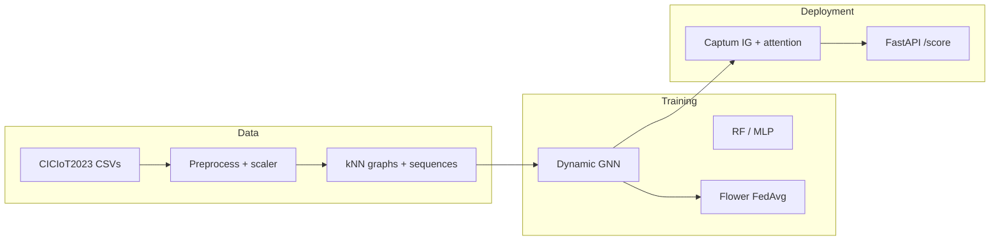

# Explainable Dynamic GNN for IoT Intrusion Detection (Federated + SIEM-Ready)

**MSc Cyber Security** — University of the West of Scotland (UWS).

This is **Arka Talukder’s (B01821011)** final-year **individual** project: design, code, experiments, and written report are the student’s own degree work, supervised by **Dr Raja Ujjan**, with references and data handling as described in the dissertation. See **[`AUTHORSHIP.md`](AUTHORSHIP.md)** for a one-page authorship and integrity summary for staff and examiners.

**What the software does (CPU-oriented prototype):** CICIoT2023 flow rows → *k*NN **graphs** → **GAT+GRU** → optional **Flower FedAvg** → **Captum** + **FastAPI** ECS-style **JSON** for security operations–style triage.

| Reader | Open first |
|--------|------------|
| **Engineer / replicator** | [Quick start](#quick-start) · [`SETUP_AND_RUN.md`](SETUP_AND_RUN.md) · `config/experiment.yaml` |
| **Coordinator / hand-in** | [`docs/project_portfolio/README.md`](docs/project_portfolio/README.md) · [`submission/`](submission/) |
| **Supervisor / viva (screen share)** | [`docs/viva_supervisor_materials/README.md`](docs/viva_supervisor_materials/README.md) |
| **Long story + Q&A** | [`DISSERTATION_PROJECT_GUIDE.md`](DISSERTATION_PROJECT_GUIDE.md) |
| **5–6 min demo video (script + preflight)** | [`docs/video/README.md`](docs/video/README.md) |

---

## Why this repo exists

| Theme | What is implemented |
|--------|----------------------|
| **Graph IDS** | Flow-level nodes, *k*NN edges in feature space (no device IPs in the public release), windowed sequences |
| **Temporal model** | 2× `GATConv` (multi-head) → per-window embedding → **GRU** → binary classifier (`src/models/dynamic_gnn.py`) |
| **Baselines** | **Random Forest** and **MLP** on the same splits (`src/models/baselines.py`) |
| **Federated learning** | **FedAvg** with **Flower**, 3 clients, non-IID split (`src/federated/`) |
| **Explainability** | **Integrated Gradients** + GAT attention → ranked features / nodes for alerts (`src/explain/`) |
| **SOC output** | **FastAPI** `POST /score` → prediction + ECS-like alert JSON (`src/siem/`) |
| **Thesis** | Source: [`Arka_Talukder_Dissertation_Final_DRAFT.md`](Arka_Talukder_Dissertation_Final_DRAFT.md) → Word in [`submission/`](submission/) (final: **`B01821011_Arka_Talukder_Dissertation_Final.docx`**) via [`scripts/dissertation_to_docx.py`](scripts/dissertation_to_docx.py) / [`scripts/sync_dissertation_and_docx.py`](scripts/sync_dissertation_and_docx.py) |

---

## Pipeline (high level)



---

## Requirements

- **Python 3.10+** (tested with 3.12), **PyTorch**, **PyTorch Geometric**, **Flower**, **Captum**, **FastAPI**, **scikit-learn**, **pandas** — see [`requirements.txt`](requirements.txt).
- **PyG install** follows the official matrix: [PyTorch Geometric installation](https://pytorch-geometric.readthedocs.io/en/latest/install/installation.html).
- **Dataset:** [CICIoT2023](https://www.unb.ca/cic/datasets/iotdataset-2023.html) (Pinto *et al.*, 2023, [DOI](https://doi.org/10.3390/s23135941)). Place pre-split CSVs under `data/raw/` (`train.csv`, `test.csv`, `validation.csv`).  
  **`data/` is gitignored** — you must download the dataset yourself.

---

## Quick start

```bash
python -m venv venv
venv\Scripts\activate          # Windows
pip install -r requirements.txt
# Then install PyG for your CUDA/CPU combo (see link above).

# One-shot: preprocess → graphs → RF/MLP → central GNN → metrics + figures
python scripts/run_all.py --config config/experiment.yaml

# Smoke test on fewer rows
python scripts/run_all.py --config config/experiment.yaml --nrows 10000

# Alerts + extra plots (after checkpoints exist)
python scripts/generate_alerts_and_plots.py

# Ablation (GAT-only, no GRU) — thesis Chapter 8
python scripts/run_ablation.py --config config/experiment.yaml

# Sensitivity (window × k) + multi-seed — thesis Chapter 8
python scripts/run_sensitivity_and_seeds.py --config config/experiment.yaml

# Dissertation → Word
python scripts/dissertation_to_docx.py

# Appendix 1 code figures (PNG)
python scripts/render_appendix1_code_figures.py
```

**Federated training:** create client splits once (`split_and_save` from `src.federated.data_split`), then server + clients — full commands in [`SETUP_AND_RUN.md`](SETUP_AND_RUN.md).

**API:** `uvicorn src.siem.api:app --reload` → `POST /score` with flow windows.

**Tests:** `python -m pytest tests/ -q` (or `python tests/test_api.py` for the API tests only).

---

## Headline results (fixed subset, this checkout)

Values from [`results/metrics/results_table.csv`](results/metrics/results_table.csv) after the main pipeline (your exact split may vary if you change `config/experiment.yaml`).

| Model | Precision | Recall | F1 | ROC-AUC | Inference (ms) |
|-------|-----------|--------|-----|---------|-----------------|
| Random Forest | 0.9989 | 0.9984 | 0.9986 | 0.9996 | 46.09 |
| MLP | 1.0000 | 0.9885 | 0.9942 | 0.9984 | 0.66 |
| Central GNN | 1.0000 | 1.0000 | 1.0000 | 1.0000 | 22.70 |
| Federated GNN | 1.0000 | 1.0000 | 1.0000 | 1.0000 | 20.99 |

*Interpretation of “100%” metrics is discussed in the dissertation (subset scope, class balance strategy, robustness tables).*

---

## Repository layout

```
config/experiment.yaml          # Single source of truth for paths, graph params, FL, model hparams
src/
  data/                         # preprocess, graph_builder, dataset
  models/                       # dynamic_gnn, baselines, trainer
  federated/                    # Flower client/server, Dirichlet split
  explain/                      # Integrated Gradients + ExplanationBundle
  siem/                         # FastAPI + ECS-style alert formatter
  evaluation/                   # Metrics + plotting helpers
scripts/
  run_all.py                    # Master pipeline
  generate_alerts_and_plots.py  # FL curve, model comparison, alerts
  run_ablation.py               # GAT-only ablation
  run_sensitivity_and_seeds.py  # Grid + seeds
  dissertation_to_docx.py       # MD → submission/Arka_Talukder_Dissertation_Final_DRAFT.docx
  sync_dissertation_and_docx.py # MD/Word sync + copy into supervisor_package when present
  render_appendix1_code_figures.py
submission/                     # Final B018 Word/PDF + school forms — see submission/README.md
docs/
  project_portfolio/            # Stakeholder “start here” (coordinator, programme, visitors)
  viva_supervisor_materials/  # Viva: what to show / hide on screen
  video/                        # Demo video script, preflight, recording
  reports/ viva/ planning/      # Checklists, compliance, viva notes
supervisor_package/             # Optional zip-style bundle (dissertation + results + code mirror)
artifacts/                      # Optional packaged figure exports
results/                        # metrics/, figures/, checkpoints/, alerts/
Arka_Talukder_Dissertation_Final_DRAFT.md   # Thesis source (Markdown)
Dissertation_Arka_Talukder_Humanized.md  # Optional alternate drafting track
thesis_artifacts/               # Humanized / export outputs (if used)
archive/                        # Interim, process/attendance, one-off — see archive/README.md
```

Large binaries, `venv/`, and raw/processed data stay **out of git** per [`.gitignore`](.gitignore).

**Canonical code vs mirror:** The **authoritative implementation** is under **`src/`** and **`scripts/`** at the repository root. **`supervisor_package/`** is an optional **hand-in style bundle** (copies of dissertation, results, and code for one-folder review). If both appear, **develop and cite from root `src/`**, not the package copy, unless you are following a supervisor-specific path.

---

## Documentation map

| Document | Purpose |
|----------|---------|
| [`AUTHORSHIP.md`](AUTHORSHIP.md) | **Student identity, scope, and academic attribution** (for examiners) |
| [`NOTICE.md`](NOTICE.md) | **Reuse, rights, and third-party use** (for visitors reusing or citing the repo) |
| [`LICENSE`](LICENSE) | **Copyright — all rights reserved** (original repo content; third-party remains under their own licences) |
| [`docs/project_portfolio/README.md`](docs/project_portfolio/README.md) | **Stakeholder start page** (coordinator, programme, final Word path, forms) |
| [`SETUP_AND_RUN.md`](SETUP_AND_RUN.md) | Step-by-step CLI, FL, API, literature figures |
| [`docs/README.md`](docs/README.md) | Index of `docs/reports/`, `planning/`, `reference/` |
| [`docs/reports/SUPERVISOR_FINAL_FEEDBACK.md`](docs/reports/SUPERVISOR_FINAL_FEEDBACK.md) | Final meeting checklist + evidence pointers |
| [`docs/reports/SUBMISSION_CHECKLIST.md`](docs/reports/SUBMISSION_CHECKLIST.md) | Programme submission items |
| [`docs/reports/FINAL_REPORT_GENERATION.md`](docs/reports/FINAL_REPORT_GENERATION.md) | Dissertation / Word workflow |
| [`archive/README.md`](archive/README.md) | **Archive index:** interim report, process/attendance (Appendix A), one-time scripts; ties to Chapter 13 + `dissertation_to_docx.py` |
| [`DISSERTATION_PROJECT_GUIDE.md`](DISSERTATION_PROJECT_GUIDE.md) | **Full narrative + Q&A prep** (read this for viva / supervisor meetings) |
| [`docs/viva_supervisor_materials/README.md`](docs/viva_supervisor_materials/README.md) | **Supervisor / viva** — screen share: what to open, what to collapse |
| [`docs/video/README.md`](docs/video/README.md) | 5–6 min demo: script, preflight, recording |

---

## Citation

If you use **CICIoT2023**:

```bibtex
@article{pinto2023ciciot2023,
  title   = {{CICIoT2023}: A Real-Time Dataset and Benchmark for Large-Scale Attacks in {IoT} Environment},
  author  = {Pinto, Caio and others},
  journal = {Sensors},
  volume  = {23},
  number  = {13},
  pages   = {5941},
  year    = {2023},
  doi     = {10.3390/s23135941}
}
```

---

## Disclaimer

This repository supports an **academic MSc project**. It is **not** production SOC software. Detection performance depends on your data slice, splits, and configuration; validate on your own traffic before any real deployment. For permissions, third-party material, and limitations, see **[`NOTICE.md`](NOTICE.md)**.

---

## Author

**Arka Talukder** (B01821011) — MSc Cyber Security, University of the West of Scotland, School of Computing, Engineering and Physical Sciences.  
**Supervisor:** Dr Raja Ujjan.

The dissertation, implementation, and analysis are submitted as **original work** for assessment; datasets and software libraries are **acknowledged** in the report and `requirements.txt` as required by the programme.
