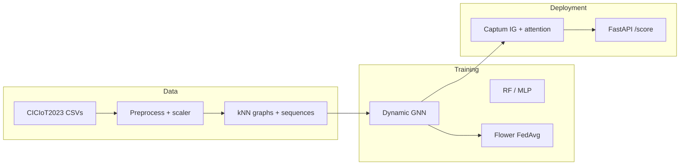

# Explainable Dynamic Graph Neural Network SIEM for Software-Defined IoT using Edge AI and Federated Learning

**MSc Cyber Security** — University of the West of Scotland (UWS).

This is **Arka Talukder’s (B01821011)** final-year **individual** project: design, code, experiments, and written report are the student’s own degree work, supervised by **Dr Raja Ujjan**, with references and data handling as described in the dissertation. See **[`AUTHORSHIP.md`](AUTHORSHIP.md)** for a one-page authorship and integrity summary for staff and examiners.

**What the software does (CPU-oriented prototype):** CICIoT2023 flow rows → *k*NN **graphs** → **GAT+GRU** → optional **Flower FedAvg** → **Captum** + **FastAPI** ECS-style **JSON** for security operations–style triage.

| Reader | Open first |
|--------|------------|
| **Engineer / employer (public GitHub)** | [Quick start](#quick-start) · [`SETUP_AND_RUN.md`](SETUP_AND_RUN.md) · **[`docs/GITHUB_PUBLIC_PORTFOLIO.md`](docs/GITHUB_PUBLIC_PORTFOLIO.md)** |
| **Stakeholder overview** | [`docs/project_portfolio/README.md`](docs/project_portfolio/README.md) · [`submission/README.md`](submission/README.md) |
| **Full academic tree (thesis PDF, viva, forms, internal checklists)** | **On your laptop only** — not on the public remote; see **[`docs/GITHUB_PUBLIC_PORTFOLIO.md`](docs/GITHUB_PUBLIC_PORTFOLIO.md)** and [`.gitignore`](.gitignore) |

---

## Why this repo exists

| Theme | What is implemented |
|--------|----------------------|
| **Graph IDS** | Flow-level nodes, *k*NN edges in feature space (no device IPs in the public release), windowed sequences |
| **Temporal model** | 2× `GATConv` (multi-head) → per-window embedding → **GRU** → binary classifier (`src/models/dynamic_gnn.py`) |
| **Baselines** | **Random Forest** and **MLP** on the same splits (`src/models/baselines.py`) |
| **Federated learning** | **FedAvg** with **Flower**, 3 clients, non-IID split (`src/federated/`) |
| **Explainability** | **Integrated Gradients** + GAT attention → ranked features / nodes for alerts (`src/explain/`) |
| **SOC output** | **FastAPI** `POST /score` → prediction + ECS-like alert JSON (`src/siem/`) |
| **Written report** | Full dissertation text is maintained **locally** (Markdown → Word under `submission/`). This public repo highlights **code + metrics + figures**. See [`submission/README.md`](submission/README.md) and [`docs/GITHUB_PUBLIC_PORTFOLIO.md`](docs/GITHUB_PUBLIC_PORTFOLIO.md). |

---

## Pipeline (high level)



---

## Requirements

- **Python 3.10+** (tested with 3.12), **PyTorch**, **PyTorch Geometric**, **Flower**, **Captum**, **FastAPI**, **scikit-learn**, **pandas** — see [`requirements.txt`](requirements.txt).
- **PyG install** follows the official matrix: [PyTorch Geometric installation](https://pytorch-geometric.readthedocs.io/en/latest/install/installation.html).
- **Dataset:** [CICIoT2023](https://www.unb.ca/cic/datasets/iotdataset-2023.html) (Pinto *et al.*, 2023, [DOI](https://doi.org/10.3390/s23135941)). Place pre-split CSVs under `data/raw/` (`train.csv`, `test.csv`, `validation.csv`).  
  **`data/` is gitignored** — you must download the dataset yourself.

---

## Quick start

```bash
python -m venv venv
venv\Scripts\activate          # Windows
pip install -r requirements.txt
# Then install PyG for your CUDA/CPU combo (see link above).

# One-shot: preprocess → graphs → RF/MLP → central GNN → metrics + figures
python scripts/run_all.py --config config/experiment.yaml

# Smoke test on fewer rows
python scripts/run_all.py --config config/experiment.yaml --nrows 10000

# Alerts + extra plots (after checkpoints exist)
python scripts/generate_alerts_and_plots.py

# Ablation (GAT-only, no GRU) — thesis Chapter 8
python scripts/run_ablation.py --config config/experiment.yaml

# Sensitivity (window × k) + multi-seed — thesis Chapter 8
python scripts/run_sensitivity_and_seeds.py --config config/experiment.yaml

# Dissertation → Word
python scripts/dissertation_to_docx.py

# Appendix 1 code figures (PNG)
python scripts/render_appendix1_code_figures.py
```

**Federated training:** create client splits once (`split_and_save` from `src.federated.data_split`), then server + clients — full commands in [`SETUP_AND_RUN.md`](SETUP_AND_RUN.md).

**API:** `uvicorn src.siem.api:app --reload` → `POST /score` with flow windows.

**Tests:** `python -m pytest tests/ -q` (or `python tests/test_api.py` for the API tests only).

---

## Headline results (fixed subset, this checkout)

Values from [`results/metrics/results_table.csv`](results/metrics/results_table.csv) after the main pipeline (your exact split may vary if you change `config/experiment.yaml`).

| Model | Precision | Recall | F1 | ROC-AUC | Inference (ms) |
|-------|-----------|--------|-----|---------|-----------------|
| Random Forest | 0.9989 | 0.9984 | 0.9986 | 0.9996 | 46.09 |
| MLP | 1.0000 | 0.9885 | 0.9942 | 0.9984 | 0.66 |
| Central GNN | 1.0000 | 1.0000 | 1.0000 | 1.0000 | 22.70 |
| Federated GNN | 1.0000 | 1.0000 | 1.0000 | 1.0000 | 20.99 |

*Interpretation of “100%” metrics is discussed in the dissertation (subset scope, class balance strategy, robustness tables).*

---

## Repository layout

**What is on the public GitHub vs what stays on your laptop:** **[`docs/GITHUB_PUBLIC_PORTFOLIO.md`](docs/GITHUB_PUBLIC_PORTFOLIO.md)**.

**Full-workspace map (when every folder exists locally):** **[`docs/GITHUB_AND_SUPERVISOR_LAYOUT.md`](docs/GITHUB_AND_SUPERVISOR_LAYOUT.md)**.

```
config/experiment.yaml          # Single source of truth for paths, graph params, FL, model hparams
src/                            # preprocess, models, FL, explain, FastAPI, metrics helpers
scripts/                        # run_all, ablation, sensitivity, dissertation export helpers, figures
tests/                          # e.g. API tests
notebooks/                      # Exploration notebooks
results/
  metrics/                      # JSON/CSV for tables in README / thesis
  figures/                      # Plots (checkpoints/*.pt are local only — regenerate with run_all)
  alerts/                       # Example SOC-style JSON outputs
submission/README.md            # How hand-in files relate to local thesis sources (binaries not on public remote)
docs/
  README.md                     # Documentation index
  GITHUB_PUBLIC_PORTFOLIO.md    # Job-facing vs local-academic split
  GITHUB_AND_SUPERVISOR_LAYOUT.md
  project_portfolio/            # “Start here” for public-tree readers
  video/                        # Short demo narrative (GUIDE, SCRIPT, …)
video/README.md                 # Points to docs/video/
assets/                         # Diagrams referenced from docs or thesis exports
```

Large binaries, `venv/`, raw/processed **data**, **model checkpoints**, **thesis PDFs**, **viva packs**, and **duplicate hand-in mirrors** stay **out of the public remote** per [`.gitignore`](.gitignore).

**Canonical code:** **`src/`** and **`scripts/`** at the repository root. Any **`supervisor_package/`** copy on disk is for local assessment packaging only.

---

## Documentation map

| Document | Purpose |
|----------|---------|
| [`AUTHORSHIP.md`](AUTHORSHIP.md) | **Student identity, scope, and academic attribution** (for examiners) |
| [`NOTICE.md`](NOTICE.md) | **Reuse, rights, and third-party use** (for visitors reusing or citing the repo) |
| [`LICENSE`](LICENSE) | **Copyright — all rights reserved** (original repo content; third-party remains under their own licences) |
| [`docs/GITHUB_PUBLIC_PORTFOLIO.md`](docs/GITHUB_PUBLIC_PORTFOLIO.md) | **Public GitHub vs laptop** — what employers see; what stays local |
| [`docs/GITHUB_AND_SUPERVISOR_LAYOUT.md`](docs/GITHUB_AND_SUPERVISOR_LAYOUT.md) | Full workspace roles (when `supervisor_package/`, `archive/`, thesis sources exist **locally**) |
| [`docs/project_portfolio/README.md`](docs/project_portfolio/README.md) | **Start here** for coordinators and visitors reading this tree |
| [`SETUP_AND_RUN.md`](SETUP_AND_RUN.md) | Step-by-step CLI, FL, API, literature figures |
| [`docs/README.md`](docs/README.md) | Index of **`docs/`** on the **public** remote |
| [`submission/README.md`](submission/README.md) | Hand-in layout (`submission/*.docx` and forms are **local only** on the author’s machine) |
| [`docs/video/README.md`](docs/video/README.md) | 5–6 min demo pack (GUIDE, SCRIPT, BLOCKS, CHECKLIST) |

---

## Citation

If you use **CICIoT2023**:

```bibtex
@article{pinto2023ciciot2023,
  title   = {{CICIoT2023}: A Real-Time Dataset and Benchmark for Large-Scale Attacks in {IoT} Environment},
  author  = {Pinto, Caio and others},
  journal = {Sensors},
  volume  = {23},
  number  = {13},
  pages   = {5941},
  year    = {2023},
  doi     = {10.3390/s23135941}
}
```

---

## Disclaimer

This repository supports an **academic MSc project**. It is **not** production SOC software. Detection performance depends on your data slice, splits, and configuration; validate on your own traffic before any real deployment. For permissions, third-party material, and limitations, see **[`NOTICE.md`](NOTICE.md)**.

---

## Development (how the code was built)

- **Editor / IDE:** **Visual Studio Code** on the author’s **Windows** workstation, using the **integrated terminal** for runs in this repo.
- **Coding:** The project is **normal, hand-written Python** under **`src/`** and **`scripts/`**, tracked in **Git** — the same style of **direct source editing** and debugging you would use in any professional MSc implementation.

---

## Author

**Arka Talukder** (B01821011) — MSc Cyber Security, University of the West of Scotland, School of Computing, Engineering and Physical Sciences.  
**Supervisor:** Dr Raja Ujjan.

The dissertation, implementation, and analysis are submitted as **original work** for assessment; datasets and software libraries are **acknowledged** in the report and `requirements.txt` as required by the programme.
